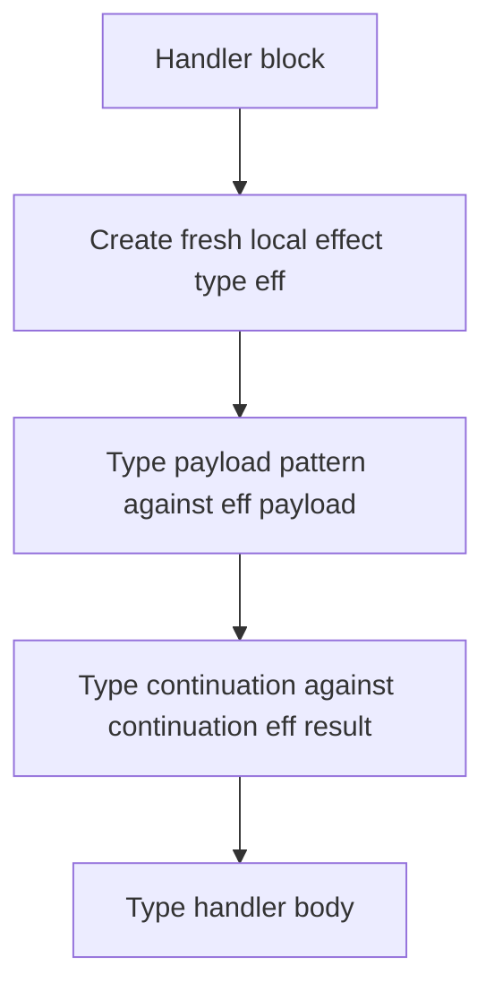

# Typ Effects

This document specifies effect handlers for `typ`.

This builds on top of [checker.md](./checker.md),
[pattern_analysis.md](./pattern_analysis.md), and
[first_class_modules.md](./first_class_modules.md) where relevant.

The point here is simple: effect handlers are typed, but OCaml's effect story
is not "every function carries a visible effect row."

So `typ` should not invent a row-effect language that the source language does
not have. It should instead specify the typing contract effect handlers
actually use.

## 1. Scope

This document covers:

- effect cases in `match` and `try`
- effect payload typing
- continuation typing
- the local abstract effect type introduced by a handler
- the interaction with pattern analysis

This document does not cover:

- a user-visible effect-row system on ordinary function types
- effect polymorphism as a surface feature
- optimizer or runtime semantics of effect handling

Those are out of scope here.

## 2. Core Point

Effect handlers are typed, but effects are not tracked as explicit rows on every
ordinary expression type.

That means:

- ordinary function types remain ordinary function types
- handlers still introduce typed effect payloads and continuations
- the checker still needs dedicated logic for effect cases

So the spec should be honest:

yes, effects are part of the type system
no, this does not imply a full public effect-row calculus

## 3. Effect Cases

`typ` should distinguish:

- value cases
- exception cases
- effect cases

for `match` and `try`.

Effect cases are not just constructor cases with different punctuation. They
bind both:

- an effect payload pattern
- a continuation pattern

and those two pieces are typed together.

### Example

```ocaml
match run () with
| v -> v
| effect Read_line k -> continue k "hello"
```

The effect clause binds both the effect payload pattern and the continuation
pattern. That is why it needs its own typing rule instead of borrowing plain
constructor-pattern typing unchanged.

## 4. Local Abstract Effect Type

Typing a handler should introduce a fresh local abstract effect type for that
handler block.

Conceptually:

1. create a fresh local abstract type `eff`
2. type the handled effect payload against `eff payload`
3. type the continuation against `continuation(eff, result_ty)`
4. type the handler body under that local information

This keeps the handler self-contained and avoids leaking ad hoc equalities into
the surrounding environment.

### Diagram



## 5. Payload Typing

Effect patterns match effect payload values.

So the payload side of an effect case should be typed as a value pattern whose
expected type is the handler-local effect payload type.

This is one place where `typ` should reuse ordinary pattern typing rather than
inventing a completely different subsystem.

## 6. Continuations

Continuation patterns are more restricted.

The continuation bound by an effect case should have a continuation type
parameterized by:

- the local effect type
- the overall result type of the handled computation

This is not the same thing as an arbitrary function parameter.

So `typ` should keep continuation patterns explicit and reject invalid
continuation-pattern shapes with a dedicated structured diagnostic.

### Pseudocode

```ocaml
let type_effect_case result_ty payload_pat cont_pat body =
  let eff = fresh_local_abstract_type () in
  let payload_ty = effect_payload_type eff in
  let cont_ty = continuation_type eff result_ty in
  let payload = type_pattern payload_pat payload_ty in
  let cont = type_continuation_pattern cont_pat cont_ty in
  let body = type_expression body result_ty in
  EffectCase (payload, cont, body)
```

## 7. Match And Try

Both `match` and `try` may carry effect cases, but they do not mean the same
thing operationally.

The typing contract, though, should preserve the same core idea:

- value cases type against the scrutinee/result as usual
- effect cases type against the local effect payload and continuation
- all accepted branches agree on the final result type

So the feature sits partly in core-expression typing and partly in pattern
typing.

## 8. Pattern Analysis

Effect cases also affect pattern analysis.

That means:

- exhaustiveness and redundancy should treat effect cases as their own analyzed
  space where the language does
- diagnostics should not flatten value-case and effect-case failures into one
  undifferentiated warning

This is another example of why pattern analysis belongs in its own spec.

## 9. Queries And Summaries

The effect subsystem changes local typing behavior and diagnostics, but it does
not require `ModuleTypings` to export a new public "effect row" field for every
ordinary value.

If effect-specific exported facts become necessary later, that should be a
separate extension of the summary contract, not an assumption smuggled in here.

## 10. References

The main upstream extraction points here are:

- `typecore.ml`
  `type_effect_cases`, effect-pattern splitting, and continuation-pattern
  typing
- `predef.ml`
  `type_eff` and `type_continuation`
- `typedtree.mli`
  effect-case shape in typed `match` and `try`

The contract we want to keep is:

- effects are typed
- handlers introduce a local abstract effect type
- continuations have dedicated typing
- ordinary expression types do not suddenly become explicit effect-row types
