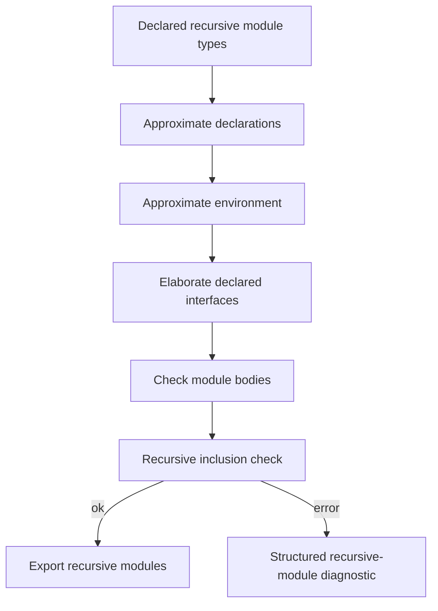

# Typ Recursive Modules

This document specifies recursive modules for `typ`.

This builds on top of [modules.md](./modules.md),
[signatures.md](./signatures.md), and [generalization.md](./generalization.md).

The point here is simple: recursive modules are not ordinary module bindings
with a `rec` flag slapped on top.

They require approximation, explicit interfaces, and a separate acceptance
check. If `typ` tries to type them like ordinary modules, it will either reject
too much or walk straight into circularity.

## 1. Scope

This document covers:

- mutually recursive module bindings
- explicit module-type requirements for recursive bindings
- approximation of recursive module types
- recursive-module inclusion checking
- exported recursive-module signatures

This document does not cover:

- recursive first-class modules
- recursive class modules
- user-visible generative/applicative toggles

Those are separate concerns.

## 2. Explicit Signatures

Recursive modules require explicit module types.

That means `typ` should reject recursive module bindings whose components do not
provide explicit module-type annotations.

The rule is simple:

the checker may infer bodies against those declared module types, but it should
not try to infer the recursive module interfaces from scratch.

## 3. Approximation

Typing recursive modules starts with approximation.

Conceptually:

1. create recursive module identities
2. build approximate module declarations for them
3. insert those approximations into the environment
4. type-check the declared module types in that approximate environment
5. type-check the module bodies against the resulting declarations

This is the module-language analogue of recursive-value approximation in the
core calculus.

### Example

```ocaml
module rec A : sig val x : int end = struct
  let x = B.y
end
and B : sig val y : int end = struct
  let y = A.x
end
```

The checker cannot type either body by pretending the final fully-elaborated
module type is already known everywhere. It needs the approximation step first.

## 4. Two Worlds

Recursive-module checking needs two related environments:

- an abstract or approximate environment used to break direct cycles
- a richer checking environment where the declared module types are available

The exact representation can vary. The contract should not.

Without this split, recursive manifest types and strengthened paths become too
easy to make circular in the wrong way.

### Diagram



## 5. Body Checking

Once the recursive declarations are approximated, each body is checked against
its declared interface.

That means:

- the body elaborates to an actual module type
- that actual module type is compared against the declared one
- the recursive group is only accepted if every binding passes the acceptance
  check

This is stricter and more explicit than ordinary non-recursive module typing.

## 6. Inclusion Check

Recursive-module acceptance is not just ordinary inclusion with the final
recursive paths substituted everywhere once.

That would reintroduce circularity through manifest types.

So the contract should be:

- recursive-module inclusion uses finite unrolling or an equivalent cycle-safe
  acceptance check
- the check must preserve the declared equalities that make the recursive group
  useful downstream

The exact implementation may mirror upstream `check_recmodule_inclusion` or use
another equivalent formulation. The observable behavior should stay the same:
accept useful recursive groups without pretending the cycle disappears.

### Pseudocode

```ocaml
let check_recursive_modules group =
  let decls = approximate_declared_interfaces group in
  let env1 = bind_approximations decls in
  let checked_ifaces = elaborate_declared_interfaces env1 group in
  let env2 = bind_checked_interfaces checked_ifaces in
  let bodies = check_bodies env2 group in
  require (recursive_inclusion_ok checked_ifaces bodies);
  export_recursive_group checked_ifaces bodies
```

## 7. Export Boundary

Once a recursive group is accepted, it should export ordinary module bindings to
the outside world.

That means downstream code should not need a separate query model just because a
module happened to come from a recursive group.

Its `ModuleTypings` should still expose:

- module identity
- exported signature
- visible equalities
- symbol origins

The recursive machinery is an acceptance-time concern, not a permanent special
case at every later query site.

## 8. Diagnostics

Recursive-module failures should remain structured.

At minimum, `typ` should preserve the difference between:

- missing explicit type
- invalid recursive shape
- inconsistency between declared and actual module type
- recursive inclusion failure
- illegal cyclic reference

This is another area where a flat error string is not enough.

## 9. References

The main upstream extraction points here are:

- `typemod.ml`
  `transl_recmodule_modtypes`, recursive-structure handling, and
  `check_recmodule_inclusion`

The contract we want to keep is:

- require explicit interfaces
- approximate first
- check bodies against those interfaces
- accept the group through a cycle-aware inclusion rule
