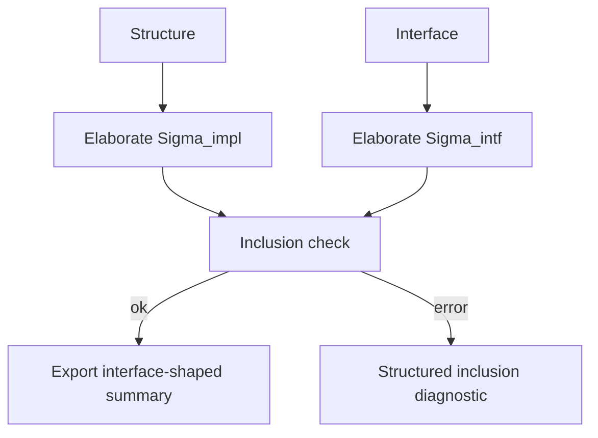

# Typ Signatures

This document specifies interfaces, signatures, and implementation checking for
`typ`.

This builds on top of [modules.md](./modules.md) and
[nominal_data.md](./nominal_data.md).

The point here is simple: the module calculus is not complete without the part
that says what a module promises to expose and how an implementation is checked
against that promise.

That is what signatures own.

## 1. Scope

This document covers:

- signature elaboration
- interface items
- module type expressions
- `with`-constraints
- destructive substitution
- opens and includes inside signatures
- implementation-versus-interface checking
- the export boundary that feeds `ModuleTypings`

This document does not cover:

- first-class modules
- recursive modules
- object and class signatures
- package types as core-expression syntax

Those are covered elsewhere.

## 2. What A Signature Is

A signature is a semantic interface, not just syntax.

It says:

- which names are exported
- in which namespaces they live
- which equalities are visible downstream
- which items are abstract versus manifest

That means signatures sit directly on the persistence seam.

If a module checks against a signature, then that signature shape is what
downstream modules, queries, and `ModuleTypings` should see.

## 3. Elaboration

Signature elaboration is left to right, just like structure elaboration.

Each signature item extends the environment for later items.

That means a later item may refer to:

- values introduced earlier in the signature
- types introduced earlier in the signature
- modules introduced earlier in the signature
- module types introduced earlier in the signature

This matters for manifest types, nested module signatures, includes, and
`with`-constraints.

### Example

```ocaml
sig
  type t
  val make : t
  module M : sig
    val id : t -> t
  end
end
```

The inner `module M` item is elaborated in an environment where `t` and `make`
are already known.

## 4. Signature Items

At minimum, `typ` should support these item families:

- value declarations
- type declarations
- type extensions
- exception declarations
- module declarations
- module substitutions
- module type declarations
- module type substitutions
- opens
- includes

Each signature item should elaborate to:

- a typed interface item
- a semantic signature item
- an updated environment for the remaining items

## 5. Module Type Expressions

At minimum, this slice should support:

- module type identifiers
- aliases
- signature literals
- functor module types
- `typeof`
- `with`-constraints

The contract is:

module type syntax elaborates into semantic module types before inclusion or
implementation checking happens.

That means downstream code should never have to reason directly over raw parsed
module-type syntax once elaboration is done.

## 6. `with`-Constraints

`with`-constraints refine an already-elaborated signature.

That means the checker should:

1. elaborate the base module type
2. extract its signature
3. apply each `with`-constraint in order
4. produce the refined module type

This is not just pretty syntax on top of signatures. It changes visible
equalities and therefore changes downstream typing.

For this slice, `typ` should cover:

- `with type`
- `with module`
- `with modtype`
- destructive substitution variants of those forms

The exact concrete AST can vary. The behavior should not.

### Example

```ocaml
module type S = sig
  type t
  val x : t
end

module type S_int = S with type t = int
```

After refinement, downstream users should see `x : int`, not `x : t` with an
unexplained abstract `t`.

## 7. Destructive Substitution

Destructive substitution is not just refinement. It also removes or replaces
the old item from the visible signature shape.

So the contract is:

- ordinary `with` refines while preserving the original item boundary
- destructive substitution rewrites the visible interface shape

This matters for:

- later lookup in the same signature
- inclusion checking
- exported `ModuleTypings` contents

## 8. Includes And Opens

An `include` inside a signature elaborates a module type and splices its
signature items into the current signature.

An `open` changes lookup for later items but does not necessarily become a
persisted exported item of its own.

The important rule is:

these operations affect the elaboration environment, not just the surface
syntax.

## 9. Implementation Checking

Given an implementation structure `S` and an interface signature `I`, `typ`
should:

1. elaborate `S` to its semantic exported signature `Sigma_impl`
2. elaborate `I` to `Sigma_intf`
3. check inclusion of `Sigma_impl` against `Sigma_intf`
4. export the interface-approved view

The important rule is:

what escapes the module is the interface-approved shape, not every internal
fact inferred while checking the implementation.

That means interfaces are not comments. They are semantic export constraints.

### Pseudocode

```ocaml
let check_implementation structure interface =
  let sigma_impl = elaborate_structure structure in
  let sigma_intf = elaborate_signature interface in
  require (include_signature sigma_impl sigma_intf);
  export_view sigma_intf
```

### Diagram



## 10. Inclusion

Signature inclusion must be a first-class judgment.

At minimum, it should compare:

- value declarations
- type declarations
- extension constructors
- modules
- module types

and it should report which part failed if inclusion does not hold.

This is one of the places where structured diagnostics matter a lot.

An inclusion failure is not just "types do not match." It usually has a very
specific symptom:

- missing field
- incompatible value declaration
- incompatible type declaration
- incompatible module type
- interface mismatch

The checker should preserve that shape.

## 11. Export Boundary

This slice feeds directly into `ModuleTypings`.

That means the canonical persisted summary should reflect:

- the interface view if one exists
- otherwise the implementation's exported signature view

So a module with an `.mli`-style interface should persist the interface-shaped
exports, not the raw internal implementation signature.

## 12. References

The main upstream extraction points here are:

- `typemod.ml`
  `transl_modtype`, `transl_signature`, `transl_with`, and
  `type_module_type_of`
- `includemod.mli`
  `signatures`, `check_modtype_inclusion`, and `check_implementation`

Those upstream entry points are enough to make the contract clear:

- elaborate signatures left to right
- refine them with `with`-constraints
- check inclusion explicitly
- export the constrained interface view
