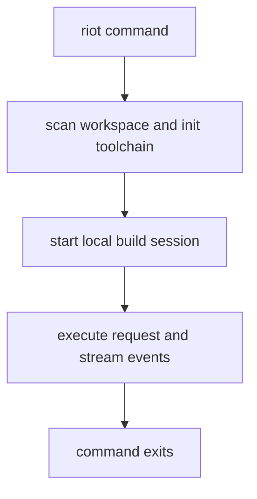

# RFD0001 - Simplify Riot into a One-Shot Build Tool

- Feature Name: `simplify_riot_one_shot`
- Start Date: `2026-03-19`
- Status: `implemented`

## Summary
[summary]: #summary

This RFD proposes collapsing `riot` back into a one-shot command-line build tool. `riot` should boot, evaluate the requested command, perform the build or query work, and then exit. The current daemon-oriented architecture, including background server management and the `riot-mcp` package, adds operational and conceptual overhead that is not justified by the current value it provides. The proposal keeps the useful internals, particularly actor-based build execution, while removing the long-lived server, daemon lifecycle, and MCP-facing layer from the core.

## Motivation
[motivation]: #motivation

The current `riot` architecture has accumulated multiple layers between a contributor invoking `riot` and the build work that actually happens:

- `riot-cli` parses commands.
- `riot-client` connects to a background server.
- `riot-build` manages daemon state and exposes JSON-RPC over TCP.
- `riot-mcp` wraps that again for agent-facing integration.

This layering makes the system harder to understand, test, and maintain.

For contributors, the mental model is no longer "run the build tool" but "interact with a distributed local system". That brings several problems:

- Build correctness is mixed with daemon lifecycle concerns.
- CLI behavior depends on background state and daemon files.
- Server management commands create additional failure modes such as stale PID files, stale port files, and partially initialized background services.
- The MCP layer makes the core build tool carry agent integration concerns that should be optional and external.

The result is that simple workflows, such as `riot build`, `riot run`, `riot bench`, and read-only workspace queries, now pay for transport and process management complexity that does not materially improve the common case.

This RFD is motivated by three concrete goals:

1. Make `riot` easier to reason about.
2. Reduce the amount of code that exists only to manage the daemon and transport.
3. Make future work on planning, execution, caching, and toolchain support happen in a smaller, more direct architecture.

Relevant use cases:

- A contributor runs `riot build` and expects the command to perform the build and exit, without background server reuse.
- A contributor runs `riot run foo` and expects `riot` to resolve, build, run, and exit in a single flow.
- A contributor debugging build behavior should not need to reason about PID files, TCP ports, or server reuse.
- Agent integrations should call a dedicated integration layer if desired, but the core build tool should not depend on that layer.

## Guide-level explanation
[guide-level-explanation]: #guide-level-explanation

After this change, contributors should think about `riot` as a normal build tool again.

`riot` commands will work as one-shot operations:

- `riot build`
- `riot run`
- `riot test`
- `riot bench`

Each command will:

1. Discover the workspace.
2. Initialize toolchain and store state.
3. Start any internal actors needed for the requested operation.
4. Execute the requested work.
5. Exit when the work is done.

There is no persistent daemon lifecycle in the user model. Contributors should not need `riot server start`, `riot server stop`, `riot server kill`, or daemon status checks for normal operation.

The actor model remains an implementation detail, not an operational mode. The system may still spawn internal actors for build orchestration, telemetry, or worker coordination, but those actors exist only for the lifetime of the command invocation.

The `riot-mcp` package is removed from the core workspace. If agent integrations are desired, they should live in a separate integration layer that depends on `riot`, not the other way around.

Example before:

```text
riot build
  -> ensure daemon
  -> connect over tcp/json-rpc
  -> send request
  -> stream responses
  -> leave daemon running
```

Example after:

```text
riot build
  -> initialize local session
  -> execute build in-process
  -> stream events directly
  -> exit
```

This should make the code easier to read and modify. A contributor investigating a CLI command should be able to trace it to the execution path without crossing daemon bootstrapping, port discovery, and transport adapters.

### Diagram template (when relevant)



## Reference-level explanation
[reference-level-explanation]: #reference-level-explanation

The proposed implementation has three major parts.

### 1. Replace daemon management with one-shot local sessions

`riot-build` currently combines two responsibilities:

- command-local build/query execution
- daemon/process lifecycle management

This RFD proposes removing the second responsibility.

The server internals should be repackaged as a local session runtime:

- initialize workspace, toolchain, store, and package graph state
- spawn the internal server actor for the current command
- allow the CLI to send requests directly to that actor
- tear down naturally when the command finishes

The current `Server_manager.ensure_running` should be replaced by a one-shot session constructor inside `riot-cli`.

### 2. Collapse the default transport

The CLI should not require JSON-RPC-over-TCP to talk to the local executor.

The default path should be:

- move the local request helpers into `riot-cli`
- route build/query operations directly through `Protocol.ServerRequest` / `Protocol.ServerResponse`
- preserve streaming build events through actor messaging rather than JSON-RPC response parsing
- delete `riot-client`, `riot rpc`, and the TCP/JSON-RPC bridge from the core path

This keeps CLI churn small while removing the daemon and network coupling.

`jsonrpc` and the TCP server may remain temporarily only if needed for migration compatibility, but they should no longer sit on the primary path for normal `riot` commands.

### 3. Remove MCP from the core

`packages/riot-mcp` should be deleted.

That removal includes:

- deleting the `riot-mcp` package
- removing the `riot mcp` CLI subcommand
- removing shell completion entries for `mcp`
- removing manifest dependencies that exist only for MCP support

The core `riot` workspace should not need the `mcp` package or an MCP server implementation to build and run.

### Command surface implications

The following command families should keep working through the local session path:

- build
- run
- bench
- install
- workspace/package graph queries
- formatting commands that currently flow through the server

The following command families should be removed or reduced:

- `riot server start`
- `riot server stop`
- `riot server kill`
- `riot server status`
- `riot mcp`

`riot server foreground` may remain temporarily as a development/debug escape hatch if it materially helps migration, but it should not remain part of the normal architecture.

### Dead code expected after the cut

This refactor is expected to make several areas removable or shrinkable:

- daemon file handling
- PID/port discovery logic
- server restart/shutdown semantics
- tests that validate daemon reuse rather than build behavior
- client transport code that only exists for local TCP communication

## Drawbacks
[drawbacks]: #drawbacks

- Startup work currently amortized across a daemon will happen per invocation.
- Some existing tests and utilities built around server lifecycle will need to be rewritten.
- If any external integrations depend on the current local JSON-RPC server, they will need a migration path or an explicit compatibility story.
- Keeping the actor-based server internals while deleting the daemon may still leave some conceptual indirection until a later cleanup pass.

## Rationale and alternatives
[rationale-and-alternatives]: #rationale-and-alternatives

This design is the best immediate simplification because it attacks the operational complexity without forcing a full rewrite of planning and execution internals.

Alternatives considered:

- Keep the daemon, but hide it better.
  This does not solve the maintenance problem. It preserves PID files, background lifecycle bugs, and extra architecture in the common path.

- Keep JSON-RPC/TCP, but start a fresh server per command.
  This is simpler than a reusable daemon, but it still keeps an unnecessary local transport stack in the critical path.

- Inline everything directly into `riot-cli`.
  This would reduce package count faster, but it risks mixing execution internals into the CLI layer too early. Keeping a local session boundary gives a cleaner migration path.

- Keep `riot-mcp` in-tree as an optional package.
  That still makes the core workspace carry integration complexity that is not required for the build tool itself.

If this RFD is not implemented, `riot` remains harder to reason about than it needs to be, and future work will continue paying the cost of the current layering.

## Prior art
[prior-art]: #prior-art

Most build tools and package managers present a one-shot CLI model even when they use internal worker pools or background helpers internally. Contributors usually do not manage those helpers directly as part of the normal workflow.

Within this repository, several subsystems already use actors as internal coordination mechanisms without exposing daemon lifecycle as part of the primary user model. That is the pattern this RFD wants for `riot`: keep actors where they help execution, remove them as an operational burden.

The current `riot` architecture itself is also prior art in what to avoid here. It demonstrates that a daemon-plus-client-plus-MCP stack can be built, but it also demonstrates the resulting maintenance cost and user-facing complexity.

## Unresolved questions
[unresolved-questions]: #unresolved-questions

- Should `riot-build` keep a debug-only foreground mode after the primary transport is collapsed?
- Are there any external consumers of the current JSON-RPC server that need a compatibility shim before transport code is removed entirely?

## Future possibilities
[future-possibilities]: #future-possibilities

Once the daemon and MCP layers are removed, follow-up simplifications become easier:

- collapse `riot-build` into a smaller local execution library
- separate read-only query/session logic from build execution logic
- expose a cleaner external integration surface for agents that is maintained independently from the core build tool

The likely long-term direction is a `riot` architecture with a very small CLI layer, a local execution/session layer, and focused planner/executor/toolchain packages underneath it.
