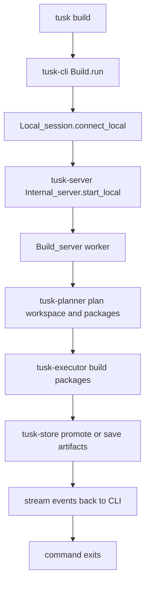
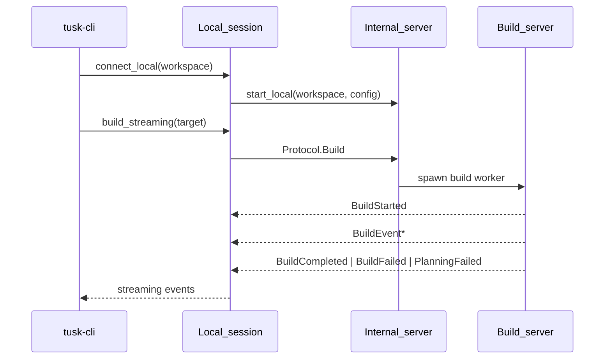
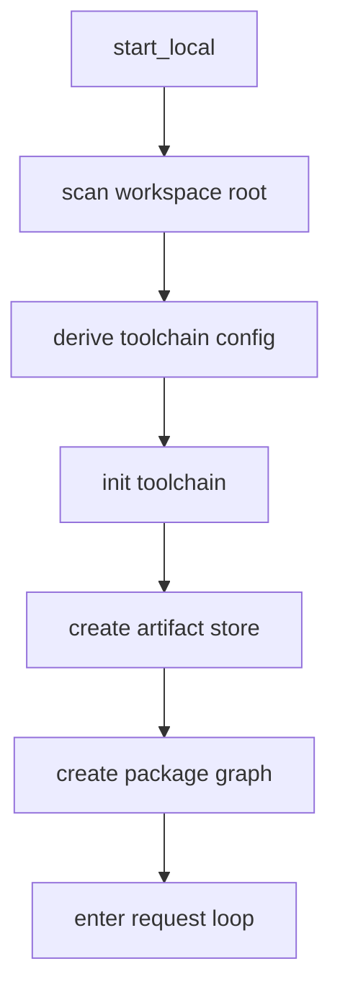
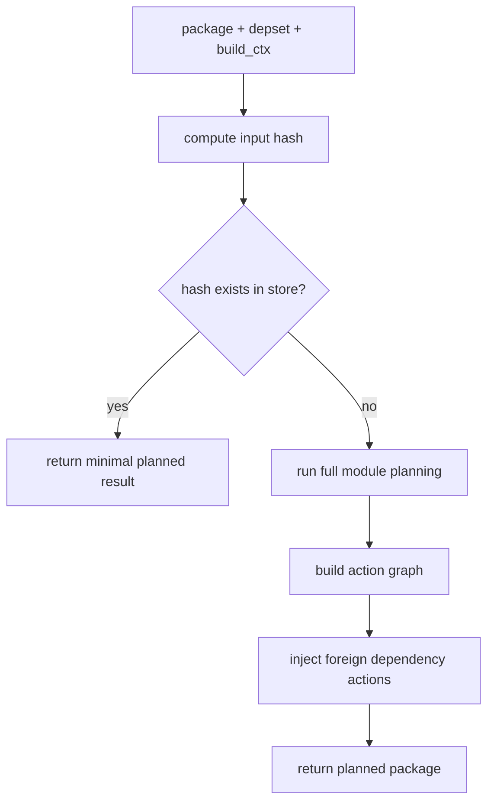
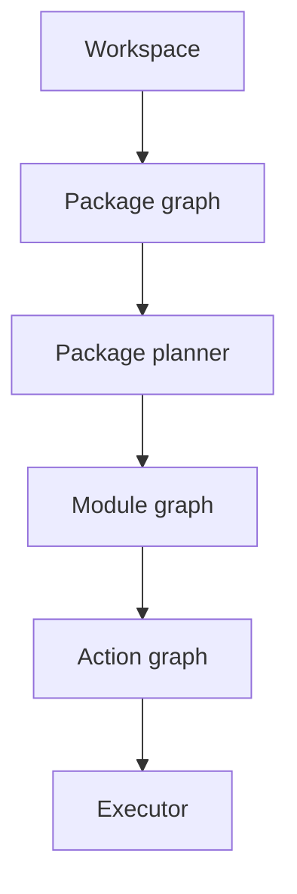
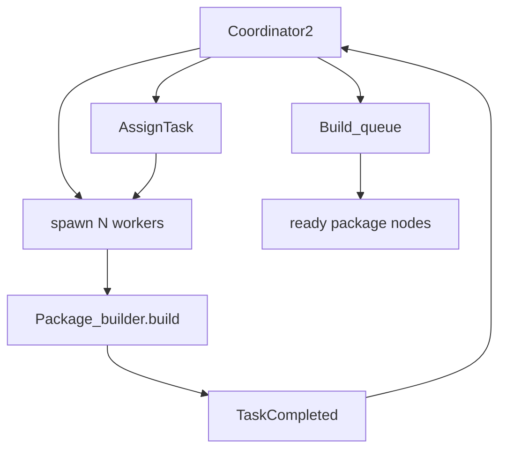
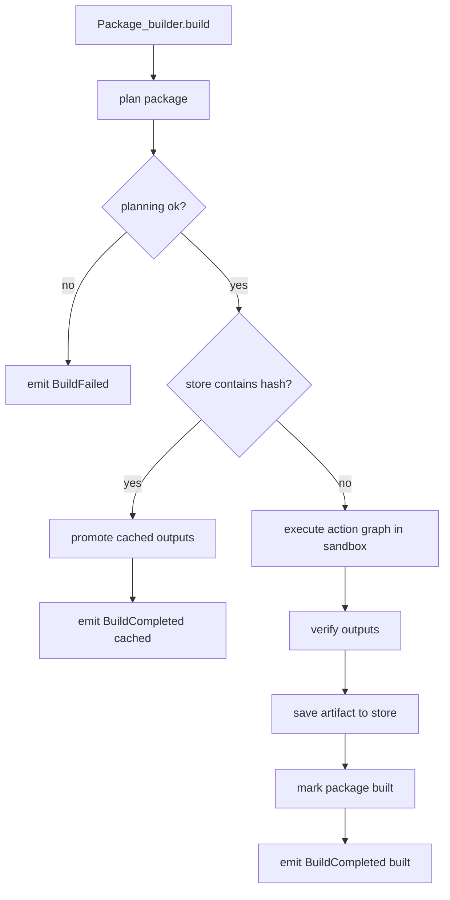
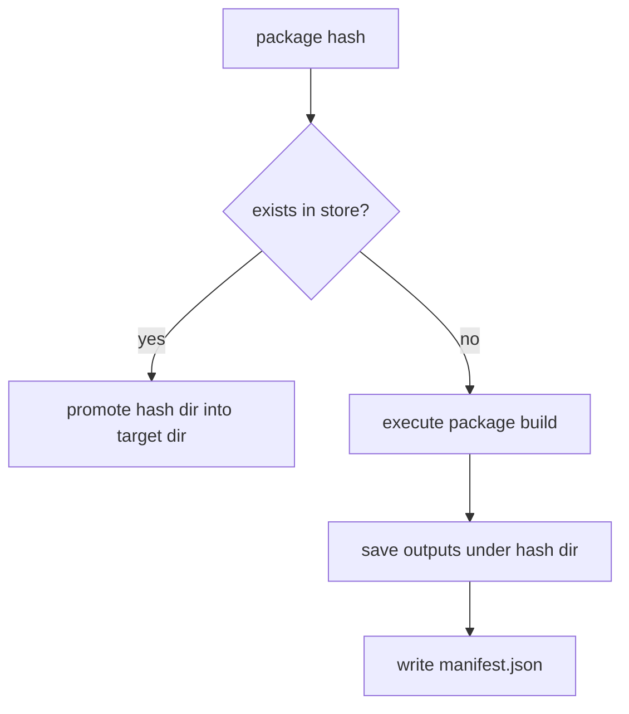
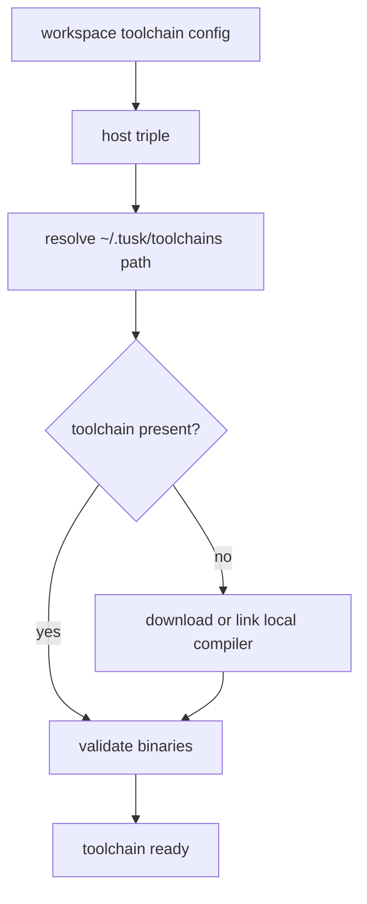

# RFD0003 - Tusk Build System Snapshot

- Feature Name: `tusk_build_system_snapshot`
- Start Date: `2026-03-19`
- RFD PR: [leostera/riot#0000](https://github.com/leostera/riot/pull/0000)
- Riot Issue: [leostera/riot#0000](https://github.com/leostera/riot/issues/0000)

## Summary
[summary]: #summary

This RFD documents the steady-state architecture of `tusk` once a working `tusk` binary already exists. It captures the current one-shot local build flow across `tusk-cli`, `tusk-server`, `tusk-planner`, `tusk-executor`, `tusk-store`, and `tusk-toolchain`.

## Motivation
[motivation]: #motivation

The build system has a clear local execution model, but there is no single document that describes the system as it exists today.

This RFD exists to capture:

- the CLI entrypoints
- the local session boundary
- the runtime orchestration layer
- workspace and package planning
- package execution
- caching
- toolchain and cross-compilation behavior

## Guide-level explanation
[guide-level-explanation]: #guide-level-explanation

The system currently operates as a one-shot local build tool with a few clear layers:

1. `tusk-cli` parses the command and decides what the user is asking for.
2. `tusk-cli` opens a local session through `Local_session`.
3. `tusk-server` starts an in-process actor that owns workspace, toolchain, store, and package graph state for that command invocation.
4. a build worker plans the requested packages and executes them.
5. build events stream back to the CLI while the command is running.
6. the process exits when the command is done.

The “server” is a local actor-based orchestration layer used within a single command execution.

The main package responsibilities are:

- `tusk-model`: shared types and directory conventions
- `tusk-toolchain`: compiler/toolchain discovery, download, and invocation
- `tusk-store`: content-addressed artifact cache
- `tusk-planner`: package graph, module graph, and action graph planning
- `tusk-executor`: per-package build execution and workspace coordination
- `tusk-server`: local orchestration and request handling
- `tusk-cli`: user-facing commands and output

### End-to-end build flow

## Reference-level explanation
[reference-level-explanation]: #reference-level-explanation

## 1. Entry points and command model

The main binary starts in `packages/tusk-cli/src/main.ml`, which runs `Miniriot.run ~main:Tusk_cli.Cli.main`.

The CLI itself is assembled in `packages/tusk-cli/src/cli.ml`.

Important properties of the current CLI flow:

- built-in commands are registered statically
- package commands are discovered dynamically from the workspace
- most meaningful operations scan the workspace up front
- build commands operate through a local session boundary

For `tusk build`, the relevant entrypoint is `packages/tusk-cli/src/build.ml`.

That module is responsible for:

- resolving the requested package target, if any
- resolving target architecture flags
- auto-installing missing toolchains for configured targets
- opening a local build session
- formatting streamed build events for the user
- presenting final success or failure summaries

## 2. Local session boundary

`packages/tusk-cli/src/local_session.ml` is the CLI-to-runtime seam.

This module:

- calls `Tusk_server.start_local`
- sends requests with `Protocol.ServerRequest`
- receives responses with `Protocol.ServerResponse`
- exposes build operations as streaming event flows

`Local_session.build_streaming`:

1. creates a fresh `Session_id`
2. sends `Protocol.Build`
3. waits for `BuildStarted`
4. streams `BuildEvent`
5. terminates on `BuildCompleted`, `BuildFailed`, `PlanningFailed`, or `CycleDetected`

## 3. Internal server state

`packages/tusk-server/src/internal_server.ml` builds the state for a single command invocation.

The state contains:

- the rescanned `Workspace.t`
- the resolved host toolchain
- the artifact store
- concurrency settings
- the current package graph
- workspace load errors

Initialization:

1. scan workspace root
2. derive toolchain config
3. initialize `tusk-toolchain`
4. create `tusk-store`
5. create the package graph
6. enter request loop

## 4. Build protocol and session messages

`packages/tusk-server/src/protocol.ml` defines the request and response messages used inside the local session.

The build request is:

- `Build { client_pid; target; target_arch; session_id }`

The build responses are:

- `BuildStarted`
- `BuildEvent`
- `BuildCompleted`
- `BuildFailed`
- `PlanningFailed`
- `CycleDetected`
- `PackageNotFound`

`BuildStats` tracks:

- start and end time
- built and failed package counts
- total module count
- cache hits and misses

## 5. Workspace planning

`packages/tusk-planner/src/workspace_planner.ml`:

1. rejects package load errors
2. builds a `Package_graph`
3. optionally filters the graph to a single package target
4. topologically sorts the graph

The result contains:

- ordered packages to build
- the package graph
- the workspace snapshot

Planning can fail with:

- `PackageNotFound`
- `CycleDetected`
- `MissingDependencies`
- `PackageLoadFailed`

## 6. Package planning

`packages/tusk-planner/src/package_planner.ml`:

1. checks that dependency packages have already been built successfully
2. computes a deterministic input hash
3. uses that hash as the package build hash
4. checks the store for a fast-path cache hit
5. if needed, performs full module and action planning
6. injects foreign dependency build actions into the action graph

The package hash includes:

- build context
- resolved profile
- package metadata
- workspace-specific dependency details
- dependency hashes

The `Session_id` is excluded from build hashing.

## 7. Module and action planning

Below package planning, the planner produces:

- a module graph
- an action graph

The module planner creates nodes for:

- `.ml`
- `.mli`
- C/native sources
- libraries
- binaries
- package commands

The action graph turns those nodes into executable steps such as:

- compile interface
- compile implementation
- generate interface
- compile C
- create library
- create executable
- create shared library
- build foreign dependency
- copy file
- write file

## 8. Workspace execution

`packages/tusk-executor/src/coordinator2.ml` is the top-level workspace executor.

Its flow is:

1. call `Tusk_planner.plan_workspace`
2. topologically sort package nodes
3. spawn a fixed number of worker actors
4. queue package nodes for build
5. assign ready package builds to idle workers
6. collect `TaskCompleted`
7. loop until all packages are completed

## 9. Per-package build execution

`packages/tusk-executor/src/package_builder.ml` is where planned packages become outputs.

For each package:

1. compute target output directory
2. call `plan_package_with_graph`
3. handle planning failures
4. handle skipped or failed dependencies
5. check the store for a package-level cache hit
6. if cached, promote outputs
7. otherwise execute the action graph in a sandbox
8. verify outputs
9. save outputs to the store
10. mark the package graph node as built

## 10. Action execution and sandboxing

The concrete action execution path lives in `tusk-executor`.

Actions are executed inside a sandbox directory and translated into toolchain calls for:

- compiling interfaces and implementations
- generating interfaces
- compiling C
- building archives and executables
- running foreign build commands
- copying and writing files

## 11. Artifact store

`packages/tusk-store/src/store.ml` is the content-addressed cache.

The store:

- creates a cache directory under `Tusk_dirs.cache_dir`
- stores artifacts under a hash-derived directory
- writes a `manifest.json`
- promotes cached outputs into target directories

The store is package-level, not action-level.

## 12. Toolchain boundary

`packages/tusk-toolchain/src/tusk_toolchain.ml` owns the compiler and toolchain boundary.

It is responsible for:

- locating the host triple
- resolving toolchain paths under `~/.tusk/toolchains`
- validating compiler binaries
- linking to a local `./ocaml/compiler` tree when present
- downloading prebuilt toolchains from `cdn.riot.ml`
- initializing cross-compilation toolchains for explicit targets

## 13. Cross-compilation

Cross-compilation enters through `tusk-cli/src/build.ml`.

The CLI:

- resolves `-x` / `--target`
- expands target patterns
- installs missing toolchains when needed

The build worker then:

- parses the target triple
- constructs a `Build_ctx`
- initializes the toolchain for that target

`Build_ctx` carries host-vs-target information through the build.

## Drawbacks
[drawbacks]: #drawbacks

- some package names do not match their current responsibilities exactly
- `tusk-server` is a local session runtime and is named as a server
- toolchain setup logic exists in both CLI and runtime paths

## Rationale and alternatives
[rationale-and-alternatives]: #rationale-and-alternatives

This document is descriptive, not prescriptive.

Alternatives considered:

- documenting bootstrap and steady-state `tusk` together in one RFD
- relying only on package-local docs

This RFD focuses only on the steady-state `tusk` system once a working `tusk` binary already exists.

## Prior art
[prior-art]: #prior-art

The main prior art for this RFD is the current implementation across:

- `tusk-cli`
- `tusk-server`
- `tusk-planner`
- `tusk-executor`
- `tusk-store`
- `tusk-toolchain`

The specific combination here is Riot-specific: actor-based orchestration, package-level store entries, and a local-session seam between CLI and runtime orchestration.

## Unresolved questions
[unresolved-questions]: #unresolved-questions

- Should `tusk-server` be renamed to reflect its current responsibility?
- How much of the current toolchain setup duplication should remain?

## Future possibilities
[future-possibilities]: #future-possibilities

- rename packages so responsibilities are clearer
- reduce duplicated toolchain handling
- document cross-compilation in more depth
