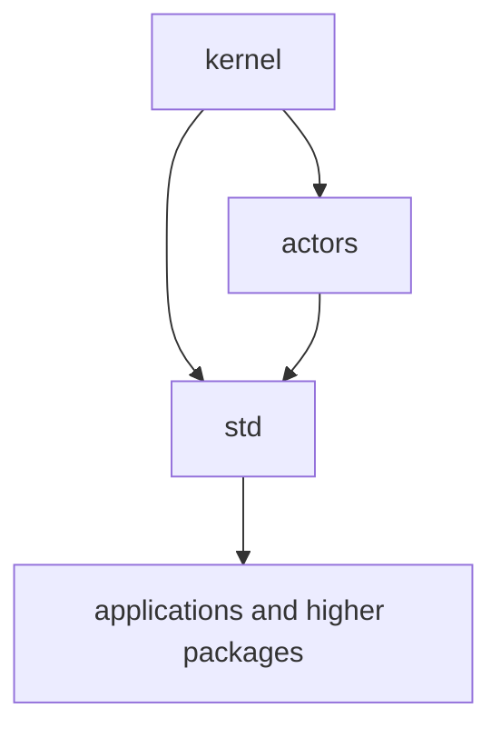
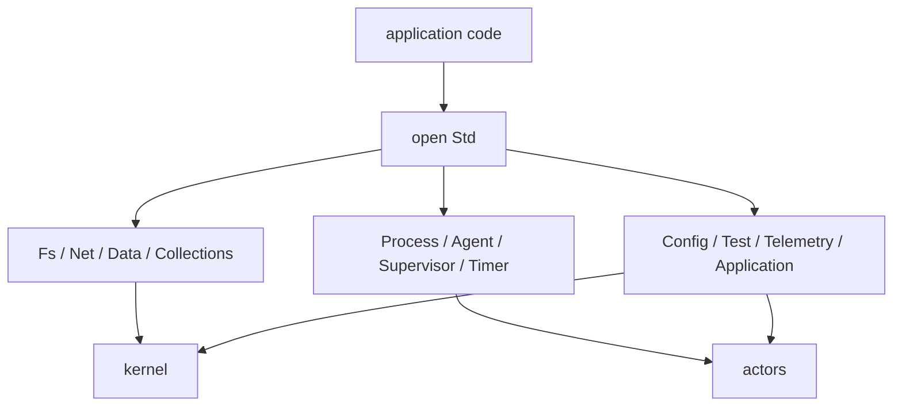
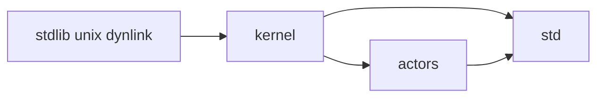
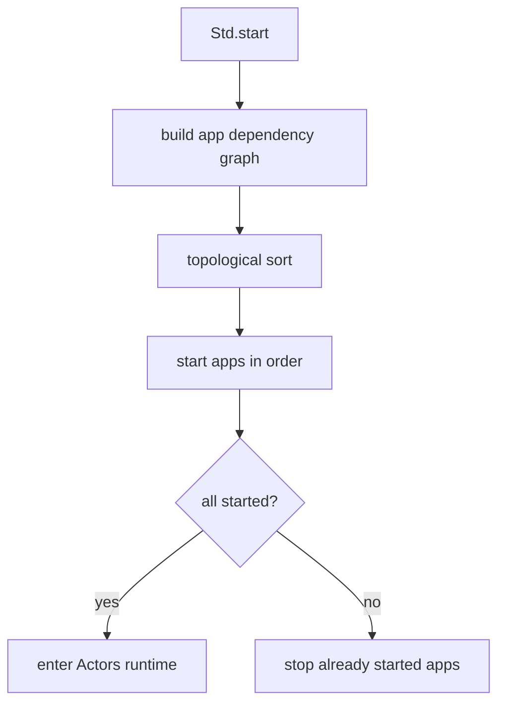

# RFD0005 - Kernel and Std Snapshot

- Feature Name: `kernel_and_std_snapshot`
- Start Date: `2026-03-19`
- Status: `implemented`
- RFD PR: [leostera/riot#0000](https://github.com/leostera/riot/pull/0000)
- Riot Issue: [leostera/riot#0000](https://github.com/leostera/riot/issues/0000)

## Summary
[summary]: #summary

This RFD documents the current relationship between `kernel` and `std`. It captures how Riot splits its foundational library surface into a low-level systems boundary in `kernel` and a broader application-facing standard library in `std`, with `actors` sitting between them for actor runtime behavior.

## Motivation
[motivation]: #motivation

`kernel` and `std` are both foundational, but they do different jobs.

Without a snapshot document, it is easy to blur their roles:

- `kernel` can look like just a bag of primitives unless its boundary is described explicitly
- `std` can look like a generic utilities package instead of the mandatory Riot surface
- the relationship between `kernel`, `actors`, and `std` can become implicit instead of architectural

This RFD records the current design as it exists today:

- what belongs in `kernel`
- what belongs in `std`
- how `std` re-exports and composes lower layers
- how applications reach runtime, filesystem, data, networking, and process facilities through `std`

## Guide-level explanation
[guide-level-explanation]: #guide-level-explanation

The current layering is:

1. `kernel` provides low-level systems primitives and platform integration
2. `actors` turns some of those primitives into an actor runtime
3. `std` becomes the default library surface for almost all Riot code

In practice:

- if code is FFI, raw platform details, or low-level async/polling primitives, it belongs in `kernel`
- if code is needs actor scheduling, processes, mailboxes, timers, or receive semantics, it belongs in `actors`
- if code is ergonomic everyday APIs for files, data, networking, application structure, testing, logging, or higher-level process helpers, it belongs in `std`

### Layer relationship

### What `kernel` is

`kernel` is the low-level boundary.

It currently owns things like:

- async polling
- file descriptors and I/O
- filesystem primitives
- network sockets and TLS streams
- time and timers at the primitive level
- system and host information
- synchronization primitives
- crypto and hashing
- thin wrappers over runtime/platform behavior

`kernel` is allowed to touch direct `stdlib`, `unix`, and platform-specific edges.

### What `std` is

`std` is the main library developers are expected to open and use.

It currently gathers and exposes:

- process and runtime-facing APIs built on `actors`
- richer filesystem and path handling
- collections and iterators
- data formats like JSON, TOML, CSV, XML, and S-expressions
- networking and HTTP types
- config loading/validation
- telemetry
- testing utilities
- agents, supervisors, worker pools, and application startup helpers

### Application-facing model

Applications generally touch `std`, not `kernel`, directly.

## Reference-level explanation
[reference-level-explanation]: #reference-level-explanation

## 1. Package boundaries and dependencies

The current manifests are simple:

- `kernel` depends on `stdlib`, `unix`, and `dynlink`
- `actors` depends on `kernel`
- `std` depends on `kernel` and `actors`

That produces a clear stack:

## 2. `kernel` as the systems boundary

`packages/kernel/src/kernel.mli` shows the current shape of the public `Kernel` surface.

It re-exports:

- `Async`
- `Collections`
- `Crypto`
- `Env`
- `Fd`
- `Fs`
- `IO`
- `Iter`
- `Net`
- `Sync`
- `System`
- `Terminal`
- `Time`
- primitive types and helpers like `Int`, `String`, `Option`, `Result`, and `UUID`

It also includes `Global` at the top level and exposes convenience constructors for vectors, queues, sets, and maps.

The key point is that `kernel` is not only “FFI code”. It is the low-level substrate that Riot code can rely on without depending directly on OCaml runtime modules everywhere.

## 3. Platform integration in `kernel`

`kernel` contains the repo’s explicit platform-facing configuration.

`packages/kernel/riot.toml` currently carries platform-specific link behavior:

- macOS OpenSSL include and link flags
- Linux OpenSSL and `uuid` link flags

That matches the package’s role as the place where platform conditionals are allowed to live.

`packages/kernel/src/system/system.mli` exposes host/platform details such as:

- parsed host triples
- available parallelism
- OS family flags
- runtime parameters
- signal handling
- executable name and argv
- process replacement through `execv`

## 4. Primitive vs ergonomic APIs

The split between `kernel` and `std` is not just about dependencies. It is also about API shape.

`kernel` APIs tend to be:

- narrow
- mechanical
- closer to platform behavior
- suitable for building larger abstractions

`std` APIs tend to be:

- broader
- more ergonomic
- more integrated across subsystems
- intended as the default import surface

Examples of this pattern in the current tree:

- `Kernel.Async.Poll` vs higher actor-facing process/syscall use through `Actors` and `Std.Process`
- `Kernel.Fs` and `Kernel.IO` primitives vs richer `Std.Fs`, `Std.Path`, and higher-level file helpers
- `Kernel.System` host/process details vs `Std.Application`, `Std.Config`, and application lifecycle helpers

## 5. `std` as the main Riot surface

`packages/std/src/std.ml` is the aggregation point.

It currently re-exports a wide cross-section of modules, including:

- `Agent`
- `Application`
- `ArgParser`
- `Collections`
- `Config`
- `Crypto`
- `Data`
- `Fs`
- `Graph`
- `Log`
- `Message`
- `Net`
- `Pid`
- `Process`
- `Supervisor`
- `Sync`
- `Telemetry`
- `Test`
- `Time`
- `Timer`
- `Unicode`
- `WorkerPool`

It also includes `Global`, giving the rest of the repo a shared ambient foundation through `open Std`.

## 6. Process-facing surface in `std`

`std` does not implement its own runtime. It wraps and re-exports `actors`.

For example, `packages/std/src/process.mli` includes the module type of `Actors.Process`, then adds:

- `self`
- `spawn`
- `spawn_link`

This pattern is important:

- runtime semantics remain owned by `actors`
- most higher-level code still works through `Std.Process`

The same general principle shows up in other parts of `std`: it is a curated integration layer, not a completely separate stack.

## 7. Application startup

`packages/std/src/application.ml` provides application dependency management and startup ordering.

The current design:

1. models applications as records with `name`, `deps`, `start`, and `stop`
2. builds a dependency graph
3. topologically sorts it
4. starts apps in dependency order
5. rolls back already-started apps on failure

`Std.start` in `packages/std/src/std.ml` then uses `Actors.run` to host that application set and keep the system alive.

## 8. Telemetry as a library-level actor

`packages/std/src/telemetry.ml` shows an important current design pattern in `std`.

Telemetry is implemented as its own actor server with:

- attach/detach handler messages
- a global PID cell
- event emission through actor messaging

This shows how `std` uses `actors` to build reusable coordination services rather than exposing only raw process APIs.

## 9. Data, config, and testing in `std`

One of `std`’s distinctive roles in this repository is breadth.

The current tree includes substantial library surfaces for:

- `Data.Json`
- `Data.Toml`
- `Data.Csv`
- `Data.Xml`
- `Config`
- `Test`
- `Unicode`
- `Net.Http`

That makes `std` more than a convenience layer. It is Riot’s integrated default programming environment.

## 10. Why both layers exist

The current codebase embodies a specific separation:

- `kernel` keeps low-level concerns explicit and contained
- `std` gives developers one coherent place to stand

Without `kernel`, low-level platform and runtime details would leak upward.
Without `std`, application code would have to assemble its own stack from smaller pieces constantly.

## Drawbacks
[drawbacks]: #drawbacks

- `std` has a very wide surface area, which increases blast radius for changes
- the boundary between “kernel primitive” and “std convenience” still depends partly on judgment
- some modules in `std` are aggregation-focused rather than deeply minimal
- the current stack still relies on re-exports heavily, which can obscure original ownership when reading code quickly

## Unresolved questions
[unresolved-questions]: #unresolved-questions

- how much larger should `std` become before some areas split into separately documented subsystems?
- should more currently duplicated utility surfaces move either down into `kernel` or up into higher-level packages?
- where exactly should future application-framework features stop and `std` stop growing?
- how opinionated should `Std.start` and application wiring become over time?

## Future possibilities
[future-possibilities]: #future-possibilities

- stronger package-local architecture docs for major `std` subsystems like config, test, net, and data
- clearer naming or grouping around the parts of `std` that are runtime-facing vs purely library-facing
- deeper cross-platform abstractions in `kernel`
- more integrated application lifecycle and supervision stories in `std`
- code generation or documentation tooling that can surface ownership through the `kernel -> actors -> std` stack more clearly
