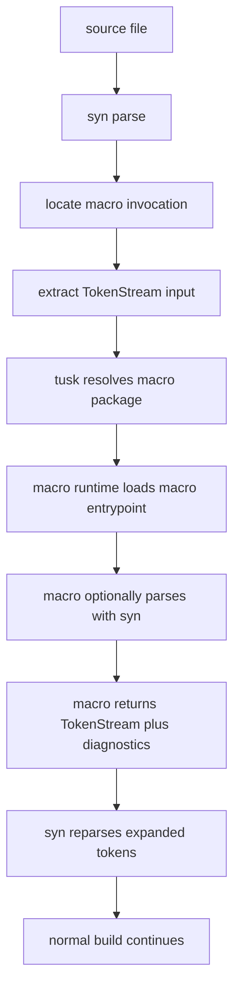
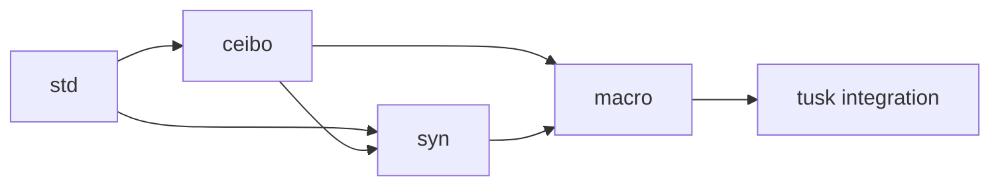
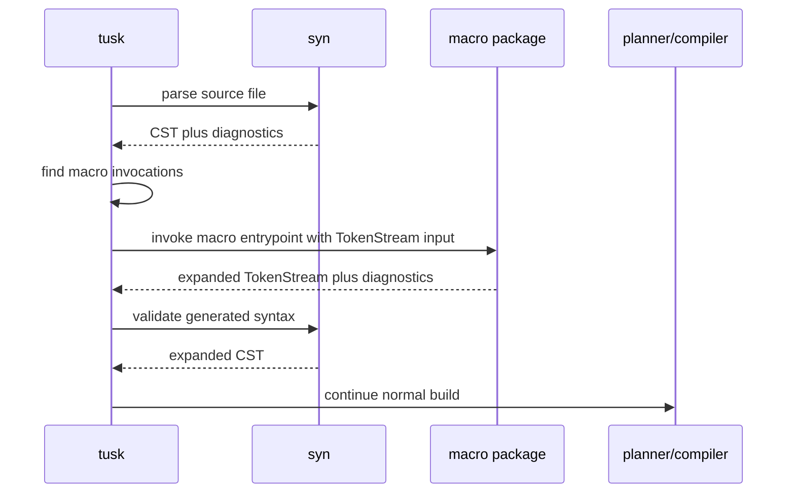
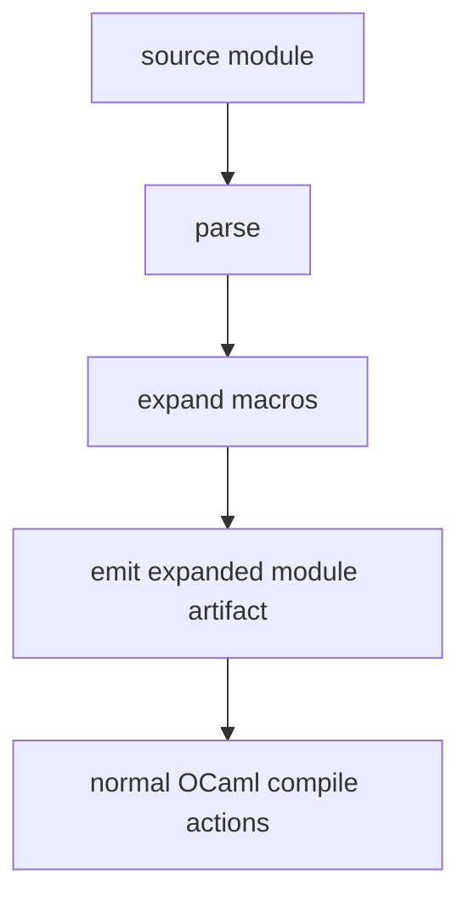

# RFD0008 - Macro

- Feature Name: `macro`
- Start Date: `2026-03-20`
- RFD PR: [leostera/riot#0000](https://github.com/leostera/riot/pull/0000)
- Riot Issue: [leostera/riot#0000](https://github.com/leostera/riot/issues/0000)

## Summary
[summary]: #summary

This RFD proposes a new `macro` package for Riot: a procedural macro system for
OCaml built on top of `syn` and `ceibo`. The goal is to give Riot a
syntax-aware, package-managed macro layer similar in spirit to Rust’s
procedural and declarative macros.

The core macro contract should be token-stream based. Macros should receive
token streams, optionally parse them with `syn`, transform them in user-defined
code, and return generated token streams plus diagnostics. The first version
should focus on explicit, parser-backed code generation rather than compiler
plugins, hygiene research, or implicit compile-time magic.

## Motivation
[motivation]: #motivation

Riot now has the missing prerequisite for a real macro story:

- `syn` can parse the Riot codebase successfully
- `syn` produces lossless syntax trees
- `syn` has a real diagnostics suite
- `ceibo` provides the red-green tree substrate needed for structural rewriting

That changes macro work from “interesting future idea” into “practical next
layer”.

The motivating use cases are concrete:

1. A package defines a derive-style macro that expands into ordinary OCaml declarations.
2. An application uses an attribute-like or function-like macro to reduce
   boilerplate around actors, messages, SQL, routing, or serialization.
3. A macro emits rich parser-style diagnostics tied to source spans, instead of
   failing as a stringly preprocessor.
4. Macro expansion participates in `tusk` builds as a normal package dependency.
5. Future Riot libraries such as `sqlx`, web routing, or state-machine helpers
   can offer structured code generation without depending on an external ppx story.

This RFD is motivated by one broad idea: Riot should own its macro story the
same way it now owns its parser story.

## Guide-level explanation
[guide-level-explanation]: #guide-level-explanation

Contributors should think about `macro` as a new package layer on top of `syn`.

The flow is:

1. User code contains a macro invocation.
2. `tusk` resolves the macro package as a build dependency.
3. The macro runtime receives token streams, not raw strings.
4. A macro may parse those tokens with `syn` if it wants structured syntax.
5. The macro returns generated token streams plus optional diagnostics.
6. The expanded code continues through the normal build pipeline.

The user model should feel closer to Rust procedural macros than to textual
preprocessors.

### What kinds of macros

The first design should support a small, deliberate set of macro forms:

- **derive-style macros**
  attached to declarations and generating sibling declarations
- **attribute-style macros**
  attached to items or expressions and rewriting the attached syntax
- **function-like macros**
  invocations that receive a token payload and expand to syntax

These names are intentionally “Rust-shaped” because that is the clearest mental
model for what Riot wants here.

### End-to-end model



### What a macro author should write

At the guide level, a macro author should write ordinary Riot package code that
looks something like:

```ocaml
let agent (input : Macro.TokenStream.t) =
  match Macro.Parse.derive_input input with
  | Ok item ->
      Agent.expand item
      |> Result.map_error Macro.Error.to_compile_error
      |> Result.unwrap_or_else Fn.id
  | Error diag ->
      Macro.Error.to_compile_error diag
```

The exact API names are not the point yet. The important part is the shape:

- the public input is a token stream
- macro authors can opt into structured `syn` parsing
- the public output is a token stream
- diagnostics are first-class

### Relationship to `syn`, `ceibo`, and `tusk`

`macro` is not a parser.
`macro` is not a formatter.
`macro` is not a text-preprocessor.

Instead:

- `ceibo` owns tree representation
- `syn` owns parsing and syntax kinds
- `macro` owns token-stream macro authoring and expansion
- `tusk` owns build integration and expansion scheduling

That layering is the main architectural point of this proposal.

## Reference-level explanation
[reference-level-explanation]: #reference-level-explanation

## 1. Package boundaries

The proposal introduces a new `packages/macro` package with a dependency shape
like:



The intended responsibility split is:

- `ceibo`: generic tree representation
- `syn`: OCaml parser, lexer, syntax kinds, diagnostics
- `macro`: macro authoring API, expansion runtime, result model
- `tusk`: build-time execution of macros

`macro` should depend on `syn`, not the other way around.

## 2. Expansion model

The system should be explicit about expansion stages.

The first version should treat macro expansion as a source-to-source transform
that happens after parsing and before downstream compilation planning.

High-level expansion pipeline:



Important properties:

- macro expansion should be deterministic
- expansion should return token streams, not raw compiler internals
- generated syntax should be reparsed/validated
- macro diagnostics should be reported in the same general style as parser diagnostics

## 3. Macro input and output

The macro ABI should not be “just strings”, but it also should not force a full
typed AST at the boundary.

The primary macro interface should be:

- `TokenStream -> TokenStream`

That gives Riot one universal exchange type for:

- derive-style macros
- attribute-style macros
- function-like macros

On top of that, `macro` should expose ergonomic `syn` adapters such as:

- `Macro.parse_derive_input`
- `Macro.parse_item`
- `Macro.parse_expr`
- `Macro.parse_type_expr`
- `Macro.parse_pattern`

This keeps the split explicit:

- **public ABI**: token streams
- **author ergonomics**: parse into `syn` structures when needed

The macro output should support:

- generated token streams
- diagnostics

A plausible result shape is:

```ocaml
type result = {
  output : Macro.TokenStream.t;
  diagnostics : Macro.Diagnostic.t list;
}
```

The output token stream should then be reparsed by `syn` as part of expansion
validation.

## 4. Invocation forms

The syntax surface must be explicit.

This RFD assumes Riot will eventually teach `syn` to parse macro invocation
forms directly, rather than treating all macro-like syntax as generic
attributes forever.

The initial target is:

- **derive macros**
  attached to a type or declaration and expanding nearby code
- **attribute macros**
  attached to an item/expression and replacing or augmenting that item
- **function-like macros**
  explicit invocation with a payload

The exact OCaml-facing syntax remains open, but the parser and macro model
should be designed together rather than separately.

The registration model should also be explicit. A derive macro likely needs to
declare:

- macro kind
- exported macro name
- helper attributes it recognizes

The Rust shape is instructive here:

```rust
#[proc_macro_derive(Agent, attributes(agent))]
```

Riot should provide an equivalent registration concept even if the exact surface
syntax differs.

## 5. Diagnostics

Macro diagnostics should be first-class, structured, and span-aware.

They should support:

- primary span
- message
- optional notes or suggestions
- optional spans into generated syntax when relevant

The user should not have to guess whether an error came from:

- parsing the original source
- macro expansion logic
- parsing generated output

A good diagnostic flow will clearly distinguish those phases while still
presenting them through a coherent Riot toolchain surface.

## 6. Safety and determinism

The first macro system should be intentionally constrained.

It should prefer:

- deterministic expansion
- explicit package dependencies
- no hidden network or filesystem behavior during expansion
- stable input/output contracts

This RFD does not propose free-form compile-time effects.

If macros eventually need more capabilities, that should be an explicit later
design discussion.

## 7. Build system integration

`tusk` needs to treat macro packages as a distinct kind of dependency.

That implies at least:

- macro packages build before packages that use them
- macro outputs participate in the normal action graph
- expansion invalidation depends on:
  - macro package hash
  - input source hash
  - macro configuration, if any

A likely direction is to add macro-expansion actions to the planner, rather than
smuggling macro work through generic shell actions.



## 8. Runtime model for macro execution

There are several possible execution models:

- in-process OCaml macro execution
- out-of-process macro execution
- native or plugin-style loading

The best first model is likely a narrow, explicit OCaml runtime contract, even
if the implementation initially shells out to a separate macro executable.

The important constraint is not “maximum cleverness”; it is:

- deterministic execution
- easy debugging
- clear dependency tracking

That means the macro package should look like a real build artifact with a clear
entrypoint, not a magical compiler side table.

## 9. Hygiene and names

True macro hygiene is a deep design topic. The first version should not pretend
to solve it completely.

Instead, the system should:

- document the hygiene story honestly
- provide helpers for generating fresh names
- preserve spans when possible
- make capture risks visible in the authoring model

This is an area where Riot should start practical and explicit, not overclaim.

## 10. Testing

The macro stack should have at least three layers of tests:

1. **expansion tests**
   macro input to expanded token stream or reparsed syntax
2. **diagnostic tests**
   malformed macro input or macro-emitted errors
3. **integration tests**
   `tusk` builds real packages that depend on macro packages

Because `syn` is already fixture-driven, the macro package should follow the
same general testing philosophy.

Macro tests should strongly prefer the following shape:

1. build input token stream
2. run macro expansion
3. reparse expanded output with `syn`
4. snapshot normalized or pretty-printed output

That is a much better contract than asserting on raw emitted strings.

## Drawbacks
[drawbacks]: #drawbacks

- A procedural macro system adds a significant new layer of build complexity.
- Macro APIs can calcify quickly if the first version overcommits.
- Expansion debugging can be difficult if diagnostics and generated-code views
  are not excellent.
- Build determinism and caching become more subtle once macro execution is part
  of the action graph.

## Rationale and alternatives
[rationale-and-alternatives]: #rationale-and-alternatives

This design is the best next step because it builds directly on Riot’s newly
finished parser stack and creates a coherent next layer for code generation.

Alternatives considered:

- **Keep using PPX-shaped approaches**
  That leaves Riot’s parser/tooling stack disconnected from one of the most
  important syntax-extension use cases.

- **Do only string-template generation**
  Simpler initially, but it throws away the structured syntax foundation Riot
  just built.

- **Start with formatter or semantic tooling first**
  Those are valuable too, but a macro package is a more direct “next thing built
  on `syn`” and aligns with the stated direction of the ecosystem.

- **Try to solve full hygiene and compiler integration immediately**
  Too much surface area for a first version.

If Riot does not build its own procedural macro layer, then one of the most
valuable parser-backed extension points remains outside the Riot toolchain.

## Prior art
[prior-art]: #prior-art

The main prior art is Rust’s procedural macro system:

- derive macros
- attribute macros
- function-like macros
- token-stream macro boundary
- syntax-aware expansion with diagnostics

That is the strongest directional influence here.

There is also relevant prior art in:

- Lisp macro systems
- Elixir’s quoted AST and macro expansion model
- compiler-plugin and ppx ecosystems

Riot should learn from those systems, but the intended feel here is closest to
Rust: package-managed, procedural, syntax-aware, and build-integrated.

## Unresolved questions
[unresolved-questions]: #unresolved-questions

- What exact surface syntax should Riot use for macro invocations?
- What should the first macro execution model be: in-process, subprocess, or plugin loading?
- Should macro diagnostics reuse `syn` diagnostics directly, or wrap them in a macro-specific layer?
- How should expanded artifacts be stored and surfaced in `_build`?
- What minimum hygiene helpers should the first version provide?
- How should macro packages be declared in `tusk.toml`?

## Future possibilities
[future-possibilities]: #future-possibilities

Once Riot has a procedural macro package, it opens several follow-on directions:

- derive helpers for actor messages, serialization, SQL bindings, and routing
- macro-assisted DSLs for web handlers, supervision trees, and state machines
- formatter and fix tooling that can reason about expanded and unexpanded code
- richer semantic tooling built on a macro-aware syntax pipeline
- eventually, tighter integration with editor tooling and expansion visualization

The long-term opportunity is for Riot to treat parsing, rewriting, macro
expansion, diagnostics, and build integration as one coherent syntax toolchain,
rather than as separate unrelated tools.
