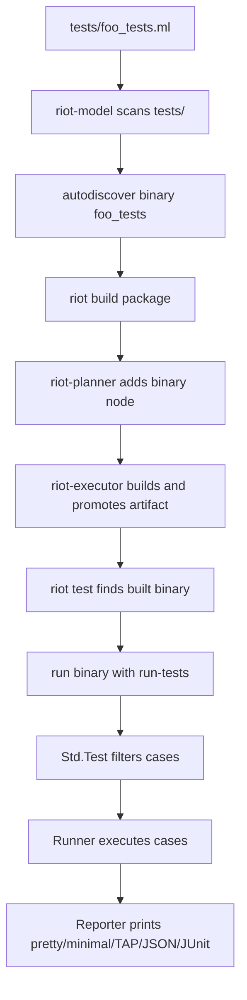

# RFD0009 - Testing System Snapshot

- Feature Name: `testing_system_snapshot`
- Start Date: `2026-03-20`
- Status: `implemented`
- RFD PR: [leostera/riot#0000](https://github.com/leostera/riot/pull/0000)
- Riot Issue: [leostera/riot#0000](https://github.com/leostera/riot/issues/0000)

## Summary
[summary]: #summary

This RFD documents Riot's current testing system as it exists today. It
captures the end-to-end path from test authoring conventions in package
directories, through `Std.Test` and `Propane`, to `riot test` discovery, build,
artifact lookup, and suite execution.

The goal is not to propose a new testing architecture yet. The goal is to
create a precise baseline that later RFDs can extend with expectation testing,
snapshot testing, fixture update flows, richer filtering, and similar features.

## Motivation
[motivation]: #motivation

Riot already has a testing system, but the design currently lives in several
different places:

- package layout and test binary discovery live in `riot-model`
- suite execution and reporting live in `packages/std/src/test/`
- property testing lives in `propane`
- workspace-level discovery and execution live in `riot-cli`
- packages such as `syn` already implement expectation-like fixture comparisons
  on top of the base harness

That makes the current system harder to reason about than it should be.

In practice, contributors need answers to a few concrete questions:

- What makes something a "test" in this repository?
- How does `riot test` find tests?
- Where does the test harness begin and end?
- What is built into `Std.Test`, and what is package-specific convention?
- How do property tests fit into the same model?
- Where do fixture-style tests already exist, and what is missing to make them
  first-class?

This RFD exists to answer those questions in present tense, using the system as
it is now.

## Guide-level explanation
[guide-level-explanation]: #guide-level-explanation

The current testing system is executable-first.

A contributor typically writes tests by:

1. adding an OCaml file under `tests/`
2. naming that file `*_tests.ml` or `*-tests.ml`
3. building a `Test.test_case list`
4. calling `Test.Cli.main ~name ~tests ~args`
5. letting `riot test` discover and run the produced binary

There is no separate manifest section for test targets in the common case.
Tests are discovered by filename convention.

### Mental model

Today, Riot testing has four layers:

1. `riot-model` scans package directories and turns matching files in `tests/`
   into ordinary binaries.
2. `riot-planner` and `riot-executor` build those test binaries the same way
   they build other binaries.
3. `riot-cli test` selects which suites to run, builds the owning package, finds
   the built artifact, and executes it.
4. the suite binary itself uses `Std.Test` to list cases, filter cases, run
   them, and format results.

That means Riot has two distinct levels of testing behavior:

- suite-level behavior, owned by `riot`
- case-level behavior, owned by `Std.Test`

### End-to-end flow



### What contributors write

The common pattern is a plain OCaml executable:

```ocaml
open Std

let test_something () =
  if some_check () then Ok () else Error "expected ..."

let tests =
  Test.[
    case "something" test_something;
  ]

let () =
  Actors.run
    ~main:(fun ~args -> Test.Cli.main ~name:"my-suite" ~tests ~args)
    ~args:Env.args ()
```

The suite binary then supports two harness subcommands:

- `list-tests`
- `run-tests`

If the binary is run without a subcommand, it defaults to a sequential,
pretty-printed run of all cases.

### Two layers of filtering

The current system has two different filters, and they happen in different
places.

`riot test` filters suites:

- `riot test` runs all discovered suites
- `riot test std:...` runs all suites in `std`
- `riot test std:std_data_` runs suites in `std` whose binary names start with
  `std_data_`
- `riot test parser_` runs suites across all packages whose binary names start
  with `parser_`

The suite binary filters cases:

- `suite-binary run-tests --pattern "parse "`

`riot test` forwards arguments after `--` directly to the suite binary's
`run-tests` subcommand, so case-level filtering currently looks like:

```sh
riot test std:std_data_json_tests -- --pattern "parse " --format minimal
```

This split is important. `riot` does not currently understand individual test
case names. It only understands suite binaries.

### Output formats

`Std.Test` currently ships five reporters:

- `pretty`
- `minimal`
- `tap`
- `json`
- `junit`

These are selected inside the suite binary with `run-tests --format ...`.

### Property tests are normal test cases

`Propane` does not introduce a separate suite model. It produces
`Std.Test.test_case` values.

A property test therefore participates in the same runner, same reporters, and
same summaries as a unit test. The main visible difference is that the test case
is tagged as a property with an example count.

### Fixture tests already exist, but as package convention

The repository already contains expectation-like tests, but they are
package-specific instead of first-class harness features.

For example, `syn`:

- scans fixture files in `packages/syn/tests/fixtures`
- loads adjacent `.expected` files
- compares serialized parser output against the stored expectation
- fails with a mismatch message if the strings differ

That means Riot already uses snapshot-style workflows in practice, but the base
harness does not yet provide a shared snapshot API, update command, diff
renderer, or snapshot storage convention.

## Reference-level explanation
[reference-level-explanation]: #reference-level-explanation

## 1. Test discovery starts in package scanning

`packages/riot-model/src/package.ml` scans five source buckets:

- `src/`
- `tests/`
- `native/`
- `examples/`
- `bench/`

The `sources` record stores those separately:

- `src`
- `tests`
- `native`
- `examples`
- `bench`

Test discovery is then implemented by `autodiscover_test_binaries`.

The current rule is:

- any file under `tests/`
- whose basename ends in `_tests.ml` or `-tests.ml`
- becomes a `Package.binary`

The binary name is just the filename without the `.ml` extension, and the binary
source path remains the relative `tests/...` path.

This has a few important consequences:

- tests are usually not declared in `riot.toml`
- most package manifests say nothing about tests at all
- test suites become ordinary package binaries very early in the pipeline
- there is no separate `test` target kind in the package model

The same mechanism also autodiscovers:

- examples from `examples/*.ml`
- benchmarks from `bench/*_bench.ml`

Tests are therefore a naming convention on top of the binary model, not a
separate graph concept.

## 2. Test binaries are built like other binaries

Once test files have become `Package.binary` values, the planner treats them as
ordinary binaries.

`packages/riot-planner/src/module_planner.ml` iterates over
`input.package.binaries` and adds binary nodes for all of them, including tests.

Those binary nodes:

- use the test file as their entrypoint
- link the owning package library if one exists
- link transitive package libraries
- inherit the same include path logic as other binaries

There is no special "compile test mode" in the planner or executor.

At execution time, `packages/riot-executor/src/package_builder.ml` includes
`package.sources.tests` in the sandbox input set alongside `src` and `native`
inputs. The resulting binary artifacts are then saved in the store and promoted
into the workspace output directory.

In practice, the promoted path shape is:

```text
_build/<profile>/<target>/out/<package>/<suite-binary>
```

The important part is that tests land in the same promoted output area as other
binaries.

## 3. `riot test` works at suite granularity

`packages/riot-cli/src/test_cmd.ml` is the top-level suite runner.

Its selection model is based on binary names:

- package wildcard: `pkg:...`
- package-scoped prefix: `pkg:prefix`
- workspace-wide prefix: `prefix`

It only considers workspace-member packages. External path dependencies are
excluded from default test runs.

The same discovery model is also surfaced through `riot completions --tests`,
which currently emits both:

- `pkg:...` entries for packages that have tests
- `pkg:suite_name` entries for individual suite binaries

After selection, the command groups suite binaries by package and does the
following for each package:

1. build the package once with `Build.build_command (Some pkg) None`
2. reconnect to the local session
3. locate each built suite artifact with `find_artifact ~kind:"binary"`
4. execute the suite binary

Each suite is executed as:

- `run-tests` when no extra args are provided
- `run-tests <extra-args...>` when args are forwarded after `--`

This means top-level `riot test` currently always enters the suite's
`run-tests` path. It does not expose the suite binary's `list-tests`
subcommand.

The final summary reported by `riot test` is also suite-oriented:

- total test suites
- passed suites
- failed suites

It is not an aggregate summary of all individual test cases across all suites.

## 4. Build/test invocations are serialized with a workspace lock

The local session layer in `packages/riot-cli/src/local_session.ml` acquires an
exclusive lock file before starting a build:

```text
_build/riot.lock
```

That lock is shared with normal `riot build` flows because `riot test` builds
packages through the same session boundary.

The current behavior is:

- only one top-level build or test build can run per workspace at a time
- concurrent `riot build` / `riot test` invocations fail fast with
  `BuildAlreadyRunning`

This is a property of the current testing system because suite execution depends
on the normal build pipeline.

## 5. `Std.Test` defines the suite and case model

The core harness lives in `packages/std/src/test/`.

The public `Test` surface currently exposes:

- `case`
- `property`
- `skip`
- `todo`
- `assert_equal`
- `assert_ok`
- `assert_error`
- `assert_true`
- `assert_false`
- `Cli.main`

`Test_case.t` currently stores:

- `name`
- `test_type`
- `fn : unit -> (unit, string) result`
- `skip : bool`

`test_type` is one of:

- `UnitTest`
- `Property { examples }`

There are a few semantics worth making explicit:

- a passing test returns `Ok ()`
- a failing test returns `Error "message"`
- an uncaught exception is converted into a failed result with backtrace text
- `skip` creates a skipped case that is not executed
- `todo` currently creates a normal failing case whose function returns
  `Error "todo"`

There is currently no built-in concept for:

- expected failure
- flaky/retry
- timeout
- quarantine
- fixture update
- snapshot approval

## 6. The runner is simple and mostly sequential

`packages/std/src/test/runner.ml` owns case execution.

The runner configuration currently contains:

- `concurrency`
- `reporter`
- `mode`
- `target`
- `suite_info`

`mode` is:

- `Sequential`
- `Shuffle`

`target` is:

- `All`
- `FilterByPrefix prefix`

Important current behavior:

- cases are filtered by prefix before execution
- shuffle mode randomizes order with `Kernel.Random.int`
- exceptions are caught and turned into failure messages
- summaries are computed from the final result list

The notable gap is that `concurrency` is currently parsed and stored, but not
used to run cases in parallel. The runner still executes with `List.mapi` over
the ordered list.

So the current harness is operationally sequential, even though the CLI already
advertises a concurrency flag.

## 7. Reporters are pluggable, but intentionally thin

Reporter integration is a simple module signature:

- `init`
- `on_result`
- `finalize`

The currently shipped reporters are:

- `Pretty`
- `Minimal`
- `TAP`
- `JSON`
- `JUnit`

These reporters have different tradeoffs:

- `Pretty` prints human-oriented lines per case
- `Minimal` prints compact `.` / `F` / `S` progress
- `TAP` streams TAP v14 lines
- `JSON` emits a final object with tests and summary
- `JUnit` emits a single `testsuite` XML document

What they do not currently provide:

- per-test duration
- captured stdout/stderr
- nested suites
- diff rendering
- attachments or artifacts
- stable machine-readable suite IDs beyond names

The reporter API is currently good enough for small extension points, but it is
still intentionally narrow.

## 8. `Test.Cli` is the boundary between suite binary and harness

`packages/std/src/test/cli.ml` gives each suite binary the same mini-CLI.

The supported subcommands are:

- `list-tests`
- `run-tests`

`run-tests` currently supports:

- `--format`
- `--shuffle`
- `--concurrency`
- `--pattern`

If no subcommand is supplied, `Cli.main` runs all tests with the pretty reporter
and sequential mode.

This is the part of the system that makes direct execution of a suite binary
useful. For example, once a suite has been built, contributors can bypass
`riot test` and invoke the suite binary directly to:

- list test case names
- run only a case prefix
- choose a machine-readable reporter

That direct binary UX is richer than the current top-level `riot test` UX.

## 9. Property testing is a thin adapter over `Std.Test`

`packages/propane/src/property.ml` integrates property testing into the common
harness by returning `Test.property ...`.

The property runner currently:

- generates `test_count` values
- treats assumption failures as discarded examples
- aborts if assumption failures exceed `10x test_count`
- shrinks failing examples up to `max_shrink_steps`
- formats the minimal counter-example into the failure message

The default config is:

- `test_count = 100`
- `max_shrink_steps = 1000`
- `seed = None`
- `verbose = false`

Two environment variables currently affect properties:

- `PROPANE_TESTS`
- `PROPANE_SEED`

The important architectural point is that `Propane` does not bypass the normal
test runner. It composes with it.

That gives Riot one shared reporting and execution model for:

- plain unit cases
- property cases

## 10. Fixture and snapshot-like tests already exist as library code

The repository already contains a few recurring higher-level patterns:

### Explicit unit suites

Packages like `std` and `http` build a static `tests` list with named
`Test.case` entries.

### Property suites

Packages like `swisstable`, `http`, and `propane` use `Propane.property` values
inside the same `tests` list.

### Fixture comparison suites

`packages/syn/tests/fixture_tests.ml`:

- scans `packages/syn/tests/fixtures`
- loads adjacent `.expected` files
- parses source fixtures
- serializes parse trees and diagnostics to JSON
- compares the serialized output to the stored expectation

`packages/syn/tests/diagnostic_tests.ml` does the same for
`.diagnostic` files.

These are already expectation tests in practice. They are simply implemented at
the package layer instead of through `Std.Test`.

## 11. Inline tests are not part of the active path

The repository contains a small amount of `[@test]` syntax, for example in
`packages/riot-model/src/workspace.ml`.

However, the current `riot` discovery path does not collect inline tests.

The active discovery path is still:

- scan `tests/`
- match `_tests.ml` / `-tests.ml`
- build and run binaries

So inline-test syntax is not currently a first-class testing mode in Riot.

## 12. Foreign dependency test hooks exist in the model, but are not wired in

`Package.foreign_dependency` already has a `test_cmd : string list option`
field.

At the moment, that field is parsed from `riot.toml`, but the standard
`riot test` flow does not execute it.

So the current system has a dormant extension point for foreign/native test
hooks, but not an integrated feature yet.

## Drawbacks
[drawbacks]: #drawbacks

The current system is workable, but it has clear limitations:

- test discovery is convention-based, not explicit
- tests are just binaries, so suite metadata is thin
- `riot test` only understands suites, not individual cases
- per-case filtering lives in the suite binary, not the top-level CLI
- top-level summaries are suite summaries, not repository-wide case summaries
- the runner advertises `--concurrency`, but execution is still sequential
- there is no built-in expectation or snapshot API
- there is no shared fixture update flow
- there is no built-in per-test duration, captured output, retry, or flake model
- direct suite binaries expose `list-tests`, but `riot test` does not
- foreign dependency `test_cmd` exists in the model but is not used
- concurrent top-level build/test invocations are serialized by the build lock

There are also a few rough edges in the current assertion layer:

- assertion helpers are small and panic-oriented
- failure output does not yet provide rich diffs or structured comparisons

## Rationale and alternatives
[rationale-and-alternatives]: #rationale-and-alternatives

The current design appears to have emerged from a few pragmatic choices that
fit Riot well:

- keep tests as normal OCaml executables
- reuse the build graph instead of inventing a separate test compiler path
- keep the shared harness small
- let packages build richer test styles on top

That has real advantages:

- low magic
- easy to understand package layout
- easy reuse of normal binaries, libraries, and `Actors.run`
- one reporting path for unit and property tests

But there are obvious alternatives for future work:

- explicit `[test]` manifest entries instead of filename discovery
- inline tests collected from source files
- first-class snapshot/expectation storage in `Std.Test`
- a richer top-level `riot test` protocol that understands case names directly
- package-provided fixture update hooks

This RFD does not choose between those alternatives. It documents the baseline
they would have to extend or replace.

## Prior art
[prior-art]: #prior-art

Riot's current testing system sits between a few familiar models:

- `cargo test`: executable-oriented, integrated with the build system
- `alcotest`: explicit case lists and lightweight test runners
- `qcheck` / `crowbar`: property testing layered into a host test framework
- `ppx_expect`: inline expectation tests with update workflows
- golden/snapshot fixture suites in parser and compiler repositories

Riot currently resembles the executable-first camp more than the inline-test
camp. It already uses golden-file techniques in places like `syn`, but that
behavior is still library-level convention rather than shared test framework
policy.

## Unresolved questions
[unresolved-questions]: #unresolved-questions

- Should future expectation and snapshot support live in `Std.Test`, in a
  separate package, or in package-local helpers?
- Should test discovery remain filename-based, or should tests become an
  explicit target kind in manifests and the planner?
- Should `riot test` learn case discovery and case filtering directly instead of
  delegating that to suite binaries?
- Should fixture update flows be driven by a standard CLI protocol, a reporter,
  or dedicated `riot` subcommands?
- Should the existing `[@test]` syntax grow into a supported inline-test path,
  or should Riot stay fully executable-first?
- Should foreign dependency `test_cmd` become part of normal workspace test
  execution?

## Future possibilities
[future-possibilities]: #future-possibilities

The current architecture leaves a few natural extension points open.

### 1. First-class expectation and snapshot support

The most direct extension is a shared layer above `Test.case` for:

- snapshot assertions
- expectation files
- update/accept workflows
- diff rendering
- snapshot storage conventions

That could unify the ad hoc fixture patterns already present in packages like
`syn`.

### 2. Richer suite metadata

If tests stop being "just binaries with a naming convention", Riot could add
metadata such as:

- owner package
- suite kind
- timeout
- tags
- flaky/quarantined state
- fixture directories

### 3. True case-level parallelism

The runner already carries a `concurrency` field. A future RFD could turn that
into real parallel case execution, along with the isolation rules needed to make
that safe.

### 4. Unified top-level filtering

The current split between suite-level and case-level filtering is functional but
awkward. A future system could let `riot test` understand both levels directly.

### 5. Integrated foreign/native test hooks

The parsed-but-unused `test_cmd` field on foreign dependencies is a clear sign
that the build model already anticipates non-OCaml test steps.

### 6. Inline tests or generated suites

If Riot eventually wants inline-test ergonomics, the current suite model could
still remain the execution substrate while code generation or collection builds
synthetic suite binaries behind the scenes.
