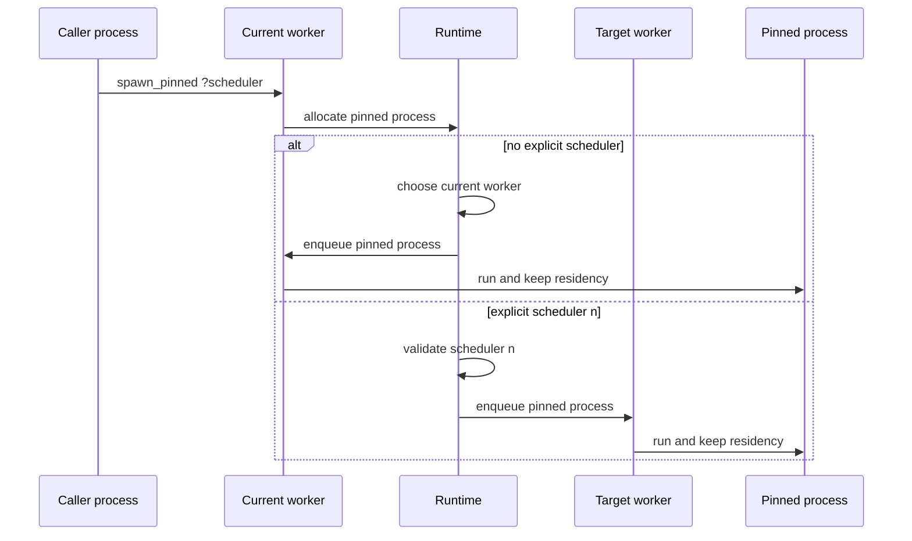
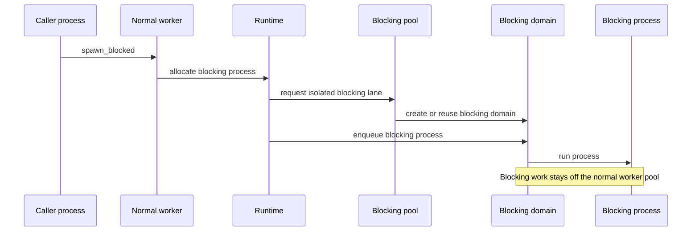
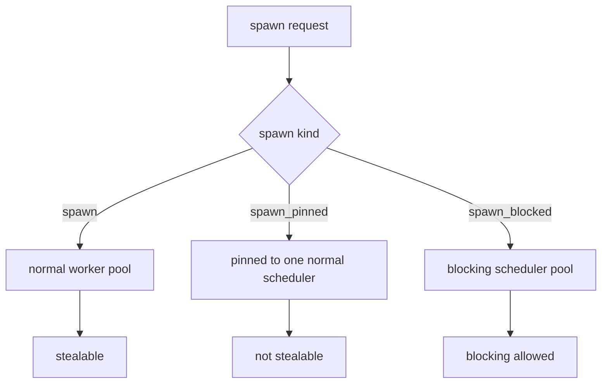
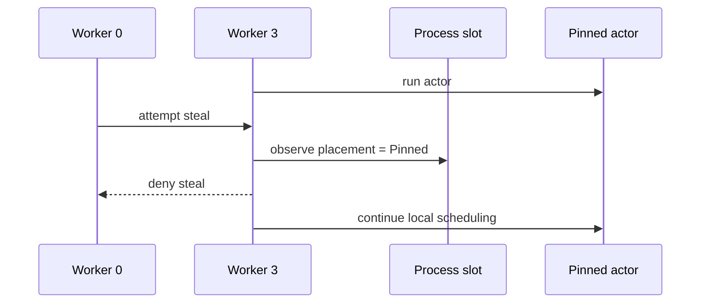
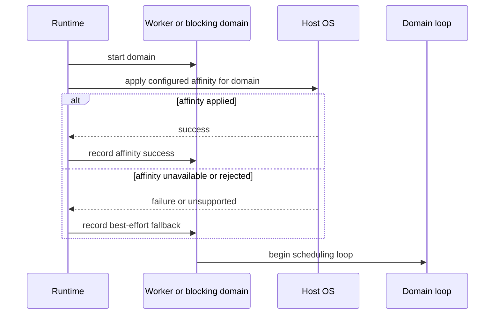

# RFD0011 - Actors Pinned and Blocking Spawn

- Feature Name: `actors_pinned_and_blocking_spawn`
- Start Date: `2026-03-20`
- Status: `implemented`

## Summary
[summary]: #summary

This RFD proposes two follow-up spawn modes on top of the multicore `actors` runtime:

- `spawn_pinned` for actors that must stay on one scheduler and must not be work-stolen
- `spawn_blocked` for actors that may run blocking code and therefore must not occupy a normal work-stealing scheduler

It also proposes making CPU affinity a runtime-level, best-effort scheduler policy rather than the primary actor-facing abstraction. The stable cross-platform contract is scheduler pinning. CPU pinning is an optional implementation detail of worker domains on platforms that support it well.

## Motivation
[motivation]: #motivation

Once `actors` has normal work-stealing schedulers, the default `spawn` should stay optimized for ordinary actor workloads:

- cheap
- migratable
- cooperative
- safe to rebalance

That default is wrong for two classes of actor:

### 1. Scheduler-sticky actors

Some actors should remain on one scheduler for locality or operational reasons:

- an actor owns scheduler-local caches or native state
- an actor communicates heavily with resources registered on one scheduler
- an actor should not bounce between workers because stable residency matters more than balancing

### 2. Blocking actors

Some actors may call code that blocks the underlying domain:

- terminal UI loops
- native FFI that blocks in place
- foreign libraries that do not integrate with `Async.Poll`
- long blocking reads or writes that cannot be expressed through the cooperative syscall path

Running those actors on normal work-stealing schedulers would defeat the whole point of the multicore runtime. A blocked domain is still blocked even if every other actor on that scheduler is cooperative.

This RFD exists to keep the default runtime honest:

- `spawn` stays for normal actors
- `spawn_pinned` is the locality escape hatch
- `spawn_blocked` is the blocking escape hatch

## Guide-level explanation
[guide-level-explanation]: #guide-level-explanation

After this change, `actors` has three actor placement classes:

- `spawn`: normal, migratable, work-stealable
- `spawn_pinned`: scheduler-sticky, not stealable
- `spawn_blocked`: isolated from the normal scheduler pool because it may block

### `spawn`

Use ordinary `spawn` for actors that:

- yield cooperatively
- use `receive`
- use actor-aware timers and I/O
- can move between schedulers if work stealing decides to rebalance them

### `spawn_pinned`

Use `spawn_pinned` when the actor should stay on one scheduler:

```ocaml
let ui_cache_owner =
  Actors.spawn_pinned (fun () -> loop ())
```

Pinned means:

- the actor gets an owner scheduler at spawn time
- it keeps that owner for its whole lifetime
- work stealing ignores it

Pinned does not necessarily mean "hard-pinned to CPU 3". It means "stable scheduler residency". If the runtime also pins that scheduler's domain to a CPU, then the actor gets CPU affinity transitively.

The interaction to picture is:



### `spawn_blocked`

Use `spawn_blocked` when the actor may block the domain:

```ocaml
let tui =
  Actors.spawn_blocked (fun () -> run_tui_loop ())
```

Blocked means:

- the actor does not run on a normal work-stealing scheduler
- it runs on a blocking scheduler/domain that the runtime treats separately
- if it blocks, it only hurts that blocking lane, not the normal actor schedulers

The interaction to picture is:



### Diagram



### CPU affinity

CPU affinity is explicitly weaker than scheduler pinning in the public model.

Why:

- Linux supports hard CPU affinity well.
- Windows supports thread affinity.
- macOS exposes thread affinity tags as scheduler hints rather than hard CPU pinning.

So the actor-facing guarantee should be:

- pinning to a scheduler is always meaningful

And the runtime-facing best-effort behavior can be:

- pin worker domains to CPUs when the platform supports it well

That lets the API stay honest on all supported hosts.

## Reference-level explanation
[reference-level-explanation]: #reference-level-explanation

## 1. Placement classes

Process placement becomes runtime-side scheduling metadata associated with a process slot or registry entry, not a field on `Process.t`:

```ocaml
type placement =
  | Normal
  | Pinned
  | Blocking
```

Semantics:

- `Normal`: may migrate between normal schedulers
- `Pinned`: always stays on one normal scheduler
- `Blocking`: runs on a blocking scheduler/domain and is never stolen

`spawn` creates `Normal`.
`spawn_pinned` creates `Pinned`.
`spawn_blocked` creates `Blocking`.

## 2. Public API

The proposed public additions are:

```ocaml
val spawn_pinned :
  ?scheduler:int ->
  (unit -> (unit, Process.exit_reason) result) ->
  Pid.t

val spawn_blocked :
  (unit -> (unit, Process.exit_reason) result) ->
  Pid.t
```

Design notes:

- `spawn_pinned ?scheduler` keeps the stable, portable abstraction at the scheduler level
- `spawn_blocked` does not initially expose a scheduler selector because its first responsibility is isolation, not placement micro-control

This keeps the public surface small and avoids promising portable CPU-level pinning semantics that Riot cannot actually guarantee on every host OS.

## 3. Scheduler selection for pinned actors

If `spawn_pinned` does not get an explicit scheduler:

- use the current scheduler
- mark the actor as pinned there for its whole lifetime

If `spawn_pinned ~scheduler:n` is used:

- validate `n` against the normal worker count
- place the actor directly on that scheduler

Pinned actors still use normal scheduler facilities:

- mailbox
- `receive`
- cooperative yield
- timers
- actor-aware I/O

They simply opt out of stealing.

Once placed, a pinned actor stays on its owner scheduler:



## 4. Blocking scheduler pool

`spawn_blocked` should not reuse the normal scheduler pool.

The first implementation should prefer correctness over sophistication:

- create a separate blocking scheduler/domain per blocking actor, or
- lazily allocate from a dedicated blocking pool with one runnable actor per blocking scheduler

The important rule is:

- a blocking actor must not share a normal work-stealing scheduler with ordinary actors

This RFD does not require an aggressively optimized blocking pool on day one. Blocking actors are expected to be rare and intentional.

### Why not just pin a blocking actor to a normal scheduler?

Because that still blocks the scheduler's domain. A pinned actor that performs blocking work is not merely sticky; it is disruptive.

`spawn_pinned` is about residency.
`spawn_blocked` is about isolation.

## 5. Message delivery and links

Pinned and blocking actors still participate fully in the actor model:

- `send pid msg` works the same way
- links and monitors work the same way
- `Pid.t` remains runtime-wide

The runtime routes messages by PID and then hands them to the owning scheduler class:

- normal worker
- pinned normal worker
- blocking worker

The actor API should not require callers to care which class owns the target PID.

## 6. Affinity policy

CPU affinity belongs in runtime configuration, not the actor placement API.

The proposed config extension is:

```ocaml
type affinity_policy =
  | No_affinity
  | Best_effort
  | Fixed of int array
```

Semantics:

- `No_affinity`: do not attempt OS-level CPU placement
- `Best_effort`: pin worker domains compactly if the platform supports it
- `Fixed of int array`: scheduler `i` should prefer CPU `array.(i)`

The runtime applies affinity to scheduler domains, not individual actors.

That means:

- a pinned actor on scheduler 3 inherits scheduler 3's CPU affinity if one exists
- a normal actor may observe different CPUs over time if it migrates
- a blocking actor inherits the affinity policy of its dedicated blocking domain if the runtime assigns one

At runtime, affinity is a best-effort startup step:



## 7. Platform support matrix

The runtime should expose capabilities internally and document them clearly.

Expected platform shape:

- Linux: hard CPU affinity is available through `sched_setaffinity(2)`
- Windows: thread affinity is available through the Win32 thread affinity APIs
- macOS: `THREAD_AFFINITY_POLICY` exists, but it is explicitly a scheduler hint about affinity relationships and cache sharing, not a hard CPU pin

Because of that, the stable promise is:

- scheduler pinning always works
- CPU affinity is best-effort and platform-dependent

If a contributor needs guaranteed stable CPU residency, that requirement should be treated as Linux/Windows-specific unless Riot gains a more explicit platform contract.

## 8. Stealing rules

Work stealing must ignore:

- `Pinned` actors
- `Blocking` actors

Only `Normal` runnable actors may move between normal schedulers.

That rule keeps the scheduler matrix easy to reason about:

- normal pool steals among itself
- pinned actors stay put
- blocking actors stay isolated

## 9. Runtime accounting

Once placement classes exist, metrics should distinguish:

- normal runnable depth
- pinned runnable depth
- blocking actor count
- steal attempts and successful steals
- affinity placement successes and failures

That is especially important because `spawn_blocked` can otherwise become an invisible escape hatch that hides domain explosions or platform-specific affinity failures.

## Drawbacks
[drawbacks]: #drawbacks

- The runtime now has more than one kind of scheduler lane to reason about.
- `spawn_blocked` can become an attractive nuisance if callers use it as a generic fix for code that should really be integrated with the cooperative I/O path.
- True CPU pinning is not equally portable across supported operating systems.
- Dedicated blocking domains are operationally expensive if abused.

## Rationale and alternatives
[rationale-and-alternatives]: #rationale-and-alternatives

This design is the right follow-up because it keeps default `spawn` simple while giving two narrow, explicit escape hatches for workloads that would otherwise damage the runtime.

Alternatives considered:

- Add only `spawn_pinned` and tell blocking workloads to use it.
  This is incorrect. Pinned blocking work still blocks a normal scheduler domain.

- Make `spawn` itself smart enough to auto-detect blocking actors.
  The runtime cannot reliably infer that. The actor author knows more than the scheduler does here.

- Make CPU number the primary actor-facing placement API.
  That exposes a platform-specific abstraction as if it were portable. Scheduler pinning is the cleaner semantic layer.

- Reuse a global thread pool for `spawn_blocked` and stop calling the result an actor.
  That would create a second concurrency model. The proposal keeps blocked work inside the actor runtime and PID space.

## Prior art
[prior-art]: #prior-art

- The BEAM scheduler distinguishes ordinary scheduler work from dirty schedulers for blocking or long-running native work. Riot does not need to copy that design exactly, but the separation of normal and blocking execution classes is a useful precedent.
- Linux and Windows both expose explicit thread affinity APIs.
- Apple's Mach thread affinity policy is explicitly described as an experimental hint for scheduler placement and cache sharing, not as a hard CPU pin. That supports keeping CPU affinity out of the core actor contract.

## Unresolved questions
[unresolved-questions]: #unresolved-questions

- Should the first `spawn_blocked` implementation use one dedicated domain per actor or a bounded lazy pool?
- Do we want a public capability API so callers can ask whether hard CPU affinity is available on the current host?
- Should `spawn_blocked` eventually gain an explicit placement selector, or is isolation alone the right first surface?
- Do we need a stronger story for "run on the initial domain" if some integrations eventually require that specific OS thread?

## Future possibilities
[future-possibilities]: #future-possibilities

This proposal opens the door to:

- a capability query API for scheduler affinity and blocking support
- explicit reserved schedulers for main-thread integrations
- dirty-I/O or dirty-CPU pools with different sizing policies
- high-level `std` helpers that route known blocking abstractions onto `spawn_blocked`
- runtime warnings when a pinned or blocking placement is requested but the relevant platform capability is unavailable

The main constraint should remain the same: default `spawn` stays the fast path, and the escape hatches stay explicit.
