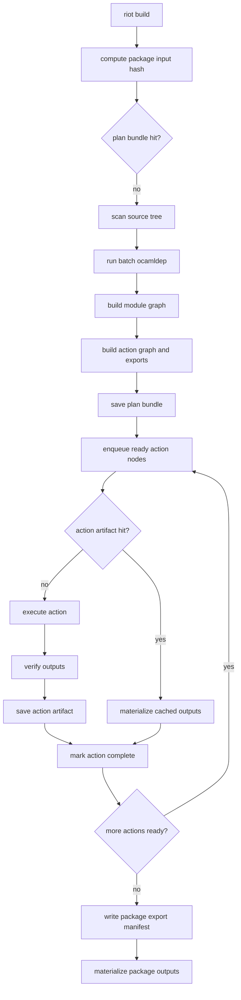
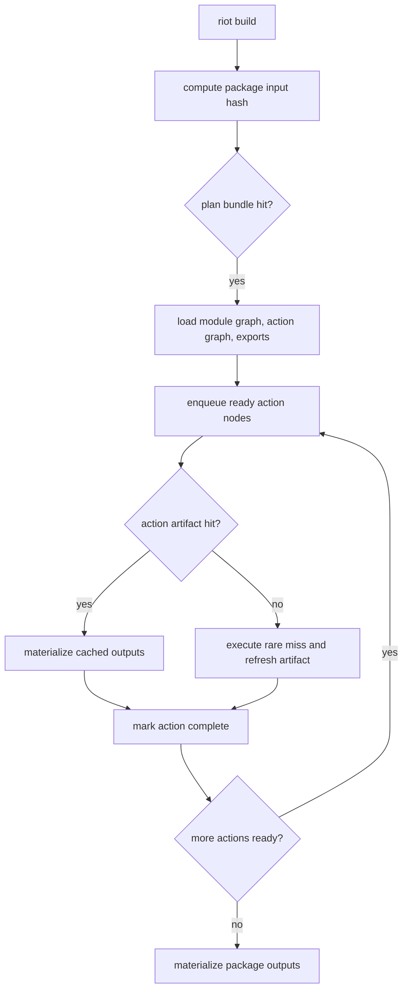
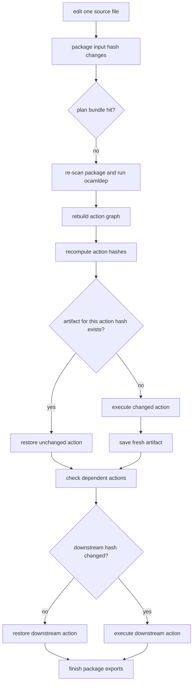
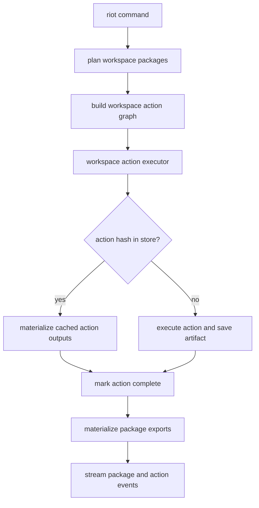
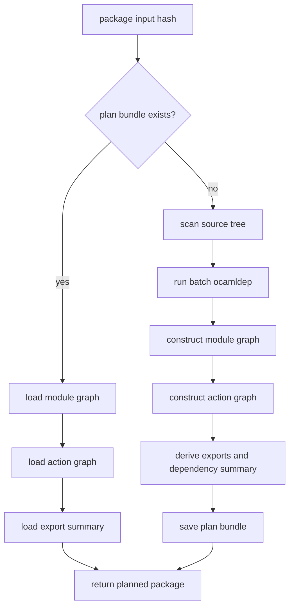
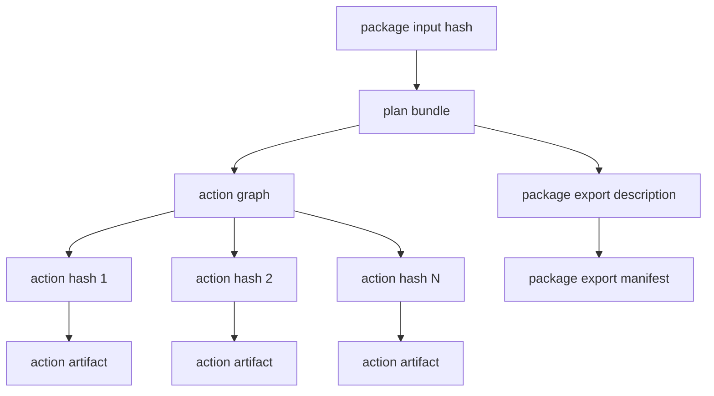
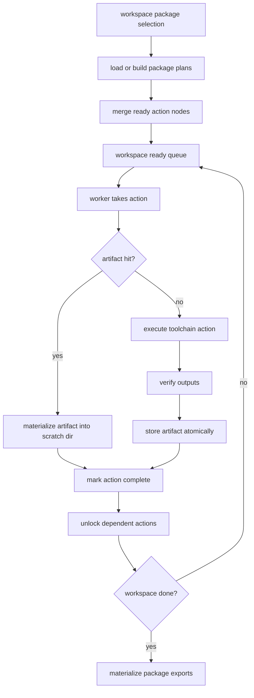
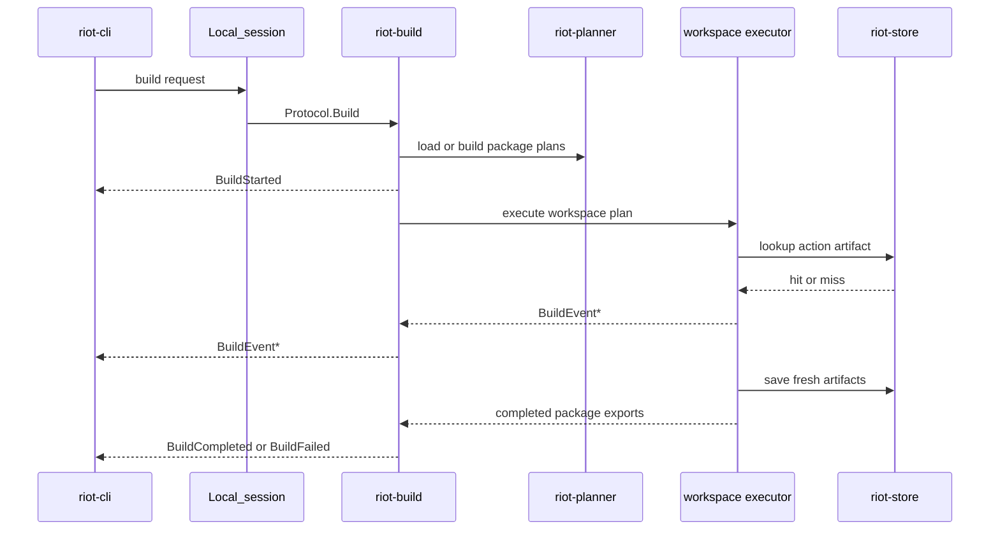
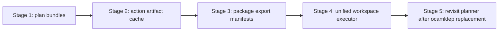

# RFD0012 - Simplify Riot Around Action-Level Caching

- Feature Name: `riot_action_cache_and_workspace_execution`
- Start Date: `2026-03-20`
- Status: `implemented`

## Summary
[summary]: #summary

This RFD proposes making the action node, not the package, the primary artifact
cache unit of the `riot` build system while explicitly keeping a package-level
planning cache. `riot-planner` should memoize package plans by package input
hash, `riot-executor` should schedule and reuse action nodes under a single
workspace-level concurrency budget, and `riot-store` should atomically persist
action artifacts plus package export manifests. The existing one-shot local
session model and streamed CLI output remain in place.

The goal is to let large packages rebuild incrementally without forcing users to
split them into many packages early, while also deleting the current duplicate
package-level and action-level artifact-cache paths.

## Motivation
[motivation]: #motivation

The current implementation already contains most of the ingredients for
action-level caching, but they are not the active architecture.

Today:

- `riot-planner` computes deterministic `Action_node` hashes.
- `riot-executor` has action-level telemetry types and a parallel action queue.
- `riot-store` is already a generic hash-addressed artifact store.

But the live build path still treats the package as the only durable artifact
cache boundary:

- `package_planner.ml` computes a package input hash and skips full planning
  when that package hash already exists in the store.
- `package_builder.ml` checks the same package hash again and only saves the
  final package outputs.
- `parallel_action_executor.ml` executes action nodes in parallel, but it does
  not consult the store per action node.

The result is an architecture with two models:

1. a package-level planning fast path that is useful
2. a package-level artifact cache model that is real
3. an action-level artifact cache model that is implied by the types, but
   mostly dormant

This creates several concrete problems.

### 1. Large packages still rebuild too much

If one module changes inside a large package, the package-level cache misses and
the package rebuild path runs again. The system already knows how to identify
individual action nodes, but it does not use those hashes to skip unchanged
actions.

That means larger packages are penalized on execution reuse. Contributors are
pushed toward package-splitting for performance reasons even when the right
architectural boundary is still one package.

### 2. Planning and execution are coupled through built artifacts

`Dependency.t` currently carries a built `Artifact.t`. `package_planner.ml`
therefore treats dependency packages as plannable only after they have already
been built and promoted to the store.

This couples:

- planning
- execution state
- store layout

That coupling is one of the reasons `riot` has to plan packages during
execution, rather than producing a clean workspace plan first and then
executing it.

### 3. Planning itself is expensive today

The package fast path exists for a reason.

Even before execution starts, the slow path currently pays for:

- source tree rescanning
- module graph reconstruction
- a batch `ocamldep` shell-out across all concrete ML and MLI files

Because there is no in-memory, parallel replacement for `ocamldep` yet, the
system still needs a package-level planning cache keyed by something like the
current package input hash.

### 4. The scheduler is duplicated

The build path currently has two readiness schedulers:

- `coordinator2.ml` schedules packages
- `parallel_action_executor.ml` schedules actions inside a package

Both keep queues, both track dependencies, and both compete for concurrency
control. `package_builder.ml` currently gives each package action executor
`System.available_parallelism`, which means package-level parallelism and
action-level parallelism can oversubscribe the machine.

That is complexity without a clean ownership boundary.

### 5. Streamed builds exist, but action streaming does not really escape

The local-session protocol already streams build events. That is good and should
stay.

But `parallel_action_executor.ml` emits action events with a synthetic session
id instead of the real build session id. `build_server.ml` filters events by
session id, so these action events are not reliably part of the actual build
stream.

The system has the shape of streamed action execution, but not a coherent
implementation of it.

### 6. The store contract is too weak for granular caching

`riot-store` currently creates the final hash directory in place. For
action-level caching this is not good enough:

- multiple workers may race to write the same artifact
- readers may observe a partially written entry
- promotion currently assumes a flat directory copy

Granular caching requires atomic `put-if-absent` semantics and recursive path
handling.

### Use cases this RFD addresses

- A contributor edits one leaf module in a large library package and expects
  only the affected compile and relink actions to run.
- A contributor changes link flags or one foreign dependency and expects
  recompilation to stop at the correct boundary.
- Two independent packages should build in parallel without nested worker pools
  oversubscribing the machine.
- `riot build`, `riot run`, and `riot test` should continue to stream progress
  as work happens.
- A future remote cache or remote execution story should build on the same
  action artifact identity model without throwing away the useful package-level
  plan memoization layer.

## Guide-level explanation
[guide-level-explanation]: #guide-level-explanation

After this change, contributors should still think about `riot` in package
terms, but `riot` itself should think in action terms.

Packages remain:

- the authoring unit
- the dependency declaration unit
- the user-facing unit for `riot build --package`, `riot run`, and output
  reporting

Actions become:

- the cache unit
- the execution unit
- the dependency unit inside the executor

### Contributor model

When a contributor runs `riot build`, the system should behave like this:

1. resolve the requested packages
2. plan those packages into action graphs
3. schedule ready action nodes across the whole workspace under one concurrency
   budget
4. for each action node, either restore it from the cache or execute it
5. materialize package exports into the usual `out/` directory
6. stream progress while this is happening

The important shift is that packages are no longer the thing that must be fully
fresh or fully cached. A package can complete from a mix of:

- cached action nodes
- freshly executed action nodes
- skipped action nodes because a dependency failed

### Example: editing one module in a large library package

Assume package `foo` contains 120 modules and one binary.

Today, one changed implementation file causes a package cache miss and `foo`
re-enters the full package build flow.

With this proposal:

- the changed module compile action misses
- downstream archive/shared-library/link actions that depend on it miss
- unaffected module compile actions hit the cache
- the package still shows up as one package in the UI

The contributor keeps one package. The build system still behaves incrementally.

### Example: repeated no-op build

On a no-op rebuild:

- `riot` should usually hit the package-level plan cache
- almost every action node is a cache hit
- the executor materializes only what is needed for the requested package
  outputs
- the CLI still streams progress and finishes quickly

This preserves the current package-level planning fast path, but changes what
it caches. It should cache plan structure, not duplicate package build outputs.

### Example: independent packages

If packages `a` and `b` do not depend on each other, and package `c` depends on
both:

- ready actions from `a` and `b` can execute in parallel
- `c` actions become ready only after their dependencies are complete
- one executor owns the full concurrency budget

This gives both package-level and intra-package parallelism without nesting
multiple worker pools that each believe they own the whole machine.

### Process: cold build

### Process: no-op rebuild

### Process: partial rebuild inside one package

### Streamed build output

The existing local-session streaming model stays:

- the CLI still gets a stream of build events
- package-level start and completion messages still exist
- action-level events become real session events instead of internal-only noise

The default CLI output should stay package-oriented and quiet. Action-level
streaming is primarily for correctness, telemetry, and future verbose or UI
modes.

### Final shape

## Reference-level explanation
[reference-level-explanation]: #reference-level-explanation

## 1. Core invariants

The proposed steady-state architecture has five invariants:

1. `Action_node.hash` is the primary build artifact identity.
2. Package input hash is the primary plan-cache identity.
3. Planning does not consult the artifact store to decide whether to build.
4. Execution owns artifact cache lookup, artifact cache write, and readiness
   tracking.
5. Package outputs are a materialized view over action artifacts, not the
   primary cache entry.

This keeps responsibility boundaries clear:

- `riot-planner` decides graph shape and cacheable plan identity
- `riot-executor` decides what runs and what is restored
- `riot-store` decides how artifacts are persisted

## 2. Planner changes

### 2.1 `Workspace_planner` remains package-oriented

`workspace_planner.ml` should keep doing what it is good at:

- resolve the requested package subset
- validate package dependency edges
- produce deterministic topological package order

That remains the right boundary for workspace-level package selection.

### 2.2 `Package_planner` becomes pure planning

`package_planner.ml` should stay responsible for planning-time cache lookup, but
that lookup should become a plan-cache lookup, not an artifact-cache lookup.

The current package input hash fast path should be retained and repurposed.
When the plan cache misses, planning should produce:

- the module graph
- the action graph
- the package export description
- the package summary hash derived from planned exports

This means:

- no planning-time dependency on built package artifacts
- no dummy empty graphs on package cache hit
- no "planned only if dependency packages are already built" rule

Instead:

- package input hash should map to a serialized plan bundle
- that plan bundle should contain module graph, action graph, and package export
  description
- execution should then decide action artifact hits and misses

### 2.3 Replace built dependency artifacts with planned dependency summaries

`Dependency.t` is currently a built-artifact shape:

- package metadata
- `Artifact.t`
- transitive depset
- hash

That should be replaced with a planned dependency summary, for example:

- package metadata
- exported library filenames
- exported include directories
- foreign-link inputs
- package summary hash

The planner should consume dependency summaries from already planned dependency
packages, not from already built package graph nodes.

This is the change that decouples planning from execution state.

### 2.4 Package exports become explicit

The planner should describe which outputs are package exports, for example:

- `.cmxa`
- `.a`
- `.cmxs`
- requested binaries
- command binaries

That export description is what later drives:

- dependent package planning
- final materialization to `out/`
- `FindArtifact` and `riot run`

### 2.5 Action hashing stays, but must become semantically correct

The existing `Action.hash` and `Action_node.make` logic is the right starting
point. It already forms a Merkle-style action graph.

But the final design should preserve ordering when order is semantically
meaningful, especially for:

- link object order
- library order
- command argument order

Only order-insensitive sets should be normalized before hashing.

## 3. Store changes

The store becomes the durable home of action artifacts.

### 3.1 Action artifact contract

Each stored action artifact should contain:

- the action hash
- the relative output paths produced by that action
- per-file hashes and sizes
- enough metadata to materialize the artifact into another directory

The current generic manifest format is close to this already.

### 3.2 Atomic writes

The store should grow an atomic `put_if_absent`-style write path:

1. write into a temporary directory
2. write the manifest there
3. rename the temp directory into the final hash directory
4. if another writer already won the race, discard the temp directory and use
   the existing entry

Readers must never treat "directory exists" as sufficient proof that the entry
is complete.

### 3.3 Recursive materialization

Store promotion/materialization should preserve relative paths recursively.

That means:

- nested output paths must be representable in the manifest
- materialization must create parent directories
- action artifacts and package export manifests can reuse the same primitive

### 3.4 Package export manifests

Package-level artifact lookup is still useful for:

- `riot run`
- `FindArtifact`
- build summaries

But these should no longer be package artifact cache entries that duplicate all
package outputs under a separate hash. Instead, the store should optionally record a
package export manifest that maps:

- package name
- profile
- target

to:

- exported output names
- the action hashes that produced them

This keeps package lookup without making package artifact caching the primary
execution model.

### 3.5 Plan bundles

The package input hash should point to a durable plan bundle.

That bundle should be sufficient to skip:

- source tree rescanning
- module graph reconstruction
- `ocamldep` execution
- action graph regeneration

At minimum it should contain:

- package summary hash
- module graph
- action graph
- dependency summary
- package export description

This is the replacement for the current package fast path. It should survive
even after package artifacts stop being the primary cache entry.

## 4. Executor changes

The executor should own one readiness scheduler for the whole workspace build.
It should consume planned graphs, whether those came from fresh planning or a
plan bundle hit.

### 4.1 Replace nested schedulers with one workspace executor

The current steady-state path is:

- package queue in `coordinator2.ml`
- per-package execution in `package_builder.ml`
- per-package action queue in `parallel_action_executor.ml`

The target architecture is one `Workspace_executor` that operates on planned
workspace actions and package export boundaries.

This single executor owns:

- one ready queue
- one completed set
- one dependency-failure propagation rule
- one concurrency budget

### 4.2 Action dispatch algorithm

For each ready action node:

1. compute or read its hash from the plan
2. check the store
3. on cache hit:
   materialize the artifact into the package scratch directory and mark the
   action completed as cached
4. on cache miss:
   execute the action in the package scratch directory, verify outputs, save the
   artifact to the store, and mark it completed as fresh

If an action dependency failed, mark the dependent action as skipped.

### 4.3 Package lifecycle becomes derived state

Package-level events should be derived from action execution:

- `BuildStarted` when the package first becomes active
- `CompilationStarted` when the first uncached action in that package starts
- `BuildCompleted` when all exported outputs for that package are available
- `BuildSkipped` or `BuildFailed` when export completion becomes impossible

This removes the need for package execution to be its own inner state machine.

### 4.4 One concurrency budget

The executor should use one concurrency budget derived from
`Build_ctx.available_parallelism`.

This budget should be shared across:

- actions from different packages
- actions within one package

The machine should not be oversubscribed by nested schedulers each believing
they own full parallelism.

## 5. Streaming and protocol

The transport shape can stay as it is.

`riot-cli`, `local_session.ml`, `riot-build`, and the one-shot local session
model remain valid.

The required changes are:

- thread the real `session_id` into action execution
- emit action events with that real session id
- keep the current `BuildStarted`, `BuildEvent`, `BuildCompleted`, and
  `BuildFailed` protocol messages

`BuildStats` should be extended to report both:

- package counts
- action cache hits and misses

The default CLI formatter should remain package-oriented. This RFD does not
require noisy per-action printing in the common path.

## 6. Scratch directories and materialization

Same-package action dependencies still need a local working area. The proposal
keeps package scratch directories, but changes what they contain.

The target shape is:

- concrete source files are read from the workspace directly
- generated files and compiled outputs live in the package scratch directory
- cached action artifacts are materialized into the scratch directory on hit
- dependent packages read exported artifacts from immutable store paths

This means the scratch directory stops being a full package mirror.

That allows two simplifications:

- remove "copy the whole package inputs into sandbox" behavior
- remove per-action source copying for concrete source files

The scratch directory becomes a place for generated and built outputs, not a
shadow copy of the source tree.

## 7. Migration plan

This RFD is intentionally staged. The package-level planning cache should stay
throughout these stages because action-graph production is currently expensive.

### Stage 1: Separate plan caching from artifact caching

Keep the current package input hash fast path, but make its output an explicit
plan bundle rather than an implicit "skip to package artifact hit" shortcut.

This stage should include:

- a serialized package plan bundle keyed by package input hash
- plan loading that restores module graph, action graph, and export summary
- removal of dummy empty-graph package planning results

### Stage 2: Make action caching real

Implement action cache lookup and save inside the action executor using the
existing action hashes.

This stage should include:

- real `session_id` threading for action events
- atomic store writes
- recursive artifact materialization
- action cache hit and miss telemetry

The existing package queue may remain temporarily.

### Stage 3: Demote package artifact caching from the hot path

Remove:

- package artifact cache as the primary build reuse mechanism
- package-builder save/promote as the authoritative correctness path

Add:

- package export manifests built from action results
- planner dependency summaries that no longer require built artifacts

At the end of this stage, actions are the primary artifact cache entry, while
packages still retain a planning cache and export manifest layer.

### Stage 4: Collapse execution into one workspace action scheduler

Replace:

- `Coordinator2`
- the package-level readiness handoff in `Package_builder`
- the per-package nested action executor ownership of full parallelism

with:

- one workspace action executor

At this point, `Build_queue` and most package-level execution state should be
deletable.

### Stage 5: Revisit planner cost when `ocamldep` replacement exists

If the project later gains an in-memory, parallel dependency analysis engine,
the package plan cache can be reconsidered or simplified.

Until then, package-level plan memoization is a feature, not accidental
complexity.

## Drawbacks
[drawbacks]: #drawbacks

- The architecture now has two intentional cache layers:
  package plan cache and action artifact cache.
- The cache will contain many more entries than a package-only cache and will
  need garbage collection strategy.
- The migration touches planner, executor, and store contracts at once.
- Package export manifests add a second layer of metadata, even though they are
  much smaller than duplicating package artifacts.

## Rationale and alternatives
[rationale-and-alternatives]: #rationale-and-alternatives

This design is the best simplification because it picks one primary execution
unit and one primary artifact cache unit without throwing away the package-level
planning fast path that exists for good reason.

Alternatives considered:

- Keep package artifact caching and add action artifact caching underneath it.
  This preserves two artifact invalidation models and two places where artifact
  cache decisions happen. It is not a simplification.

- Keep the current nested package scheduler and just cap concurrency harder.
  This reduces oversubscription symptoms, but not the duplicated readiness
  logic.

- Force contributors to split packages earlier.
  That treats a build-system limitation as a package-design rule. It is the
  wrong trade.

- Delete the package fast path entirely and always rebuild plans.
  This would be cleaner only if planning were cheap. With the current
  `ocamldep`-based planner, it throws away a useful optimization without a
  replacement.

If this RFD is not implemented, `riot` will keep carrying package-level and
action-level artifact concepts, while only the package artifact layer is used
for durable reuse and the expensive planning path remains entangled with built
artifacts.

## Prior art
[prior-art]: #prior-art

The strongest prior art here is already inside the repository:

- `Action_node.make` already computes Merkle-style hashes.
- `riot-executor/README.md` already sketches an action-graph-first executor.
- `RFD0001` already simplified `riot` into a one-shot local tool.
- `RFD0003` documents the current package-cache-oriented steady state that this
  RFD now proposes to evolve.

More generally, build systems that scale well tend to separate:

- a coarse plan cache that avoids expensive graph construction
- a fine-grained artifact cache that avoids unnecessary execution

`riot` already has enough pieces to move in that direction.

## Unresolved questions
[unresolved-questions]: #unresolved-questions

- How aggressively should package plan bundles be versioned and invalidated
  across planner changes?
- What should the serialized plan bundle format be, and how stable does it need
  to be across versions?
- Should package export manifests live inside `riot-store`, inside `out/`, or
  both?
- What cache-retention and garbage-collection policy should exist once action
  artifacts become much more numerous?
- Should action-level output remain silent by default in the CLI, or should
  there be an opt-in verbose mode in the same rollout?

## Future possibilities
[future-possibilities]: #future-possibilities

Once action-level caching and a unified executor exist, several follow-ups get
simpler:

- remote cache support
- remote execution
- watch mode with true incremental rebuilds
- eventual replacement of `ocamldep` with an in-memory dependency engine
- richer progress UIs that consume streamed action events

The main value of this RFD is not only faster large-package rebuilds. It is
that it gives `riot` one coherent build model instead of a package model on top
of an unused action model.
