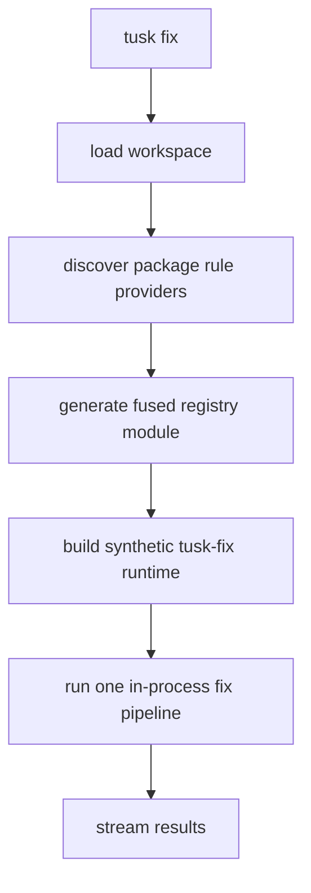
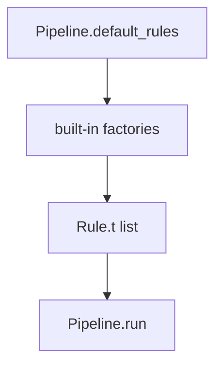
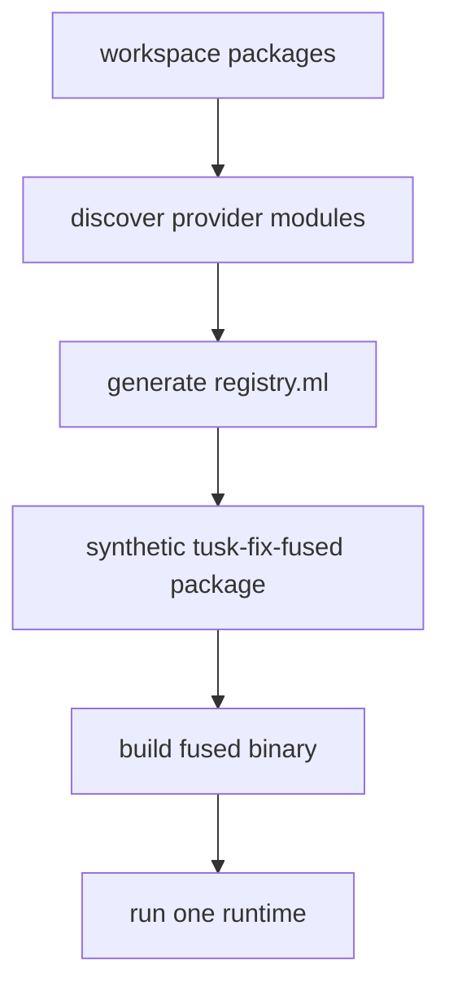
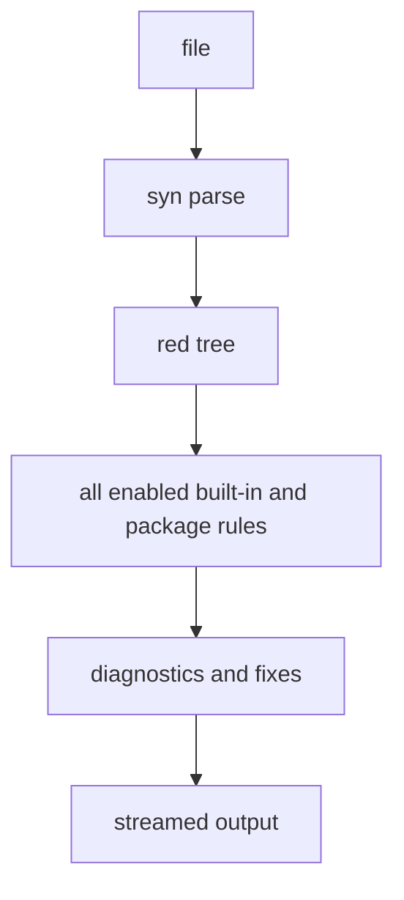

# RFD0013 - Tusk Fix Package-Provided Rules

- Feature Name: `tusk_fix_package_rules`
- Start Date: `2026-03-20`
- RFD PR: [leostera/riot#0000](https://github.com/leostera/riot/pull/0000)
- Riot Issue: [leostera/riot#0000](https://github.com/leostera/riot/issues/0000)

## Summary
[summary]: #summary

This RFD proposes extending `tusk-fix` so packages can ship their own lint
rules and fix explanations, with the rules fused at build time into a
workspace-specific synthetic `tusk-fix` runtime.

The important design point is that package rules should not be executed as one
binary per rule or one binary per package at runtime. That model would be too
slow for Riot-sized workspaces.

Instead:

- packages declare fix-provider modules in `tusk.toml`
- `tusk fix` discovers those provider modules from the workspace
- `tusk fix` generates a synthetic registry package that depends on the owning
  packages
- that generated package links all discovered rules into one fused runtime
- the fused runtime parses each file once and runs all enabled rules in-process

That gives Riot the ownership we want:

- `std` can ship `no-stdlib`
- `suri` can ship framework migration rules
- `sqlx` can ship data-access rules
- any package can add rules by joining the workspace

without turning the checked-in `packages/tusk-fix` package into a giant static
central registry.

## Motivation
[motivation]: #motivation

`tusk-fix` already has the local building blocks:

- a parser-backed pipeline
- a rule abstraction
- typed diagnostics
- diagnostic explanations
- a worker/coordinator execution model

What it does not have yet is package ownership.

Right now, rules live in `packages/tusk-fix/src/rules/`. That is fine for
bootstrapping, but it is the wrong long-term boundary for package-specific
knowledge.

`no-stdlib` is the obvious example. It is not really a generic `tusk-fix`
opinion. It is a `std` opinion about how Riot code should interact with the
standard library boundary.

The same will be true elsewhere:

- `suri` should own web-framework migrations and conventions
- `http` should own protocol-surface transitions
- `sqlx` should own query and pool usage rules
- `minttea` should own update/view/command conventions

So the requirement is not just “support more rules”. The requirement is:

`tusk-fix` must let packages own their own rules.

There is also a performance requirement.

Riot already has roughly:

- ~100k lines of OCaml
- ~2300 source files

If package rules were executed as tiny subprocesses, runtime overhead would
explode quickly:

- one provider invocation per file per rule is already too much
- even “fast” subprocesses add startup, scheduling, and I/O overhead
- per-provider parsing would repeat the same parse work unnecessarily

The correct runtime shape is therefore:

- one fused runtime
- one parse pass per file
- many rules executed in-process

That is the central decision in this RFD.

## Guide-level explanation
[guide-level-explanation]: #guide-level-explanation

A package that wants to ship `tusk-fix` rules declares a provider module in its
manifest.

For example, `std` could eventually declare:

```toml
[[tusk.fix.provider]]
name = "std"
module = "Std.Fix_rules"
rules = ["no-stdlib"]
```

The package would then expose a provider module implementing a small API from a
new `tusk-fix-api` package.

From the user side, nothing changes:

```text
tusk fix
tusk fix --check
tusk fix --explain F0001
```

The difference is in how `tusk fix` runs internally.

Instead of directly using only the rules compiled into `packages/tusk-fix`, it
does this:



The user should think about it this way:

- packages own rule definitions
- `tusk fix` owns orchestration
- build-time fusion gives the user one runtime instead of hundreds of tiny ones

## Reference-level explanation
[reference-level-explanation]: #reference-level-explanation

## 1. Current state

Today:

- `tusk-fix` owns the rule abstraction
- `Pipeline.default_rules` returns built-in rules
- `Fix_config` resolves workspace and package-local enable/disable state
- the runtime executes rules in one process

That current pipeline is good.

What is missing is a way for rules to come from packages other than
`packages/tusk-fix`.

The current discovery shape is:



That is too closed for the next phase.

## 2. Goals

This proposal is trying to achieve all of the following:

1. let any workspace package ship `tusk-fix` rules
2. keep package-specific lint logic near the package that owns it
3. preserve one in-process rule runtime
4. preserve one parse pass per file
5. keep `tusk fix --explain CODE` working for package-owned codes
6. preserve the current workspace/package config override model
7. avoid forcing checked-in `packages/tusk-fix` to depend on arbitrary packages

## 3. Non-goals

This proposal is not trying to do these things yet:

- third-party plugin loading outside the current workspace
- cross-file refactors
- formatter plugins
- dynlink-based OCaml plugins
- solving normal vs dev vs build/tool dependency classes in the same change

For the first implementation, packages can depend on `syn` and `tusk-fix-api`
as regular dependencies when they choose to ship fix providers.

## 4. Manifest shape

Packages expose rule providers through `tusk.toml`.

The proposed manifest shape is:

```toml
[[tusk.fix.provider]]
name = "std"
module = "Std.Fix_rules"
rules = ["no-stdlib"]
```

Fields:

- `name`: provider name for debugging and reporting
- `module`: fully qualified provider module path
- `rules`: rule ids served by that provider

This uses provider modules, not one manifest entry per rule, because packages
will often want to ship a family of related rules and share helpers.

## 5. Provider authoring API

Provider modules should implement a small API in a new `tusk-fix-api` package.

That package should expose:

- `Rule`
- `Diagnostic`
- `Diagnostic_code`
- `Fix`
- a provider module signature
- helpers for registration into the fused runtime

The authoring story should feel like:

```ocaml
module Std_fix_rules : Tusk_fix_api.Provider = struct
  let rules () =
    [ No_stdlib.make () ]

  let codes () =
    No_stdlib.codes
end
```

The important boundary is:

- diagnostics stay typed inside the provider-owning package
- the fused runtime sees one shared set of rules and codes

## 6. Fusion model

`tusk fix` should generate a workspace-specific synthetic package that links:

- `tusk-fix`
- `tusk-fix-api`
- every provider-owning package
- a generated registry module that lists every discovered provider

Conceptually:



The generated registry module should look roughly like:

```ocaml
let providers =
  [
    (module Std.Fix_rules : Tusk_fix_api.Provider);
    (module Suri.Fix_rules : Tusk_fix_api.Provider);
  ]
```

That synthetic runtime is what the CLI should execute.

## 7. Runtime model

Once the fused runtime exists, execution stays simple.

Per file:

- parse once with `syn`
- run all enabled rules in-process
- merge diagnostics and optional fixes
- stream results through the existing coordinator/reporter path

Conceptually:



This is the key reason not to use provider subprocesses.

## 8. Config interaction

The current config model is already close to what we need:

- workspace `[tusk.fix].rules`
- package-local `[tusk.fix].rules`
- package-local overrides applying on top of workspace defaults

The only change is that the available rule set now comes from:

- built-in rules
- fused provider modules discovered from the workspace

So the effective-rule algorithm becomes:

1. discover all built-in and package-provided rule ids
2. establish default enablement
3. apply workspace overrides
4. apply package-local overrides for the file’s package
5. run only the resulting enabled rules

## 9. Explain flow

`tusk fix --explain F0001` should search:

1. built-in diagnostic codes
2. package-owned diagnostic codes fused into the runtime
3. if no match exists, return the usual unknown-code error

That means package-provided rules get first-class explanation text with no
special user syntax.

## 10. Why not one provider binary per package

That model is easy to imagine, but it is the wrong runtime shape.

Problems:

- one file can trigger many provider invocations
- the same file gets reparsed repeatedly
- process startup and transport overhead add up quickly
- large workspaces become “call 100 tiny binaries”

At Riot scale, that is not acceptable.

## 11. Why not statically link all rules into checked-in tusk-fix

That creates the wrong ownership pattern.

Problems:

- `packages/tusk-fix` would need to depend on arbitrary packages
- package-specific lint logic would still be centralized
- package authors would need to edit `packages/tusk-fix` to add rules
- the checked-in core package would keep growing as a bottleneck

That defeats the point of package-provided rules.

## 12. Why not dynlink

Dynamic OCaml plugins are the wrong tradeoff here.

Problems:

- native plugin loading is platform-sensitive
- ABI boundaries are fragile
- debugging is worse
- the build/runtime model becomes harder to reason about

Generated fusion is more explicit and more reliable.

## 13. Rollout plan

The rollout should happen in stages.

### Stage 1

- add provider metadata to `tusk-model`
- discover providers from the workspace
- add `tusk-fix-api`
- generate the fused registry module
- build and run one fused `tusk-fix` runtime

### Stage 2

- move `no-stdlib` into a package-owned provider
- most likely `std` first
- keep the built-in copy temporarily only for migration safety

### Stage 3

- remove migrated built-ins from `packages/tusk-fix/src/rules/`
- make package-owned rules the normal extension mechanism

## Drawbacks
[drawbacks]: #drawbacks

- fusion introduces generated workspace build artifacts
- provider discovery changes the `tusk fix` build path
- provider-owning packages currently need regular deps on `syn` and `tusk-fix-api`
- the synthetic runtime must be rebuilt when the provider set changes

These are acceptable costs for getting ownership and runtime shape right.

## Rationale and alternatives
[rationale-and-alternatives]: #rationale-and-alternatives

The chosen design optimizes for:

- package ownership
- one parse pass per file
- one runtime process
- runtime performance
- a stable user model

The strongest alternative is “one provider binary per package”.
That is simpler mechanically, but it is much worse operationally.

The fused design keeps the public story clean:

- packages declare providers
- `tusk fix` discovers them
- `tusk` generates a fused runtime
- the user still runs one command

That is the right foundation.

## Prior art
[prior-art]: #prior-art

Relevant patterns:

- workspace-discovered extension points already exist in `tusk`
- other language toolchains generate synthetic registries at build time
- Riot already uses generated build artifacts when a checked-in package would be
  the wrong boundary

This proposal follows the same general idea:

- package-owned implementation
- generated fusion at build time
- one coherent runtime at execution time

## Unresolved questions
[unresolved-questions]: #unresolved-questions

- Should rule ids be globally unique strings, or should `tusk-fix`
  canonicalize them as `package:rule` internally?
- Should the fused runtime be rebuilt eagerly on every `tusk fix`, or only when
  the provider set hash changes?
- Should provider-owning packages eventually use dev/build-only deps instead of
  regular package dependencies?
- Should built-in `Diagnostic_code` move to a more extensible registry shape
  before the first external provider lands?
