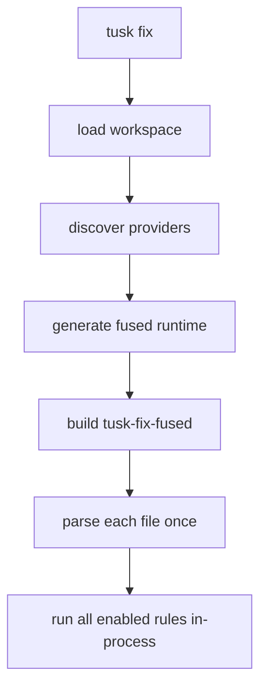

# RFD0013 - Tusk Fix Package-Provided Rules

- Feature Name: `tusk_fix_package_rules`
- Start Date: `2026-03-20`
- RFD PR: [leostera/riot#0000](https://github.com/leostera/riot/pull/0000)
- Riot Issue: [leostera/riot#0000](https://github.com/leostera/riot/issues/0000)

## Summary
[summary]: #summary

This RFD extends `tusk-fix` so workspace packages can ship their own lint rules
and explanations, with those rules fused at build time into one synthetic
runtime.

The central design decision is unchanged:

- do not run one binary per rule
- do not run one binary per package
- do parse each file once
- do run all enabled rules in-process

The implementation that now exists follows that shape:

- packages declare one `[tusk.fix.provider]`
- provider source defaults to either:
  - `fix/tusk_fix_rules/tusk_fix_rules.ml`
  - `fix/tusk_fix_rules.ml`
  - `src/tusk_fix_rules/tusk_fix_rules.ml`
  - `src/tusk_fix_rules.ml`
- rule ids are automatically namespaced as `<package>:<rule>`
- diagnostic codes are automatically namespaced as `<package>:<code>`
- `tusk fix` generates a fused runtime under `_build`
- that runtime rebuilds like any other `tusk` package and uses normal caching

`std:no-stdlib` is the first concrete package-owned rule using this model.

## Motivation
[motivation]: #motivation

`tusk-fix` already had the right local primitives:

- parser-backed analysis
- typed diagnostics
- fixes and explanations
- one-process execution

What it lacked was ownership. Rules such as `no-stdlib` are not really generic
`tusk-fix` opinions. They are package-owned policies. `std` should own
`std:no-stdlib` in the same way `suri`, `sqlx`, or `minttea` should eventually
own their own lint rules.

There is also a hard runtime constraint. Riot-sized workspaces are already large
enough that per-rule or per-package subprocess execution would be the wrong
shape. The cost is not just CPU time; it is repeated parsing, process startup,
transport overhead, and poor streaming behavior.

So the requirement is:

`tusk-fix` must let packages own rules without giving up a fused in-process
runtime.

## Guide-level explanation
[guide-level-explanation]: #guide-level-explanation

A package can expose a fix provider in `tusk.toml`:

```toml
[tusk.fix.provider]
rules = ["no-stdlib"]
```

If `path` is omitted, `tusk-fix` probes these defaults in order:

- `fix/tusk_fix_rules/tusk_fix_rules.ml`
- `fix/tusk_fix_rules.ml`
- `src/tusk_fix_rules/tusk_fix_rules.ml`
- `src/tusk_fix_rules.ml`

The provider source is not compiled as part of the owning package's normal
build. Instead, `tusk fix` discovers all providers in the workspace, generates a
synthetic fused package, builds it, and runs that one binary.

From the user side, the command surface stays simple:

```text
tusk fix
tusk fix --check
tusk fix --explain std:f0001
```

From the runtime side, the shape is:



## Reference-level explanation
[reference-level-explanation]: #reference-level-explanation

## 1. Manifest shape

The implemented manifest shape is:

```toml
[tusk.fix.provider]
path = "fix/tusk_fix_rules.ml" # optional
rules = ["no-stdlib"]
```

Rules are declared provider-locally, but exposed to users as
`<package>:<rule>`.

For example:

- package `std`
- local rule `no-stdlib`

becomes:

- `std:no-stdlib`

Likewise, provider-defined diagnostic code `f0001` becomes `std:f0001`.

## 2. Provider authoring

Shared rule-authoring types live in `tusk-fix-api`.

Provider implementations should prefer `fix/` over `src/` so build-only rule
code does not participate in the package's runtime dependency graph.

The fused runtime still exposes the richer `Tusk_fix` runtime surface, but
provider authors write against the shared rule API plus `syn` helpers.

Conceptually, a provider module looks like:

```ocaml
open Std

let name = "std"

let rules () =
  [ No_stdlib.make () ]

let diagnostic_codes () =
  No_stdlib.codes
```

Provider support modules that live next to the entrypoint are copied into the
generated fused runtime as sibling embedded modules.

## 3. Fusion model

`tusk fix` generates a workspace-specific synthetic package that depends on:

- `tusk-fix`
- `tusk-fix-api`
- `syn`
- `std`
- each provider-owning package

and emits generated source that:

- embeds provider entrypoints
- embeds provider support modules
- registers providers before CLI execution

The resulting fused runtime is rebuilt like any other `tusk` package, so it
inherits normal build caching behavior.

## 4. Runtime model

Per file, the fused runtime should:

1. parse once with `syn`
2. run all enabled built-in and package rules in-process
3. collect diagnostics and optional fixes
4. stream results through the CLI reporter

That runtime model is the main reason to prefer generated fusion over provider
subprocesses.

## 5. Config interaction

The effective rule set is:

1. built-in rules
2. discovered package-provided rules
3. workspace `[tusk.fix].rules` overrides
4. package-local `[tusk.fix].rules` overrides

Short rule syntax still applies:

- `"name"` enables
- `"-name"` disables

Package-local overrides apply on top of workspace defaults.

## 6. Explain flow

`tusk fix --explain std:f0001` searches:

1. built-in diagnostic codes
2. package-owned diagnostic codes fused into the runtime
3. unknown-code fallback if nothing matches

That makes package-provided explanations first-class.

## 7. Dependency-layering constraint

The first implementation exposed a deeper problem in the build model.

`std` wants to own `std:no-stdlib`, but direct normal dependency layering like:

- `std -> tusk-fix-api`
- `tusk-fix-api -> syn`
- `syn -> ceibo`
- `ceibo -> std`

creates a cycle.

That is why provider source must remain outside the owning package's normal
build, and why dependency classes are now the required follow-up. Provider
authoring wants build-only dependencies, not normal runtime dependencies.

## 8. Current status

Implemented:

- provider discovery in `tusk-model`
- fused runtime generation in `tusk-fix`
- package-prefixed rule ids
- package-prefixed diagnostic codes
- default provider path probing
- package-owned `std:no-stdlib`
- package-owned `--explain` support

Still open:

- proper normal/dev/build dependency classes so provider-owning packages can
  express build-only rule-authoring dependencies cleanly

## Drawbacks
[drawbacks]: #drawbacks

- fusion introduces generated workspace build artifacts
- provider source is compiled in a synthetic runtime, not in the owning
  package's normal build
- the synthetic runtime must be rebuilt when provider membership changes
- provider authoring currently pushes on the package dependency model, which is
  why dependency classes are now necessary

## Rationale and alternatives
[rationale-and-alternatives]: #rationale-and-alternatives

### Why not one provider binary per package

Because it is the wrong runtime shape:

- too many subprocesses
- repeated parsing
- repeated startup cost
- poor scaling for large workspaces

### Why not statically link all rules into checked-in `tusk-fix`

Because it creates the wrong ownership model:

- package-specific rules stay centralized
- package authors must edit `packages/tusk-fix`
- `tusk-fix` becomes a bottleneck package

### Why not dynlink

Because it buys the wrong tradeoff:

- platform-sensitive behavior
- ABI fragility
- more complex debugging
- harder-to-reason-about build/runtime story

Generated fusion is more explicit and more predictable.

## Prior art
[prior-art]: #prior-art

Relevant patterns:

- synthetic registries generated at build time
- workspace-discovered extension points
- toolchains that keep extension ownership at the package boundary while still
  executing one coherent runtime

This design follows that same pattern.

## Unresolved questions
[unresolved-questions]: #unresolved-questions

- How far should provider sources be allowed to reach into the owning package:
  only public modules, or some future friend/internal surface?
- When built-ins migrate to package providers, should the built-in copies linger
  for a transition window or be removed immediately after verification?
