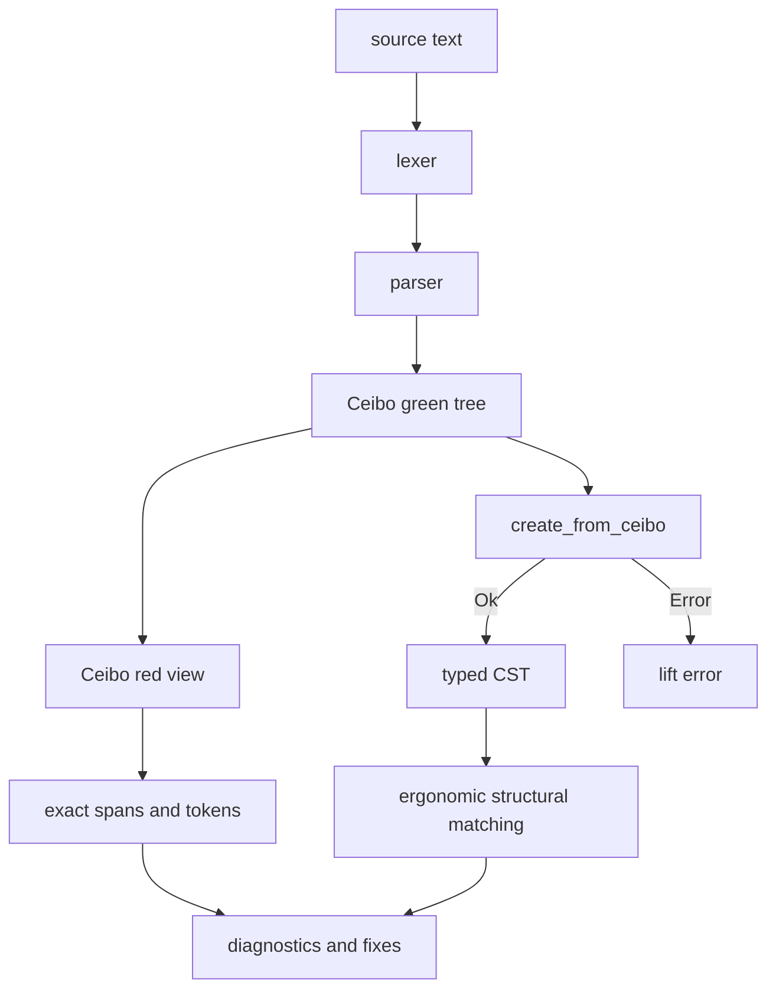

# RFD0015 - Syn Faithful CST

- Feature Name: `syn_faithful_cst`
- Start Date: `2026-03-21`
- Status: `accepted`
- RFD PR: [leostera/riot#0000](https://github.com/leostera/riot/pull/0000)
- Riot Issue: [leostera/riot#0000](https://github.com/leostera/riot/issues/0000)

## Summary
[summary]: #summary

This RFD proposes that `syn` should expose a complete, typed,
pattern-matchable concrete syntax tree (`Syn.Cst`) alongside its existing
lossless `Ceibo` trees.

The central requirement is:

- `Ceibo` should remain the canonical lossless source-of-truth
- `Syn.Cst` should be a fully materialized, complete typed CST produced once
  per parse result
- `Syn.Cst` should only be produced for parse results with no parser
  diagnostics
- `Syn.Cst` should be a faithful lift of the parsed syntax, not a
  lint-convenience projection
- `Syn.Cst` should not contain `Unknown` nodes
- CST lifting should fail fast when the parsed syntax cannot be represented
  faithfully
- helper predicates such as `is_function` or `has_default` should live outside
  the core tree definitions

The intent is to make tooling such as `tusk-fix`, `tusk-eval`, the future
formatter, and the future typechecker easier to write without sacrificing the
exact source fidelity that fix rules require.

## Motivation
[motivation]: #motivation

The current `syn` surface is powerful but mechanically awkward for tooling.
Consumers such as `tusk-fix` operate directly on generic `Ceibo.Red` nodes and
tokens, which means many rules have to:

- match on `SyntaxKind`
- traverse raw child arrays
- skip trivia manually
- infer which child token is the "real" subject of a diagnostic

That is workable, but it is brittle.

The recent `snake-case-type-names` rule in `tusk-fix` is a good example. The rule
should conceptually answer a simple question:

- "what is the declared type name of this `type` declaration?"

But on the current raw tree surface the rule instead has to:

- find a `TYPE_DECL`
- descend into a `MODULE_PATH`
- ignore trivia
- pick the correct segment out of that path
- avoid confusing the declaration name with unrelated type uses

That kind of traversal is easy to get wrong and hard to read in review.

This matters for Riot because `syn` is no longer just a parser experiment. It is
now a foundation for:

- `tusk-fix` lint rules and auto-fixes
- parser-backed diagnostics
- future macros
- future formatting and rewrite tooling
- the future typechecker
- other source-analysis tools that want structure, not just tokens

These consumers want two things at once:

1. a concrete, lossless representation of the original source
2. an ergonomic typed API that reflects OCaml syntax as named structures

`Ceibo` gives Riot the first property extremely well. What is missing is a
stable typed layer for the second.

The proposal in this RFD is to add that typed layer without replacing the
lossless tree, and to make that layer faithful enough that it can become the
shared structural surface for more than lint rules.

## Guide-level explanation
[guide-level-explanation]: #guide-level-explanation

Contributors should think of `syn` as exposing two related syntax surfaces:

- `Ceibo`
  - the exact, lossless syntax tree
  - preserves every byte, token, span, comment, and trivia relationship
  - always exists, even when parsing reports diagnostics
  - remains the right surface for exact source edits and low-level traversal
- `Syn.Cst`
  - a typed, pattern-matchable concrete syntax tree
  - fully materialized from the same parse when parsing succeeds without
    diagnostics
  - easier to use for analysis and linting
  - structured faithfully enough that later passes can rely on it as the
    parser-shaped representation of the program

The important point is that `Syn.Cst` should not be a lossy AST and should not
be a lint-specific convenience projection.

It should still be a concrete syntax tree. That means it should preserve
syntactic distinctions that matter for tooling, such as:

- `fun x -> ...` vs `function | ...`
- `let` vs `let rec`
- parenthesized vs unparenthesized expressions
- `begin ... end` vs `( ... )`
- labeled and optional arguments
- local opens
- record syntax shape
- module-path-qualified names

If two concrete forms are grouped under one outer family, the inner payload
should still preserve which form was written.

For example:

- `Expression.Literal literal_expr` is fine
- but `literal_expr` should still distinguish string, int, bool, unit, and
  other literal forms

Likewise:

- `Expression.Function function_expr` is fine
- but `function_expr` should still distinguish `fun` from `function`

### What rule authors should write

Instead of this style:

```ocaml
match Syn.Ceibo.Red.SyntaxNode.kind node with
| Syn.SyntaxKind.TYPE_DECL ->
    (* Inspect raw children, skip trivia, locate the right token *)
    ...
| _ -> ...
```

rule authors should be able to write something like:

```ocaml
let diagnostic_for_decl = function
| Syn.Cst.Item.TypeDeclaration
    {
      name;
      manifest = Some { body; _ };
      _;
    } ->
    ...
| _ -> None
```

This should make lint rules:

- shorter
- easier to review
- less dependent on child ordering trivia
- much less likely to misidentify the wrong token

### What fix authors should still do

Fix rules should still produce edits against exact spans or tokens:

```ocaml
let token = decl.name.token in
Fix.make_text_edit
  ~span:(Syn.Ceibo.Red.SyntaxToken.span token.syntax_token)
  ~new_text:"user_profile"
```

That is the key layering rule:

- the typed CST should help locate the right token
- the actual rewrite should still target the lossless source representation

### Parse result mental model

Contributors should think of a parse result as one parse with:

- one always-present lossless tree
- one optional typed CST



The CST should not replace the raw tree. It should make the raw tree easier to
use safely.

The key invariant should be:

- `tree` always exists
- `diagnostics` may exist
- `cst = Some _` should mean there were no parse diagnostics and the Ceibo to
  CST lift succeeded
- `cst = None` should mean the caller must stay on diagnostics or raw-tree
  tooling

## Reference-level explanation
[reference-level-explanation]: #reference-level-explanation

## 1. Core invariants

The CST should satisfy these invariants:

- it should be built from `Ceibo`, not independently from the token stream
- it should not drop concrete distinctions that the parsed program recorded
- it should not expose `Unknown` nodes in the public tree
- it should either produce a complete typed CST or fail
- it should retain exact `Ceibo` identity for nodes and tokens

`Syn.Cst` should therefore be a faithful lift, not a best-effort partial
view.

## 2. Public API

`syn` should expose one public CST construction function:

```ocaml
module Cst : sig
  type error = {
    message : string;
    syntax_kind : Syntax_kind.t;
    span : Ceibo.Span.t;
    context : string list;
  }

  val create_from_ceibo :
    (Syntax_kind.t, string) Ceibo.Green.node -> (source_file, error) result
end
```

The parser should continue to return:

```ocaml
type parse_result = {
  tree : Ceibo.Green.t;
  cst : Cst.source_file option;
  diagnostics : Diagnostic.t list;
}
```

But `parse_result.cst` should be treated as a convenience field, not the
authoritative constructor. The authoritative API should be
`Cst.create_from_ceibo`.

## 3. Internal lifting model

The implementation inside `cst.ml` should use a private exception-backed
control flow to bail out quickly:

```ocaml
type error = {
  message : string;
  syntax_kind : Syntax_kind.t;
  span : Ceibo.Span.t;
  context : string list;
}

exception Bail of error

let bail ... = raise (Bail error)

let rec lift_expression ... = ...
let rec lift_pattern ... = ...
let rec lift_type ... = ...

let lift ceibo = ...

let create_from_ceibo ceibo =
  match lift ceibo with
  | cst -> Ok cst
  | exception Bail error -> Error error
```

This should let the internal lifting code:

- be assertive about expected shapes
- fail fast
- avoid threading `result` through every internal helper

While still giving public consumers a normal result-based API.

## 4. CST shape rules

The CST should follow these shape rules:

- broad grouped families at the outer layer are fine
- concrete distinctions should be preserved inside family payloads
- boolean fields should not stand in for meaningful syntax variants
- accessor-only wrapper modules should not be the primary API
- convenience predicates and derived views should live outside the core tree

Examples:

- `Expression.Literal literal_expr` is good
- `literal_expr` should still distinguish string, int, float, char, bool, unit,
  constructor-constants, and quoted strings where applicable

- `Expression.Let let_expr` is good
- `let_expr` should still distinguish `let` from `let rec`

- `Expression.Function function_expr` is good
- `function_expr` should still distinguish `fun` from `function`

- `Expression.Wrapped wrapped_expr` is good
- `wrapped_expr` should still distinguish `(expr)` from `begin expr end`

Helpers such as these should live in a separate module like `Syn.Matchers`:

- `LetBinding.is_function`
- `Parameter.has_default`
- `TypeDeclaration.name`
- `Expression.is_literal`

## 5. Relationship to `Ceibo`

`Ceibo` should remain canonical for:

- lossless storage
- token identity
- spans
- exact source reproduction
- low-level tree traversals
- parser recovery

`Syn.Cst` should remain a layer on top of that.

Every CST node should retain its raw `Ceibo.Red` node.

Every CST token should likewise retain:

- raw token handle
- span
- text access
- presence or missing information where applicable

That is what keeps fix rules precise.

## 6. Fixture-driven coverage

The faithful lift should be driven by the existing parser fixture suite. For
each fixture in
[packages/syn/tests/fixtures](/Users/leostera/Developer/github.com/leostera/riot/packages/syn/tests/fixtures),
the project should compare two versioned artifacts:

- `<fixture>.expected_lossless.json`
- `<fixture>.expected_cst.json`

Those artifacts should be produced by the `syn` binary itself:

- `syn print-ceibo <file>`
- `syn print-cst <file>`

This should become the practical coverage tracker for `Syn.Cst`.

If a fixture parses successfully but the CST lift is still missing some syntax,
then `print-cst` should return a structured lift error and the corresponding
`expected_cst` snapshot should make that gap visible until the lift is
implemented.

When extending the CST, the development loop should be:

1. pick a failing fixture
2. extend the CST types if needed
3. extend the `Ceibo -> Cst` lift
4. update the fixture snapshot
5. repeat until the fixture passes

That keeps the coverage work grounded in real parser inputs and keeps the CST
honest about the exact syntax Riot already parses.

## Suggested rollout

The rollout should happen in slices:

### Stage 1

- define the faithful-lift contract
- add `create_from_ceibo`
- remove `Unknown` from the public CST surface
- add lift errors with context breadcrumbs

### Stage 2

- cover expressions, patterns, and type expressions
- add CST tests that prove faithful distinctions
- move convenience helpers into `Syn.Matchers`

### Stage 3

- cover declarations, module syntax, class syntax, and signatures
- migrate `tusk-fix` to depend on faithful CST nodes rather than convenience
  wrappers
- keep the fixture snapshots as the coverage tracker

## Drawbacks
[drawbacks]: #drawbacks

- `syn` will have to maintain two syntax representations instead of one
- CST construction will add memory and CPU cost per parse result
- generated node definitions and codegen add maintenance overhead
- there is a risk of confusion if contributors are unclear on when to use
  `Ceibo` vs `Syn.Cst`

## Rationale and alternatives
[rationale-and-alternatives]: #rationale-and-alternatives

### Why not stay on raw `Ceibo` only

Because the current raw-tree-only API pushes too much syntax knowledge into
every downstream rule and tool.

That creates repeated, fragile logic in consumers such as:

- finding declaration names
- finding argument lists
- distinguishing concrete syntax shapes
- recovering the correct token to diagnose or rewrite

That is exactly the kind of structure `syn` should centralize.

### Why not replace `Ceibo` entirely

Because Riot still needs the lossless tree for:

- exact source spans
- trivia preservation
- precise fixes
- parser recovery

Replacing `Ceibo` would optimize the wrong thing and would likely make precise
rewrites harder, not easier.

### Why not keep a convenience-shaped CST

Because a convenience-shaped CST will quickly drift toward lint-specific
shortcuts:

- booleans instead of meaningful syntax variants
- flattened paths that lose concrete distinctions
- payloads that normalize away the source form too early

That would help individual rules in the short term but would be a bad
foundation for:

- a formatter
- a typechecker
- general structural analysis

The CST should therefore model the parsed syntax faithfully first, and only
then offer convenience through separate helper layers.

### Why not expose only lightweight typed views over raw nodes

That is a viable intermediate step, but it leaves an important problem
unsolved:

- consumers still rebuild structural interpretations ad hoc
- sub-children still need repeated conversion as tooling descends the tree

If `tusk-fix` runs dozens of rules over one file, Riot should be able to build
the typed concrete structure once for that file and share it.

The chosen design should therefore produce one complete CST per parse result
rather than a chain of on-demand child views.

### Why not make the CST recovery-aware from day one

Because that makes the first design significantly more complex:

- every typed node family has to model malformed structure
- callers have to reason about recovery nodes
- the invariant "typed traversal is safe when CST exists" disappears

The simpler first step should be:

- always produce `Ceibo`
- only produce `Cst` when parsing is clean
- make faithful CST lifting either succeed or fail

If Riot later needs recovery-aware typed syntax, that should be a follow-up
design rather than a requirement for the first CST.

### Why not expose a semantic AST instead

Because linting, formatting, and rewriting need concrete syntax, not normalized
syntax.

A semantic AST would collapse distinctions that tools often care about, such as:

- source spelling
- parentheses
- optional argument syntax
- exact path qualification
- concrete local-open forms

The typed layer should therefore remain a CST, not an AST.

## Prior art
[prior-art]: #prior-art

Relevant prior art includes:

- SwiftSyntax
  - keeps a raw lossless syntax layer
  - exposes typed syntax wrappers for ergonomic traversal
- Roslyn
  - typed syntax APIs over a lossless tree architecture
- rust-analyzer / Rowan
  - lossless green trees with typed wrappers layered on top

The strongest shared lesson is:

- typed syntax APIs are most effective when they sit on top of a lossless raw
  representation rather than replacing it

## Unresolved questions
[unresolved-questions]: #unresolved-questions

- What syntax metadata format should drive code generation for typed nodes?
- Should the fixture runner grow snapshot-refresh tooling for both lossless and
  CST artifacts?
- How should parser-facing APIs expose lift failures for debugging without
  complicating normal parse consumers?

## Future possibilities
[future-possibilities]: #future-possibilities

Once Riot has a faithful typed CST, it could support:

- formatter passes over exact syntax structure
- richer `tusk-fix` rewrites
- parser-backed editor tooling
- structural refactorings
- a future typechecker built on shared parser-shaped nodes
