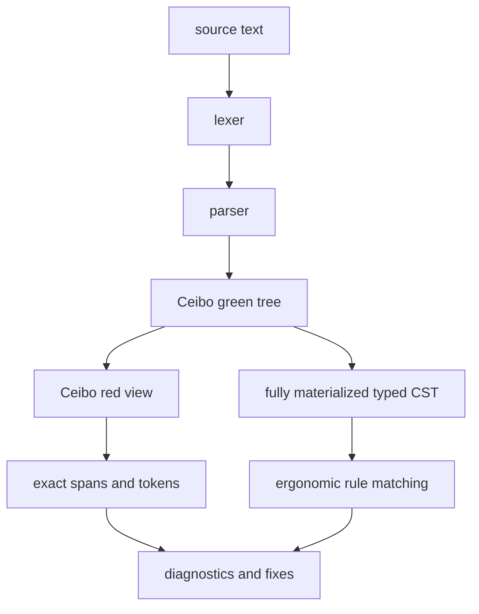

# RFD0015 - Syn Typed CST

- Feature Name: `syn_typed_cst`
- Start Date: `2026-03-21`
- RFD PR: [leostera/riot#0000](https://github.com/leostera/riot/pull/0000)
- Riot Issue: [leostera/riot#0000](https://github.com/leostera/riot/issues/0000)

## Summary
[summary]: #summary

This RFD proposes that `syn` should expose a complete, typed,
pattern-matchable concrete syntax tree (`Syn.Cst`) alongside its existing
lossless `Ceibo` trees.

The central requirement is:

- `Ceibo` should remain the canonical lossless source-of-truth
- `Syn.Cst` should be a fully materialized, complete typed CST produced once
  per parse result
- `Syn.Cst` should only be produced for parse results with no parser
  diagnostics
- `Syn.Cst` should provide ergonomic, compiler-checked structural access
- every CST node and token should retain a path back to exact source spans and
  raw syntax so fix rules remain precise

The intent is to make tooling such as `tusk-fix`, `tusk-eval`, and future
macro/codegen systems easier to write without sacrificing the exact source
fidelity that fix rules require.

## Motivation
[motivation]: #motivation

The current `syn` surface is powerful but mechanically awkward for tooling.
Consumers such as `tusk-fix` operate directly on generic `Ceibo.Red` nodes and
tokens, which means many rules have to:

- match on `SyntaxKind`
- traverse raw child arrays
- skip trivia manually
- infer which child token is the "real" subject of a diagnostic

That is workable, but it is brittle.

The recent `snake-case-type-names` rule in `tusk-fix` is a good example. The rule
should conceptually answer a simple question:

- "what is the declared type name of this `type` declaration?"

But on the current raw tree surface the rule instead has to:

- find a `TYPE_DECL`
- descend into a `MODULE_PATH`
- ignore trivia
- pick the correct segment out of that path
- avoid confusing the declaration name with unrelated type uses

That kind of traversal is easy to get wrong and hard to read in review.

This matters for Riot because `syn` is no longer just a parser experiment. It is
now a foundation for:

- `tusk-fix` lint rules and auto-fixes
- parser-backed diagnostics
- future macros
- future formatting and rewrite tooling
- other source-analysis tools that want structure, not just tokens

These consumers want two things at once:

1. a concrete, lossless representation of the original source
2. an ergonomic typed API that reflects OCaml syntax as named structures

`Ceibo` gives Riot the first property extremely well. What is missing is a
stable typed layer for the second.

The proposal in this RFD is to add that typed layer without replacing the
lossless tree.

## Guide-level explanation
[guide-level-explanation]: #guide-level-explanation

Contributors should think of `syn` as exposing two related syntax surfaces:

- `Ceibo`
  - the exact, lossless syntax tree
  - preserves every byte, token, span, comment, and trivia relationship
  - always exists, even when parsing reports diagnostics
  - remains the right surface for exact source edits and low-level traversal
- `Syn.Cst`
  - a typed, pattern-matchable concrete syntax API
  - fully materialized from the same parse when parsing succeeds without
    diagnostics
  - easier to use for analysis and linting

The important point is that `Syn.Cst` should not be a lossy AST.

It should still be a concrete syntax tree. That means it should preserve
syntactic distinctions that matter for tooling, such as:

- parenthesized vs unparenthesized expressions
- labeled and optional arguments
- record syntax shape
- local opens
- module-path-qualified names

### What rule authors should write

Instead of this style:

```ocaml
match Syn.Ceibo.Red.SyntaxNode.kind node with
| Syn.SyntaxKind.TYPE_DECL ->
    (* Inspect raw children, skip trivia, locate the right token *)
    ...
| _ -> ...
```

rule authors should be able to write something like:

```ocaml
match item with
| Syn.Cst.Item.TypeDeclaration decl ->
    let name = Syn.Cst.TypeDeclaration.name_token decl in
    ...
```

This would make lint rules:

- shorter
- easier to review
- less dependent on child ordering trivia
- much less likely to misidentify the wrong token

### What fix authors should still do

Fix rules should still produce edits against exact spans or tokens:

```ocaml
let token = Syn.Cst.TypeDeclaration.name_token decl in
Fix.make_text_edit
  ~span:(Syn.Ceibo.Red.SyntaxToken.span token.syntax_token)
  ~new_text:"user_profile"
```

That is the key layering rule:

- the typed CST should help locate the right token
- the actual rewrite should still target the lossless source representation

### Parse result mental model

Contributors should think of a parse result as one parse with:

- one always-present lossless tree
- one optional typed CST



The CST should not replace the raw tree. It should make the raw tree easier to
use safely.

The key invariant should be:

- `tree` always exists
- `diagnostics` may exist
- `cst = Some _` should mean there were no parse errors
- `cst = None` should mean the caller must stay on diagnostics or raw-tree
  tooling

## Reference-level explanation
[reference-level-explanation]: #reference-level-explanation

## 1. Core design

`syn` should continue to parse source into a lossless `Ceibo` tree.

In addition, it should expose a typed CST layer with these properties:

- typed nodes and tokens
- recursive, fully typed node families for declarations, expressions, patterns,
  types, modules, signatures, and other concrete syntax categories
- pattern-matchable sum types for syntax families such as `expr`, `pattern`,
  and `type_expr`
- exact links back to raw `Ceibo.Red` nodes or tokens
- generated definitions rather than handwritten wrappers
- only produced for parse results with no parser diagnostics

The typed CST should be a structured projection of the parsed concrete syntax,
not a separate semantic AST.

## 2. API shape

The API should look conceptually like:

```ocaml
module Cst : sig
  type source_file

  type syntax_node = (SyntaxKind.t, string) Ceibo.Red.syntax_node
  type syntax_token = (SyntaxKind.t, string) Ceibo.Red.syntax_token

  module Item : sig
    type t =
      | TypeDeclaration of TypeDeclaration.t
      | ModuleDeclaration of ModuleDeclaration.t
      | LetBinding of LetBinding.t
  end

  type expr =
    | LetExpr of LetExpr.t
    | MatchExpr of MatchExpr.t
    | ApplyExpr of ApplyExpr.t
    | IdentExpr of IdentExpr.t
    | TupleExpr of TupleExpr.t

  type pattern =
    | VarPattern of VarPattern.t
    | TuplePattern of TuplePattern.t
    | ConstructorPattern of ConstructorPattern.t

  val syntax_node_of_source_file : source_file -> syntax_node
end
```

Specific typed nodes should expose structural fields:

```ocaml
module TypeDeclaration : sig
  type t = {
    syntax_node : syntax_node;
    type_keyword : token;
    type_name : TypeName.t;
    parameters : type_parameter list;
    manifest : type_expr option;
    constraints : type_constraint list;
    attributes : attribute list;
  }

  val syntax_node : t -> syntax_node
  val name_token : t -> token
end
```

And recursively typed families should look like:

```ocaml
type expr =
  | LetExpr of let_expr
  | MatchExpr of match_expr
  | ApplyExpr of apply_expr
  | IdentExpr of ident_expr
  | TupleExpr of tuple_expr

and let_expr = {
  syntax_node : syntax_node;
  pattern : pattern;
  value : expr;
  body : expr;
}
```

This structure should make it possible to write pattern-match-driven tooling
without manually indexing into raw child arrays or repeatedly materializing
typed child views.

## 3. Relationship to `Ceibo`

`Ceibo` should remain canonical for:

- lossless storage
- token identity
- spans
- exact source reproduction
- low-level tree traversals
- future incremental parsing

`Syn.Cst` should remain a layer on top of that.

Every CST node should retain its raw `Ceibo.Red` node.

Every CST token should likewise retain:

- raw token handle
- span
- text access
- presence/missing information where applicable

That is what keeps fix rules precise.

## 4. Parse result construction

The CST should be constructed once per parse result and then shared by
consumers.

The parse result should therefore look conceptually like:

```ocaml
type parse_result = {
  tree : Ceibo.Green.t;
  cst : Cst.source_file option;
  diagnostics : Diagnostic.t list;
}
```

That allows `tusk-fix`, future typechecking, and other tooling to parse once
per file, obtain one stable CST, and run multiple passes over the same
structured tree when parsing succeeds.

## 5. Parse diagnostics and CST availability

Because `syn` is resilient, the raw `Ceibo` tree should remain the recovery
surface.

The first typed CST should take the simpler approach:

- if parsing reports diagnostics, `cst` should be `None`
- if `cst` exists, callers should be able to assume the parse was structurally
  valid enough for typed traversal

This keeps the initial CST simpler:

- typed nodes do not need to model parser recovery
- rule authors do not need to reason about malformed structural variants
- the existence of a CST becomes a simple signal for downstream tooling

This matches the current `tusk-fix` pipeline well, because lint rules already
skip structural analysis when parse diagnostics are present.

## 6. Code generation

The typed CST should be generated from syntax metadata rather than maintained
by hand.

That generator should define:

- the typed node families
- field layouts
- accessor functions
- pattern-matchable wrapper variants
- the full recursive CST construction from parsed syntax

Hand-maintaining wrappers for the full OCaml grammar would be too error-prone
and would drift from the parser.

## 7. Tooling integration

`tusk-fix` should eventually consume `Syn.Cst` as its primary structural API.

That should let rules ask questions like:

- what is the declared type name here?
- what module path is being opened?
- what are the named arguments of this function declaration?
- is this string expression a concatenation chain of string literals?

without spelling those questions as raw `SyntaxKind` traversals.

At the same time, `tusk-fix` should keep emitting edits as exact text edits over
`Ceibo` spans.

That split should look like:

- structure from `Syn.Cst`
- precision from `Ceibo`

And the execution model should be:

- if `cst = Some tree`, run typed structural rules
- if `cst = None`, report parse diagnostics and skip CST-dependent analysis

## 8. Suggested rollout

The rollout should happen in slices:

### Stage 1

- define syntax metadata for a small useful subset of nodes
- implement generated typed CST nodes
- add `cst` to `parse_result`
- keep all current `Ceibo` APIs unchanged

### Stage 2

- cover declaration and expression nodes used most often by `tusk-fix`
- migrate one or two lint rules to `Syn.Cst`
- validate that fixes still target exact spans cleanly
- keep the invariant that CST-backed rules run only on diagnostics-free parses

### Stage 3

- expand CST coverage across the grammar
- add convenience iterators and visitors
- make `tusk-fix` use `Syn.Cst` by default for new built-in rules

## Drawbacks
[drawbacks]: #drawbacks

- `syn` will have to maintain two syntax representations instead of one
- CST construction will add memory and CPU cost per parse result
- generated node definitions and codegen add maintenance overhead
- there is a risk of confusion if contributors are unclear on when to use
  `Ceibo` vs `Syn.Cst`

## Rationale and alternatives
[rationale-and-alternatives]: #rationale-and-alternatives

### Why not stay on raw `Ceibo` only

Because the current raw-tree-only API pushes too much syntax knowledge into
every downstream rule and tool.

That creates repeated, fragile logic in consumers such as:

- finding declaration names
- finding argument lists
- distinguishing concrete syntax shapes
- recovering the correct token to diagnose or rewrite

That is exactly the kind of structure `syn` should centralize.

### Why not replace `Ceibo` entirely

Because Riot still needs the lossless tree for:

- exact source spans
- trivia preservation
- precise fixes
- future incremental parsing and structural sharing
- parser recovery

Replacing `Ceibo` would optimize the wrong thing and would likely make precise
rewrites harder, not easier.

### Why not expose only lightweight typed views over raw nodes

That is a viable intermediate step, but it leaves an important problem
unsolved:

- consumers still rebuild structural interpretations ad hoc
- sub-children still need repeated conversion as tooling descends the tree

If `tusk-fix` runs dozens of rules over one file, Riot should be able to build
the typed concrete structure once for that file and share it.

The chosen design should therefore produce one complete CST per parse result
rather than a chain of on-demand child views.

### Why not make the CST recovery-aware from day one

Because that makes the first design significantly more complex:

- every typed node family has to model malformed structure
- callers have to reason about `Missing`, `Unexpected`, or `Error` cases
- the invariant "typed traversal is safe when CST exists" disappears

The simpler first step should be:

- always produce `Ceibo`
- only produce `Cst` when parsing is clean

If Riot later needs recovery-aware typed syntax, that should be a follow-up
design rather than a requirement for the first CST.

### Why not expose a semantic AST instead

Because linting and rewriting need concrete syntax, not normalized syntax.

A semantic AST would collapse distinctions that tools often care about, such as:

- source spelling
- parentheses
- optional argument syntax
- exact path qualification
- malformed-but-present syntax

The typed layer should therefore remain a CST, not an AST.

## Prior art
[prior-art]: #prior-art

Relevant prior art includes:

- SwiftSyntax
  - keeps a raw lossless syntax layer
  - exposes typed syntax wrappers for ergonomic traversal
- Roslyn
  - typed syntax APIs over a lossless tree architecture
- rust-analyzer / Rowan
  - lossless green trees with typed wrappers layered on top

The strongest shared lesson is:

- typed syntax APIs are most effective when they sit on top of a lossless raw
  representation rather than replacing it

## Unresolved questions
[unresolved-questions]: #unresolved-questions

- What syntax metadata format should drive code generation for typed nodes?
- How much of the grammar should be covered before `tusk-fix` starts depending
  on `Syn.Cst` for new rules?
- Should Riot eventually add a second, recovery-aware CST mode for interactive
  tooling, or should malformed-file tooling remain on the raw `Ceibo` layer?

## Future possibilities
[future-possibilities]: #future-possibilities

Once Riot has a typed CST, it could support:

- safer formatter development
- CST-driven rewrite helpers on top of exact text edits
- typed macro input helpers
- richer editor features
- syntax-schema-driven documentation for the OCaml grammar as `syn` models it

The most important follow-up, though, should remain modest:

- get a typed CST that makes lint rules significantly easier to write
- keep `Ceibo` as the exact source-fidelity layer underneath
- use `cst` presence as a simple "no parse errors" signal for structural tools
