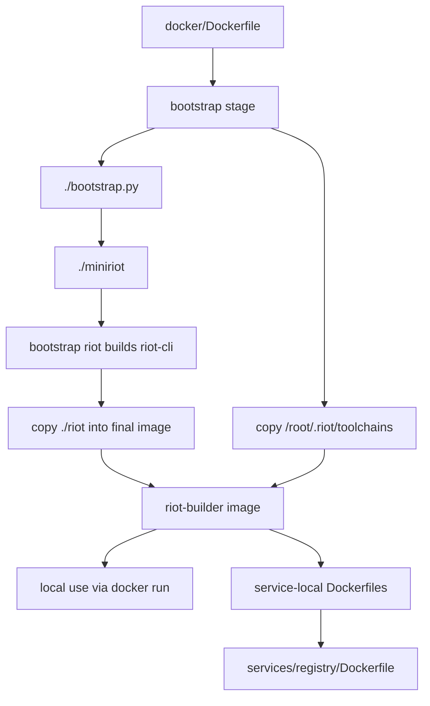

# RFD0021 - Docker Stack Snapshot

- Feature Name: `docker_stack_snapshot`
- Start Date: `2026-03-27`
- Status: `implemented`

## Summary
[summary]: #summary

This RFD documents Riot's current Docker stack as it exists today.
It covers the local builder-image flow under `docker/`, the current
`riot-builder` image contract, the surrounding documentation, the disabled
GitHub publishing workflows, and the resulting gap between what contributors
are told and what the repository actually automates.

The goal is not to redesign container support yet.
The goal is to create a precise baseline for future work on image publishing,
service packaging, CI integration, and cross-platform container builds.

## Motivation
[motivation]: #motivation

Riot now has enough Docker surface area that contributors need a clear answer to
basic operational questions:

- What is the official builder image?
- How is that image supposed to be built?
- Is `ghcr.io/leostera/riot/riot-builder:latest` actually current?
- Which parts of Docker support are real today, and which parts are aspirational
  documentation?
- How should service-local Dockerfiles, like `services/registry/Dockerfile`,
  relate to the shared builder image?

At the moment, the answers are spread across:

- `docker/Dockerfile`
- `docker/build.sh`
- `docker/README.md`
- `docker/QUICKSTART.md`
- `docker/example-app/*`
- `.github/workflows/*.disabled`
- several snapshot RFDs that mention Docker only in passing

That fragmentation has already produced drift.
The docs currently describe automatic GHCR publishing on every push to `main`,
but the only Docker publishing workflow in the repo is disabled.

This RFD exists to state the current reality in one place so future work can
start from an accurate baseline instead of stale assumptions.

## Guide-level explanation
[guide-level-explanation]: #guide-level-explanation

Today, Riot's Docker stack has three layers:

1. a local builder-image definition in `docker/Dockerfile`
2. a local helper script in `docker/build.sh`
3. documentation that assumes a published GHCR image exists and is fresh

There is also a fourth, emerging layer:

4. service-local Dockerfiles, such as `services/registry/Dockerfile`, that use
   `ghcr.io/leostera/riot/riot-builder:latest` as their build stage

### Contributor mental model

The current mental model should be:

- Riot does have a usable Docker builder image definition.
- Contributors can build that image locally from this repository.
- Service and application Dockerfiles can use that builder image pattern.
- The repository does not currently guarantee that the published GHCR image is
  up to date with `main`.
- Any workflow that depends on `ghcr.io/leostera/riot/riot-builder:latest`
  implicitly depends on out-of-band manual publication or stale cached state.

### End-to-end flow today



### What works today

- Building `riot-builder` locally from the repo root with `./docker/build.sh`
- Using `docker/Dockerfile` directly with `docker build -f docker/Dockerfile .`
- Running `riot` inside the resulting image
- Building Riot packages and binaries inside that image
- Writing service-local multi-stage Dockerfiles that consume `riot-builder`

### What does not exist as an active automated system

- an enabled GitHub Actions workflow that rebuilds and pushes `riot-builder`
- an enabled CI workflow that validates Docker docs against the actual image
- an enabled release flow for Docker images
- an active contract that `ghcr.io/leostera/riot/riot-builder:latest` tracks
  current `main`

## Reference-level explanation
[reference-level-explanation]: #reference-level-explanation

## 1. Directory layout

The current Docker-specific files in the repository are:

```text
docker/Dockerfile
docker/build.sh
docker/README.md
docker/QUICKSTART.md
docker/example-app/Dockerfile
docker/example-app/README.md
services/registry/Dockerfile
```

The workflow files that mention container publishing are all currently disabled:

```text
.github/workflows/ci.yml.disabled
.github/workflows/docker-build.yml.disabled
.github/workflows/ocaml-publish-toolchains.yml.disabled
.github/workflows/release.yml.disabled
```

## 2. Builder image definition

The canonical image definition is `docker/Dockerfile`.

It is a two-stage build:

### 2.1 Bootstrap stage

The `bootstrap` stage:

- starts from `ubuntu:24.04`
- installs:
  - `curl`
  - `git`
  - `build-essential`
  - `python3`
  - `python3-pip`
  - `libssl-dev`
  - `uuid-dev`
  - `libzstd-dev`
- copies the repository to `/riot`
- runs:
  - `./bootstrap.py`
  - `./miniriot`
  - `./_build/bootstrap/out/Riot_cli/riot build --no-code-server riot-cli`
  - `./_build/bootstrap/out/Riot_cli/riot install riot`

The result is a bootstrapped `riot` binary plus a populated
`/root/.riot/toolchains` directory inside the image.

### 2.2 Final builder stage

The `builder` stage:

- starts again from `ubuntu:24.04`
- installs build dependencies and GNU cross toolchains:
  - host build essentials
  - `gcc-aarch64-linux-gnu`
  - `g++-aarch64-linux-gnu`
  - `gcc-x86-64-linux-gnu`
  - `g++-x86-64-linux-gnu`
  - corresponding libc dev packages
- copies `/riot/riot` from the bootstrap stage into `/usr/local/bin/riot`
- copies `/root/.riot/toolchains` from the bootstrap stage into the final image
- sets `WORKDIR /app`
- uses `ENTRYPOINT ["riot"]`

This means the final image is not a minimal runtime image.
It is a pre-seeded build container whose job is to compile Riot workspaces.

## 3. Local build helper

The active local helpers for image construction and publication are:

- `docker/build.sh`
- `docker/publish.sh`

`docker/build.sh`:

- assumes it is run from the repo root
- defaults to:
  - `IMAGE_NAME=riot-builder`
  - `IMAGE_TAG=latest`
  - `DOCKERFILE=docker/Dockerfile`
- supports `--platform`, `--name`, and `--tag`
- shells out to plain `docker build`

`docker/publish.sh`:

- builds the image locally through `docker/build.sh`
- smoke-tests the resulting image
- tags the image for GHCR as `latest` and `sha-<git-short-sha>`
- optionally pushes those tags

The current helpers still do not:

- attach OCI metadata
- use `docker buildx`
- build multi-arch manifests
- publish branch tags automatically

Only `docker/publish.sh` performs post-build smoke tests.

So the current local tooling is enough for manual publication, but it is still
not a full automated publishing pipeline.

## 4. Docker context behavior

`.dockerignore` excludes:

- `_build/`
- `.riot/`
- `.git/`
- `miniriot`
- `riot`
- `docs/`
- `docker/`
- many compiled artifacts and editor files

This has two important effects:

1. the builder image always bootstraps from source instead of reusing the
   caller's local `_build` or installed toolchains
2. Git metadata and local Docker helper files are not copied into the build
   context payload itself, even though `docker/Dockerfile` is still used as the
   build file

That keeps the image build cleaner and more reproducible, but it also means the
Docker docs themselves are not exercised by the image build.

## 5. Consumer-facing builder image contract

The user-facing contract presented by the docs is:

- pull `ghcr.io/leostera/riot/riot-builder:latest`
- mount a Riot workspace at `/app`
- run `riot build ...`, `riot test ...`, or `riot bench ...`
- use a multi-stage Dockerfile for application/service packaging

This contract is reflected in:

- `docker/README.md`
- `docker/QUICKSTART.md`
- `docker/example-app/Dockerfile`
- `docker/example-app/README.md`
- `services/registry/Dockerfile`

That contract is reasonable as an interface.
The gap is not the interface itself.
The gap is that the repository does not currently automate freshness of the
published image behind that interface.

## 6. Documentation drift

The current docs claim:

- images are automatically built and published to GHCR on every push to `main`
- tags like `latest`, `main`, and `sha-<commit>` exist and are maintained
- the relevant CI/CD path lives in `.github/workflows/docker-build.yml`

In the repository state audited for this RFD, none of that is currently active.

The only Docker build workflow is:

- `.github/workflows/docker-build.yml.disabled`

and every other related workflow in `.github/workflows/` is also disabled.

So the current documentation overstates the amount of automation in place.

## 7. Service-local Dockerfiles

`services/registry/Dockerfile` demonstrates the current intended composition
pattern:

1. use `ghcr.io/leostera/riot/riot-builder:latest` as a build stage
2. run `riot build --release registry`
3. copy the resulting binary into a smaller runtime image

That pattern is structurally sound and matches the general guidance in
`docker/example-app/Dockerfile`.

However, because the shared builder image is not currently guaranteed to be
fresh, service-local Dockerfiles inherit that uncertainty unless contributors:

- build `riot-builder` locally first, or
- manually republish the image

## 8. Relationship to toolchain publication

The Docker builder image is adjacent to, but separate from, Riot's OCaml
toolchain publication story.

`docker/Dockerfile` copies `/root/.riot/toolchains` into the final image so the
builder starts warm.

That image-level warm cache is a consumer optimization.
It is not itself the source of truth for published OCaml toolchains.

The related OCaml publication workflow is also disabled:

- `.github/workflows/ocaml-publish-toolchains.yml.disabled`

So the broader container/toolchain publishing surface is currently in a
documented-but-disabled state across both concerns.

## Drawbacks
[drawbacks]: #drawbacks

The current Docker stack has a few concrete drawbacks:

- documentation claims more automation than the repo currently provides
- service Dockerfiles depend on a builder image whose freshness is not enforced
- contributors must know when to build locally vs trust GHCR
- there is no active container CI signal protecting the docs from drift
- image publication is not versioned as part of the normal `main` workflow

## Rationale and alternatives
[rationale-and-alternatives]: #rationale-and-alternatives

This RFD is intentionally a snapshot rather than a fix.

That is the right choice here because the immediate problem is not lack of
possible solutions.
The immediate problem is lack of an agreed description of current behavior.

The main alternatives would have been:

- silently re-enable the workflows first
- only fix the docs and skip the snapshot
- treat Docker support as purely local and stop documenting GHCR entirely

Those are all reasonable future actions, but they are easier to evaluate once
the present state is written down.

## Prior art
[prior-art]: #prior-art

The current Riot pattern is familiar from many language ecosystems:

- one shared "builder image" with the compiler and toolchain preinstalled
- multi-stage application Dockerfiles that copy only the final binary into a
  smaller runtime image
- optional CI workflows that publish the builder image to a registry

What is unusual in Riot's current state is not the architectural pattern.
What is unusual is the mismatch between the documented publishing story and the
disabled automation that is supposed to uphold it.

## Unresolved questions
[unresolved-questions]: #unresolved-questions

- Should Riot treat `riot-builder` as an actively published artifact again, or
  should local build-from-source become the only supported path for now?
- If publishing is restored, should the source of truth be `latest`, `main`,
  `sha-<commit>`, or some combination of those tags?
- Should service Dockerfiles pin a SHA-tagged builder image for reproducibility
  instead of using `latest`?
- Should container-image publication be coupled to `main` pushes, release tags,
  or a separate manual workflow?
- How much of the builder-image contract belongs in docs vs executable CI smoke
  tests?

## Future possibilities
[future-possibilities]: #future-possibilities

The natural extensions from the current state are:

- re-enable and modernize Docker publishing workflows
- add a smoke test that builds at least one service-local Dockerfile against the
  builder image produced from the same commit
- make `riot-builder` publication part of the normal `main` hygiene
- publish SHA-tagged images and teach service Dockerfiles to pin them
- split the current builder image into:
  - a stable build image
  - narrower runtime-image recipes per service
- document ownership of the Docker stack as explicitly as the rest of the build
  system

None of those future steps require changing the snapshot described here first.
They just require using this snapshot as the baseline when deciding what to
fix.
