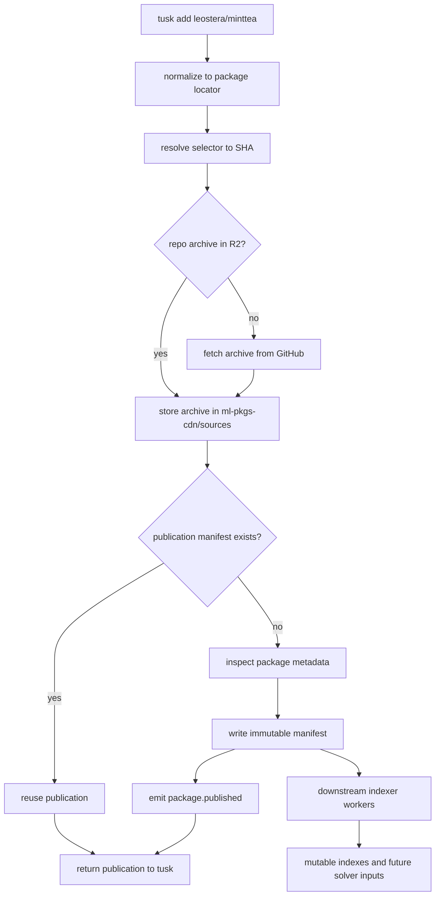

# RFD0022 - Riot Package Registry

- Feature Name: `riot_package_registry`
- Start Date: `2026-03-27`
- Status: `presented`
- RFD PR: [leostera/riot#0000](https://github.com/leostera/riot/pull/0000)
- Riot Issue: [leostera/riot#0000](https://github.com/leostera/riot/issues/0000)

## Summary
[summary]: #summary

This RFD proposes a new `services/registry` package that acts as Riot's
on-demand external package publication service.
It resolves a provider-backed package locator plus optional selector into a
concrete Git commit SHA, stores the corresponding source archive durably in
`ml-pkgs-cdn`, writes one immutable package publication manifest, logs every
request, and emits a `package.published` event on the first successful
publication.

The registry is intentionally narrow.
It is not responsible for package search, dependency solving, version
selection, lockfile generation, or a mutable global index.
Those concerns move downstream into workers that consume publication events and
materialize read-optimized indexes for `tusk`.

GitHub is the first supported upstream provider.
The external model stays provider-neutral so additional source providers can be
added later without redesigning the registry contract.

## Motivation
[motivation]: #motivation

`tusk` currently models workspace and path-based dependencies well, but it does
not yet have a durable external package story.
The new registry needs to satisfy four concrete constraints:

1. it must be cheap enough to run mostly at rest on Cloudflare Workers and only
   spend compute when packages are actively fetched
2. it must be durable enough that every fetch attempt is recorded and every
   successful publication survives upstream source deletion
3. it must be reliable enough that once Riot has published a package, Riot can
   continue serving it even if GitHub is unavailable later
4. it must be extensible enough that a successful publication can fan out into
   downstream systems such as build pipelines, documentation generation,
   compatibility testing, and future package indexes

There is a second design pressure here: avoid inventing too much protocol too
early.

It is tempting to make the registry own:

- package discovery
- dependency solving
- version compatibility decisions
- mutable package catalogs
- release policies

But all of those increase the hot-path surface area and entangle the registry
with client-specific state.
For example, "latest compatible" depends on the current workspace and lock
state, which the registry should not own.

The registry therefore needs a deliberately smaller responsibility:

- publish immutable source-backed package records
- make those records durable
- tell downstream systems that publication happened

That boundary keeps the protocol small, the caching story understandable, and
future indexers replaceable.

### Use cases this RFD addresses

- A user runs `tusk add leostera/minttea` and Riot resolves that shorthand to
  a GitHub-backed package, materializes the sources if needed, and returns a
  concrete immutable publication.
- A user fetches a semver-tagged package version and Riot keeps serving the
  published package even if that tag later moves upstream.
- A package lives in a repository subdirectory rather than the repo root, and
  Riot treats that subdirectory as the package boundary.
- A later request for the same package at the same resolved SHA reuses the
  stored archive and manifest without consulting GitHub again.
- Downstream systems consume a `package.published` event to build secondary
  indexes, docs, or compatibility reports without expanding the registry's
  responsibility.

## Guide-level explanation
[guide-level-explanation]: #guide-level-explanation

The registry should be understood in terms of four named concepts:

- `source URL`
  The canonical upstream package identity, such as
  `https://github.com/leostera/minttea`.
- `package locator`
  The normalized protocol key for a package, such as
  `github.com/leostera/minttea`.
  A locator may point at the repo root or at a package subdirectory inside a
  repo.
- `selector`
  The user-facing ref that Riot is asked to resolve, such as `main`,
  `0.4.2`, or a commit SHA.
- `publication`
  The immutable record produced after Riot resolves a selector to a concrete
  SHA, stores the source archive, inspects the package metadata, and writes a
  manifest for that package at that SHA.

### Contributor model

Contributors should think about `services/registry` as a publication service,
not as a package manager.

The registry accepts:

- a package locator
- an optional selector

and returns:

- a resolved SHA
- a durable source archive
- a durable publication manifest

Once a publication exists, Riot should be able to serve it from object storage
alone.
The registry should not need to refresh it from GitHub.

Downstream systems may later build mutable views such as:

- "all published versions of package X"
- "latest compatible version of package X"
- "all packages depending on package Y"

But those are not registry responsibilities.

### Example: `tusk add leostera/minttea`

Assume:

- `leostera/minttea` is shorthand for
  `https://github.com/leostera/minttea`
- the package lives at the repository root
- no explicit selector is provided

The intended flow is:

1. `tusk` normalizes `leostera/minttea` into the canonical source URL and
   package locator `github.com/leostera/minttea`
2. `tusk` asks the registry to resolve that package with selector `main`
3. the registry resolves `main` to the current commit SHA on GitHub
4. the registry checks whether the repo archive for that SHA is already present
   in `ml-pkgs-cdn`
5. on a miss, the registry downloads the archive from GitHub and stores it in
   `ml-pkgs-cdn`
6. the registry checks whether the package publication manifest for that
   locator and SHA already exists
7. on a miss, the registry inspects the package files inside the archive,
   extracts package metadata, writes the immutable manifest, and emits one
   `package.published` event
8. the registry returns the publication data to `tusk`

If `main` later moves, a later `resolve` call may return a different SHA.
That is acceptable because `main` is a mutable selector.
The publication at the old SHA stays immutable and available.

### Example: package in a subdirectory

If the package is actually
`https://github.com/leostera/minttea/widgets/core`, then the package locator is
`github.com/leostera/minttea/widgets/core`.

The important distinction is:

- the source archive is repo-scoped
- the publication manifest is package-scoped

That means Riot may reuse one repo archive for multiple package publications in
different subdirectories of that repo.

### Example: repo root request without a package

If `https://github.com/leostera/minttea` does not contain a root `tusk.toml`,
then the repo root is not a valid install target.
The registry may still cache the repo archive in `sources/`, but it must not
write a package publication manifest for the root package locator and must not
emit `package.published`.

### Flow diagram



## Reference-level explanation
[reference-level-explanation]: #reference-level-explanation

## 1. Scope

`services/registry` owns:

- package locator normalization for supported providers
- selector resolution to concrete SHAs
- source archive caching
- package manifest creation
- request logging
- first-publication event emission

`services/registry` does not own:

- dependency solving
- lockfile semantics
- package search
- mutable package catalogs
- compatibility resolution
- documentation generation
- build execution

Those concerns are downstream consumers of publication events.

## 2. Identity model

### 2.1 Canonical source identity

The canonical package identity is the upstream source URL, for example:

```text
https://github.com/leostera/minttea
https://github.com/leostera/minttea/widgets/core
```

### 2.2 Protocol locator

The wire protocol should use a normalized package locator string instead of an
opaque numeric or random package id.
For GitHub, the normalized form is:

```text
github.com/<owner>/<repo>
github.com/<owner>/<repo>/<package-subdir>
```

This keeps URLs debuggable and avoids an extra lookup layer in the registry.

### 2.3 Package validity

A repo root is a valid package target only if a `tusk.toml` exists at the repo
root.
A subdirectory is a valid package target only if that subdirectory contains a
`tusk.toml`.

Discovery of package sets inside a repo is explicitly out of scope for this
RFD.

## 3. Selector semantics

### 3.1 Default selector

If no selector is provided, the registry resolves `main`.

### 3.2 Immutable selectors

The following selectors are treated as immutable publication inputs:

- full commit SHAs
- semver-like tags such as `0.4.2`

Once Riot has published such a selector to a concrete SHA, the resulting
publication is immutable forever.

### 3.3 Mutable selectors

Selectors such as:

- `main`
- branch names
- other non-semver refs

are resolved anew on each request.
They may produce different SHAs over time.

The registry does not store mutable selectors as canonical publication
identities.
It stores only the resulting SHA publication.

### 3.4 No selector rewriting

The registry should not normalize between `0.4.2` and `v0.4.2`.
Selectors stay transparent.
If a user asks for `0.4.2`, Riot looks for the tag `0.4.2`.

## 4. Minimal protocol surface

This RFD intentionally keeps the registry protocol small.
The minimal HTTP surface should look like:

```text
GET /package/<locator>/-/resolve?ref=<selector>
GET /package/<locator>/-/manifest/<sha>.json
GET /package/<locator>/-/source/<sha>.tar.gz
```

The `/-/` separator is intentional.
It keeps protocol operations separate from the package path itself.

The first endpoint is the only endpoint that may need to consult GitHub.
The manifest and source endpoints are publication reads and should be served
from stored objects.

The source endpoint may redirect to the underlying CDN object.

## 5. Storage layout

The object storage bucket is `ml-pkgs-cdn`.
This RFD uses `s3://` notation for clarity even though the bucket is expected to
be backed by Cloudflare R2.

The initial layout is:

```text
ml-pkgs-cdn/
  sources/
    github.com/
      <owner>/
        <repo>/
          <sha>.tar.gz

  packages/
    github.com/
      <owner>/
        <repo>/
          <package-subdir-if-any>/
            <sha>.manifest.json

  requests/
    YYYY/
      MM/
        DD/
          HH/
            <request-id>.json
```

Example:

```text
s3://ml-pkgs-cdn/sources/github.com/leostera/minttea/7f4c...a91.tar.gz
s3://ml-pkgs-cdn/packages/github.com/leostera/minttea/7f4c...a91.manifest.json
s3://ml-pkgs-cdn/requests/2026/03/27/12/01HV....json
```

If the package is in a subdirectory:

```text
s3://ml-pkgs-cdn/sources/github.com/leostera/minttea/7f4c...a91.tar.gz
s3://ml-pkgs-cdn/packages/github.com/leostera/minttea/widgets/core/7f4c...a91.manifest.json
```

## 6. Publication flow

For a `resolve` request:

1. normalize the incoming package reference to a canonical source URL and
   package locator
2. resolve the selector to a concrete SHA when needed
3. check whether the repo archive already exists under `sources/.../<sha>.tar.gz`
4. on a miss, fetch the archive from GitHub and store it
5. check whether the package manifest already exists under
   `packages/.../<sha>.manifest.json`
6. on a miss, inspect the package files and write the manifest
7. log the request outcome
8. emit `package.published` only if step 6 created a new publication
9. return the publication data to the caller

The archive fetch should prefer provider-native source archives first rather
than running Riot's own archive normalization pipeline in v1.

## 7. Package manifest

The package publication manifest is immutable and SHA-scoped.
At minimum it should contain:

- package locator
- canonical source URL
- package subdirectory, or `.`
- requested selector
- resolved SHA
- package name from `tusk.toml`
- package version from `tusk.toml`
- direct dependency list from `tusk.toml`
- source archive location
- publication timestamp

The manifest is the durable source-of-truth record for one package publication.

## 8. Request logging

Every request must be logged, including failures.

A request log entry should contain at least:

- request timestamp
- package locator
- requested selector
- resolved SHA if resolution succeeded
- success or failure
- error category if failed
- caller metadata if available, such as `tusk` version

This request log is append-only input for future statistics and auditing.

## 9. Event semantics

The registry emits one queue message with semantic type `package.published`
only on the first successful creation of a new immutable publication manifest.

Cache hits must not re-emit the event.
Failed requests must not emit the event.

The event payload should contain enough data for downstream workers to operate
without re-reading GitHub immediately, including:

- package locator
- canonical source URL
- package subdirectory
- requested selector
- resolved SHA
- package name
- package version
- direct dependencies
- source archive location
- manifest location

## 10. Downstream indexing boundary

This RFD intentionally stops at publication.

Downstream workers may consume `package.published` and produce:

- mutable per-package version indexes
- dependency indexes
- reverse dependency views
- search catalogs
- docs and build jobs
- future compatibility reports

`tusk` should eventually consume those derived indexes and perform dependency
resolution locally.
The registry itself remains a publication service rather than a solver.

## 11. Availability model

If GitHub is unavailable but Riot has already stored the archive and manifest
for a publication, Riot should continue serving that publication successfully.

The registry does not refresh existing publications from GitHub.
Publication is append-only.

Private upstreams may be supported when the registry is configured with a
GitHub token that can read them. Whether those publications are served
publicly remains an operator policy decision outside the registry contract.

## Drawbacks
[drawbacks]: #drawbacks

This design intentionally avoids features that users may expect from a
full package registry:

- no built-in search
- no built-in discovery
- no built-in version solving
- no built-in mutable package catalog

That means a second system is required to build indexes for dependency
resolution and user-facing browsing.

The SHA-scoped publication model also means mutable refs such as `main` do not
have a stable artifact identity of their own.
Clients must understand that mutable selectors resolve to publications rather
than naming publications directly.

## Rationale and alternatives
[rationale-and-alternatives]: #rationale-and-alternatives

### Why keep the registry dumb?

Because the hot path should do the minimum amount of work necessary to turn an
upstream source reference into a durable immutable Riot publication.

This keeps:

- the protocol small
- CDN behavior straightforward
- storage append-only
- future indexers replaceable

### Why not make the registry solve dependencies?

Dependency solving depends on local workspace state and future lockfile
semantics.
Putting that logic in the registry would make the server responsible for hidden
client-specific context and would force the protocol to grow around it.

### Why not use opaque package ids?

An opaque package id would add an extra lookup layer and make debugging object
storage and HTTP paths harder.
The normalized package locator is readable and already stable enough for v1.

### Why not implement the full Go module proxy protocol?

The Go protocol is intentionally small and that is worth learning from, but
Riot's package identity model differs in an important way:

- Go packages are primarily identified by import paths
- Riot packages are identified by source URLs plus optional subdirectories

Riot should borrow Go proxy ideas about immutability and small protocol
surfaces, not copy the exact protocol wholesale.

### Why not make a global mutable index part of the registry?

That would reintroduce coordination, invalidation, and write-amplification
problems into the publication service.
The event-driven indexer boundary keeps those concerns out of the registry.

## Prior art
[prior-art]: #prior-art

### Go module proxies

Go's module proxy protocol is intentionally small.
That small surface is a major reason it caches well and is easy to mirror.
Riot should adopt that instinct for protocol minimalism, even though Riot's
package identity model differs.

### `goproxy`

The vendored `3rdparty/goproxy` implementation shows a very small proxy that:

- separates mutable queries from immutable downloads
- caches artifacts before doing network work when possible
- uses atomic temp-file-then-rename cache writes

### Athens

The vendored `3rdparty/athens` implementation shows a production-oriented Go
proxy that layers:

- a download protocol
- a stasher that fetches and saves upstream results
- singleflight request collapse
- configurable offline, strict, fallback, redirect, and async behaviors

Athens is especially useful as a reminder that publication and indexing are
better treated as separate concerns.

### crates.io and Hex.pm

Both registries separate immutable artifact serving from richer metadata and
administrative APIs.
That separation reinforces the core direction of this RFD: keep the package
read path simple and durable, and move richer behaviors out of the publication
service.

## Unresolved questions
[unresolved-questions]: #unresolved-questions

- What exact dependency schema should the publication manifest use once Riot
  needs source-explicit dependency identities for downstream solving?
- Should semver-tagged selector aliases also be duplicated into object storage
  as convenience keys, or should the registry only store the canonical SHA
  objects?
- What exact response schema should `/resolve` use?
- How should future repo discovery surface package sets while keeping install
  targets package-specific?
- Should Riot support additional provider-specific archive normalization rules
  beyond provider-native archive downloads?

## Future possibilities
[future-possibilities]: #future-possibilities

This publication layer is designed to support future systems without needing to
change its core boundary.

Natural follow-on work includes:

- additional source providers beyond GitHub
- a queue-driven package indexer that builds mutable solver indexes
- package discovery endpoints backed by derived indexes
- automated build, documentation, and compatibility jobs driven by
  `package.published`
- prebuilt package artifacts derived from source publications
- transparency or checksum layers over Riot-managed publications

The key constraint should remain: those future systems consume publications,
but they do not turn the registry itself into a general-purpose package
manager.
