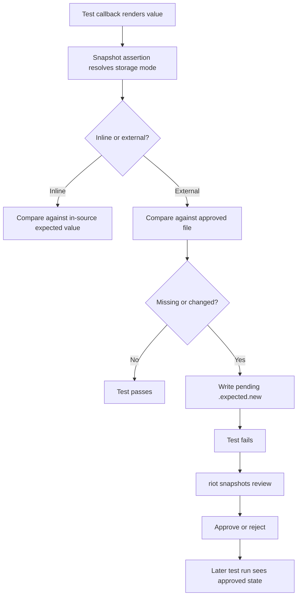

# RFD0025 - Snapshot Testing for Riot

- Feature Name: `snapshot_testing_for_riot`
- Start Date: `2026-03-29`
- Status: `presented`
- RFD PR: [leostera/riot#0000](https://github.com/leostera/riot/pull/0000)
- Riot Issue: [leostera/riot#0000](https://github.com/leostera/riot/issues/0000)

## Summary
[summary]: #summary

This RFD proposes first-class snapshot testing for `Std.Test`, plus a shared
fixture-runner helper and a dedicated `riot snapshots` review workflow.

The design has four core ideas:

- snapshot assertions should compare rendered values rather than force
  contributors to hand-write deep structural assertions
- external snapshots should be approval-driven: a new or changed value produces
  a pending candidate and fails until a contributor explicitly approves it
- inline expectations should remain available for very small outputs, but they
  are not part of the review workflow
- fixture-driven test suites should compose with the same snapshot API instead
  of reimplementing ad hoc `.expected` harnesses per package

This RFD assumes a context-aware `Std.Test` runner. A per-test `ctx` object is
available inside each test callback and provides enough stable identity to
derive snapshot paths and diagnostics.

That prerequisite now exists in `Std.Test`. Snapshot testing is no longer a
pure design exercise: the shared `ctx`, `Std.Test.Snapshot`,
`Std.Test.FixtureRunner`, and `riot snapshots` command family are all real.
The remaining work is primarily broader package migration, review ergonomics,
and policy cleanup.

## Motivation
[motivation]: #motivation

Riot already uses expectation-style testing in several places, but the
behavior is package-specific instead of part of the shared test system.

Before this work:

- `syn` maintained custom fixture runners and adjacent expected outputs
- `krasny` used a Python fixture harness over `.expected` files
- `riot-fix` aggregated JSON output into stored fixture expectations
- many ordinary tests still rely on hand-written assertions even when they are
  checking large rendered values, trees, or diagnostics

This creates three problems.

### 1. Structural assertions are the wrong tool for large rendered values

Some test subjects are naturally easier to review as text than as imperative
assertion code:

- parse trees
- diagnostics
- formatter output
- generated files
- lowered IR
- protocol payloads

For those cases, the most useful test is usually:

1. render the value into a stable textual representation
2. compare it against an approved reference
3. show a readable diff when it changes

Without a shared snapshot primitive, contributors either:

- write brittle deep assertions
- invent one-off helpers
- create package-local fixture harnesses that drift apart over time

### 2. Riot already wants reviewable expectations, but has no shared review model

The repo already uses `.expected` files because contributors want reviewed
artifacts rather than silent golden-file overwrites.

The missing shared behavior is:

- where approved snapshots live
- where pending candidates live
- what first-run behavior is
- how approval and rejection happen
- how fixture tests and non-fixture tests fit the same model

Without that shared contract, every package has to answer the same policy
questions independently.

### 3. Fixture runners should be a harness feature, not a recurring custom script

Fixture testing is common enough in Riot to deserve a reusable abstraction.

The pattern is consistent:

1. discover input files from a directory
2. turn each input into a test case
3. run package-specific logic on the fixture
4. snapshot the rendered result

That is exactly the kind of thing `Std.Test` should make easy.

### Use cases this RFD addresses

- A parser test renders a CST or diagnostic payload as JSON and snapshots it.
- A formatter test runs over `tests/fixtures/*.ml` and stores the approved
  output next to each fixture.
- A small string transformation test keeps its expectation inline in source
  because a separate file would be noise.
- A contributor changes formatter behavior, runs `riot test`, sees pending
  snapshot candidates, and then reviews them with `riot snapshots review`.

## Guide-level explanation
[guide-level-explanation]: #guide-level-explanation

Contributors should think about snapshot testing as "asserting a rendered
representation of a value".

That rendered representation might be:

- plain text
- canonical JSON
- a custom pretty-printer output

### Two snapshot styles

Riot snapshot assertions come in two styles:

- external snapshots
- inline expectations

External snapshots are file-backed and reviewable.
Inline expectations are source-backed and self-contained.

### External snapshots

An external snapshot assertion renders a value, compares it to the approved
snapshot on disk, and fails if the snapshot is missing or changed.

On failure, the runner writes a pending candidate and asks the contributor to
review it later.

Example:

```ocaml
open Std
module Test = Std.Test

let test_parse_tree ctx =
  let actual = Parser.parse "let x = 1" |> Ast.to_json in
  Test.Snapshot.assert_json ~ctx ~actual

let tests = [
  Test.case "parse tree for let binding" test_parse_tree;
]
```

If no approved snapshot exists yet, the test fails and writes a pending
candidate. The contributor then reviews it with:

```sh
riot snapshots review
```

### Inline expectations

Inline expectations keep the approved value inside the test source.

Example:

```ocaml
open Std
module Test = Std.Test

let test_case_conversion ctx =
  let actual = "snake_case -> snakeCase -> SnakeCase" in
  Test.Snapshot.assert_inline_text
    ~ctx
    ~actual
    ~expected:"snake_case -> snakeCase -> SnakeCase"

let tests = [
  Test.case "snake to camel to class" test_case_conversion;
]
```

Inline expectations do not create pending files and are not managed by
`riot snapshots`.
They are intended for very small values where a separate artifact would make
the test harder to read.

### Fixture runners

Fixture-driven tests should feel like ordinary tests that happen to carry
fixture metadata.

Example:

```ocaml
open Std
module Test = Std.Test

let run_fixture ctx =
  let actual = Formatter.format_file ctx.fixture_path in
  Test.Snapshot.assert_text ~ctx:ctx.test ~actual

let tests =
  Test.FixtureRunner.cases
    ()
    ~dir:(Path.v "./fixtures")
    ~run:run_fixture

let () =
  Actors.run ~main:(Test.Cli.main ~name:"formatting tests" ~tests) ~args:Env.args ()
```

The fixture runner:

- discovers fixture inputs
- creates one `Test.case` per fixture
- gives the callback both test metadata and fixture metadata
- lets the snapshot system decide where approved and pending files live

### First-run and update workflow

For external snapshots, Riot should prefer reviewed updates over automatic
approval.

The workflow is:

1. run `riot test`
2. failing snapshot assertions write pending candidates
3. inspect the diff with `riot snapshots review`
4. approve, reject, ignore, or quit review
5. rerun tests

The first run of a new snapshot test therefore fails by design.

### Diagram



## Reference-level explanation
[reference-level-explanation]: #reference-level-explanation

## 1. Package boundary

The proposal spans three owned surfaces:

- `packages/std/src/test/`
  Owns snapshot assertions, fixture-runner helpers, and the case-level runtime
  contract.
- `packages/riot-cli/`
  Owns repository-level review commands under `riot snapshots`.
- package test suites
  Own rendering logic for domain values and decide whether a given assertion is
  better expressed as external or inline.

This RFD does not make `riot test` itself responsible for snapshot semantics
beyond running suites normally. `riot test` should keep owning suite discovery,
build, and execution.

## 2. Assumed per-test context

Every test callback receives a `ctx` object with stable identity for the
currently running test.

The current `Std.Test.ctx` shape is:

```ocaml
type ctx = {
  suite_name: string;
  test_name: string;
  test_index: int;
  source_file: Path.t option;
  binary_path: Path.t option;
  workspace_root: Path.t option;
  package_name: string option;
  fixture: Test_context.fixture option;
}
```

Fixture-backed tests additionally use:

```ocaml
type Test.Context.fixture = {
  path: Path.t;
  relpath: Path.t;
  name: string;
  snapshot_path: Path.t option;
}
```

Snapshot identity is derived from this context rather than from hidden global
state or best-effort source inspection.

## 3. Snapshot assertion API

A first-pass `Std.Test.Snapshot` surface should expose a very small set of
primitives:

```ocaml
module Std.Test.Snapshot : sig
  val assert_text :
    ctx:Std.Test.ctx ->
    actual:string ->
    (unit, string) result

  val assert_json :
    ctx:Std.Test.ctx ->
    actual:Std.Data.Json.t ->
    (unit, string) result

  val assert_with :
    ctx:Std.Test.ctx ->
    render:('a -> string) ->
    actual:'a ->
    (unit, string) result

  val assert_inline_text :
    ctx:Std.Test.ctx ->
    actual:string ->
    expected:string ->
    (unit, string) result
end
```

Notes:

- `assert_text` uses external snapshot storage.
- `assert_json` uses external snapshot storage and pretty-prints canonical JSON
  before comparison.
- `assert_with` allows custom serializers without turning every package into
  its own snapshot harness.
- `assert_inline_text` compares against source-embedded expected text and does
  not participate in `riot snapshots`.

In v1, a test may perform at most one snapshot assertion of any kind.
That keeps snapshot identity simple and avoids assertion-name machinery in the
first iteration.

## 4. Opaqueness and normalization

Snapshot contents are text on disk, but the snapshot system should not impose a
global normalization policy.

The rules are:

- `assert_text` treats output as opaque text
- `assert_json` may canonicalize object field ordering
- `assert_with` leaves normalization entirely to the provided renderer

The default system should not strip semantically meaningful whitespace,
timestamps, or paths.
If a domain needs custom cleanup or redaction, it should do that in its render
function explicitly.

This keeps the base model small and avoids a global "magic normalization"
surface that contributors cannot reason about.

## 5. External snapshot storage

External snapshots have two possible files:

- approved: `<base>.expected`
- pending: `<base>.expected.new`

The approved file is the current source of truth.
The pending file is a candidate produced by a failing test run and awaiting
review.

### 5.1 Fixture-backed snapshots

Fixture-backed tests store snapshots adjacent to the fixture input.

For example:

- fixture:
  `packages/krasny/tests/fixtures/0100_atoms_and_basic_expressions.ml`
- approved:
  `packages/krasny/tests/fixtures/0100_atoms_and_basic_expressions.expected`
- pending:
  `packages/krasny/tests/fixtures/0100_atoms_and_basic_expressions.expected.new`

This matches the current repository convention around adjacent `.expected`
artifacts and keeps fixture inputs and approved outputs together.
Approved fixture `.expected` files are intended to be version controlled.

### 5.2 Non-fixture snapshots

Tests that are not fixture-backed store approved snapshots under:

```text
.riot/snapshots/
```

The recommended layout is:

```text
.riot/snapshots/<package>/<suite>/<test>.expected
```

with the pending candidate at:

```text
.riot/snapshots/<package>/<suite>/<test>.expected.new
```

Example:

```text
.riot/snapshots/std/std_test_cli_tests/list-tests-lists-all-sample-cases.expected
```

This gives ordinary tests a stable artifact home without requiring every
package to invent its own storage convention.

Approved snapshots under `.riot/snapshots/` are intended to be version
controlled.
Pending `.expected.new` files are working-tree artifacts and should not be
committed, whether they live next to fixtures or under `.riot/snapshots/`.

## 6. External snapshot execution behavior

When an external snapshot assertion runs, it:

1. renders the actual value to text
2. resolves the approved and pending paths from `ctx`
3. compares the rendered value to the approved file, if present

The assertion then behaves as follows:

1. if the approved file exists and matches, the assertion passes
2. if the approved file is missing, the assertion writes a pending candidate
   and fails
3. if the approved file exists but differs, the assertion writes a pending
   candidate and fails

Ordinary test execution never mutates the approved file.
Only the pending file may be created or replaced.

If a pending file already exists, rerunning the test does not make the test
pass. The presence of a pending file is evidence of unreviewed state, not
approved state.

## 7. Review workflow

Snapshot review lives under:

```text
riot snapshots <subcommand>
```

The initial command set should be:

- `riot snapshots review`
- `riot snapshots approve`
- `riot snapshots reject`

`review` should discover pending files, show a diff between approved and
pending state, and let the contributor inspect each change.

The current implementation supports:

- optional substring filtering via `riot snapshots review <query>`
- line-oriented interactive review in TTY sessions:
  - `a` / approve
  - `r` / reject
  - `i` / ignore
  - `q` / quit

`approve` should promote pending files to approved files.

`reject` should delete pending files without changing approved state.

This command family only operates on external snapshots.
Inline expectations are not reviewable artifacts.

## 8. Fixture runner helper

`Std.Test` should provide a shared helper for turning fixture directories into
ordinary test cases.

The current surface is:

```ocaml
module Std.Test.FixtureRunner : sig
  type ctx = {
    test : Std.Test.ctx;
    fixture_path : Std.Path.t;
    fixture_relpath : Std.Path.t;
    fixture_name : string;
  }

  val cases :
    ?filter:(Std.Path.t -> [ `keep | `skip ]) ->
    ?snapshot_path:(Std.Path.t -> Std.Path.t option) ->
    unit ->
    dir:Std.Path.t ->
    run:(ctx -> (unit, string) result) ->
    Std.Test.test_case list
end
```

This keeps the abstraction small:

- discovery lives in one shared helper
- execution stays inside ordinary `Std.Test` cases
- snapshot identity comes from the same `ctx` model as non-fixture tests

Packages such as `krasny`, `syn`, and future formatter or codegen suites can
then share one fixture pattern instead of maintaining custom test runners.

## 9. Inline expectations

Inline expectations are intentionally simpler than external snapshots.

They:

- do not create `.expected` files
- do not create `.expected.new` files
- do not participate in `riot snapshots`
- fail immediately on mismatch with a useful diff

They are appropriate when:

- the expected value is small
- keeping the expectation close to the test improves readability
- a separate artifact would make review harder rather than easier

They are not intended to replace external snapshots for large outputs, fixture
corpora, or frequently changing renderings.

## 10. Diffing and failure output

Snapshot assertion failures should show:

- the resolved snapshot path for external snapshots
- whether the failure is "missing approved snapshot" or "snapshot mismatch"
- a readable text diff between approved and actual output

The exact diff engine is not fixed by this RFD.
A simple unified diff is sufficient for v1.
A future implementation may integrate a shared `Std.Diff` helper.

## Implementation
[implementation]: #implementation

This section describes a concrete implementation plan in small slices.
The intent is to make rollout incremental and to keep each slice narrow enough
to validate independently.

The recommended order is:

1. land the minimum `Std.Test` snapshot core
2. land file-backed external snapshots
3. land inline expectations
4. land `FixtureRunner`
5. land `riot snapshots`
6. migrate one or two real packages

The design does not require all current package-local expectation harnesses to
be rewritten in one change.

### Current implementation status

Implemented:

- context-aware `Std.Test` callbacks
- `Std.Test.Snapshot.assert_text`
- `Std.Test.Snapshot.assert_json`
- `Std.Test.Snapshot.assert_with`
- `Std.Test.Snapshot.assert_inline_text`
- `Std.Test.FixtureRunner.cases`
- `riot snapshots review|approve|reject`
- interactive `riot snapshots review` in TTY sessions
- native snapshot-backed suites in `syn`, `krasny`, `riot-fix`, and `riot-cli`

Still open:

- richer snapshot diff rendering
- repository policy for `.expected.new` files
- possible inline JSON assertions
- deleting or repurposing the remaining non-fixture legacy helper scripts

### Slice 0: prerequisite `Std.Test` context

This prerequisite is done and merged into `Std.Test`.

Likely touch points:

- `packages/std/src/test/test_case.ml`
- `packages/std/src/test/test_case.mli`
- `packages/std/src/test/test.ml`
- `packages/std/src/test/test.mli`
- `packages/std/src/test/runner.ml`
- `packages/std/src/test/cli.ml`
- `packages/std/src/std.ml`
- `packages/std/src/std.mli`

Expected outcome:

- `Test.case` receives a callback with a `ctx`
- the runner constructs one `ctx` per test case execution
- `ctx` exposes enough stable metadata for snapshot path derivation

Validation:

- update and run `packages/std/tests/std_test_cli_tests.ml`
- add one small unit test that confirms `ctx.test_name` or similar metadata is
  populated correctly

### Slice 1: introduce snapshot module skeleton

Add a new `Std.Test.Snapshot` module with no review CLI yet.
Start with path resolution, file I/O helpers, and result formatting.

Likely new files:

- `packages/std/src/test/snapshot.ml`
- `packages/std/src/test/snapshot.mli`

Likely touched files:

- `packages/std/src/test/test.ml`
- `packages/std/src/test/test.mli`
- `packages/std/src/std.ml`
- `packages/std/src/std.mli`

The first version should implement internal helpers for:

- deriving snapshot paths from `ctx`
- checking whether the current test is fixture-backed or not
- reading approved files
- writing pending files
- rendering a simple unified diff

This slice does not need public JSON helpers yet.
It just establishes the storage/runtime boundary cleanly.

Validation:

- add unit tests under `packages/std/tests/` for path derivation
- add unit tests for approved-vs-pending file behavior in a temp directory

### Slice 2: implement external text snapshots

Once the skeleton exists, land:

- `Snapshot.assert_text`
- `Snapshot.assert_with`

These are the main policy-bearing assertions:

- match approved `.expected` and pass
- missing approved file writes `.expected.new` and fails
- changed approved file writes `.expected.new` and fails
- reruns keep failing until approval happens

Implementation notes:

- use the current test `ctx` to derive snapshot identity
- keep approved file writes out of normal test execution
- keep the failure message stable and explicit about file paths

Validation:

- add focused `Std.Test` snapshot tests under `packages/std/tests/`
- cover fixture-backed and non-fixture-backed path resolution
- verify that `.expected.new` is replaced on repeated failures

### Slice 3: implement external JSON snapshots

Add:

- `Snapshot.assert_json`

Implementation notes:

- serialize through `Std.Data.Json`
- sort object fields recursively before writing
- do not normalize anything beyond JSON structural canonicalization

This should be implemented as a thin helper on top of `assert_text`, not as a
separate storage engine.

Validation:

- add tests proving key-order-insensitive comparisons
- add tests proving arrays and scalar formatting remain stable

### Slice 4: implement inline expectations

Add:

- `Snapshot.assert_inline_text`

This slice is intentionally much smaller than external snapshots.
It only needs:

- direct compare against in-source expected text
- readable diff on failure
- no file writes
- no `riot snapshots` integration

Implementation notes:

- share the same diff renderer as external snapshots where possible
- keep the failure shape visually similar to external mismatch failures

Validation:

- add unit tests for passing and failing inline expectations
- add at least one multiline inline expectation case

### Slice 5: implement `FixtureRunner`

Add:

- `Std.Test.FixtureRunner.cases`

Likely new files:

- `packages/std/src/test/fixture_runner.ml`
- `packages/std/src/test/fixture_runner.mli`

Likely touched files:

- `packages/std/src/test/test.ml`
- `packages/std/src/test/test.mli`
- `packages/std/src/std.ml`
- `packages/std/src/std.mli`

The helper should:

- discover fixtures from a directory
- construct a stable fixture-relative identity
- produce ordinary `Test.case` values
- extend base test `ctx` with fixture metadata

Implementation notes:

- keep discovery rules deliberately simple in v1
- prefer deterministic path ordering
- do not build package-specific fixture naming policy into the helper

Validation:

- add unit tests for deterministic discovery order
- add a small sample fixture suite in `packages/std/tests/` using snapshots

### Slice 6: add `riot snapshots` command family

Introduce a new top-level command family in `riot-cli`:

- `riot snapshots review`
- `riot snapshots approve`
- `riot snapshots reject`

Likely new files:

- `packages/riot-cli/src/snapshots_cmd.ml`
- `packages/riot-cli/src/snapshots_cmd.mli`

Likely touched files:

- `packages/riot-cli/src/cli.ml`
- `packages/riot-cli/src/shell_completions/shell_completions.ml`
- `packages/riot-cli/README.md`
- `packages/riot-cli/AGENTS.md` if command behavior/contracts change

The first implementation does not need a TUI.
A line-oriented review flow is sufficient, and is what Riot currently ships.

Implementation notes:

- discover pending files by scanning known snapshot roots
- for `review`, print the approved path, pending path, and a diff
- for `approve`, promote `.expected.new` to `.expected`
- for `reject`, delete `.expected.new`
- ignore inline expectations entirely

Validation:

- add `riot-cli` unit tests for path scanning and promotion behavior
- add at least one integration-style test over a temp snapshot tree

### Slice 7: decide pending-file ignore policy

This slice is small but important because it affects daily repo ergonomics.

Likely touch points:

- repo `.gitignore`
- package-local fixture directories if they need explicit ignore rules
- contributor docs

The intended policy from this RFD is:

- approved `.expected` files are committed
- pending `.expected.new` files are not committed

Implementation notes:

- decide whether to ignore `*.expected.new` globally or keep them visible as
  untracked review artifacts
- make the policy explicit in contributor docs once chosen

### Slice 8: pilot migrations

This slice is done.

The initial pilot set proved out both non-fixture and fixture-backed usage, and
the migration then widened into package-owned suites:

- `packages/std/tests/` for direct snapshot assertions
- `packages/krasny/tests/` for fixture-backed formatter snapshots
- `packages/syn/tests/` for lossless, diagnostic, and CST fixture snapshots
- `packages/riot-fix/tests/` for aggregated JSON fixture snapshots

What the pilot answered:

- derived snapshot paths are readable enough to keep
- `FixtureRunner` is strong enough for adjacent-snapshot package suites
- interactive `riot snapshots review` is sufficient as a first review loop

Remaining follow-up is now about polish and cleanup, not viability.

### Slice 9: foundational `std` fix for context-aware test callbacks

This RFD treats package-owned rewrites in foundational packages as ordinary
evergreen fixes, not as a separate codemod feature.

That means the `Std.Test` callback migration should land as a `std` fix rule
that is loaded by normal `riot fix` execution.

Likely new files:

- `packages/std/fix/migrate_test_case_context.ml`
- `packages/std/fix/migrate_test_case_context.mli`

Likely touched files:

- `packages/std/fix/riot_fix_rules.ml`
- `packages/std/riot.toml`

The rule should only target callsites that are clearly owned by `Std.Test`.
The first implementation should support:

- `Test.case`, `Test.skip`, and `Test.property`
- `Std.Test.case`, `Std.Test.skip`, and `Std.Test.property`
- unqualified `case`, `skip`, and `property` only when the file locally
  establishes that they refer to `Std.Test`, for example through
  `open Std.Test`, `let open Std.Test`, or `module Test = Std.Test`

The rewrite policy should stay narrow and syntax-directed:

- `fun () -> body` rewrites to `fun _ctx -> body`
- `@@ fun () -> body` rewrites to `@@ fun _ctx -> body`
- bare callback expressions such as `test_case` rewrite to
  `fun _ctx -> test_case ()`
- ambiguous shapes may emit a diagnostic without an autofix

Implementation notes:

- use the typed CST and `Rule_query`/`Traversal`, not regexes
- flatten nested application nodes and normalize `@@` into the same logical
  "constructor plus callback" shape where practical
- prefer replacing only the unit parameter slice for lambda rewrites so body
  formatting and comments stay intact
- for bare callback expressions, wrap the original expression rather than
  rewriting helper definitions in the same pass

Because `std` is a foundational package, this rule can remain in the default
`std` provider until the old callback shape disappears from the repository.
At that point the fix may be deleted.

Validation:

- add focused `fixme` rule tests for lambda, `@@`, and helper-function forms
- add tests proving already-migrated callbacks remain unchanged
- add tests proving unrelated local functions named `case` are ignored
- run `riot fix --apply` on a representative subset of test packages and
  confirm the rewritten sources still typecheck

### Slice 10: broaden format helpers

After the core is proven, additional helpers become low-risk follow-ups:

- `assert_inline_json`
- binary snapshots
- redaction helpers
- custom diff engines
- named multiple snapshots per test

These should remain follow-up slices, not v1 blockers.

## Drawbacks
[drawbacks]: #drawbacks

- Snapshot tests make it easy to approve large changes without enough review.
- Approved artifacts increase repository churn and can create merge conflicts.
- A shared fixture-runner API adds test-system surface area that every package
  owner will now inherit.
- The one-snapshot-per-test rule keeps v1 simple but is constraining for some
  compound cases.
- `.riot/` becomes a repository-owned namespace that must stay coherent as more
  features want to use it.

## Rationale and alternatives
[rationale-and-alternatives]: #rationale-and-alternatives

### Why this design

This design is the best fit for Riot because it preserves the current split:

- `Std.Test` owns case-level assertions and helper APIs
- `riot-cli` owns repository-level orchestration and review commands
- packages own their renderers, not their own snapshot frameworks

It also matches how Riot already works in practice: contributors already use
`.expected` files and custom fixture harnesses because reviewable text artifacts
are the right tool for these problems.

### Why not TLA+ this first

The snapshot lifecycle itself is small and mostly policy-shaped:

- compare
- write pending candidate
- approve or reject later

The harder part is the API and workflow design, not the state machine.
An RFD is therefore more useful than a TLA+ spec for this feature.

### Why not keep per-package custom runners

That would preserve local freedom, but it would also preserve drift.

The current repo already has enough evidence that fixture expectations are a
shared need:

- parser outputs
- formatter outputs
- lint diagnostics
- generated text and code

If the abstraction is genuinely shared, it belongs in `Std.Test`.

### Why not auto-approve on first run

Auto-approval removes the review step precisely when a contributor is first
introducing the artifact.
That is the opposite of the intended safety model.

The first run of an external snapshot test should fail and require manual
approval.

### Why not store all snapshots adjacent to source

Fixture-backed snapshots work best adjacent to fixtures because the fixture
input is itself the stable identity.

Ordinary tests do not always have a meaningful adjacent input file.
For those, a repository-owned store under `.riot/snapshots/` is a clearer and
more scalable home.

### Why not make inline snapshots reviewable in v1

Reviewable inline snapshots require source rewriting, string escaping policy,
location tracking, and patch application.
That is useful, but it is not necessary to get most of the value of snapshot
testing in Riot.

Inlining small expectations without source rewriting is still valuable and much
cheaper to introduce.

## Prior art
[prior-art]: #prior-art

### `insta`

Riot vendors `insta` under:

`3rdparty/insta`

The most useful lessons from `insta` are:

- keep assertion runtime and review tooling separate
- write pending snapshot files instead of mutating approved state by default
- provide format-specific helpers such as JSON snapshot assertions

These ideas appear in:

- [`insta/src/lib.rs`](../../3rdparty/insta/insta/src/lib.rs)
- [`insta/src/runtime.rs`](../../3rdparty/insta/insta/src/runtime.rs)
- [`cargo-insta/src/cli.rs`](../../3rdparty/insta/cargo-insta/src/cli.rs)

Riot should not copy all of `insta` wholesale.
In particular, Riot does not need `insta`'s full update-mode matrix,
source-rewriting machinery, or inline pending-file protocol in the first pass.

### Existing Riot package-local expectation harnesses

Riot already has package-local prior art:

- `packages/syn/tests/`
- `packages/krasny/tests/`
- `packages/riot-fix/tests/`

These existing harnesses are good evidence that the use case is real.
They are also evidence that Riot should stop solving the same problem three
different ways.

## Unresolved questions
[unresolved-questions]: #unresolved-questions

- What exact `ctx` shape should `Std.Test` standardize before snapshot rollout?
- Should `riot snapshots approve` and `reject` support filtering by package,
  suite, or path in v1?
- Should fixture-backed pending files use plain adjacent `.expected.new`, or
  should Riot eventually centralize pending artifacts under `.riot/` as well?
- What gitignore policy should Riot use for pending snapshot files across both
  adjacent fixture directories and `.riot/snapshots/`?
- Should inline expectations remain text-only in the first pass, or should Riot
  also ship `assert_inline_json` immediately?

## Future possibilities
[future-possibilities]: #future-possibilities

- multiple named snapshots per test
- reviewable inline snapshots with source rewriting
- binary snapshots
- custom diff renderers through a shared `Std.Diff`
- redaction and normalization helpers for unstable fields such as timestamps or
  absolute paths
- richer `riot snapshots` filtering and batch approval commands
- migration codemods in `riot fix` to help move packages from custom fixture
  harnesses to `Std.Test.FixtureRunner`
