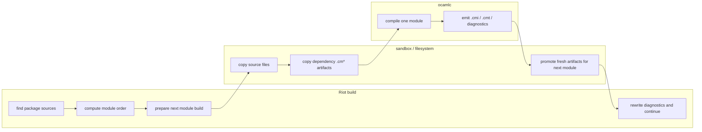
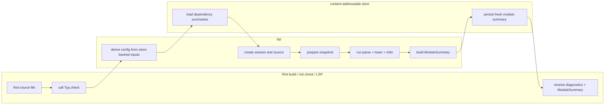

# RFD0030 - Typ Incremental Library-First Typechecker

- Feature Name: `typ_incremental_library_first_typechecker`
- Start Date: `2026-04-03`
- Status: `presented`
- RFD PR: [leostera/riot#0000](https://github.com/leostera/riot/pull/0000)
- Riot Issue: [leostera/riot#0000](https://github.com/leostera/riot/issues/0000)

## Summary
[summary]: #summary

This RFD proposes `typ`, a new library for incremental type checking for the
functional subset of OCaml (that is, no objects):

* it produces structured, machine-readable diagnostics instead of compiler
strings that Riot has to parse after the fact

* it runs as a library inside Riot, so checking can be parallelized without
spinning up one OS process per file

* it integrates directly with Riot's build graph and later analysis passes, so
typed exports are available as values instead of only through opaque `.cmi`,
`.cmti`, or `.cmt` files

* it's incremental, lenient, and query-first, so build, LSP, and macro
workflows can share one typing engine instead of maintaining separate
implementations

* it deliberately aims for better code quality, maintainability, and
extensibility than the upstream OCaml checker while keeping Riot free to
restrict the language surface and experiment with features such as row
polymorphism on records


## Motivation
[motivation]: #motivation

Riot's current typechecking story depends on upstream OCaml tooling in ways
that are workable, but fundamentally the wrong shape for Riot's needs.

The problems are:

1. **structured diagnostics**: currently diagnostics from the compiler are
   rendered as strings, which means we can't do much with them and they are
considered presentation output instead. For further processing, or translating
errors into other formats (JSON, HTML, etc), this is not ideal. A new
typechecker should allow us to collect structured diagnostics that can be
turned into the right presentation at the edge: JSON, human output, HTML, etc.

2. **parallel friendly**: the ocaml typechecker wasn't designed to work in parallel environments, so parallelism is achieved at the OS-process level by calling `ocamlc` many times. A new typechecker should be a multi-core ready library, and even make use of parallelism/concurrency internally.

3. **simplified integration**: currently ocaml requires us to perform this file
   dance where we move files around until just the right .cmi and .cma files
are in the directory where we'd invoke ocamlc. A new typechecker should allow
us to provide a configurable store to avoid this dance entirely, almost removing
this entire aspect of build system artifact management.

4. **leniency and tooling friendliness**: today the lenient typechecker is
   reimplemented separately in `merlin`, and so you have two entrypoints to the
same system. A new typechecker should be designed for leniency and querying
from day 1, to support LSP and other tooling use-cases without requiring a
separate implementation.

5. **developer friendly**: ocaml is a scary difficult project to get into, despite being so lauded as a hackable compiler. Its typechecker implementation is written in an old imperative style with global mutable state, and its hard to read and get into. A new typechecker should be designed from day 1 to be easier to read, test, extend, profile, and reason about, to support our own type checking experiments.

I believe these are reason enough to build a new checker.

## Guide-level explanation
[guide-level-explanation]: #guide-level-explanation

We'll explain this with two examples, building a package and editing a file.

## Building a package

Suppose Riot is checking a package with 3 files:

```text
./colors.ml
./rgb.ml
./ansi_table.ml
```

and `colors.ml` depends on the other two modules.

To do this today, Riot will:

1. find the source files in this package
2. compute the dependency order between them
3. then one module at a time:
   * copy sources and dependency artifacts (.cm* files) into a new sanbdox
   * call `ocamlc` in this sandbox and verify new output artifacts exist
   * parse `ocamlc` output for use as a structure diagnostic later
   * promote new artifacts for the next module to find them
4. rewrite diagnostic paths for presentation, or wrap it in a json object



So most of the work of the build system is on moving files around, and working
around the `ocamlc` outputs.

With `typ`, the integration fits much more naturally and avoids all the file
shenanigans:

1. find the source files in the package
2. then parallely for each module:
   * call `Typ.check ~store ~file`
     * `typ` reads required type information from the store directly
     * runs type checking
     * stores any intermediate and final outputs in the store
   * get missing requirements, or a typed result with structured diagnostics 

Internally `Typ.check` looks a  bit like:

```ocaml
let config = Session.config ~store () in
let session = Session.empty ~config in

(* create a source to type *)
let session, source_id =
  Session.create_source session
    ~kind:File
    ~origin:(Path path)
    ~text
in

(* freeze the session *)
let snapshot = Typ.Session.snapshot session in

(* extract all type diagnostics: here's where all the typing happens *)
let diags = Typ.Query.diagnostics snapshot source_id in

(* extract whole module summary for persistance *)
let summary = Typ.Query.module_summary snapshot source_id in

Ok {summary;diags}
```



The heavy-lifting here is done by 2 parts:
1. the `~store` is an immutable content-addressable cache that `Typ` uses to
   read and store dependency type manifests. If something has been type-checked before, it will be present in there.
2. the missing requirements allows us to reconstruct the dependency graph
   without requiring an upfront dependency analysis.

The important difference are that:
* type information is now available as values and not as opaque files:
* diagnostics can easily be formatted for human or machine consumption
* later build passes, lints, and macros can consume those values directly
* parallelism becomes cheap since Riot actors are cheap

## Editing a file

Suppose the user is editing `colors.ml` in the LSP and the file is temporarily
broken. Today, the lenient and queryable behavior lives in separate
tooling, so you must have `ocamllsp` installed and configured to find the right compiler artifacts. 

With `typ`, the editor uses the same checker core:

```ocaml
open Type

(* configure and create a new typing session *)
let config = Session.config ~store () in
let session = Session.empty ~config in

(* find or create source files in this session *)
let session, source_id =
  Session.create_source session
    ~kind:File
    ~origin:(Path path)
    ~text
in

(* on typing update the source text *)
let session =
  Typ.Session.update_source_text 
    session 
    source_id 
    ~text:new_text
in

(* at query time, take a snapshot of the session *)
let snapshot = Typ.Session.snapshot session in
let diags = Typ.Query.diagnostics snapshot source_id in
let ty = Typ.Query.type_at snapshot source_id position in
...
```

So the same session can answer:

- structured diagnostics for the current text
- `type_at` queries
- definition and scope queries
- export summaries when the file is sound enough to produce them

## Reference-level explanation
[reference-level-explanation]: #reference-level-explanation

## 1. Package boundary

We will have a new public package called `typ` that will be published to the registry too.

This package will:
- parse a file/string through `syn` or receive a concrete syntax tree
- discover dependencies
- type-check one rooted set of sources against a universe built of module summaries of the dependencies
- answer queries over the resulting typed world
- produce one canonical reusable type summary per module

`typ` owns:

- lowering from `Syn.Cst` into semantic forms (the `SemanticTree`)
- name resolution
- type inference
- structured diagnostics
- query indexes
- source origins and source-backed definition metadata
- canonical per-module reusable typing artifacts

`typ` does not own:

- filesystem walking
- workspace loading
- CLI rendering
- LSP protocol handling
- macro transport
- store orchestration at the workspace level

The point is that `typ` is a library. Build, LSP, and macros call into it. It
does not become a second build system.

## 2. Supported language

The target language is the functional subset of OCaml, including:

- literals and identifiers
- tuples, lists, arrays, and other built-in types
- user defined records, variants, polymorphic variants and GADTs
- `let`, `let rec`, `fun`, `function`, application, sequencing, and conditionals
- pattern typing and match analysis
- type annotations and generalization
- the module-level behavior needed to type-check across files and consume
  module summaries

We leave out of scope the entirety of the object system, including anonymous
objects and classes.

All unsupported syntax must not be silently dropped, it must become explicit
recovery plus structured diagnostics.

## 3. Core contract

- `typ` does not infer directly on `Syn.Cst`, it lowers to `SemanticTree`
- all persistent checker state is explicit
- query-local mutation is allowed, but it does not escape the query boundary
- source spans and CST nodes are origin data, not semantic identity
- diagnostics are structured and span-backed
- the canonical reusable artifact is one `ModuleSummary` per module
- queries run against prepared immutable snapshots, not against a mutating
  session

There may be richer in-memory analysis records inside `typ`. That is fine. But
the reusable boundary across runs is the module summary, not some hidden
checker state.

## 4. Semantic model, concretely

The semantic flow is:

```text
source text
  -> parse
  -> Syn.Cst
  -> dependency discovery
  -> snapshot preparation
  -> lower to semantic tree
  -> name resolution
  -> type inference
  -> query indexes + diagnostics + ModuleSummary
```

The semantic tree is not a prettier CST, and it will lower all syntax it can
while presreving semantics. So similar syntax gets collapsed based on semantic
equivalence classes.

At minimum, the semantic model needs:

- stable source identities
- stable item identities
- best-effort stable expression and pattern identities
- normalized top-level item structure
- normalized body structure
- explicit source origins
- explicit recovery nodes

When lowering, if two bits of surface syntax mean the same thing for typing and
queries, they should lower to the same semantic form. If we still care about
the original spelling, we keep that in origin data.

For example, these should lower to the same semantic form:

```ocaml
let f x = x
let f = fun x -> x
let f = function | x -> x
```

Surface syntax can then survive in exactly four ways:

- it survives semantically
  for example:
  - `fun x -> body`
  - `function | A -> x | B -> y`
  - `expr : ty`
- it gets normalized into a canonical semantic form
  for example:
  - `let f x y = body` becomes one binding plus normalized parameters or
    nested lambdas
  - `f a b c` becomes one callee plus a canonical argument list
  - extra paren shells around simple expressions disappear
- it survives only as origin data
  for example:
  - comments and docstrings
  - trivia and separators
  - punctuation-only wrappers like redundant parens that we still need for
    spans and precise diagnostics
- it becomes explicit recovery
  for example:
  - objects and classes
  - unsupported module forms
  - anything else outside the currently supported subset

## 5. Canonical module summary

A `ModuleSummary` is our canonical reusable typing artifact per module. It gets
serialized, stored, loaded into future sessions, and used for cross-module
typing.

This is the thing that gets serialized, stored, loaded into future sessions,
and used for cross-module typing.

It is okay if the final concrete record shape changes later. What is not okay
is being vague about what it must contain.

At minimum, a `ModuleSummary` must contain:

- module identity
- a stable input fingerprint for the summarized module
- dependency fingerprints or provenance for every imported summary it depends on
- trust state for the exported interface
- exported values and their schemes
- exported type declarations
- exported constructors
- exported record labels
- enough definition metadata to answer cross-module `definition_at`
- exact source origins for exported symbols, including spans

Conceptually it should look roughly like this:

```ocaml
type export_status =
  | Trusted
  | Errored
  | No_export

type symbol_origin = {
  module_name: string;
  source: Source_ref.t;
  span: Span.t;
}

type value_export = {
  name: string;
  scheme: Type_scheme.t;
  defined_at: symbol_origin;
}

type type_export = {
  name: string;
  params: string list;
  manifest: Type_expr.t option;
  defined_at: symbol_origin;
}

type constructor_export = {
  name: string;
  scheme: Type_scheme.t;
  parent_type: string;
  defined_at: symbol_origin;
}

type label_export = {
  name: string;
  scheme: Type_scheme.t;
  parent_type: string;
  defined_at: symbol_origin;
}

type module_summary = {
  module_name: string;
  module_fingerprint: Fingerprint.t;
  dependency_fingerprints: (string * Fingerprint.t) list;
  export_status: export_status;
  values: value_export list;
  types: type_export list;
  constructors: constructor_export list;
  labels: label_export list;
}
```

This is intentionally approximate. The exact encoding can move. The semantic
payload cannot.

One more rule:

- `ModuleSummary` is the canonical reusable artifact
- package-level manifests are optional host-side conveniences

In other words, package bundles may exist for faster lookup. They are not the
semantic contract.

## 6. Store contract

`typ` works with an immutable content-addressable store.

The store must be able to:

- load a `ModuleSummary` by fingerprint
- persist a `ModuleSummary` by fingerprint
- optionally keep hotter summaries in an in-memory cache without changing the
  semantics

The store must not be the home for:

- mutable sessions
- immutable snapshots
- raw CSTs
- transient query caches
- local unification state
- any hidden global checker state

The summary key must be derived from the typing inputs, not from arbitrary host
paths.

At minimum, that fingerprint must account for:

- checker artifact version
- module identity
- source text hash
- interface text hash, when relevant
- fingerprints of imported module summaries
- typing-relevant host configuration

If any of those change, the old summary is no longer valid.

## 7. Sessions and prepared snapshots

There are two top-level runtime objects:

- `Session`
- `Snapshot`

A session is the mutable host-owned world.

It contains:

- source texts
- stable source identities
- host configuration

A session may contain many sources. That is fine. The session is the long-lived
object for build and for the LSP.

A prepared snapshot is different:

- it is immutable
- it is revision-bound
- it is rooted at one source or a small root set
- it is fully hydrated with all dependency summaries needed for those roots

That last point matters.

If a snapshot exists, it means `typ` already has all the type information
required to answer queries for those roots. Queries do not discover missing
dependencies later.

If the user edits a file and that edit introduces a new dependency, that means:

- the session gets a new revision
- the old snapshot stays valid for the old revision
- the host prepares a new snapshot for the new revision

So yes, snapshots get recreated. That is the contract. The thing that makes
that cheap is reuse of already-available module summaries.

## 8. Preparing a snapshot

Preparing a snapshot is its own algorithm.

The host gives `typ`:

- a session
- a root source or root source set

`typ` then:

1. parses the roots
2. builds `Syn.Cst`
3. discovers module dependencies from the syntax
4. resolves those dependencies to module identities
5. attempts to hydrate the required `ModuleSummary` values from hot cache or
   store
6. if anything is missing, bails early with `Missing_requirements`
7. otherwise returns a prepared immutable snapshot

This means syntactic dependency discovery is part of the contract.

The baseline dependency-discovery source is exactly the same kind of
information Riot already uses today for module and package graph ordering:

- text
- parse
- CST
- dependency extraction

The point here is to bail out as early as possible.

If the required summaries are not available, we want to know that before doing
full lowering and inference work.

Conceptually:

```ocaml
val snapshot :
  Session.t ->
  roots:Source_id.t list ->
  (Snapshot.t, Missing_requirements.t) result
```

Once a `Snapshot` exists, all snapshot queries are total over that
prepared world.

## 9. Type-checking algorithm

< insert logic heavy explanation of the exact algorithm used by OCaml >

## 10. Query contract

The query API runs over a prepared snapshot.

That is important enough to repeat:

- no query is defined over a mutable session
- no query discovers missing requirements
- no query mutates the prepared world

Lazy forcing inside the snapshot is fine. It is an implementation detail. The
semantic contract is that a prepared snapshot is one coherent typed world.

At minimum, the query surface must support:

- `diagnostics`
- `module_summary_of`
- `type_at`
- `definition_at`
- `scope_at`

### `diagnostics`

`diagnostics snapshot root` returns the structured diagnostics for that root in
that prepared world.

This includes, when relevant:

- parse diagnostics
- lowering diagnostics
- typing diagnostics

### `module_summary_of`

`module_summary_of snapshot root` returns the canonical reusable
`ModuleSummary` for that root.

If the module has local errors but still produced an interface, the returned
summary must say so in its trust state.

### `type_at`

`type_at snapshot root position` returns the smallest semantic expression that
contains `position`, and the inferred type of that expression.

If no semantic expression covers the position, it returns no result.

### `definition_at`

`definition_at snapshot root position` resolves the symbol at `position` to the
exact origin span where it is defined.

This includes cross-module definitions.

That is why `ModuleSummary` must carry precise definition origins for exported
symbols. Cross-module `definition_at` must not require reopening source text or
re-running full typing on dependencies.

### `scope_at`

`scope_at snapshot root position` returns the names visible at `position`,
together with the best type or scheme information available for those names.

This is an ordinary typing query, not a best-effort string dump.

## 11. Source identities and origins

Sources need stable identities across edits.

That means:

- one logical source gets one stable `SourceId`
- text updates preserve that `SourceId`
- snapshots are tied to a session revision, not to unstable offsets

Semantic nodes also need identities, but not all with the same strength.

The stability tiers are:

- `SourceId`
  - strong stability
- top-level item ids
  - strong stability when the declaration still matches
- local expression and pattern ids
  - best-effort stability
- synthetic recovery nodes
  - no long-term guarantee

Origins are separate from semantic identity.

An origin map must be able to take a semantic thing and recover:

- the source it came from
- the exact span it came from
- the CST node, when source-backed tooling needs that

That is how diagnostics and definition queries stay source-precise without
making the CST the semantic store.

## 12. Diagnostics

Diagnostics are first-class structured values.

They are not strings with metadata bolted on afterward.

Every diagnostic must carry enough structured information for multiple
presentations later:

- human CLI output
- JSON output
- editor surfaces
- later tooling or lint passes

At minimum, each diagnostic must support:

- one primary origin
- zero or more related origins
- machine-readable code
- severity
- structured payload specific to that diagnostic kind

At minimum, the checker must model diagnostics for:

- unbound names
- unbound type constructors
- type mismatches
- invalid recursive bindings
- non-exhaustive matches
- redundant cases
- unsupported syntax
- missing requirements during snapshot preparation

`UnsupportedSyntax` is the catch-all while the supported subset grows. It is
fine to split it into more specific kinds later. It is not fine to drop the
structure and fall back to ad-hoc strings.

## 13. Parallelism

The library is parallel-friendly by construction.

That does not mean the core checker becomes actor-shaped. It means:

- the host can parallelize independent roots
- the host can parallelize independent modules in a dependency layer
- summary hydration can be parallelized
- store interaction can be parallelized

The core local inference algorithm does not need internal parallelism as part
of the contract.

The point is to avoid per-file process overhead, not to force every internal
step into concurrency.

## 14. Testing and conformance

This reference section should become the test plan later.

That means the checker must be validated with tests that directly correspond to
the spec:

- module summary snapshots
- diagnostics snapshots
- `type_at` fixtures
- `definition_at` fixtures
- `scope_at` fixtures
- missing-requirements preparation tests
- cache hit and cache miss tests
- source identity stability tests
- snapshot immutability tests

Architecture tests are not optional.

At minimum, they must prove:

- whitespace-only edits do not change module summaries
- changing one body does not invalidate unrelated summaries
- inserting sibling items does not renumber unrelated stable ids
- editing a source creates a new revision and requires a new prepared snapshot
- a prepared snapshot is queryable without further dependency discovery
- unchanged dependency fingerprints hit the store
- changed dependency fingerprints invalidate exactly what they should

## 15. Appendix: theory subset

The type-theoretic subset being implemented should be documented explicitly.

This appendix is where we say, in detail, which OCaml typing rules we are
adopting and which we are not.

At minimum, it should cover:

- let-polymorphism
- the value restriction
- recursive bindings
- algebraic data types
- records
- pattern typing
- match typing and exhaustiveness
- labeled and optional arguments, when supported
- module-summary style interface reuse

The OCaml compiler remains the main theory reference for this subset, especially:

- `Types`
- `Btype`
- `Ctype`
- `Typecore`
- `Typedtree`

But this appendix should not just say "see OCaml."

It should extract the exact subset Riot is implementing, in Riot terms, so the
tests and the implementation have something precise to conform to.

## Drawbacks
[drawbacks]: #drawbacks

This design is more opinionated than "just build a typed tree from the CST."

The costs are:

- a real lowering layer adds design work up front
- stable IDs, source maps, and export trust states add core concepts
- a query-first API is less direct for callers that just want a tree
- supporting build, LSP, and macros in one package means balancing more
  constraints earlier

## Rationale and alternatives
[rationale-and-alternatives]: #rationale-and-alternatives

### Why this design

This is the best fit for Riot because it treats the typechecker as a shared
semantic engine rather than a compiler-only phase.

It matches:

- Riot's faithful parser architecture
- Riot's in-process build architecture
- Riot's editor-tooling ambitions
- Riot's macro plans

### Alternative: infer directly on `Syn.Cst`

Rejected.

`Syn.Cst` is the right source layer and the wrong long-lived semantic layer.
Its fidelity to tokens, trivia, sugar, and raw surface distinctions is a
strength for parsing and rewriting, not a reason to make it the semantic cache.

### Alternative: make `Typ.Tst` the primary store

Rejected.

Typed views are useful, but they should remain derived from lowered IR plus
origins. Making them the primary incremental store would tie too much semantic
state to tree shape and source representation.

### Alternative: wrap `vendor/ocaml/typing`

Rejected as the primary design.

The OCaml compiler remains useful prior art for:

- generalization
- mismatch explanation
- pattern typing
- match analysis

But its internal state model and public data shape are poor fits for Riot's
library-first goals.

### Alternative: ban all mutation

Rejected.

The real requirement is not "no mutation anywhere." It is:

- no hidden global persistent mutation
- explicit, revisioned cross-query state
- local mutation allowed inside a query if it does not escape

### Alternative: path-based source identity

Rejected.

Paths are one possible origin for a source. They are not the core semantic
identity if Riot wants to support unsaved buffers, generated files, and
fragments cleanly.

## Prior art
[prior-art]: #prior-art

### OCaml compiler `typing/`

The OCaml compiler remains the most relevant technical reference for:

- core type-system behavior
- generalization and scheme handling
- mismatch explanation
- pattern analysis

It is also an important negative reference for:

- global mutable state
- mutable public type representation
- forward declaration refs as a structural norm

### Lowered-IR-first analysis engines

This RFD follows the general lesson from modern incremental analysis systems:
keep syntax isolated, lower into more compact semantic representations, and
make semantic identities position-independent.

### Incremental query systems

This RFD also follows the general lesson from incremental query systems:

- explicit inputs
- deterministic derived queries
- snapshot-friendly parallel reads
- local implementation freedom inside one query

### Incremental parsing under edits

The editor lane is motivated by the same requirement as incremental parsing:
useful answers under ongoing edits and syntax errors are a first-class tool
requirement, not optional polish.

## Unresolved questions
[unresolved-questions]: #unresolved-questions

The main open questions are:

- Should typed holes have surface syntax in the first implementation, or only
  an internal recovery form?
- What is the right stable-origin granularity for body-local constructs that
  come from sugared surface forms?
- Which declaration facts should participate in top-level `Item_id` matching
  when sibling ordering changes?
- Which typed views should be public and pattern-matchable, and which should
  stay behind query helpers?
- What is the exact shape of `Scope_id`, `Definition`, and `Signature` in the
  query facade?

## Future possibilities
[future-possibilities]: #future-possibilities

Later work could add:

- cross-file query APIs for references, hover, completion, and workspace-wide
  symbol search
- macro expansion validation that reuses `Typ.Session` directly
- richer mismatch traces for editor and CLI presentation
- broader module-language coverage beyond the first build-oriented subset
- multiple typed-view projections over the same lowered semantic store for
  different consumers
