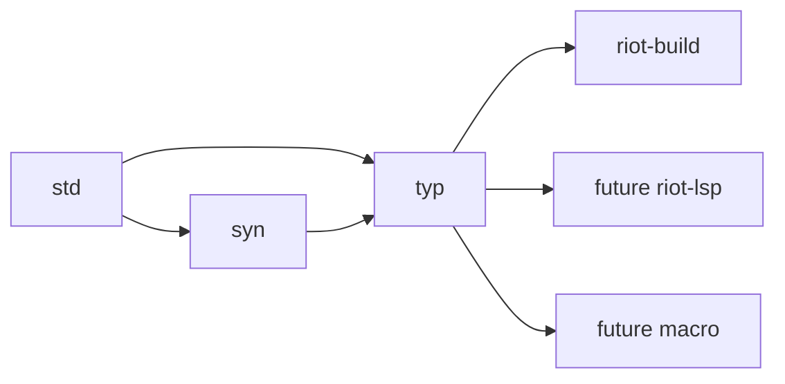

# RFD0030 - Typ Incremental Library-First Typechecker

- Feature Name: `typ_incremental_library_first_typechecker`
- Start Date: `2026-04-03`
- Status: `presented`
- RFD PR: [leostera/riot#0000](https://github.com/leostera/riot/pull/0000)
- Riot Issue: [leostera/riot#0000](https://github.com/leostera/riot/issues/0000)

## Summary
[summary]: #summary

This RFD proposes `typ`, a new library for incremental type checking for the
functional subset of OCaml (that is, no objects):

* it produces structured, machine-readable diagnostics instead of compiler
strings that Riot has to parse after the fact

* it runs as a library inside Riot, so checking can be parallelized without
spinning up one OS process per file

* it integrates directly with Riot's build graph and later analysis passes, so
typed exports are available as values instead of only through opaque `.cmi`,
`.cmti`, or `.cmt` files

* it's incremental, lenient, and query-first, so build, LSP, and macro
workflows can share one typing engine instead of maintaining separate
implementations

* it deliberately aims for better code quality, maintainability, and
extensibility than the upstream OCaml checker while keeping Riot free to
restrict the language surface and experiment with features such as row
polymorphism on records


## Motivation
[motivation]: #motivation

Riot's current typechecking story depends on upstream OCaml tooling in ways
that are workable, but fundamentally the wrong shape for Riot's needs.

The problems are:

1. **structured diagnostics**: currently diagnostics from the compiler are
   rendered as strings, which means we can't do much with them and they are
considered presentation output instead. For further processing, or translating
errors into other formats (JSON, HTML, etc), this is not ideal. A new
typechecker should allow us to collect structured diagnostics that can be
turned into the right presentation at the edge: JSON, human output, HTML, etc.

2. **parallel friendly**: the ocaml typechecker wasn't designed to work in parallel environments, so parallelism is achieved at the OS-process level by calling `ocamlc` many times. A new typechecker should be a multi-core ready library, and even make use of parallelism/concurrency internally.

3. **simplified integration**: currently ocaml requires us to perform this file
   dance where we move files around until just the right .cmi and .cma files
are in the directory where we'd invoke ocamlc. A new typechecker should allow
us to provide a configurable store to avoid this dance entirely, almost removing
this entire aspect of build system artifact management.

4. **leniency and tooling friendliness**: today the lenient typechecker is
   reimplemented separately in `merlin`, and so you have two entrypoints to the
same system. A new typechecker should be designed for leniency and querying
from day 1, to support LSP and other tooling use-cases without requiring a
separate implementation.

5. **developer friendly**: ocaml is a scary difficult project to get into, despite being so lauded as a hackable compiler. Its typechecker implementation is written in an old imperative style with global mutable state, and its hard to read and get into. A new typechecker should be designed from day 1 to be easier to read, test, extend, profile, and reason about, to support our own type checking experiments.

I believe these are reason enough to build a new checker.

## Guide-level explanation
[guide-level-explanation]: #guide-level-explanation

We'll explain this with two examples, building a package and editing a file.

## Building a package

Suppose Riot is checking a package with 3 files:

```text
./colors.ml
./rgb.ml
./ansi_table.ml
```

and `colors.ml` depends on the other two modules.

To do this today, Riot will:

1. find the source files in this package
2. compute the dependency order between them
3. then one module at a time:
   * copy sources and dependency artifacts (.cm* files) into a new sanbdox
   * call `ocamlc` in this sandbox and verify new output artifacts exist
   * parse `ocamlc` output for use as a structure diagnostic later
   * promote new artifacts for the next module to find them
4. rewrite diagnostic paths for presentation, or wrap it in a json object

<add mermaid swimlane diagram for the above flow>

So most of the work of the build system is on moving files around, and working
around the `ocamlc` outputs.

With `typ`, the integration fits much more naturally and avoids all the file
shenanigans:

1. find the source files in the package
2. then parallely for each module:
   * call `Typ.check ~store ~file`
     * `typ` reads required type information from the store directly
     * runs type checking
     * stores any intermediate and final outputs in the store
   * get missing requirements, or a typed result with structured diagnostics 

Internally `Typ.check` looks a  bit like:

```ocaml
let config = Session.config ~store () in
let session = Session.empty ~config in

(* create a source to type *)
let session, source_id =
  Session.create_source session
    ~kind:File
    ~origin:(Path path)
    ~text
in

(* freeze the session *)
let snapshot = Typ.Session.snapshot session in

(* extract all type diagnostics: here's where all the typing happens *)
let diags = Typ.Query.diagnostics snapshot source_id in

(* extract whole module summary for persistance *)
let summary = Typ.Query.module_summary snapshot source_id in

Ok {summary;diags}
```

<add simplified swimlane diagram>

The heavy-lifting here is done by 2 parts:
1. the `~store` is an immutable content-addressable cache that `Typ` uses to
   read and store dependency type manifests. If something has been type-checked before, it will be present in there.
2. the missing requirements allows us to reconstruct the dependency graph
   without requiring an upfront dependency analysis.

The important difference are that:
* type information is now available as values and not as opaque files:
* diagnostics can easily be formatted for human or machine consumption
* later build passes, lints, and macros can consume those values directly
* parallelism becomes cheap since Riot actors are cheap

## Editing a file

Suppose the user is editing `colors.ml` in the LSP and the file is temporarily
broken. Today, the lenient and queryable behavior lives in separate
tooling, so you must have `ocamllsp` installed and configured to find the right compiler artifacts. 

With `typ`, the editor uses the same checker core:

```ocaml
open Type

(* configure and create a new typing session *)
let config = Session.config ~store () in
let session = Session.empty ~config in

(* find or create source files in this session *)
let session, source_id =
  Session.create_source session
    ~kind:File
    ~origin:(Path path)
    ~text
in

(* on typing update the source text *)
let session =
  Typ.Session.update_source_text 
    session 
    source_id 
    ~text:new_text
in

(* at query time, take a snapshot of the session *)
let snapshot = Typ.Session.snapshot session in
let diags = Typ.Query.diagnostics snapshot source_id in
let ty = Typ.Query.type_at snapshot source_id position in
...
```

So the same session can answer:

- structured diagnostics for the current text
- `type_at` queries
- definition and scope queries
- export summaries when the file is sound enough to produce them

## Reference-level explanation
[reference-level-explanation]: #reference-level-explanation

## 1. Package boundaries

This RFD introduces one new public package:

- `packages/typ`

The intended dependency shape is:



The responsibility split is:

- `syn`
  owns parsing, CST shape, syntax recovery, parser diagnostics, and syntax
  traversal
- `typ`
  owns lowering, semantic IDs, source maps, name resolution, type inference,
  typed views, exports, query indexes, and type diagnostics
- `riot-build`
  owns package and workspace orchestration plus dependency-aware scheduling
- future LSP
  owns editor protocol, document lifecycle, overlays, and presentation
- future macro
  owns macro ABI, expansion lifecycle, and generated-source orchestration

`typ` does not own:

- filesystem traversal
- workspace loading
- CLI rendering
- language server protocol details
- macro transport or plugin loading

## 2. Scope

The first scope is the functional subset of OCaml.

Included:

- literals, identifiers, tuples, lists, arrays, records, and variants
- `let`, `let rec`, `fun`, `function`, application, sequencing, and conditionals
- pattern typing and match analysis
- user-defined algebraic data types and record types
- type annotations and generalization
- interfaces and exported value/type summaries needed for cross-file typing
- fragment-oriented checking for expressions, patterns, and type expressions

Out of scope in the first milestone:

- objects
- classes
- methods
- instance variables
- the object type system

Unsupported syntax in those families should still lower into explicit recovery
forms. The inference engine operates on supported IR plus recovery nodes, not
on the full surface grammar.

Module support is phased:

- `v0` module support is limited to the subset whose item structure is already
  reified by `syn` at the file shell
- nested `struct ... end`, `sig ... end`, and functor bodies lower to explicit
  recovery in `v0`
- deeper module-language support only becomes supported once `syn` exposes the
  needed nested item structure directly

This restriction comes from the current CST surface:

- `ModuleType.Signature` still preserves only a raw `signature_syntax_node`
  instead of nested lifted items
  ([cst.mli](/Users/leostera/Developer/github.com/leostera/riot/packages/syn/src/cst.mli#L640))
- `ModuleExpression.Structure` still preserves `item_syntax_nodes` rather than
  a nested typed item tree
  ([cst.mli](/Users/leostera/Developer/github.com/leostera/riot/packages/syn/src/cst.mli#L3009))

## 3. Core invariants

These are the architectural invariants:

- `typ` never infers directly on `Syn.Cst`
- all persistent checker state is explicit and externalized
- query-local inference may use private mutation, but it must not escape the
  query boundary
- long-lived state is keyed by stable semantic IDs and source IDs
- source spans and CST nodes are origin data, not semantic identity
- the checker can emit partial results after non-fatal failures
- diagnostics always map back to source origins
- exports are first-class results with an explicit trust model
- the public API is query-first
- raw CST and rich typed trees are derived views, not the primary incremental
  store

This is how the RFD answers the "no global mutable state" constraint while
still leaving room for efficient local implementations inside one inference
query.

## 4. Semantic IDs and source maps

The core identity model looks roughly like this:

```ocaml
module Source_id : sig
  type t
end

module Item_id : sig
  type t
end

module Expr_id : sig
  type t
end

module Pat_id : sig
  type t
end

module Origin_id : sig
  type t
end
```

`Source_id` identifies a source unit abstractly. It is not just a path. It must
be able to represent:

- on-disk files
- unsaved buffers
- generated macro outputs
- fragments

Its lifecycle is part of the contract:

- one logical source gets one stable `Source_id`
- text updates preserve that `Source_id`
- removing a source invalidates future queries for that ID in later snapshots
- snapshots keep earlier revisions queryable without mutating their view

`OriginMap` relates semantic IDs back to source syntax for one specific
snapshot:

- semantic ID -> origin ID
- origin ID -> source span
- origin ID -> CST node lookup when a source snapshot is available

This keeps source mapping precise without making syntax-tree identity the main
cache key.

### ID stability tiers

Not all IDs need the same stability guarantee.

- `Source_id`
  - strong stability
  - stable for the lifetime of one logical source across text updates
- top-level `Item_id`
  - strong stability
  - stable across sibling insertions and unrelated body edits when the owning
    declaration identity survives lowering unchanged
- `Expr_id` and `Pat_id`
  - best-effort stability
  - stable within the same owning item and normalized body shape when the
    corresponding lowered node still matches
- synthetic recovery-only nodes
  - no long-term stability guarantee

The implementation and the tests should reflect this tiering. `typ` should not
pretend that every local node ID is as durable as top-level item identity.

## 5. Lowered IR and summaries

The semantic middle layer needs three distinct concepts, not one blurred one.

### `ItemTree`

`ItemTree` is the syntax-lowered, body-stable item skeleton for one source.

It owns:

- value declarations and heads
- type declarations and type heads
- imported names, opens, and includes
- module-level shells needed for export computation
- semantically meaningful declaration attributes

It should stay stable across many body-local edits.

### `BodyArena`

`BodyArena` owns normalized local structure:

- expressions
- patterns
- local binders
- normalized parameter forms
- explicit recovery nodes

This is where:

- local name resolution
- body inference
- local diagnostics

should primarily happen.

The invalidation rule is:

- editing one body must not invalidate unrelated file-level summaries

### `FileSummary`

`FileSummary` is the name-resolved, export-facing summary derived from:

- `ItemTree`
- dependency inputs
- builtin and prelude environment
- any summary-level diagnostics

It owns:

- resolved item names
- visible exported names
- trusted versus errored export state
- summary-level dependency effects

`FileSummary` is not `ItemTree` with extra fields. It is a different semantic
artifact.

### Persisted module export artifacts

After a module finishes checking, its export-facing summary crosses a persisted
boundary before downstream work reuses it.

OCaml already makes this conceptual split:

- `.cmi` stores reusable interface information
  ([vendor/ocaml/file_formats/cmi_format.mli](/Users/leostera/Developer/github.com/leostera/riot/vendor/ocaml/file_formats/cmi_format.mli#L16))
- `.cmt` and `.cmti` store richer typed annotations
  ([vendor/ocaml/file_formats/cmt_format.mli](/Users/leostera/Developer/github.com/leostera/riot/vendor/ocaml/file_formats/cmt_format.mli#L16))

`typ` should adopt the same separation even if the first serialization format
is just JSON.

The minimum persisted artifact split is:

- `PersistedSummary`
  - a `.cmi`-like reusable export payload
  - contains the exported typing environment, trust state, and the minimum
    dependency-facing metadata needed for reuse
- `ModuleSummary`
  - a host-facing wrapper around `PersistedSummary`
  - adds module identity, source or input hash, and provenance needed for
    store lookup and package-level manifests

Later work may add a richer `.cmti`-like artifact that persists:

- typed views
- origin maps
- documentation-facing information
- richer query indexes

Build-side type reuse should depend only on the smaller persisted export
artifact, not on the richer analysis artifact.

### Lowering contract

Lowering must normalize source syntax into semantic forms explicitly rather
than letting later analysis depend on surface shape by accident.

The rule for every CST family must be one of:

- survives semantically
- normalized away into a canonical IR form
- preserved only in `OriginMap`
- lowered to explicit recovery

The contract should be explicit for the current `Syn.Cst` surface.

| `Syn.Cst` family | Lowering policy | Notes |
| --- | --- | --- |
| `LetBinding` plus `parameters` sugar | Normalized away into item head plus body-local lambda shape | Original parameter spelling stays in `OriginMap` |
| `Expression.Fun` | Survives semantically | Represents explicit parameterized function shape |
| `Expression.Function` | Survives semantically | Represents case-list function shape and must not be collapsed into ordinary `fun` |
| `Expression.Apply` chains | Normalized into canonical callee plus argument list form | Application associativity becomes semantic structure rather than CST nesting accidents |
| `Expression.Parenthesized` and most delimiter shells | Origin-only | Preserve for source mapping and diagnostics, not semantic identity |
| `Expression.TypeAscription` | Survives semantically | Carries checking expectations and explicit user constraints |
| `Pattern.Parenthesized` and punctuation-only pattern shells | Origin-only | No semantic identity of their own |
| `StructureItem.Comment`, `StructureItem.Docstring`, `SignatureItem.Comment`, `SignatureItem.Docstring` | Origin-only | Not part of semantic IR |
| Trivia, separators, and token ownership details | Origin-only | Never used as semantic identity |
| `ModuleExpression.Structure` with raw `item_syntax_nodes` | Recovery in `v0` | No nested semantic lowering in `v0` because nested item tree is not yet reified |
| `ModuleType.Signature` with raw `signature_syntax_node` | Recovery in `v0` | Same restriction as nested `struct` bodies |
| Object/class families | Recovery in `v0` | Outside first checker subset |

This normalization policy is part of the architecture, not formatter cleanup.

## 6. Name resolution and exports

Lowering is followed by explicit name-resolution and export phases.

Exports are not an accidental byproduct of building a typed tree. They are
their own durable result.

This RFD proposes three export result states:

- `Trusted_export`
- `Errored_export`
- `No_export`

The intended rules are:

- explicitly annotated values or signature items may still produce a
  `Trusted_export` even if their bodies have local errors, provided the exposed
  interface is independently checkable
- an unannotated binding whose inference failed must not export a generalized
  scheme for downstream typing
- unresolved opens, includes, or other summary-level failures may downgrade a
  file from `Trusted_export` to `Errored_export` or `No_export`
- editor-facing local information may still exist even when the package-facing
  export is not trusted

This trust model is what keeps build reuse and editor leniency from fighting
each other.

Dependency inputs must also be keyed and provenance-carrying. `typ` should not
accept an unstructured bag of exports. At minimum, dependency-facing inputs
need:

- dependency identity
- visible-name or import-path provenance
- export payload
- revision or fingerprint

That is the minimum contract for reliable invalidation.

### Package and module graph algorithm

The host algorithm for reusable type exports should deliberately mirror Riot's
existing planner and executor flow instead of inventing a second orchestration
model.

The flow is:

0. build the scoped package graph for the requested lane
1. identify the package or packages whose exports are needed
2. compute or load dependency package export bundles first
3. build the package's module graph
4. fetch persisted module exports by hash from the store when available
5. typecheck only the missing modules in dependency order
6. persist fresh module exports back to the store
7. persist a package-level type bundle that maps module names to the stored
   module export artifacts

More concretely:

1. Build the package graph using the same dependency and scope rules as
   `riot-planner`.
   This includes normal, dev, and build scopes where appropriate.
2. For each package node, compute a package type-input hash.
   That hash should include:
   - checker artifact version
   - package identity and relevant typechecking config
   - source hashes for the package's modules and interfaces
   - fingerprints of dependency package export bundles
3. Use that package hash to probe the store for a package-level type bundle.
   The bundle is a small manifest that records:
   - package identity
   - module names
   - per-module export hashes
   - any package-level export or trust metadata the host needs
4. On a package-bundle miss, build the module graph for that package using the
   same module discovery and dependency wiring rules as the build planner, or a
   sibling planner with the same graph semantics.
5. For each module node in topological order, compute a module type-input hash.
   That hash should include:
   - checker artifact version
   - module identity and kind (`.ml` or `.mli`)
   - source text hash
   - fingerprints of the imported module export artifacts
   - any relevant package-level typing configuration
6. Probe the store for that module export artifact by hash.
   On a hit, decode the stored `ModuleSummary` and load it into the current
   typechecking session as a dependency input.
7. On a miss, recursively ensure imported packages and imported modules have
   their persisted exports available, then typecheck the module with those
   loaded summaries, and persist the resulting `ModuleSummary`.
8. After the package's modules have been processed, persist the package-level
   type bundle so later runs can skip module-graph traversal when nothing
   relevant changed.

Riot-specific resolution rules stay explicit:

- package-level dependency discovery happens through the package graph
- intra-package dependency discovery happens through the module graph
- when a required top-level module corresponds to a Riot package root, package
  identity resolves through Riot's package naming convention

The first host that needs this flow may simply copy the existing planner or
executor loop. That is acceptable.

The longer-term shape is better:

- `riot-planner` grows a type-export planning stage alongside build planning
- `riot-executor` or a sibling runtime materializes type-export artifacts in
  the normal cache lane
- `riot build` naturally emits type exports as part of package execution
- `riot check` and the future LSP then reuse those artifacts instead of running
  a bespoke dependency walker

## 7. Inference model

The internal type language needs:

- rigid and flexible variables
- quantified schemes
- named constructors
- function, tuple, record, and variant types
- recovery and hole forms

The inference engine accepts lowered IR, not surface CST. At minimum:

```ocaml
type infer_ctx

val infer_expr :
  infer_ctx -> Expr_id.t -> infer_ctx * Typ_view.expression
```

Inside one query, the implementation may use private mutation for:

- local union-find
- fresh-variable supply
- worklists
- query-local diagnostic accumulation

Once a query returns, its observable outputs are frozen into explicit results.

The rule is:

- persistent state is explicit, revisioned, and snapshot-friendly
- query-local mutation is allowed and private

## 8. Typed views

`Typ.Tst` may exist as a typed view over lowered semantic structures plus
source origins.

It should preserve:

- semantic IDs
- inferred types
- source origins
- recovery state

It should not be the canonical store of:

- incremental identity
- export summaries
- all environment information

The checker should avoid storing a full environment on every node the way the
OCaml compiler stores `exp_env` on typed expressions
([vendor/ocaml/typing/typedtree.mli](/Users/leostera/Developer/github.com/leostera/riot/vendor/ocaml/typing/typedtree.mli#L162)).
Instead, `typ` builds compact queryable indexes and scope summaries.

## 9. Public API

The stable public API is query-first, not tree-first.

Conceptually:

```ocaml
module Typ : sig
  module Session : sig
    type t
    type snapshot

    val empty : config:Config.t -> t

    val create_source :
      t ->
      kind:[ `File | `Fragment | `Generated ] ->
      origin:[ `path of Path.t | `virtual_ of string ] ->
      text:string ->
      t * Source_id.t

    val update_source_text :
      t -> Source_id.t -> text:string -> t

    val set_dependency_export :
      t ->
      dep:Dependency_id.t ->
      visible_as:Import_path.t option ->
      fingerprint:Export_fingerprint.t ->
      export:Export.t ->
      t

    val snapshot : t -> snapshot
  end

  module Query : sig
    val diagnostics : Session.snapshot -> Source_id.t -> Diagnostic.t list
    val export_of : Session.snapshot -> Source_id.t -> export_result
    val type_at : Session.snapshot -> Source_id.t -> Position.t -> Ty.t option
    val definition_of :
      Session.snapshot -> Source_id.t -> Position.t -> Definition.t option
    val scope_at : Session.snapshot -> Source_id.t -> Position.t -> Scope.t option
    val signature_of_item :
      Session.snapshot -> Item_id.t -> Signature.t option
    val typed_view_of_source :
      Session.snapshot -> Source_id.t -> Tst.source_file option
  end
end
```

This does not freeze exact names. It freezes the shape:

- sessions and snapshots
- opaque source identities
- query results
- typed views as optional derived artifacts
- host-loaded persisted module summaries as the reuse boundary for dependency
  typing

`Session.snapshot` returns an immutable revision view. Queries against one
snapshot observe one coherent semantic world even if the outer host session
keeps receiving updates.

## 10. Fragment checking

Fragment checking needs more than `env`.

Use an explicit `Fragment_context`:

```ocaml
module Fragment_context : sig
  type t = {
    source_id : Source_id.t;
    owner_scope : Scope_id.t option;
    opened_modules : Module_ref.t list;
    type_params_in_scope : Type_param.t list;
    value_env : Value_binding.t list;
    expected : Ty.t option;
    origin_anchor : Origin_id.t option;
  }
end
```

That gives macros and LSP features enough structure to compose with caching,
diagnostics, and source maps.

## 11. Dirty-input lane

The library acknowledges two lanes explicitly.

### `v0` build/compiler lane

- input requires clean `Syn.Cst`
- main goal is deterministic file and package typing
- outputs include diagnostics, exports, and queries over trusted syntax
- module support is limited to the subset whose nested item structure is
  already reified by `syn` at the file shell

### later editor lane

- input may come from parse-recovered syntax or a lowered partial surface below
  clean `Syn.Cst`
- lowering should still produce partial IR with recovery nodes
- editor queries should continue to return best-effort local results

This keeps the build milestone honest without pretending that clean-CST-only is
already an LSP-complete boundary.

## 12. Diagnostics

`typ` diagnostics should remain separate from parser diagnostics, just as Riot
already keeps parse diagnostics separate from later analysis diagnostics in
`riot-fix`
([packages/riot-fix/src/pipeline.mli](/Users/leostera/Developer/github.com/leostera/riot/packages/riot-fix/src/pipeline.mli#L4)).

Each diagnostic supports:

- one primary source origin
- zero or more secondary labels
- notes
- machine-readable code
- optional mismatch or expectation trace

At minimum, the checker models these families explicitly:

- unbound value
- unbound type constructor
- type mismatch
- invalid recursive binding
- non-exhaustive pattern match
- redundant match case
- unsupported syntax in the current checker subset

Pattern exhaustiveness and redundancy analysis remain a distinct subsystem,
even if they live under the same package.

## 13. Parallelism

The checker should be parallel-friendly without becoming actor-shaped at its
core.

The split is:

- core lowering and inference for one query stay deterministic and explicit
- batch surfaces expose independent work units and mergeable outputs
- build-oriented callers may schedule those units with `Std.WorkerPool`
  ([packages/std/src/worker_pool/worker_pool.mli](/Users/leostera/Developer/github.com/leostera/riot/packages/std/src/worker_pool/worker_pool.mli#L1))

Potential parallel units include:

- independent files in a dependency layer
- imported interface decoding
- export recomputation for already-lowered dependencies

This RFD does not require parallelism inside unification or local inference.

## 14. Testing strategy

`typ` should be snapshot-tested from the beginning with:

- `Std.Test.FixtureRunner`
- `Std.Test.Snapshot`

([packages/std/src/test/fixture_runner.mli](/Users/leostera/Developer/github.com/leostera/riot/packages/std/src/test/fixture_runner.mli#L1),
[packages/std/src/test/snapshot.mli](/Users/leostera/Developer/github.com/leostera/riot/packages/std/src/test/snapshot.mli#L1))

The first fixture families snapshot:

- `ItemTree`
- lowered bodies
- `FileSummary`
- typed views
- diagnostics
- exports
- selected query results

Architecture tests are also required. `typ` should lock down invalidation and
identity behavior with tests such as:

- whitespace-only edit does not change exports
- editing inside one body does not invalidate unrelated file summaries
- inserting a sibling item does not renumber stable IDs for unrelated items
- updating a source preserves `Source_id`
- stale snapshots do not corrupt the current session
- one unresolved name recovers locally instead of causing a diagnostic cascade
- unchanged module inputs hit the persisted export cache and skip rechecking
- changing one module invalidates only its export artifact and downstream
  dependents, not unrelated package summaries
- package-level type bundles round-trip through the chosen persistence format

These are architectural invariants, not implementation afterthoughts.

## 15. V0 support matrix

The table below makes the `v0` lowering policy explicit.

| Syntax family | `v0` lowering status | `v0` diagnostic expectation | `v0` export effect |
| --- | --- | --- | --- |
| Top-level `let`, `type`, `exception`, `external`, `val` | Supported | ordinary typing diagnostics | trusted or errored depending on item result |
| Top-level `open` and `include` with supported targets | Supported | unresolved/import diagnostics as needed | may downgrade file summary if unresolved |
| Function bodies, patterns, matches, ADTs, records | Supported | ordinary body and match diagnostics | body-local failures do not automatically poison unrelated items |
| Parameter sugar such as `let f x = ...` | Normalized | none beyond ordinary typing diagnostics | same as normalized item |
| Comments, docstrings, trivia, separator ownership | Origin-only | none from lowering alone | no export effect |
| Objects, classes, methods, instance variables | Recovery-only | unsupported-syntax diagnostic | no trusted export from affected constructs |
| Local modules, first-class modules, functors | Recovery-only in `v0` | unsupported-syntax diagnostic | no trusted export from affected constructs |
| Nested `struct ... end` and `sig ... end` bodies | Recovery-only in `v0` | unsupported-syntax diagnostic | no trusted export from affected constructs |
| Parse-recovered dirty syntax for the editor lane | Not part of clean-CST `v0` | parser diagnostics plus future partial-lowering diagnostics | not trusted for build exports |

This matrix should be revised only by changing the underlying architectural
support and tests, not by silently broadening behavior in implementation code.

## 16. Proposed phased rollout

### Phase 0

- create `packages/typ`
- define source IDs, semantic IDs, `ItemTree`, `BodyArena`, `FileSummary`, and
  origin maps
- add fixture-backed snapshots for lowering and diagnostics
- support the clean-CST build/compiler lane for the functional subset

### Phase 1

- add name resolution and export trust states
- add query-first session and snapshot APIs
- add body inference and typed views

### Phase 2

- add broader cross-file checking for ordinary Riot package builds
- add type-at, definition-of, and scope-at query surfaces
- add architecture tests for invalidation and stable IDs
- add persisted per-module export artifacts plus package-level type bundles
- mirror Riot's package-planner loop for store-backed export fetch or compute

### Phase 3

- add the editor lane for dirty inputs and partial lowering
- integrate the same session and query model into LSP and macro workflows
- broaden supported module-language features where needed
- integrate type-export planning and persistence into the regular
  planner/executor pipeline so builds emit reusable type exports automatically

## Drawbacks
[drawbacks]: #drawbacks

This design is more opinionated than "just build a typed tree from the CST."

The costs are:

- a real lowering layer adds design work up front
- stable IDs, source maps, and export trust states add core concepts
- a query-first API is less direct for callers that just want a tree
- supporting build, LSP, and macros in one package means balancing more
  constraints earlier

## Rationale and alternatives
[rationale-and-alternatives]: #rationale-and-alternatives

### Why this design

This is the best fit for Riot because it treats the typechecker as a shared
semantic engine rather than a compiler-only phase.

It matches:

- Riot's faithful parser architecture
- Riot's in-process build architecture
- Riot's editor-tooling ambitions
- Riot's macro plans

### Alternative: infer directly on `Syn.Cst`

Rejected.

`Syn.Cst` is the right source layer and the wrong long-lived semantic layer.
Its fidelity to tokens, trivia, sugar, and raw surface distinctions is a
strength for parsing and rewriting, not a reason to make it the semantic cache.

### Alternative: make `Typ.Tst` the primary store

Rejected.

Typed views are useful, but they should remain derived from lowered IR plus
origins. Making them the primary incremental store would tie too much semantic
state to tree shape and source representation.

### Alternative: wrap `vendor/ocaml/typing`

Rejected as the primary design.

The OCaml compiler remains useful prior art for:

- generalization
- mismatch explanation
- pattern typing
- match analysis

But its internal state model and public data shape are poor fits for Riot's
library-first goals.

### Alternative: ban all mutation

Rejected.

The real requirement is not "no mutation anywhere." It is:

- no hidden global persistent mutation
- explicit, revisioned cross-query state
- local mutation allowed inside a query if it does not escape

### Alternative: path-based source identity

Rejected.

Paths are one possible origin for a source. They are not the core semantic
identity if Riot wants to support unsaved buffers, generated files, and
fragments cleanly.

## Prior art
[prior-art]: #prior-art

### OCaml compiler `typing/`

The OCaml compiler remains the most relevant technical reference for:

- core type-system behavior
- generalization and scheme handling
- mismatch explanation
- pattern analysis

It is also an important negative reference for:

- global mutable state
- mutable public type representation
- forward declaration refs as a structural norm

### Lowered-IR-first analysis engines

This RFD follows the general lesson from modern incremental analysis systems:
keep syntax isolated, lower into more compact semantic representations, and
make semantic identities position-independent.

### Incremental query systems

This RFD also follows the general lesson from incremental query systems:

- explicit inputs
- deterministic derived queries
- snapshot-friendly parallel reads
- local implementation freedom inside one query

### Incremental parsing under edits

The editor lane is motivated by the same requirement as incremental parsing:
useful answers under ongoing edits and syntax errors are a first-class tool
requirement, not optional polish.

## Unresolved questions
[unresolved-questions]: #unresolved-questions

The main open questions are:

- Should typed holes have surface syntax in the first implementation, or only
  an internal recovery form?
- What is the right stable-origin granularity for body-local constructs that
  come from sugared surface forms?
- Which declaration facts should participate in top-level `Item_id` matching
  when sibling ordering changes?
- Which typed views should be public and pattern-matchable, and which should
  stay behind query helpers?
- What is the exact shape of `Scope_id`, `Definition`, and `Signature` in the
  query facade?

## Future possibilities
[future-possibilities]: #future-possibilities

Later work could add:

- cross-file query APIs for references, hover, completion, and workspace-wide
  symbol search
- macro expansion validation that reuses `Typ.Session` directly
- richer mismatch traces for editor and CLI presentation
- broader module-language coverage beyond the first build-oriented subset
- multiple typed-view projections over the same lowered semantic store for
  different consumers
