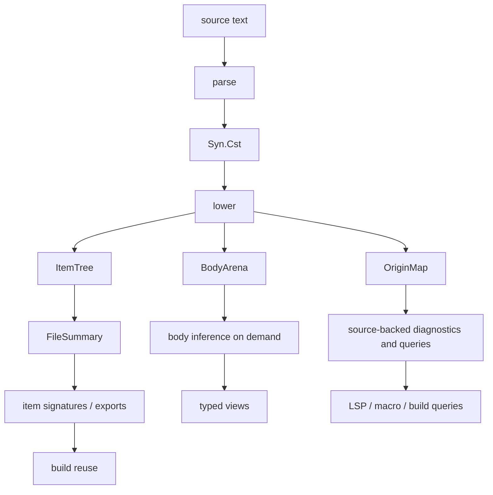
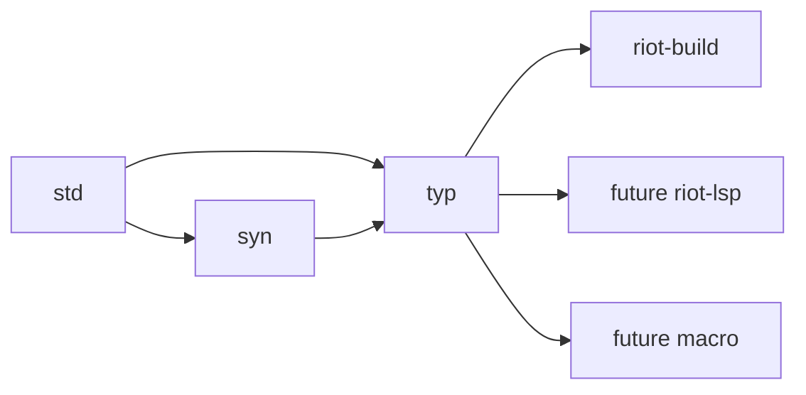

# RFD0030 - Typ Incremental Library-First Typechecker

- Feature Name: `typ_incremental_library_first_typechecker`
- Start Date: `2026-04-03`
- Status: `presented`
- RFD PR: [leostera/riot#0000](https://github.com/leostera/riot/pull/0000)
- Riot Issue: [leostera/riot#0000](https://github.com/leostera/riot/issues/0000)

## Summary
[summary]: #summary

This RFD proposes a new public `typ` package for Riot: an incremental,
library-first typechecker for the functional subset of OCaml, built from
`Syn.Cst` but semantically centered on lowered IR keyed by stable IDs.

The core architectural requirements are:

- `typ` must be usable as a library by `riot-build`, the future Riot LSP, and
  the future Riot macro system
- `typ` must not infer directly on `Syn.Cst`
- `Syn.Cst` is the authoritative source syntax and origin anchor, but name
  resolution and type inference operate on lowered semantic IR
- the long-lived incremental store is position-independent IDs, `ItemTree`,
  `BodyArena`, `FileSummary`, exports, and source maps, not raw CST nodes or
  rich typed trees
- `Typ.Tst` is a derived typed view over lowered semantic structures and source
  origins, not the primary incremental store
- all persistent checker state is explicit and externalized; query-local
  inference may use private mutation, but that mutation must not escape the
  query boundary
- typechecking must be incremental and lenient, producing partial results and
  structured diagnostics tied back to source origins
- exports must have an explicit trust model suitable for build reuse
- the public API should be query-first rather than tree-first
- the initial scope excludes the OCaml object and class systems

In short:

- `syn` owns source syntax
- `typ` lowers syntax into `ItemTree`, `BodyArena`, and `FileSummary`
- incremental state lives on stable semantic IDs and summaries
- build, LSP, and macros consume a shared query facade

## Motivation
[motivation]: #motivation

Riot now has the parser substrate needed for a real typechecker:

- `syn` exposes a faithful concrete syntax tree rooted at `Syn.Cst.SourceFile`
- `syn` preserves exact source ownership, spans, tokens, trivia, and
  attributes
- `syn` exposes an explicit visitor layer over the CST
- `syn` already treats diagnostics as structured data

That makes the next layer practical: type analysis built for Riot's own syntax
surface instead of tunneled through the OCaml compiler's parsetree and
typedtree.

This matters because Riot needs one typechecking engine for three different
consumers:

1. `riot-build`
   needs deterministic file and package checking, exported interfaces, and
   dependency-aware scheduling
2. the future Riot LSP
   needs partial results, type-at-node queries, and stable incremental
   invalidation while a file is being edited
3. the future Riot macro system
   needs fragment-oriented checking and validation of generated syntax under an
   explicit ambient typing context

Those consumers do not want three different typecheckers. They want the same
analysis engine exposed through different orchestration layers.

The OCaml compiler's `typing/` directory remains a useful technical reference.
Its own `HACKING.adoc` points to `Types`, `Typedtree`, `Env`, `Btype`,
`Ctype`, and `Typecore` as the heart of the typechecker
([vendor/ocaml/typing/HACKING.adoc](/Users/leostera/Developer/github.com/leostera/riot/vendor/ocaml/typing/HACKING.adoc#L20)).
But it also documents a shape Riot should avoid copying:

- global level and scope management in `Ctype`
- mutable type nodes and abbreviation caches in `Types`
- forward declarations through `ref` cells to break recursive module
  dependencies
- a design deeply coupled to parsetree/typedtree and the full OCaml object
  system

OCaml's own cleanup TODO names the core smells directly:

- global mutable state
- poor data representation
- missing abstraction boundary between the type algebra and the checker
- a desire for a more persistent representation around union-find and copying

([vendor/ocaml/typing/TODO.md](/Users/leostera/Developer/github.com/leostera/riot/vendor/ocaml/typing/TODO.md#L27))

That is not an argument against the OCaml compiler. It is a warning about what
Riot should not inherit by accident.

The most dangerous failure mode for this RFD would be:

- infer directly on `Syn.Cst`
- build a large `Typ.Tst`
- cache that tree as the long-lived semantic state

That would put source syntax at the center of the incremental model.
It is the wrong center of gravity for something that must serve both a compiler
and an LSP.

`Syn.Cst` is intentionally source-faithful:

- it preserves exact tokens and trivia
- it preserves parameter sugar such as `let f x = ...`
- it preserves source distinctions such as `fun` versus `function`
- it keeps some regions intentionally raw or opaque

That is excellent for parsing, rewriting, formatting, and source diagnostics.
It is not the right permanent substrate for name resolution and inference.

The design target is therefore:

- learn from OCaml's type system and error-reporting ideas
- learn from IDE-oriented architectures that separate syntax from semantic IR
- keep CST as the source layer
- make lowered IR, stable IDs, summaries, and source maps the long-lived core

## Guide-level explanation
[guide-level-explanation]: #guide-level-explanation

Contributors should think of `typ` as a library with four layers:

- source syntax
  - `Syn.Cst`
  - faithful, lossless, source-oriented
- lowered semantic IR
  - `ItemTree`
  - `BodyArena`
  - `OriginMap`
- semantic summaries
  - `FileSummary`
  - `Export`
- semantic analysis
  - name resolution
  - item signatures and exports
  - body inference on demand
- query facade
  - build queries
  - LSP queries
  - macro queries

The key rule is:

- `typ` never infers directly on `Syn.Cst`

### Long-lived state

The long-lived incremental state in `typ` should be:

- stable semantic IDs
- source IDs
- `ItemTree`
- lowered bodies
- `FileSummary`
- source maps and origin maps
- exports and other derived semantic summaries

Not:

- raw CST nodes
- offsets and spans used as semantic identity
- a giant typed tree used as the canonical cache

`Typ.Tst` may exist, but it is a derived view built from lowered IR plus source
origins. It is not the semantic ground state.

### Lowering split

The semantic IR should be split into at least two layers:

- file-level items and declarations
  - imports, opens, includes
  - module, type, and value declarations
  - type heads
  - declaration-local attributes that matter semantically
- bodies
  - normalized expressions
  - normalized patterns
  - local binders
  - explicit recovery nodes

This split is the main incremental boundary.

Changing the body of a value binding must not, by itself, invalidate unrelated
file-level or package-level summaries. Recompute of exports and cross-file
facts should be driven by summary changes, not arbitrary body edits.

### Source origins, not CST back-pointers

Typed results should not retain raw `Syn.Cst` nodes as their persistent
identity.

Instead, `typ` should use:

- `Source_id`
- `Item_id`
- `Expr_id`
- `Pat_id`
- `Origin_id`

and keep a source map:

- semantic ID -> origin ID
- origin ID -> CST node or span for a given source snapshot

That gives precise source mapping without making every semantic artifact retain
the whole CST.

### Public API shape

Contributors should think of the public `typ` API as query-first:

- `type_at`
- `definition_of`
- `scope_at`
- `diagnostics`
- `export_of`
- `signature_of_item`
- later, `references_of` and `hover_of`

`Typ.Tst` is a useful output, but it should not be the one surface every
consumer is forced to depend on.

### Session model

The library should be session-oriented, but not path-oriented at its core.

The semantic ground state should use opaque source identities so the same core
can handle:

- files on disk
- unsaved editor buffers
- generated macro fragments
- temporary or synthetic sources

`Source_id` must be stable for the lifetime of one logical source across text
updates.

That means:

- creating a source mints a `Source_id`
- editing that source updates its text while preserving the same `Source_id`
- snapshots are immutable revision views
- every query on one snapshot sees one coherent world

The mental model should be:

```ocaml
let session = Typ.Session.empty ~config:Typ.Config.default in
let session, source_id =
  Typ.Session.create_source session
    ~kind:`File
    ~origin:(`path path)
    ~text
in

let session =
  Typ.Session.update_source_text session source_id ~text:new_text
in

let snapshot = Typ.Session.snapshot session in
let diags = Typ.Query.diagnostics snapshot source_id in
let ty = Typ.Query.type_at snapshot source_id position in
...
```

### Dirty-input editor lane

This RFD treats build and editor use cases as two lanes.

- `v0` build/compiler lane
  - clean `Syn.Cst` inputs only
- later editor lane
  - a lowerable partial surface below clean `Syn.Cst`, or a partial lowering
    path from parse-recovered syntax

The clean-CST-only lane is acceptable for an initial build milestone.
It is not the whole editor architecture.

### End-to-end model



The single most important teaching point is this:

- long-lived state is lowered IR, stable IDs, summaries, and source maps
- raw CST and typed trees are derived views

## Reference-level explanation
[reference-level-explanation]: #reference-level-explanation

## 1. Package boundaries

This RFD introduces a new public package:

- `packages/typ`

The intended dependency shape is:



The responsibility split should be:

- `syn`
  owns parsing, CST shape, syntax recovery, parser diagnostics, and syntax
  traversal
- `typ`
  owns lowering, semantic IDs, source maps, name resolution, type inference,
  typed views, exports, query indexes, and type diagnostics
- `riot-build`
  owns package and workspace orchestration plus dependency-aware scheduling
- future LSP
  owns editor protocol, document lifecycle, overlays, and presentation
- future macro
  owns macro ABI, expansion lifecycle, and generated-source orchestration

`typ` should not own:

- filesystem traversal
- workspace loading
- CLI rendering
- language server protocol details
- macro transport or plugin loading

## 2. Scope

The first design scope is the functional subset of OCaml.

Included in the design target:

- literals, identifiers, tuples, lists, arrays, records, and variants
- `let`, `let rec`, `fun`, `function`, application, sequencing, and conditionals
- pattern typing and match analysis
- user-defined algebraic data types and record types
- type annotations and generalization
- interfaces and exported value/type summaries needed for cross-file typing
- fragment-oriented checking for expressions, patterns, and type expressions

Explicitly out of scope for the first milestone:

- objects
- classes
- methods
- instance variables
- the object type system

Unsupported surface syntax in those families should still lower into explicit
recovery forms. The inference engine should operate on supported IR plus
recovery nodes, not on the full surface grammar.

Module support is phased:

- `v0` module support is limited to the subset whose item structure is already
  reified by `syn` at the file shell
- nested `struct ... end`, `sig ... end`, and functor bodies lower to explicit
  recovery in `v0`
- deeper module-language support only becomes supported once `syn` exposes the
  needed nested item structure directly

This restriction is grounded in the current CST surface:

- `ModuleType.Signature` still preserves only a raw `signature_syntax_node`
  instead of nested lifted items
  ([cst.mli](/Users/leostera/Developer/github.com/leostera/riot/packages/syn/src/cst.mli#L640))
- `ModuleExpression.Structure` still preserves `item_syntax_nodes` rather than
  a nested typed item tree
  ([cst.mli](/Users/leostera/Developer/github.com/leostera/riot/packages/syn/src/cst.mli#L3009))

## 3. Core invariants

The checker should satisfy these invariants:

- `typ` never infers directly on `Syn.Cst`
- all persistent checker state is explicit and externalized
- query-local inference may use private mutation, but it must not escape the
  query boundary
- long-lived state is keyed by stable semantic IDs and source IDs
- source spans and CST nodes are origin data, not semantic identity
- the checker can emit partial results after non-fatal failures
- diagnostics always map back to source origins
- exports are first-class results with an explicit trust model
- the public API is query-first
- raw CST and rich typed trees are derived views, not the primary incremental
  store

These invariants are the architectural answer to the "no global mutable state"
constraint. They still leave room for efficient local implementations inside a
single inference query.

## 4. Semantic IDs and source maps

The core identity model should look roughly like:

```ocaml
module Source_id : sig
  type t
end

module Item_id : sig
  type t
end

module Expr_id : sig
  type t
end

module Pat_id : sig
  type t
end

module Origin_id : sig
  type t
end
```

`Source_id` should identify a source unit abstractly. It is not just a path.
It must be able to represent:

- on-disk files
- unsaved buffers
- generated macro outputs
- fragments

`Source_id` lifecycle is part of the contract:

- one logical source gets one stable `Source_id`
- text updates preserve that `Source_id`
- removing a source invalidates future queries for that ID in later snapshots
- snapshots keep earlier revisions queryable without mutating their view

`OriginMap` should relate semantic IDs back to source syntax for a specific
snapshot:

- semantic ID -> origin ID
- origin ID -> source span
- origin ID -> CST node lookup when a source snapshot is available

This keeps source mapping precise while avoiding syntax-tree identity as the
main cache key.

### ID stability tiers

Not all IDs need the same stability guarantees.

- `Source_id`
  - strong stability
  - stable for the lifetime of one logical source across text updates
- top-level `Item_id`
  - strong stability
  - stable across sibling insertions and unrelated body edits when the owning
    declaration identity survives lowering unchanged
- `Expr_id` and `Pat_id`
  - best-effort stability
  - stable within the same owning item and normalized body shape when the
    corresponding lowered node still matches
- synthetic recovery-only nodes
  - no long-term stability guarantee

This tiering should be reflected in the implementation and in architectural
tests. `typ` must not imply that every local node ID has the same durability as
top-level item identity.

## 5. Lowered IR and summaries

The semantic middle layer needs three distinct concepts, not one blurred
summary.

### `ItemTree`

`ItemTree` is the syntax-lowered, body-stable item skeleton for one source.

It owns:

- value declarations and heads
- type declarations and type heads
- imported names, opens, and includes
- module-level shells needed for export computation
- semantically meaningful declaration attributes

It should be stable over many body-local edits.

### `BodyArena`

This layer owns normalized local structure:

- expressions
- patterns
- local binders
- normalized parameter forms
- explicit recovery nodes

The body layer is where:

- local name resolution
- body inference
- local diagnostics

should primarily happen.

The main invalidation rule is:

- editing one body must not invalidate unrelated file-level summaries

### `FileSummary`

`FileSummary` is the name-resolved, export-facing summary derived from:

- `ItemTree`
- dependency inputs
- builtin and prelude environment
- any summary-level diagnostics

It owns:

- resolved item names
- visible exported names
- trusted versus errored export state
- summary-level dependency effects

`FileSummary` is not interchangeable with `ItemTree`.

### Lowering contract

Lowering must normalize source syntax into semantic forms explicitly instead of
letting later analysis depend on surface shape by accident.

The rule for every CST family must be one of:

- survives semantically
- normalized away into a canonical IR form
- preserved only in `OriginMap`
- lowered to explicit recovery

The contract should be explicit for the current `Syn.Cst` surface.

| `Syn.Cst` family | Lowering policy | Notes |
| --- | --- | --- |
| `LetBinding` plus `parameters` sugar | Normalized away into item head plus body-local lambda shape | Original parameter spelling stays in `OriginMap` |
| `Expression.Fun` | Survives semantically | Represents explicit parameterized function shape |
| `Expression.Function` | Survives semantically | Represents case-list function shape and must not be collapsed into ordinary `fun` |
| `Expression.Apply` chains | Normalized into canonical callee plus argument list form | Application associativity becomes semantic structure rather than CST nesting accidents |
| `Expression.Parenthesized` and most delimiter shells | Origin-only | Preserve for source mapping and diagnostics, not semantic identity |
| `Expression.TypeAscription` | Survives semantically | Carries checking expectations and explicit user constraints |
| `Pattern.Parenthesized` and punctuation-only pattern shells | Origin-only | No semantic identity of their own |
| `StructureItem.Comment`, `StructureItem.Docstring`, `SignatureItem.Comment`, `SignatureItem.Docstring` | Origin-only | Not part of semantic IR |
| Trivia, separators, and token ownership details | Origin-only | Never used as semantic identity |
| `ModuleExpression.Structure` with raw `item_syntax_nodes` | Recovery in `v0` | No nested semantic lowering in `v0` because nested item tree is not yet reified |
| `ModuleType.Signature` with raw `signature_syntax_node` | Recovery in `v0` | Same restriction as nested `struct` bodies |
| Object/class families | Recovery in `v0` | Outside first checker subset |

This normalization policy is part of the architecture, not formatter-level
cleanup.

## 6. Name resolution and exports

Lowering must be followed by explicit name-resolution and export phases.

The checker should not treat exports as an accidental byproduct of building a
typed tree. Exports should be their own durable result class.

This RFD proposes three export result states:

- `Trusted_export`
- `Errored_export`
- `No_export`

The intended rules are:

- explicitly annotated values or signature items may still produce a
  `Trusted_export` even if their bodies have local errors, provided the exposed
  interface is independently checkable
- an unannotated binding whose inference failed must not export a generalized
  scheme for downstream typing
- unresolved opens, includes, or other summary-level failures may downgrade a
  file from `Trusted_export` to `Errored_export` or `No_export`
- editor-facing local information may still exist even when the package-facing
  export is not trusted

This trust model is necessary so build reuse and editor leniency do not fight
each other.

Dependency inputs must also be keyed and provenance-carrying. `typ` should not
accept an unstructured bag of exports. At minimum, dependency-facing semantic
inputs need:

- dependency identity
- visible-name or import-path provenance
- export payload
- revision or fingerprint

That is the minimum needed for reliable invalidation.

## 7. Inference model

The internal type language should support:

- rigid and flexible variables
- quantified schemes
- named constructors
- function, tuple, record, and variant types
- recovery and hole forms

The inference engine should accept lowered IR, not surface CST. At minimum:

```ocaml
type infer_ctx

val infer_expr :
  infer_ctx -> Expr_id.t -> infer_ctx * Typ_view.expression
```

The implementation may use private mutation inside one query for:

- local union-find
- fresh-variable supply
- worklists
- query-local diagnostic accumulation

But once a query returns, its observable outputs must be frozen into explicit
results.

This is the intended mutation rule:

- persistent state is explicit, revisioned, and snapshot-friendly
- query-local mutation is allowed and private

## 8. Typed views

`Typ.Tst` should exist as a typed view over lowered semantic structures plus
source origins.

It should preserve:

- semantic IDs
- inferred types
- source origins
- recovery state

It should not be the canonical store of:

- incremental identity
- export summaries
- all environment information

The checker should avoid storing a full environment on every node the way the
OCaml compiler stores `exp_env` on typed expressions
([vendor/ocaml/typing/typedtree.mli](/Users/leostera/Developer/github.com/leostera/riot/vendor/ocaml/typing/typedtree.mli#L162)).
Instead, `typ` should build compact queryable indexes and scope summaries.

## 9. Public API

The stable public API should be query-first, not tree-first.

Conceptually:

```ocaml
module Typ : sig
  module Session : sig
    type t
    type snapshot

    val empty : config:Config.t -> t

    val create_source :
      t ->
      kind:[ `File | `Fragment | `Generated ] ->
      origin:[ `path of Path.t | `virtual_ of string ] ->
      text:string ->
      t * Source_id.t

    val update_source_text :
      t -> Source_id.t -> text:string -> t

    val set_dependency_export :
      t ->
      dep:Dependency_id.t ->
      visible_as:Import_path.t option ->
      fingerprint:Export_fingerprint.t ->
      export:Export.t ->
      t

    val snapshot : t -> snapshot
  end

  module Query : sig
    val diagnostics : Session.snapshot -> Source_id.t -> Diagnostic.t list
    val export_of : Session.snapshot -> Source_id.t -> export_result
    val type_at : Session.snapshot -> Source_id.t -> Position.t -> Ty.t option
    val definition_of :
      Session.snapshot -> Source_id.t -> Position.t -> Definition.t option
    val scope_at : Session.snapshot -> Source_id.t -> Position.t -> Scope.t option
    val signature_of_item :
      Session.snapshot -> Item_id.t -> Signature.t option
    val typed_view_of_source :
      Session.snapshot -> Source_id.t -> Tst.source_file option
  end
end
```

This does not freeze exact names. It freezes the direction:

- sessions and snapshots
- opaque source identities
- query results
- typed views as optional derived artifacts

`Session.snapshot` should return an immutable revision view. Queries against one
snapshot must observe one coherent semantic world even if the outer mutable host
session continues receiving updates.

## 10. Fragment checking

Fragment checking needs more than `env`.

The public fragment API should use an explicit `Fragment_context`:

```ocaml
module Fragment_context : sig
  type t = {
    source_id : Source_id.t;
    owner_scope : Scope_id.t option;
    opened_modules : Module_ref.t list;
    type_params_in_scope : Type_param.t list;
    value_env : Value_binding.t list;
    expected : Ty.t option;
    origin_anchor : Origin_id.t option;
  }
end
```

That gives macros and LSP features enough structure to compose with caching,
diagnostics, and source maps.

## 11. Dirty-input lane

The library should acknowledge two lanes explicitly.

### `v0` build/compiler lane

- input requires clean `Syn.Cst`
- main goal is deterministic file and package typing
- outputs include diagnostics, exports, and queries over trusted syntax
- module support is limited to the subset whose nested item structure is
  already reified by `syn` at the file shell

### later editor lane

- input may come from parse-recovered syntax or a lowered partial surface below
  clean `Syn.Cst`
- lowering should still produce partial IR with recovery nodes
- editor queries should continue to return best-effort local results

This makes the build milestone honest without pretending that clean-CST-only is
already an LSP-complete boundary.

## 12. Diagnostics

`typ` diagnostics should remain separate from parser diagnostics, just as Riot
already keeps parse diagnostics separate from later analysis diagnostics in
`riot-fix`
([packages/riot-fix/src/pipeline.mli](/Users/leostera/Developer/github.com/leostera/riot/packages/riot-fix/src/pipeline.mli#L4)).

Each diagnostic should support:

- one primary source origin
- zero or more secondary labels
- notes
- machine-readable code
- optional mismatch or expectation trace

The checker should model at least these families explicitly:

- unbound value
- unbound type constructor
- type mismatch
- invalid recursive binding
- non-exhaustive pattern match
- redundant match case
- unsupported syntax in the current checker subset

Pattern exhaustiveness and redundancy analysis should remain a distinct
subsystem, even if it lives under the same package.

## 13. Parallelism

The checker should be parallel-friendly without becoming actor-shaped at its
core.

The split is:

- core lowering and inference for one query stay deterministic and explicit
- batch surfaces expose independent work units and mergeable outputs
- build-oriented callers may schedule those units with `Std.WorkerPool`
  ([packages/std/src/worker_pool/worker_pool.mli](/Users/leostera/Developer/github.com/leostera/riot/packages/std/src/worker_pool/worker_pool.mli#L1))

Potential parallel units include:

- independent files in a dependency layer
- imported interface decoding
- export recomputation for already-lowered dependencies

The RFD does not require parallelism inside unification or local inference.

## 14. Testing strategy

`typ` should be snapshot-tested from the beginning with:

- `Std.Test.FixtureRunner`
- `Std.Test.Snapshot`

([packages/std/src/test/fixture_runner.mli](/Users/leostera/Developer/github.com/leostera/riot/packages/std/src/test/fixture_runner.mli#L1),
[packages/std/src/test/snapshot.mli](/Users/leostera/Developer/github.com/leostera/riot/packages/std/src/test/snapshot.mli#L1))

The first fixture families should snapshot:

- `ItemTree`
- lowered bodies
- `FileSummary`
- typed views
- diagnostics
- exports
- selected query results

Architecture tests are also required. `typ` should lock down invalidation and
identity behavior with tests such as:

- whitespace-only edit does not change exports
- editing inside one body does not invalidate unrelated file summaries
- inserting a sibling item does not renumber stable IDs for unrelated items
- updating a source preserves `Source_id`
- stale snapshots do not corrupt the current session
- one unresolved name recovers locally instead of causing a diagnostic cascade

These are architectural invariants, not implementation afterthoughts.

## 15. V0 support matrix

The table below makes the `v0` lowering policy explicit.

| Syntax family | `v0` lowering status | `v0` diagnostic expectation | `v0` export effect |
| --- | --- | --- | --- |
| Top-level `let`, `type`, `exception`, `external`, `val` | Supported | ordinary typing diagnostics | trusted or errored depending on item result |
| Top-level `open` and `include` with supported targets | Supported | unresolved/import diagnostics as needed | may downgrade file summary if unresolved |
| Function bodies, patterns, matches, ADTs, records | Supported | ordinary body and match diagnostics | body-local failures do not automatically poison unrelated items |
| Parameter sugar such as `let f x = ...` | Normalized | none beyond ordinary typing diagnostics | same as normalized item |
| Comments, docstrings, trivia, separator ownership | Origin-only | none from lowering alone | no export effect |
| Objects, classes, methods, instance variables | Recovery-only | unsupported-syntax diagnostic | no trusted export from affected constructs |
| Local modules, first-class modules, functors | Recovery-only in `v0` | unsupported-syntax diagnostic | no trusted export from affected constructs |
| Nested `struct ... end` and `sig ... end` bodies | Recovery-only in `v0` | unsupported-syntax diagnostic | no trusted export from affected constructs |
| Parse-recovered dirty syntax for the editor lane | Not part of clean-CST `v0` | parser diagnostics plus future partial-lowering diagnostics | not trusted for build exports |

This matrix should be revised only by changing the underlying architectural
support and tests, not by silently broadening behavior in implementation code.

## 16. Proposed phased rollout

### Phase 0

- create `packages/typ`
- define source IDs, semantic IDs, `ItemTree`, `BodyArena`, `FileSummary`, and
  origin maps
- add fixture-backed snapshots for lowering and diagnostics
- support the clean-CST build/compiler lane for the functional subset

### Phase 1

- add name resolution and export trust states
- add query-first session and snapshot APIs
- add body inference and typed views

### Phase 2

- add broader cross-file checking for ordinary Riot package builds
- add type-at, definition-of, and scope-at query surfaces
- add architecture tests for invalidation and stable IDs

### Phase 3

- add the editor lane for dirty inputs and partial lowering
- integrate the same session and query model into LSP and macro workflows
- broaden supported module-language features where needed

## Drawbacks
[drawbacks]: #drawbacks

- This architecture is more opinionated than "just build a typed tree from the
  CST".
- Introducing a real lowering layer adds design work up front.
- Stable IDs, source maps, and export trust states increase the number of core
  concepts contributors must learn.
- A query-first API may feel less direct to callers who just want a tree.
- Supporting build, LSP, and macro use cases in one package increases the
  number of constraints that must be balanced early.

## Rationale and alternatives
[rationale-and-alternatives]: #rationale-and-alternatives

### Why this design

This design is the best fit for Riot because it treats the typechecker as a
shared semantic engine rather than a compiler-only phase.

It matches:

- Riot's faithful parser architecture
- Riot's in-process build architecture
- Riot's editor-tooling ambitions
- Riot's macro plans

### Alternative: infer directly on `Syn.Cst`

Rejected.

`Syn.Cst` is the right source layer and the wrong long-lived semantic layer.
Its fidelity to tokens, trivia, sugar, and raw surface distinctions is a
strength for parsing and rewriting, not a reason to make it the semantic cache.

### Alternative: make `Typ.Tst` the primary store

Rejected.

Typed views are useful, but they should remain derived from lowered IR plus
origins. Making them the primary incremental store would tie too much semantic
state to tree shape and source representation.

### Alternative: wrap `vendor/ocaml/typing`

Rejected as the primary design.

The OCaml compiler remains useful prior art for:

- generalization
- mismatch explanation
- pattern typing
- match analysis

But its internal state model and public data shape are poor fits for Riot's
library-first goals.

### Alternative: ban all mutation

Rejected.

The real requirement is not "no mutation anywhere". It is:

- no hidden global persistent mutation
- explicit, revisioned cross-query state
- local mutation allowed inside a query if it does not escape

### Alternative: path-based source identity

Rejected.

Paths are one possible origin for a source. They are not the core semantic
identity if Riot wants to support unsaved buffers, generated files, and
fragments cleanly.

## Prior art
[prior-art]: #prior-art

### OCaml compiler `typing/`

The OCaml compiler remains the most relevant technical reference for:

- core type-system behavior
- generalization and scheme handling
- mismatch explanation
- pattern analysis

It is also an important negative reference for:

- global mutable state
- mutable public type representation
- forward declaration refs as a structural norm

### Lowered-IR-first analysis engines

This RFD intentionally follows the general lesson from modern incremental
analysis systems: keep syntax isolated, lower into more compact semantic
representations, and make semantic identities position-independent.

### Incremental query systems

This RFD also follows the general lesson from incremental query systems:

- explicit inputs
- deterministic derived queries
- snapshot-friendly parallel reads
- local implementation freedom inside one query

### Incremental parsing under edits

The editor lane in this RFD is motivated by the same general requirement as
incremental parsing systems: useful answers under ongoing edits and syntax
errors are a first-class tool requirement, not optional polish.

## Unresolved questions
[unresolved-questions]: #unresolved-questions

- Should typed holes have source syntax in the first implementation, or only an
  internal recovery representation?
- What is the right stable-origin granularity for body-local constructs that
  come from sugared surface forms?
- What exact declaration facts should participate in top-level `Item_id`
  identity matching when sibling ordering changes?
- Which typed views should be public and pattern-matchable, and which should
  stay behind query helpers to preserve refactoring freedom?
- What is the exact shape of `Scope_id`, `Definition`, and `Signature` in the
  query facade?

## Future possibilities
[future-possibilities]: #future-possibilities

- Cross-file query APIs for references, hover, completion, and workspace-wide
  symbol search
- macro expansion validation that reuses `Typ.Session` directly
- richer pedagogical mismatch traces for editor and CLI presentation
- broader module-language coverage beyond the first build-oriented subset
- multiple typed-view projections over the same lowered semantic store for
  different consumers
