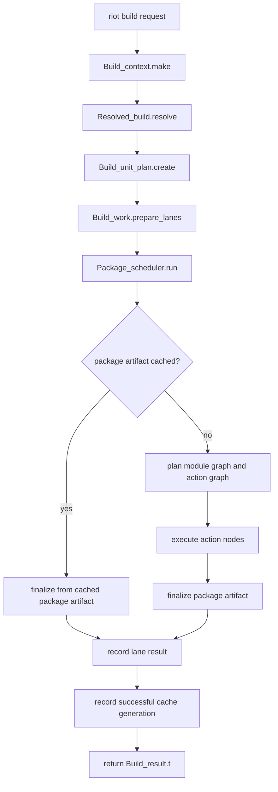

# RFD0047 - Riot Build Planner and Scheduler Snapshot

- Feature Name: `riot_build_planner_system_snapshot`
- Start Date: `2026-05-06`
- Status: `implemented`

## Summary
[summary]: #summary

This RFD documents Riot's current build planner and scheduler architecture as
a snapshot RFD. It captures the system after the build-unit graph, per-target
lanes, dynamic package/action scheduler, package artifact cache, and warm
multi-target cache path were brought into one build flow.

- one build request becomes one build-unit graph across the selected packages,
  targets, profile, and artifact kinds
- each target runs through a locked build lane with its own toolchain, build
  context, store view, and cloned build-unit graph
- package planning, action execution, and package finalization are scheduled as
  one typed work graph
- cached package artifacts can short-circuit before module/action planning;
  uncached packages expand into action nodes lazily
- this snapshot does not define conditional compilation syntax, remote
  execution, remote cache behavior, or a long-lived build daemon

## Motivation
[motivation]: #motivation

Riot's build path is no longer a simple sequence of "plan packages, then build
packages." A normal command such as:

```sh
riot build --all -x all
```

now spans several interacting systems:

- command request resolution in `riot-build`
- build-unit graph creation in `riot-planner`
- target/profile lane preparation in `riot-build`
- package artifact and action artifact lookup in `riot-store`
- package-level planning in `riot-planner`
- dynamic action scheduling and finalization in `riot-build`
- cache generation recording after successful builds
- human and JSON event streams emitted by `riot-cli`

Without a current snapshot, ordinary debugging questions become too expensive:

- why did a package wait before planning?
- why did a warm build still scan sources?
- why did a package report a module as unavailable?
- why did a native package appear cached when `.o` files were missing?
- why did `--all -x all` behave like several separate builds?
- where does a cache hit bypass planning, and where does it still need package
  dependencies to be finalized?

These questions are not incidental. Riot's build system is intentionally split
across packages, and the responsibilities are now finer-grained than in the
older build-system snapshot. The code also has concurrency-sensitive invariants:
build-unit graphs are cloned per lane, package state is guarded, package hash
computation is coordinated, and dynamic scheduler mutations must not share
mutable nodes across independent target lanes.

The recent performance target also makes the architecture worth recording.
After the planner and scheduler work, a fully warm local build of the Riot
workspace across all selected packages and targets was measured at roughly:

```text
./riot build --all -x all
ok finished in 0.48s (1567 cached)
```

The important point is not that this exact number is universal. It is that the
architecture has a specific warm-path shape: create one build-unit graph, clone
it into lanes, schedule package plan/finalize work, use package metadata to
short-circuit cached units, and avoid expanding module/action graphs for work
that is already available in the store.

If Riot does not document this shape, future changes can easily regress it by:

- reintroducing per-target build loops above the scheduler
- sharing mutable graph nodes between lanes
- treating package cache hits as action graph cache hits
- adding string-key or sort-heavy bookkeeping in hot paths
- adding source scans before cache metadata has a chance to answer
- emitting events too late to explain quiet planning or finalization gaps

This snapshot exists so build-system contributors can change the system with a
shared model instead of rediscovering these invariants through failures.

## Guide-level explanation
[guide-level-explanation]: #guide-level-explanation

Suppose a contributor runs:

```sh
riot build --all -x all
```

The current mental model is one build request, one shared build-unit plan, and
one scheduler run over all prepared lanes. Riot does not run a separate build
session for each target. It resolves the request, creates a graph of the build
units that may be needed, prepares a lane for each selected target, and then
lets the package scheduler drive planning, action execution, and finalization.

### Build units

A build unit is the package-level thing Riot is trying to make available. It is
identified by:

```ocaml
{
  package: Package_name.t;
  artifact: Build_unit.artifact_kind;
  target: Target.t;
  profile: Profile.t;
}
```

The artifact kind says what package-level output this unit represents:

```ocaml
type artifact_kind =
  | Library
  | RuntimeBinary of { name: string }
  | TestBinary of { name: string }
  | ExampleBinary of { name: string }
  | BenchBinary of { name: string }
  | SyntheticTool of { name: string }
```

Example build-unit keys look like:

```text
kernel:library:aarch64-apple-darwin:debug
std:test-bin:std_json_tests:aarch64-apple-darwin:debug
krasny:bench-bin:format_pipeline_bench:x86_64-unknown-linux-gnu:debug
fixme-runner:synthetic-tool:fixme-runner:aarch64-apple-darwin:debug
```

That is the package-level graph. It is not the module graph and it is not the
compiler action graph. A build unit can later expand into many compile, link,
copy, write, and foreign build actions, but warm cache hits can finalize the
build unit without expanding those actions at all.

### Lanes

A lane is the target/profile execution environment for a build unit. For
example, `--all -x all` may create one lane for the host target and additional
lanes for cross targets.

Each lane owns:

- the selected target
- the profile name
- the target-specific `Build_ctx.t`
- the initialized toolchain
- the lane-specific store paths
- the build lock for that target/profile
- a cloned build-unit graph
- the build units that belong to that target

The clone is deliberate. Graph nodes and dependency sets are mutable in the
graph implementation, and lanes must not share those mutable nodes while the
scheduler is running.

### Package scheduler

For each build unit in each lane, Riot creates package-level scheduler work:

```ocaml
type work_item =
  | PlanPackage of { lane; unit_key }
  | ExecuteAction of { lane; unit_key; action }
  | FinalizePackage of { lane; unit_key }
```

The initial graph contains plan and finalize nodes. A finalize node depends on
its package plan node. A plan node depends on the finalize nodes of build-unit
dependencies.

When a package plan runs, there are two possible outcomes:

1. The package artifact is cached. Riot records a final package result without
   creating module or action nodes.
2. The package needs execution. Riot asks the package planner for a module
   graph and action graph, then dynamically adds ready action nodes into the
   same scheduler.

So the scheduler is not "plan everything, then execute everything." It starts
with package plan/finalize structure and grows action nodes only for packages
that require execution.

### End-to-end flow



### What contributors should look at

When debugging build behavior, start from the layer that owns the question:

- request shape and public errors: `packages/riot-build/src/build_core.ml`
- target and package resolution: `packages/riot-build/src/resolved_build.ml`
- build-unit graph creation: `packages/riot-planner/src/build_unit_graph.ml`
- build-unit plan creation: `packages/riot-build/src/build_unit_plan.ml`
- lane preparation: `packages/riot-build/src/build_lane.ml`
- dynamic scheduling: `packages/riot-build/src/graph_scheduler.ml`
- package scheduling: `packages/riot-build/src/package_scheduler.ml`
- package planning and cache fast paths:
  `packages/riot-planner/src/package_planner.ml`
- artifact persistence and metadata lookup: `packages/riot-store/src/store.ml`
- human/TUI and JSON output: `packages/riot-cli/src/build.ml`

The most useful trace knob for package planner work is:

```sh
RIOT_PLANNER_TRACE=1 riot build ...
```

For command-level behavior, `--json` remains the stable event stream for
agents and profiling tools.

## Reference-level explanation
[reference-level-explanation]: #reference-level-explanation

### Request boundary

The public build facade is `Build_core.build`:

```ocaml
let build = fun ?on_event request ->
  let* context = make_context ?on_event request in
  let* spec = resolve context request in
  execute context spec
```

That boundary is intentionally small:

1. `Build_context.make` creates the per-command context.
2. `Resolved_build.resolve` turns CLI-level intent into selected packages,
   targets, scope, profile, and dev artifacts.
3. `Build_runtime.execute` runs the target-aware build.
4. `Build_result.from_build_results` returns the caller-facing result.

`riot-cli` owns command parsing and rendering. `riot-build` owns the build
session after the request has become typed build input.

### Build-unit graph request

`Build_unit_plan.request_of_resolved` converts the resolved build into a
`Build_unit_graph.request`:

```ocaml
type request_kind =
  | Runtime
  | Dev of Package.dev_artifacts

type request = {
  roots: Package_name.t list option;
  targets: Target.t list;
  profile: Profile.t;
  kind: request_kind;
  synthetic_tools: synthetic_tool list;
}
```

`Runtime` means the request needs normal runtime artifacts. `Dev` carries the
selected test/example/bench artifacts. Synthetic tools let build-time generated
packages such as `fixme-runner` participate in the same graph model.

The build-unit graph creates package/artifact/target/profile units, not source
file actions. This keeps the graph cheap enough to create eagerly and gives the
scheduler a package-level readiness structure before any expensive package
planning begins.

### Build-unit identity

`Build_unit.t` stores both its key and a hash id:

```ocaml
type key = {
  package: Package_name.t;
  artifact: artifact_kind;
  target: Target.t;
  profile: Profile.t;
}

type id = Crypto.hash

type t = {
  id: id;
  key: key;
  package: Package.t;
}
```

The id is derived from the key string. This lets hot scheduler and graph paths
compare compact hash identities instead of repeatedly comparing nested package,
target, profile, and artifact values.

The id is an identity for graph bookkeeping. It is not the package artifact
input hash and it is not the artifact output hash.

### Build-unit graph creation

The build-unit graph is created in three conceptual phases:

1. create graph context and package table
2. create node specs for requested roots, synthetic tools, and dependency
   libraries
3. add graph nodes, wire dependency edges, and validate the graph

The important behavior is that root artifacts and library dependency closure
are computed before the scheduler runs. For a `Dev` request, tests, examples,
and benchmarks are roots when requested, but ordinary dependencies remain
library units unless they are explicitly selected as dev roots.

This is the invariant behind:

```text
riot build --all
```

building the workspace's dev artifacts without treating every dependency's
tests, examples, and benchmarks as part of the request.

### Graph cloning per lane

`Build_lane.prepare` receives the shared build-unit plan and creates a
target-specific lane. As part of that preparation, it clones the build-unit
graph:

```ocaml
build_unit_graph =
  Riot_planner.Build_unit_graph.clone (Build_unit_plan.graph plan.build_unit_plan)
```

This clone is not optional bookkeeping. The graph implementation stores mutable
node and dependency state. Reusing the same graph across lanes can create
cross-target data races and invalid module-availability results, especially
under `--all -x all`.

The lane also filters build units to its target:

```ocaml
let build_units =
  Build_unit_plan.units plan.build_unit_plan
  |> List.filter ~fn:(fun unit -> Target.equal (Build_unit.target unit) target)
```

The scheduler uses the lane's `build_unit_keys` and the lane's cloned graph to
compute dependencies.

### Lane preparation

A prepared lane contains:

```ocaml
type 'stage t = {
  target: Target.t;
  workspace: Workspace.t;
  package_names: Package_name.t list;
  scope: Resolved_build.scope;
  profile_name: string;
  session_id: Session_id.t;
  host: Target.t;
  build_ctx: Build_ctx.t;
  toolchain: Riot_toolchain.t;
  store: Riot_store.Store.t;
  lock: Build_lock.t;
  build_unit_plan: Build_unit_plan.t;
  build_unit_graph: Build_unit_graph.t;
  build_units: Build_unit.t list;
  build_unit_keys: Build_unit.key list;
}
```

The lane preparation step:

1. waits for the target/profile build lock
2. initializes the host or cross toolchain
3. constructs the target-aware `Build_ctx.t`
4. creates the lane store with `Riot_store.Store.create_for_lane`
5. clones the build-unit graph
6. records lane preparation events

The build lock protects target/profile output paths. It does not replace the
content-addressed store, and it does not serialize independent lanes unless
they refer to the same target/profile output space.

### Package scheduler graph

The package scheduler converts build units into graph-scheduler nodes:

```ocaml
PlanPackage(unit)
FinalizePackage(unit)
```

Then it wires:

- `FinalizePackage(unit)` depends on `PlanPackage(unit)`
- `PlanPackage(unit)` depends on each dependency unit's
  `FinalizePackage(dependency)`

The dependency keys are precomputed per unit and stored in the scheduler state.
That avoids repeatedly walking cloned build-unit graphs on hot dependency
checks.

Package states are:

```ocaml
type package_state =
  | AwaitingPlan
  | AwaitingFinalization of execution_state
  | Finalized of {
      source: finalized_source;
      detailed_result: Package_builder.detailed_result;
    }
```

Dependency checks read finalized dependency results, collect failed
dependencies, and build the `depset` passed into the package planner. This is
why a package plan node depends on dependency finalization, not only dependency
planning.

### Dynamic graph scheduler

`Graph_scheduler` is a generic dynamic scheduler over typed work payloads. It
tracks:

- graph nodes
- unresolved dependency counts
- ready queue
- running worker tasks
- dynamic mutations
- events
- completed results

Work functions return commands through a handle:

```ocaml
type command =
  | Add_node of { local_id; payload }
  | Add_dependency of { node; depends_on }
  | Record_mutation of mutation
  | Emit_event of event
  | Complete_node of { node; outcome }
```

That command model lets `PlanPackage` add `ExecuteAction` nodes after package
planning discovers the action graph. It also keeps scheduler mutation
centralized: workers produce commands, the scheduler applies them.

The build uses `Continue_on_failure` mode so independent work can continue
after some packages fail. Dependent packages can still be skipped when their
required dependencies fail.

### Package planning and cache fast paths

`Package_planner.plan_build_unit_with_cache` owns package-level planning. Its
main job is to answer:

```ocaml
type plan_result =
  | Cached of {
      unit_key: Build_unit.key;
      package: Package.t;
      hash: Crypto.hash;
      artifact: Riot_store.Artifact.t;
      depset: Dependency.t list;
      exports: Riot_store.Store.export_entry list;
      breakdown: planning_breakdown;
    }
  | Planned of {
      unit_key: Build_unit.key;
      package: Package.t;
      module_graph: Module_node.t Graph.SimpleGraph.t;
      action_graph: Action_graph.t;
      hash: Crypto.hash;
      depset: Dependency.t list;
      breakdown: planning_breakdown;
    }
```

The warm path is:

1. check dependency package state and build the `depset`
2. compute a dependency-aware package input hash
3. look up package artifact metadata in `riot-store`
4. verify native object completeness when native outputs are involved
5. return `Cached` without module/action planning if the artifact is usable

The cold or changed path is:

1. compute the same input hash
2. miss the package artifact fast path
3. optionally load a cached plan bundle
4. otherwise build the module graph and action graph
5. return `Planned`

The input hash includes the planner version, build context, toolchain hash,
package source hash, workspace-specific dependency information, and dependency
output hashes. This is what prevents a package from reusing an artifact when
one of its dependency artifacts changed underneath it.

### Native artifact completeness

Native archives and linked binaries need object files such as generated C
outputs and compiled native objects. A package metadata hit is not enough if
the native object files are absent from the store.

The package planner therefore checks native object completeness before
accepting a metadata-only package artifact hit. This matters for errors shaped
like:

```text
ld: cannot find std_crypto.o: No such file or directory
```

The cache invariant is:

- if package planning returns `Cached`, downstream link actions must be able to
  materialize the package exports and native objects they depend on
- if the store cannot prove that, the package must be planned and rebuilt

### Action execution and finalization

When package planning returns `Planned`, `Package_builder` creates an execution
plan:

```ocaml
type execution_plan = {
  unit_key: Build_unit.key;
  package: Package.t;
  module_graph: Module_node.t Graph.SimpleGraph.t;
  action_graph: Action_graph.t;
  hash: Crypto.hash;
  depset: Dependency.t list;
  started_at: Instant.t;
  emit_visible_progress: bool;
}
```

The package scheduler dynamically inserts one `ExecuteAction` node per action
graph node. Each action node depends on the action nodes discovered by the
package action graph.

Action execution records either an executed artifact, a cached action artifact,
or an action failure. Package finalization gathers completed action results,
computes export entries, saves the package artifact, and records the final
package result.

This is the boundary between action-level caching and package-level caching:

- action cache entries are useful while executing an uncached package plan
- package cache entries are useful before action planning
- package finalization records export entries that downstream packages use as
  package-level dependencies

### Store metadata, input hash, and output hash

`riot-store` persists artifacts by input hash and records an output hash in
metadata:

```ocaml
type artifact = {
  input_hash: Crypto.hash;
  output_hash: Crypto.hash;
  size_bytes: int64;
  ocamlc_warnings: string list;
  exports: Manifest.export_entry list;
}
```

The input hash is the cache key for "this exact planned work under this exact
dependency context." The output hash describes the files and exports produced
by that work.

The distinction is important:

- dependencies use output hashes to invalidate downstream input hashes
- the store uses input hashes to locate package and action artifacts
- cache generation receipts record input hashes and export action hashes for
  successful builds

This model is stronger than only keying packages by source hashes. It catches
dependency output changes even when the dependent package's own source files
did not change.

### Cache generation recording

After successful lane execution, `Build_runtime` records a cache generation.
It collects:

- lanes involved in the successful build
- package artifact input hashes referenced by each lane
- exported action hashes referenced by package artifacts
- newly built package artifact sizes

The cache GC layer uses those generation receipts to keep recently used cache
state alive and discard older unused entries according to workspace policy.

Generation recording is skipped for partial-failure builds so failed runs do
not define the live cache set.

### Events and traceability

The current build emits events for:

- target resolution
- toolchain ensure/validation
- runtime start
- build-lane preparation
- package planning start/source/finish
- action graph planning
- action execution
- package finalization
- cache generation recording
- returning results

The human TUI consumes these events to show active work. JSON mode keeps the
full event stream for agents, profiling, and regression analysis.

The event model is part of the architecture. Planning and finalization can be
real work, and the event stream should make those phases visible when they
take measurable time.

### Current invariants

The current system relies on these invariants:

- A build-unit key uniquely identifies package, artifact kind, target, and
  profile.
- Build-unit ids are stable hashes of build-unit keys.
- A build lane owns a cloned build-unit graph.
- Package plan nodes depend on finalized dependency units.
- Finalized dependency results are the source of the `depset`.
- A package cache hit may bypass module/action planning.
- A package cache hit must still prove package exports and native outputs are
  materializable.
- Dynamic action nodes are added only by scheduler commands.
- Package state mutation goes through scheduler mutations or guarded package
  state storage.
- Successful cache generations are recorded after lane results are known.
- Human output is a projection of structured events; command logic should not
  print outside reporters.

## Drawbacks
[drawbacks]: #drawbacks

The current architecture is more concept-heavy than a small sequential build
loop. Contributors need to understand build units, lanes, package plans, action
graphs, package artifacts, action artifacts, and cache generations.

The warm path is fast because it is careful, but that means correctness is tied
to cache metadata quality. If package metadata says an artifact is available
when native objects are missing, the failure can surface later during linking.
The planner therefore has to keep cache-hit checks conservative.

The dynamic scheduler is powerful, but it moves complexity into scheduler
invariants. It must keep ready queues, runtime node state, dynamic mutations,
and failure behavior coherent while workers run concurrently.

The build-unit graph is still package-level. It does not by itself solve
module-level incremental planning, target-specific conditional compilation, or
long-lived source scan caching.

This RFD is also a snapshot. It describes the current system and will become
less accurate as the build system evolves.

## Rationale and alternatives
[rationale-and-alternatives]: #rationale-and-alternatives

### Why keep a build-unit graph instead of only action graphs?

Because package-level readiness is much cheaper to compute eagerly than full
module/action plans for every package. A fully warm build should not parse,
plan, and action-expand `std` if the package artifact is already available.

The build-unit graph gives Riot enough structure to know which package
artifacts depend on which other package artifacts. The package planner can then
stop at metadata for cached units and expand only changed or missing units.

### Why not eagerly plan every module/action graph?

Eager full planning is simpler to reason about, but it spends work on packages
that will later be answered by the store. That hurts warm builds most, where
the expected answer for most packages is "cached."

The current architecture keeps eager planning at the package/artifact graph
level and lazy planning at the module/action graph level.

### Why not run one build per target?

Running one build per target makes the implementation easier, but it repeats
setup costs and makes `--all -x all` behave like several unrelated builds. It
also hides cross-target scheduling opportunities and makes the event stream
look like a sequence of separate sessions.

The current architecture resolves targets once, creates lanes, and schedules
all lane work through one package scheduler run.

### Why not share one graph across lanes?

That was rejected because mutable graph nodes and dependency sets can leak
state between targets. Cross-target builds then fail in confusing ways, such as
module availability checks seeing state from another lane.

The current architecture clones the build-unit graph per lane and treats that
clone as lane-owned state.

### Why not cache per-run source fingerprints globally?

A per-run source fingerprint cache was explored and rejected in its first form
because it added mutex contention and regressed warm build time. The lesson is
that source and package hash caching is valuable, but hot-path shared mutable
caches must be designed around contention, not only avoided recomputation.

The current package input hash cache coordinates package and toolchain hash
work where it pays for itself during one build run.

### Why not make package planning completely streaming?

Streaming package planning could start work earlier, but dependency resolution
needs finalized dependency outputs to construct correct dependency-aware input
hashes. Planning a downstream package before dependency outputs are known would
either be speculative or would compute a weaker hash.

The current scheduler allows dynamic expansion after dependency finalization.
That is a conservative point in the design: packages plan when their package
dependencies are finalized.

## Prior art
[prior-art]: #prior-art

Riot's current model borrows ideas from several build-system families without
copying one of them exactly.

Ninja-style action graphs are a useful reference for explicit dependency
execution, but Riot currently keeps a package-level cache gate before action
graph expansion. That lets warm package artifacts avoid module/action planning.

Bazel and Buck-style systems show the value of stable action keys,
content-addressed outputs, and separating analysis from execution. Riot uses
input hashes and output hashes in a similar spirit, but the current system is a
local one-shot build rather than a remote-execution-first engine.

Dune is relevant because it is an OCaml build system with module-level
knowledge, generated artifacts, and package/library boundaries. Riot differs by
using Riot workspace/package metadata and by explicitly scheduling
package-level plan/finalize work alongside action work.

Shake-style build systems are relevant because they model builds as dynamic
dependency discovery. Riot's package scheduler has a similar flavor: the
initial graph contains package work, and action nodes are added as planning
discovers them.

Inside Riot, this snapshot supersedes parts of:

- RFD0003, which documented the older steady-state build path
- RFD0031, which described lazy dependency materialization
- RFD0032, which described cache generations and GC
- RFD0043, which proposed the unified build session and work scheduler
- RFD0045, which described target-specific module reachability pressure

Those RFDs remain useful historical context. This snapshot records the current
shape after the scheduler and cache work landed.

## Unresolved questions
[unresolved-questions]: #unresolved-questions

- Can source scanning and package hashing be cached across invocations without
  adding enough synchronization or invalidation cost to regress warm builds?
- Should the build-unit graph eventually become a more general task graph that
  can represent `build`, `run`, `test`, `doc`, `fix`, and `fuzz` uniformly?
- How should conditional compilation or explicit import syntax change
  target-specific module graph planning?
- Can action graph planning become more incremental inside very large packages
  such as `std`?
- Should plan bundles move to a faster binary encoding once the JSON path stops
  being good enough?
- Which build events are the right long-term contract for the human TUI versus
  machine-readable `--json` consumers?
- How much of package finalization and sandbox cleanup can safely overlap with
  other work without making error reporting harder?

## Future possibilities
[future-possibilities]: #future-possibilities

The natural extension is to make the graph model more explicitly task-shaped.
Today the build-unit graph represents package artifacts. A future task graph
could represent user intent directly:

```text
RunExecutable("hello")
  -> BuildExecutable(package = "hello", target = host, profile = debug)
      -> BuildLibrary(package = "std", target = host, profile = debug)
```

That would let `riot build`, `riot run`, `riot test`, `riot doc`, `riot fix`,
and `riot fuzz` share one planning vocabulary while still expanding into
different package/action work.

Other likely extensions are:

- persistent source scan summaries keyed by file metadata and content hash
- package plan bundles stored in a faster format
- action-level cache dashboards that explain why a module rebuilt
- remote artifact cache support
- remote execution for compiler and linker actions
- better timeline views from event timestamps
- target-specific source selection and dependency reachability
- explicit import syntax that makes module dependency extraction cheaper and
  more precise
- module-level incremental package planning for large packages

Those extensions should preserve the current core invariant: package-level
cache hits should avoid unnecessary action graph expansion, while dependency
output hashes should keep downstream cache reuse honest.
