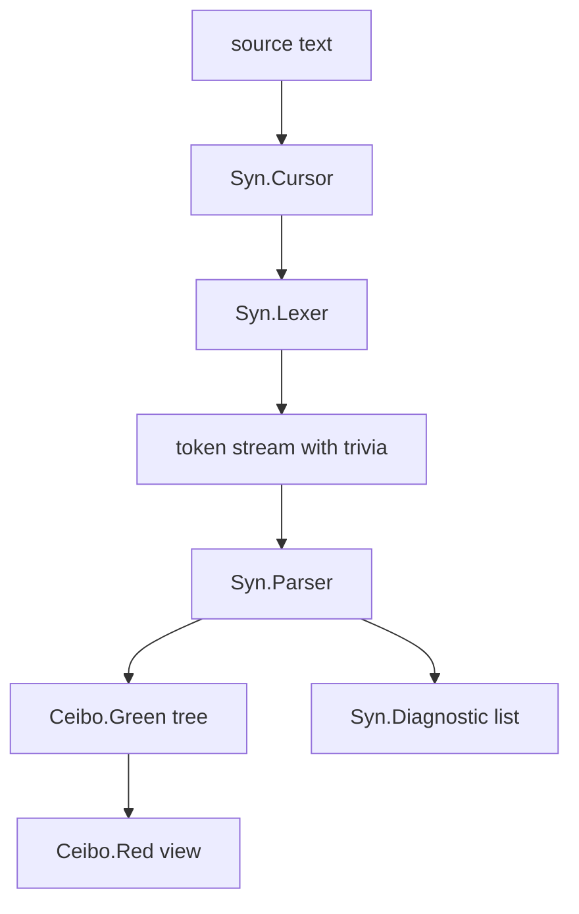
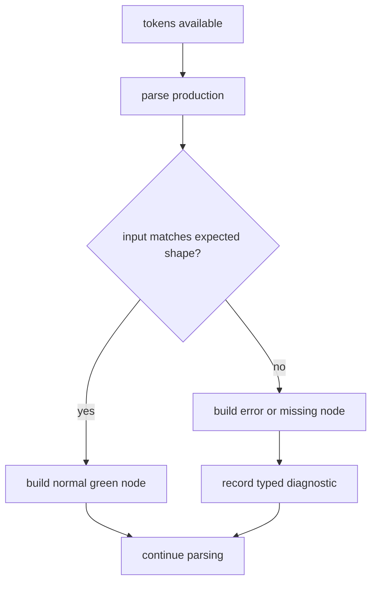
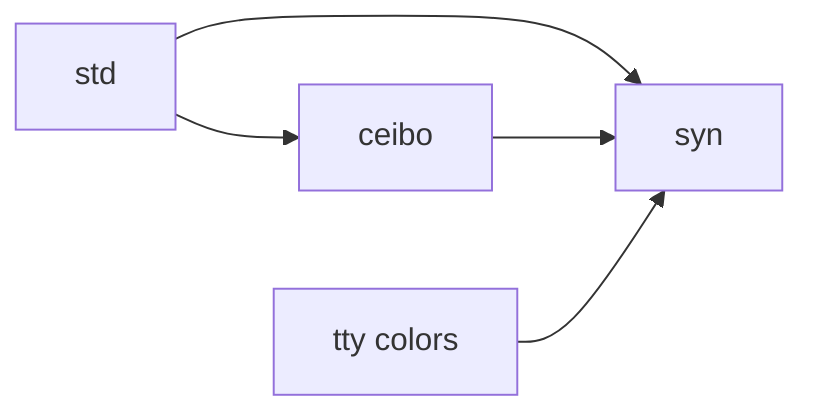
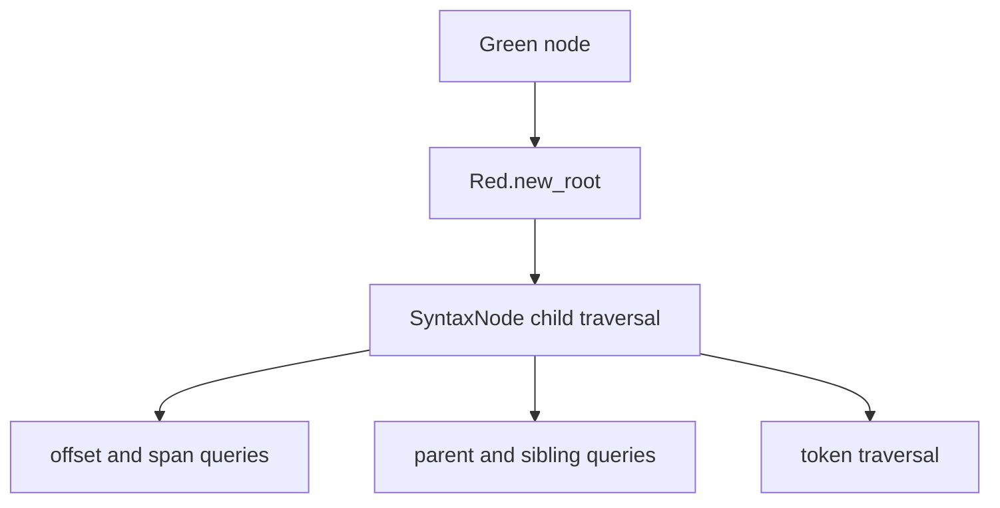
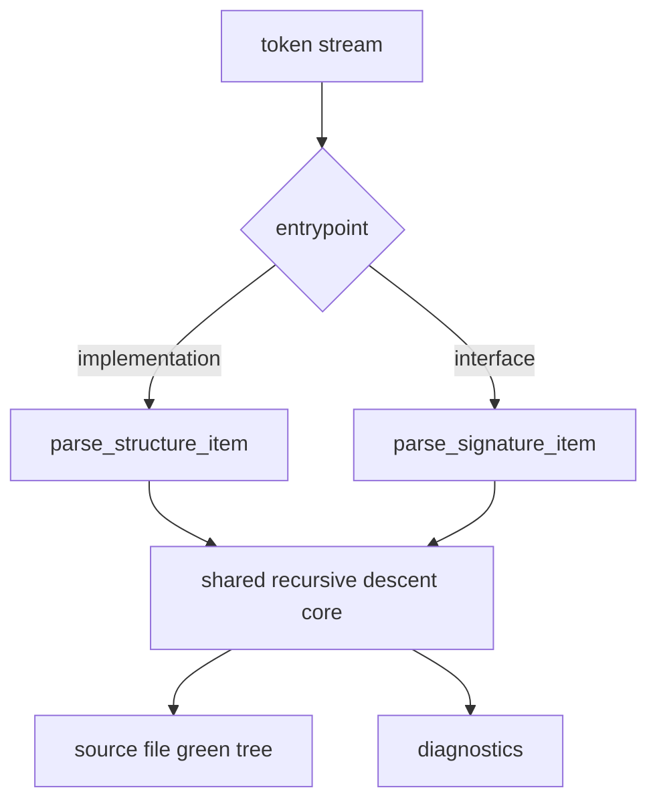
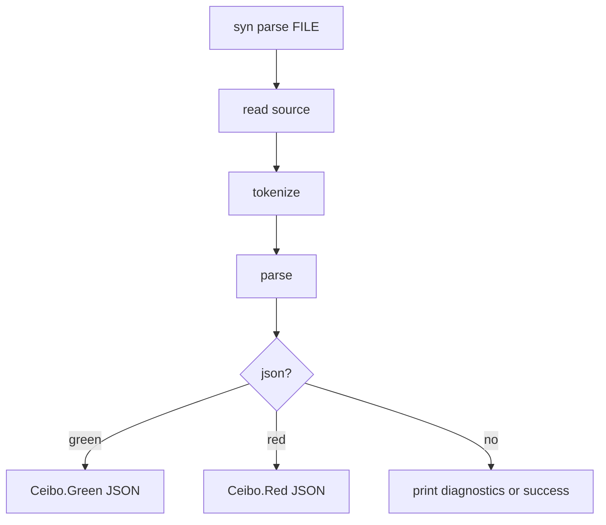

- Feature Name: `ceibo_and_syn_snapshot`
- Start Date: `2026-03-19`
- Status: `implemented`

## Summary
[summary]: #summary

This RFD documents the current architecture of `ceibo` and `syn`. Together they form Riot’s current syntax and tree stack: `ceibo` provides a generic red-green tree library, and `syn` provides the OCaml lexer, parser, syntax kinds, and diagnostics layer built on top of it.

## Motivation
[motivation]: #motivation

`ceibo` and `syn` are clearly foundational for parser work, tree tooling, and future macro/code transformation efforts, but their current relationship is only implicit in the code.

That makes a few important things harder than they should be:

- understanding where the generic tree layer ends and the OCaml-specific syntax layer begins
- understanding the current lossless parsing model across tokens, trivia, trees, and diagnostics
- understanding what `syn` currently guarantees about malformed code
- understanding the current duplication and transitional edges, especially the in-package `packages/syn/src/ceibo/` copy

This RFD captures the current design in present tense as a system snapshot.

It focuses on:

- `ceibo` as the generic tree substrate
- `syn` as the OCaml syntax stack
- the lexer/parser/tree pipeline
- the concrete OCaml syntax surface `syn` supports today
- the parser and tree-design principles that still match the implementation
- lossless and recovery-oriented parsing guarantees
- the current package boundary and the places where it is not yet perfectly clean

## Guide-level explanation
[guide-level-explanation]: #guide-level-explanation

The current stack has two clear layers.

1. `ceibo` defines the tree model.
2. `syn` defines how OCaml source becomes tokens, diagnostics, and `ceibo` trees.

In practice:

- if the concern is generic tree shape, spans, green nodes, red views, or tree building, it belongs to `ceibo`
- if the concern is OCaml tokenization, syntax kinds, diagnostics, parser recovery, or parser entrypoints, it belongs to `syn`

### End-to-end flow

### What `ceibo` is

`ceibo` is a language-agnostic red-green syntax tree library.

It provides:

- `Span`
- `Green`
- `Red`
- `Builder`

The important split is:

- **green** nodes are immutable and position-independent
- **red** nodes are lazy positioned views with parent links and offsets

That matches the core rationale captured both in `packages/ceibo/src/README.md` and in `packages/syn/docs/red-gree-syntax-trees-intro.md`:

- green nodes are the canonical immutable representation
- widths are cached so offsets can be derived later
- red nodes are fabricated lazily for traversal
- unchanged subtrees can be structurally shared

### What `syn` is

`syn` is the OCaml syntax layer built on top of `ceibo`.

It provides:

- `Token`
- `Keyword`
- `Cursor`
- `Lexer`
- `SyntaxKind`
- `Diagnostic`
- `DiagnosticReporter`
- `Parser`

The public shape is deliberately recovery-oriented:

- lexing is lossless
- parsing never fails outright
- malformed input still produces a tree
- parse problems are reported through structured diagnostics

### What `syn` supports today

Today `syn` is already much broader than “just expressions”.

At the token level it recognizes:

- keywords
- identifiers
- integer, float, string, and char literals
- delimiters for parens, braces, brackets, arrays, `begin`/`end`, `struct`/`end`, `sig`/`end`, and `object`/`end`
- trivia including whitespace, comments, and docstrings
- a substantial set of operators and punctuation, including things like `::`, `->`, `<-`, `:=`, `@@`, `|>`, float operators, polymorphic variant backticks, labels, and type-variable quotes

At the syntax-tree level it currently has node kinds for:

- expressions
- patterns
- type expressions
- module and module-type expressions
- top-level declarations
- structural nodes like source files, structures, signatures, match cases, parameters, and record fields
- error and missing placeholders

That means the current parser is not just a minimal parser for small snippets. It already aims at a broad lossless OCaml frontend.

### Design principles that still apply

Several parser-design principles from `packages/syn/src/NEW_PARSER.md` and `packages/syn/docs/swift-inspired-parser-architecture.md` still describe the implemented system well:

- always lossless
- explicit trivia control rather than blindly consuming trivia after every token
- always return nodes and diagnostics instead of hard parser failure
- grammar-shaped recursive-descent structure
- parser state centered around cursor-based traversal rather than ad hoc manual control flow

Some notes in those documents are more aspirational than implemented, but these principles clearly still match the current parser and tree stack.

### Current syntax coverage at a glance

The implemented `Syntax_kind.t` surface currently includes support for at least these categories:

- expressions: application, infix/prefix ops, `if`, `match`, `fun`, `function`, `let`, sequences, tuples, lists, arrays, records, field access, assignment, assertions, laziness, loops, `try`, typed/coerced expressions, local opens, `let module`, first-class modules, objects, method calls, `new`, extensions, and attributes
- patterns: identifiers, wildcards, literals, constructors, tuples, lists, arrays, cons patterns, records, or-patterns, as-patterns, ranges, typed patterns, lazy patterns, exception patterns, polymorphic variants, local opens, operator patterns, and first-class module patterns
- type expressions: type variables, constructors, arrows, tuples, parentheses, polymorphic variants, record types, type parameters, constraints, explicit polymorphic types, module types, first-class module types, functor parameters, functor types, and module applications
- declarations: `let`, mutual `let ... and`, `type`, mutual type declarations, exceptions, modules, module types, `open`, `include`, `val`, and `external`

That list reflects the current implementation surface in `packages/syn/src/syntax_kind.mli`, not just future intent.

### Current parser contract

The main current contract in `syn` is:

1. lex the entire source, including trivia
2. parse tokens into a green tree
3. accumulate diagnostics instead of bailing out
4. return a result even for incomplete or malformed input

## Reference-level explanation
[reference-level-explanation]: #reference-level-explanation

## 1. Package boundaries

The current manifests show the intended direction clearly:

- `ceibo` depends only on `std`
- `syn` depends on `std`, `tty`, `colors`, and `ceibo`

That gives the architectural shape:

The intended boundary is:

- `ceibo` stays generic and language-agnostic
- `syn` stays OCaml-specific

## 2. `ceibo` data model

`packages/ceibo/src/ceibo.mli` defines the current public model.

The main pieces are:

- `Span.t`
- `Green.token`
- `Green.node`
- `Green.element`
- `Red.syntax_node`
- `Red.syntax_token`
- `Builder`

### 2.1 Spans

`Span.t` is currently a simple start/end pair:

- `start`
- `end_`

It supports length, containment, overlap, union, and debug formatting.

### 2.2 Green tree

The green layer is the canonical stored tree representation.

A green token stores:

- `kind`
- `text`
- `width`

A green node stores:

- `kind`
- cached `width`
- `children`

Green elements are either tokens or nodes.

The important properties are:

- no parent pointers
- no absolute positions
- immutable structure
- cached width for fast red-node positioning

This is the layer intended for building, transformation, and structural sharing.

The design docs around `ceibo` repeatedly emphasize that this green layer is the place where sharing is meant to happen. A green node has enough information to reconstruct size and structure, but it deliberately does not own positioning or upward navigation.

### 2.3 Red tree

The red layer is a positioned view over a green tree.

It adds:

- parent access
- child/sibling navigation
- offsets
- spans
- token/node traversal helpers

Red nodes are not the canonical stored representation. They are an ephemeral view fabricated on demand from green nodes.

This matches the red-green rationale captured in both `packages/ceibo/src/README.md` and `packages/syn/docs/red-gree-syntax-trees-intro.md`: the red layer is meant for convenient traversal and positioned inspection, not for long-term storage.

### 2.4 Builder

`Builder` is the current imperative construction helper for green trees.

It provides:

- `create`
- `token`
- `start_node`
- `finish_node`
- `build`
- convenience `make_token` and `make_node`

This gives `ceibo` both:

- direct functional constructors in `Green`
- and a stack-oriented builder API for parser code

## 3. `syn` lexical layer

The lexical layer currently consists of:

- `Cursor`
- `Token`
- `Keyword`
- `Lexer`

`Lexer.tokenize` produces a flat token list that includes trivia.

That lossless token stream is one of the key current system guarantees:

- all source bytes are represented
- whitespace and comments are preserved
- token spans are contiguous
- EOF is explicit

`packages/syn/src/lexer.mli` describes the lexer as single-pass and recovery-oriented.

The current token surface in `packages/syn/src/token.mli` includes:

- OCaml keywords through `Keyword.t`
- identifiers
- primitive literals
- delimiter-aware tokens with begin/end-style paired delimiters
- trivia tokens
- a broad punctuation/operator set
- explicit `EOF`
- `Unknown` for recovery on invalid characters

This is already enough lexical richness to support a broad OCaml frontend rather than a narrow expression grammar.

The design notes in `packages/syn/docs/swift-inspired-parser-architecture.md` push in the same direction: tokenization is not treated as a lossy front-end preprocessing step, but as the first fidelity-preserving layer of the whole syntax stack.

## 4. `syn` parser layer

`packages/syn/src/parser.mli` describes the current parser contract:

- recursive descent
- one pass over the token stream
- no hard parse failure
- diagnostics collected alongside tree construction

The current parse result is:

- `tree : (Syntax_kind.t, string) Ceibo.Green.node`
- `diagnostics : Diagnostic.t list`

That means `syn` currently treats the green tree as the primary parser output, with red views created later only when positioned traversal is needed.

### 4.1 Supported syntax today

The implementation in `packages/syn/src/parser.ml` is already extensive.

The parser currently has dedicated parsing functions for:

- type variables, type parameters, tuple/arrow/parametric/record/poly-variant types
- wildcard, literal, constructor, tuple, list, array, record, cons, or, as, lazy, exception, and typed patterns
- labeled and optional params and arguments
- function expressions, applications, postfix expressions, binary expressions, tuple expressions, assignment, and sequences
- `if`, `match`, `function`, `assert`, `lazy`, `try`, `while`, `for`, and `let ... in`
- list, array, record, attribute, and extension syntax
- `let` bindings, type declarations, module declarations, module type declarations, `external`, `exception`, `open`, `include`, and `val`
- structure parsing and signature parsing

That is enough to say that `syn` currently supports a broad subset of OCaml’s core language, module language, and declaration language.

It is still a snapshot rather than a conformance claim. The important point is that the implementation surface is already large and structurally aligned with OCaml grammar categories.

The current parser shape also lines up with the guidance in `NEW_PARSER.md`:

- one `parse_*` function per major grammar production family
- explicit specialized functions for patterns, types, expressions, declarations, and module language forms
- recovery behavior embedded into those productions rather than isolated as a separate post-pass

### 4.2 Implementation and interface parsing

The parser currently supports both:

- implementation parsing through `parse_implementation`
- interface parsing through `parse_interface`

Internally, both routes feed a shared parsing engine with different top-level item parsers:

- structure items for `.ml`
- signature items for `.mli`

## 5. Entry points

The current high-level public API in `packages/syn/src/syn.ml` is:

- `tokenize`
- `parse_interface`
- `parse_implementation`
- `parse ~filename`

The current `parse ~filename` function still does file-extension-based dispatch:

- `.mli` routes to `parse_interface`
- everything else routes to `parse_implementation`

This matters because `packages/syn/src/NEW_PARSER.md` argues explicitly for two direct entrypoints instead of filename-based dispatch. The snapshot therefore records both:

- the implemented public API
- the parser-design note that points toward a stricter future API

## 6. Diagnostics and recovery

The current parsing model is strongly recovery-oriented.

The important behaviors are:

- malformed input still returns a tree
- errors become typed diagnostics
- parser recovery happens through error and missing nodes rather than through `option`-shaped failure

The design note in `NEW_PARSER.md` makes the current desired invariants explicit:

- always lossless
- explicit trivia control
- always return nodes

That document is not the same thing as the public API, but it is a useful record of the parser’s current design direction.

The current `Diagnostic` and `Error` modules already show a fairly concrete recovery model rather than just a placeholder one.

The repo currently has:

- structured diagnostic variants in `packages/syn/src/diagnostic.mli`
- stable-ish error IDs in `packages/syn/src/error.mli`
- CLI support for explaining those IDs through `syn explain`

That means recovery in `syn` is not only “tree still comes back”. It is also “tree still comes back with machine-readable error structure”.

## 7. Trivia model

One of the key details in `syn`’s current parser design is that trivia is not treated as uniformly legal everywhere.

The parser note makes this explicit:

- some token pairs are tight and should not admit trivia between them
- other boundaries do admit whitespace/comments

This matters because `syn` is not only trying to preserve bytes. It is also trying to preserve enough grammatical structure to distinguish valid and invalid trivia placement.

That is one of the reasons the current parser architecture emphasizes:

- explicit token cursor usage
- explicit trivia handling
- grammar-shaped parser functions

This is one of the most relevant pieces of `NEW_PARSER.md`, and it still belongs in the snapshot because it describes a real current concern in the implementation rather than a hypothetical future rewrite.

## 8. Current duplication inside `syn`

The current repository still contains a `packages/syn/src/ceibo/` subtree even though `syn` also depends on the standalone `ceibo` package and publicly re-exports `module Ceibo = Ceibo`.

That means the current state is not perfectly normalized yet.

The snapshot-worthy facts are:

- the active package boundary says `ceibo` is a separate foundational package
- `syn` publicly uses that package boundary
- a historical or transitional in-tree `ceibo` copy still exists under `packages/syn/src/ceibo/`

This is exactly the kind of thing a system snapshot should record instead of smoothing away.

## 9. CLI surface

`packages/syn/src/main.ml` exposes a small CLI for the syntax stack.

The current subcommands are:

- `syn tokenize`
- `syn parse`
- `syn explain`

That last command is backed by the current error catalog in `packages/syn/src/error.mli`, which already contains a concrete family of parser error IDs covering things like:

- malformed type variables
- missing let-binding pieces
- unexpected structure/signature items
- invalid patterns, expressions, constants, and type expressions
- unclosed delimiters
- tuple/list/pattern-specific recovery cases
- `if`/`match` recovery
- type-parameter and poly-type errors

The CLI can emit:

- token streams
- green tree JSON
- red tree JSON
- printed diagnostics

That makes the CLI more than a demo. It is part of the current inspection surface for the syntax stack.

This makes `syn` both a library and a standalone inspection/debugging tool for the current parser/tree stack.

## 10. Current subsystem relationship

Putting the pieces together, the current relationship is:

- `ceibo` owns generic syntax-tree representation
- `syn` owns OCaml-specific syntax analysis
- `syn` returns `ceibo` trees plus `syn` diagnostics

That makes `ceibo` the substrate and `syn` the language frontend.

## Drawbacks
[drawbacks]: #drawbacks

- the `packages/syn/src/ceibo/` duplication makes the current boundary less clean than the manifests suggest
- `syn` still mixes public implemented API with future-direction notes that do not perfectly match that API yet
- the tree and parser stack is powerful but still young enough that some internal conventions are documented more in notes than in stable abstractions
- `syn` currently depends on CLI-facing packages like `tty` and `colors`, which broadens its footprint

## Rationale and alternatives
[rationale-and-alternatives]: #rationale-and-alternatives

This document is descriptive, not prescriptive.

The current system chooses:

- a generic tree library separate from the parser
- lossless tokenization
- recovery-oriented parsing that still yields trees
- typed syntax kinds and typed diagnostics

Alternative shapes that are possible in theory but are not the current design include:

- putting the red-green tree implementation entirely inside `syn`
- returning only diagnostics or ASTs without a lossless tree
- making parser entrypoints fail hard on malformed input
- using a parser stack without red/green layering

The current implementation clearly prefers a tooling-oriented syntax stack rather than a one-shot compiler parser.

That framing is consistent across the package README and the design notes: `syn` is for developer tooling, source fidelity, and tree-based manipulation, not for semantic compilation.

## Prior art
[prior-art]: #prior-art

`ceibo` explicitly follows the red-green tree family associated with systems like:

- Roslyn
- Swift libsyntax
- rust-analyzer / Rowan

`syn` then layers an OCaml lexer/parser/diagnostic stack on top of that tree model in a way that is closer to modern language tooling than to a traditional “parse once, discard structure” compiler frontend.

The current design is especially shaped by:

- lossless syntax trees
- structured error recovery
- tree views that support later tooling work

The extra architecture notes under `packages/syn/docs/` also show direct inspiration from Swift syntax tooling and similar parser stacks that separate:

- lexical fidelity
- parser recovery
- raw tree representation
- higher-level traversal views

## Unresolved questions
[unresolved-questions]: #unresolved-questions

- should the duplicate `packages/syn/src/ceibo/` subtree be deleted entirely in favor of the standalone `ceibo` package?
- should `syn` keep the filename-based `parse ~filename` API, or collapse to explicit implementation/interface entrypoints only?
- how much of the current parser-design note should become enforced public contract?
- where should future macro and source-transformation layers sit relative to `ceibo` and `syn`?

## Future possibilities
[future-possibilities]: #future-possibilities

- deleting the in-tree `syn/src/ceibo/` copy and fully normalizing on the standalone `ceibo` package
- incremental parsing based on subtree reuse across edits
- richer tree editing and rewrite layers built on `ceibo`
- tighter integration with formatter, fix, macro, or eval tooling
- a clearer distinction between library-facing `syn` and CLI/debug tooling around it
