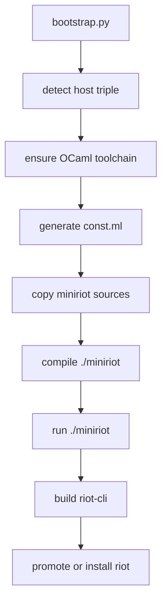
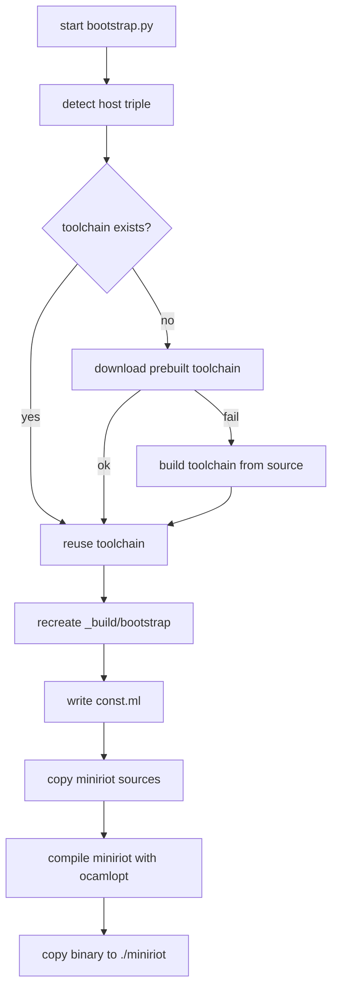
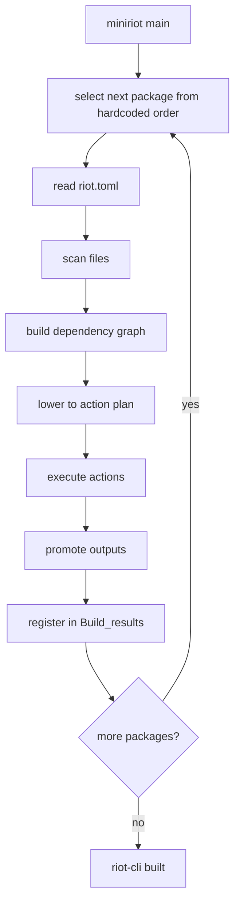

- Feature Name: `riot_bootstrap_process`
- Start Date: `2026-03-19`
- Status: `implemented`

## Summary
[summary]: #summary

This RFD documents Riot's current bootstrap process as a snapshot RFD. It
explains how the repository gets from "no working `riot` binary exists yet" to
a first usable `riot-cli`, using an external bootstrap script plus a smaller
standalone builder before the steady-state build system can take over.

- bootstrap starts from a plain host environment and an OCaml toolchain, not
  from an already-working Riot installation
- `bootstrap.py` owns toolchain provisioning and the generated bootstrap
  sandbox under `_build/bootstrap`
- the bootstrap-only `miniriot` builder performs the first real package scan,
  planning pass, and build of `riot-cli`
- early package outputs are carried forward so later packages can build on them
  during bootstrap
- this RFD is about first-build mechanics only, not the normal post-bootstrap
  `riot build` path

## Motivation
[motivation]: #motivation

Riot is self-hosted, which means "build Riot from source" is not the same
problem as "run an existing Riot binary."

Without one document for the bootstrap path, contributors have to reconstruct
that distinction from:

- `bootstrap.py`
- `packages/miniriot`
- generated files under `_build/bootstrap`
- whatever toolchain state happens to exist on the machine already

That creates recurring costs:

- bootstrap failures are harder to diagnose because it is easy to assume the
  steady-state build rules apply
- changes to toolchain provisioning, package scanning, or early-package wiring
  can break first-build behavior even when normal `riot build` still works
- contributors touching bootstrap code have to rediscover which parts are
  bootstrap-only and which parts must stay aligned with the main build system
- reviews end up re-explaining the same constraints: no existing Riot binary,
  reduced runtime surface, and a different builder implementation

These costs are structural. The bootstrap path really does have different
constraints:

- it cannot depend on the full mainline `riot` runtime
- it must be able to start from a plain OCaml toolchain
- it has to construct enough package and build logic to compile the first real
  `riot`
- it uses a smaller, separate implementation in `packages/miniriot`

This snapshot exists to make that boundary explicit before more toolchain and
build-system work lands.

## Guide-level explanation
[guide-level-explanation]: #guide-level-explanation

Suppose you clone Riot onto a clean machine that does not already have a
working `riot` binary.

The path to a first build is not:

```text
riot build
```

because the tool you would normally use does not exist yet.

Instead, the bootstrap workflow begins with:

```text
./bootstrap.py
```

Contributors should think about the current bootstrap path as a two-stage
bridge.

Stage 1 is external bootstrapping. `bootstrap.py` detects the host, makes sure
an OCaml toolchain exists, creates `_build/bootstrap`, generates the small bit
of configuration `miniriot` needs, and compiles a bootstrap-only builder.

Stage 2 is bootstrap building. Once `./miniriot` exists, it behaves like a
reduced Riot build system: it reads package manifests, scans sources, plans
bootstrap work, compiles packages in dependency order, and eventually produces
the first real `riot-cli`.

So the mental model is:

1. `bootstrap.py` gets the repository to a minimal working builder
2. `miniriot` gets the repository from that minimal builder to the real `riot`

The important boundary is that bootstrap is intentionally narrower than the
main build system:

- it starts from a plain host environment
- it owns more toolchain bootstrapping work up front
- it uses `miniriot`, not the full steady-state Riot runtime
- it ends as soon as the first real `riot-cli` exists

### Bootstrap chain



## Reference-level explanation
[reference-level-explanation]: #reference-level-explanation

## 1. `bootstrap.py`

The entrypoint is the top-level `bootstrap.py` script.

It is responsible for bootstrapping from an ordinary host environment without `riot`.

### 1.1 Host detection

`bootstrap.py` determines:

- operating system
- machine architecture
- libc flavor on Linux (`gnu` vs `musl`)

From those values it computes a host triple such as:

- `aarch64-apple-darwin`
- `x86_64-apple-darwin`
- `x86_64-unknown-linux-gnu`
- `aarch64-unknown-linux-musl`

### 1.2 Toolchain provisioning

The script then ensures that an OCaml toolchain exists under:

```text
~/.riot/toolchains/<version>/<host-triple>
```

The current default version is taken from `OCAML_VERSION`, falling back to
`5.5.0-riot.1`.

Provisioning works in this order:

1. if `bin/ocamlopt.opt` already exists, reuse the toolchain
2. otherwise try downloading a prebuilt tarball from `https://cdn.ocaml.ai/ocaml/`
3. if download fails, build OCaml from source using `riot-ocaml`

That makes `bootstrap.py` responsible both for bootstrapping the builder and for bootstrapping the compiler used by the builder.

### 1.3 Bootstrap sandbox creation

After the toolchain is available, `bootstrap.py`:

1. removes `./_build/bootstrap`
2. creates `./_build/bootstrap/sandbox/miniriot`
3. writes a generated `const.ml` file into that directory

The generated `const.ml` contains:

- filename suffix constants
- the current host triple
- the OCaml version
- the computed toolchain root
- the toolchain `bin` directory
- the toolchain `lib/ocaml` directory

This file is what allows the copied `miniriot` sources to be compiled and run as a standalone bootstrap tool.

### 1.4 Source materialization

`bootstrap.py` copies the bootstrap source set into the sandbox:

- `io.ml`
- `ocaml_platform.ml`
- `toml.ml`
- `file_scanner.ml`
- `graph.ml`
- `package.ml`
- `dep_graph.ml`
- `action.ml`
- `main.ml`

Together with generated `const.ml`, this forms the complete bootstrap program.

### 1.5 Direct compilation of `miniriot`

`bootstrap.py` compiles `miniriot` with a direct `ocamlopt` invocation using the toolchain it just provisioned.

It links against `unix.cmxa` and emits:

```text
./_build/bootstrap/sandbox/miniriot/miniriot
```

That binary is then copied to the repository root as:

```text
./miniriot
```

### 1.6 `bootstrap.py` control flow



## 2. `miniriot`

`miniriot` is the standalone bootstrap builder.

Its job is not to expose the full `riot` feature set. Its job is to build enough of the workspace to produce the first real `riot-cli`.

### 2.1 Package build order

The build order is hardcoded in `packages/miniriot/src/main.ml`.

The sequence currently includes:

- `kernel`
- `actors`
- `std`
- support packages
- the `riot-*` build packages
- finally `riot-cli`

This means bootstrap correctness depends on a manually maintained topological sequence, rather than on a general workspace planner.

### 2.2 Bootstrap package model

`packages/miniriot/src/package.ml` reads a package's `riot.toml` and extracts only the fields bootstrap needs:

- package name
- package path
- dependencies
- binaries
- whether the package uses `stdlib`
- whether it uses `unix`
- whether it uses `dynlink`
- target-specific `cc_flags`
- target-specific `ld_flags`

This bootstrap package model is intentionally smaller than `riot-model.Package.t`.

### 2.3 File scanning

`packages/miniriot/src/file_scanner.ml` walks directory trees and builds a simple file tree representation.

That file tree is used as the basis for bootstrap dependency analysis.

### 2.4 Dependency graph construction

`packages/miniriot/src/dep_graph.ml` builds a package-local module dependency graph.

Important features of this layer:

- module names are normalized and namespaced
- generated files are represented in the graph
- `ocamldep` is used to discover OCaml module dependencies
- cross-package dependencies are modeled through `Build_results`

This graph is specific to bootstrap and is not the same structure used by `riot-planner` in the mainline build system.

### 2.5 `Build_results`

`Build_results` is one of the key bootstrap mechanisms.

It records, for each package that has already been built:

- the package's module/archive name
- the output files produced by that package
- transitive `cc_flags`
- transitive `ld_flags`
- whether the package requires `stdlib`
- whether the package requires `unix`
- whether the package requires `dynlink`

Later package builds use this registry to:

- copy already-built artifacts into their sandbox
- inherit link flags and compile flags
- know whether `stdlib`, `unix`, or `dynlink` need to be added transitively

This is how bootstrap threads build products forward from earlier packages to later packages.

### 2.6 Bootstrap action language

`packages/miniriot/src/action.ml` defines the action language used by bootstrap plans.

The main actions are:

- `WriteFile`
- `CopyFile`
- `CompileInterface`
- `CompileImplementation`
- `CompileC`
- `CreateArchive`
- `CreateExecutable`
- `SetPermissions`

This is a deliberately small action set, but it is enough to build the packages required for `riot-cli`.

### 2.7 Toolchain and command execution

`packages/miniriot/src/ocaml_platform.ml` wraps direct compiler invocations.

It knows how to:

- locate the bootstrap `ocamlc.opt`
- locate `ocamldep.opt`
- compile interfaces
- compile implementations
- generate interfaces
- compile C sources
- build archives
- link executables

`packages/miniriot/src/io.ml` provides the filesystem and process helpers used by these actions:

- read and write files
- create directories
- copy files
- run shell commands
- collect command output

So the bootstrap executor is intentionally direct: it shells out to the bootstrap toolchain and manipulates files explicitly.

### 2.8 Bootstrap package build lifecycle

For each package in the hardcoded sequence, `miniriot`:

1. reads the package manifest
2. builds a package dependency graph
3. prints the file tree for debugging
4. dumps a DOT graph to `_build/bootstrap/out/<pkg>/graph.dot`
5. lowers the dependency graph into a build plan
6. executes the build plan
7. promotes outputs
8. registers the package's outputs in `Build_results`

### 2.9 Bootstrap output flow

Bootstrap outputs are promoted under `_build/bootstrap/out/...`.

Those promoted outputs are then copied into later package sandboxes as needed.

This means bootstrap uses a forward-only artifact handoff model:

- build package A
- promote outputs of package A
- register outputs of package A
- when building package B, copy package A outputs into B's sandbox

It is not using the package hash and artifact store model used by mainline `riot`.

### 2.10 `miniriot` control flow



## Drawbacks
[drawbacks]: #drawbacks

- the package build order is hardcoded
- bootstrap package modeling is narrower and separate from the mainline `riot-model`
- bootstrap uses direct shelling and filesystem operations rather than the richer runtime abstractions used by `riot`
- bootstrap artifacts are threaded through `Build_results`, which is simple but specialized

## Prior art
[prior-art]: #prior-art

The main prior art for this RFD is the code in:

- `bootstrap.py`
- `packages/miniriot/src/main.ml`
- `packages/miniriot/src/dep_graph.ml`
- `packages/miniriot/src/action.ml`
- `packages/miniriot/src/ocaml_platform.ml`

More generally, this is a classic self-hosting bootstrap arrangement:

- start from a minimal external compiler environment
- compile a reduced internal builder
- use that builder to compile the real tool

## Unresolved questions
[unresolved-questions]: #unresolved-questions

- How closely should `miniriot` track the semantics of the mainline build system?
- How much bootstrap-specific logic should remain hardcoded versus being inferred?
- Should the hardcoded build order eventually be generated from manifests?

## Future possibilities
[future-possibilities]: #future-possibilities

- document the exact contract between `bootstrap.py` and `miniriot`
- simplify the bootstrap builder further
- make the bootstrap package order derived instead of hardcoded
- tighten the relationship between bootstrap outputs and the eventual `riot` install/promotion flow
