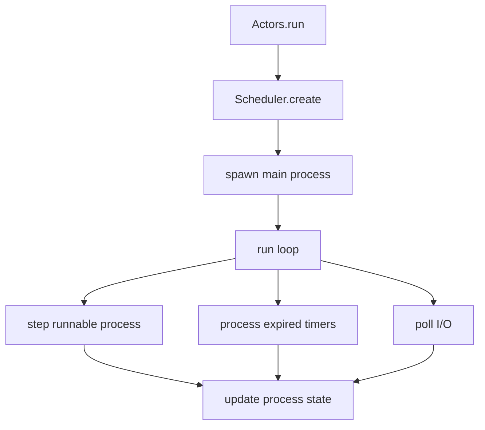
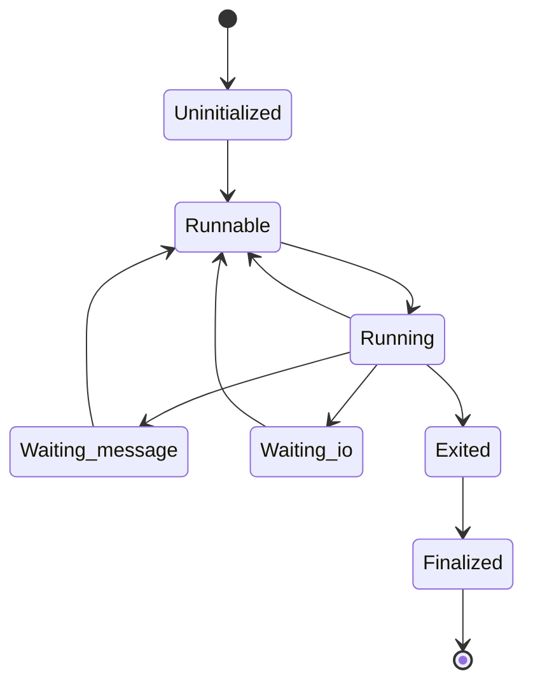
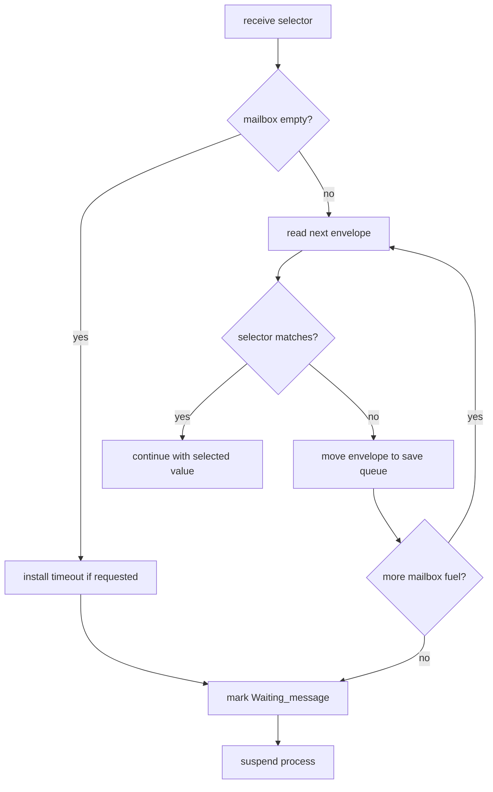
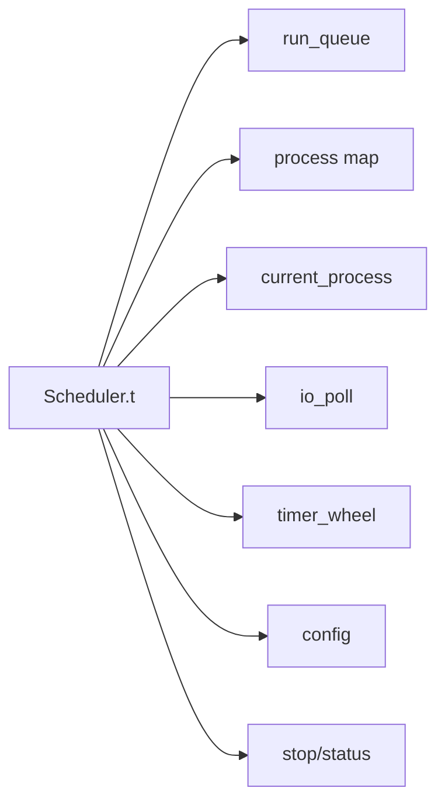
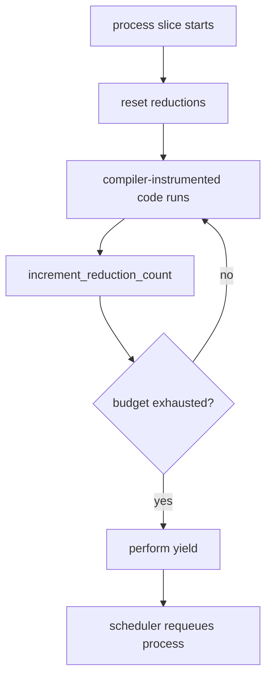
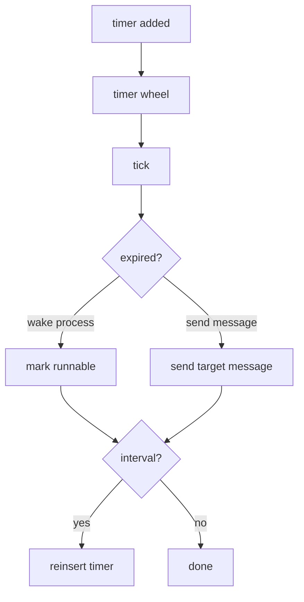

- Feature Name: `actors_runtime_snapshot`
- Start Date: `2026-03-19`
- Status: `implemented`

## Summary
[summary]: #summary

This RFD documents the current `actors` runtime as a snapshot RFD. It explains
the single-core actor system that `std` currently builds on: its public API,
its scheduler behavior, and the runtime mechanics behind processes, mailboxes,
timers, and cooperative I/O.

- one scheduler currently owns the runtime and all processes for a given
  invocation
- processes move through explicit lifecycle states and yield cooperatively
- `receive`, timers, and I/O suspension are all part of the same scheduler loop
- higher-level packages such as `Std.Agent`, `Std.Supervisor`, and
  `Std.Telemetry` rely on this runtime contract
- this RFD documents the current single-core runtime, not a future multicore
  redesign

## Motivation
[motivation]: #motivation

`actors` is one of the core runtime layers in Riot, but most of its behavior is
currently learned by reading scheduler code.

That creates recurring costs for contributors:

- debugging actor behavior requires reverse-engineering where the public API
  ends and scheduler internals begin
- it is easy to reason about `receive`, `yield`, timers, and I/O polling in
  isolation even though they only make sense as one scheduler contract
- "single-core actor runtime" sounds simple, but the repository still has
  specific semantics around lifecycle, suspension, wakeup, and message
  selection that are easy to misremember
- higher-level packages built on top of `actors` inherit assumptions that are
  hard to review if the base runtime contract is not written down

These costs are structural. `actors` is not just a small helper library; it is
the runtime boundary that packages above it depend on. This snapshot exists so
future runtime work can start from one explicit description of the system as it
exists today.

## Guide-level explanation
[guide-level-explanation]: #guide-level-explanation

Suppose a contributor writes a small actor program:

```ocaml
Actors.run ~main:(fun () ->
  let child = Actors.spawn (fun () -> Actors.receive_any ()) in
  Actors.send child "hello")
```

The important thing to understand is that this does not create one OS thread
per actor. Today the whole runtime lives under one scheduler.

That scheduler owns:

- the runnable queue
- the set of waiting processes
- timer wakeups
- I/O wakeups
- process lifecycle transitions

So the current mental model is:

1. one scheduler owns all processes for one runtime invocation
2. each process has a PID, mailbox, continuation, and lifecycle state
3. processes advance only when the scheduler steps them
4. a process gives up control by yielding, waiting for a message, or
   suspending on I/O
5. timers and I/O readiness move suspended processes back into the runnable set

The public API stays intentionally small:

- `run`
- `spawn` and `spawn_link`
- `self`
- `send`
- `receive` and `receive_any`
- `yield`
- `syscall`
- `Process` linking and monitoring
- `Timer.send_after`, `Timer.send_interval`, and `Timer.cancel`

Higher-level behavior such as supervision, agents, or telemetry lives above
this layer. `actors` owns runtime mechanics, not application policy.

### Runtime structure



### Process lifecycle

Each process moves through a small explicit state machine:

- `Uninitialized`
- `Runnable`
- `Running`
- `Waiting_message`
- `Waiting_io`
- `Exited`
- `Finalized`

The scheduler is the only component that steps processes and changes those states as part of execution.



### Message receive model

Processes do not block the whole runtime when they wait for messages.

`receive` works by:

1. looking at the current process mailbox
2. trying the selector against queued messages
3. saving unmatched messages into the save queue
4. suspending the process if no message matches
5. optionally installing a timeout timer before suspension



### I/O and timers

`syscall` is the bridge between actor scheduling and low-level readiness polling.

The current process:

- requests an interest and source
- gets registered with `Kernel.Async.Poll`
- moves to `Waiting_io`
- resumes when readiness is observed

Timers are managed through a hierarchical timing wheel and support both one-shot and interval behavior.

## Reference-level explanation
[reference-level-explanation]: #reference-level-explanation

## 1. Package boundary

`actors` depends only on `kernel`.

That package boundary is deliberate:

- `kernel` owns low-level async polling, file descriptors, time, and synchronization primitives
- `actors` turns those primitives into a runtime with processes, mailboxes, and scheduling semantics
- `std` then turns `actors` into a more ergonomic application-facing surface

## 2. Public module structure

The main public entrypoint is `packages/actors/src/actors.mli`.

The exported modules and values currently group into these roles:

- `Config`: runtime configuration
- `Runtime`: reduction counting hooks
- `Pid`: process identifiers
- `Message`: extensible message root
- `Process`: process state, links, monitors, flags
- `Timer` and `Timer_id`: delayed and interval message delivery
- top-level runtime functions like `run`, `spawn`, `send`, `receive`, `yield`, and `syscall`

The implementation in `packages/actors/src/actors.ml` is intentionally thin. It mostly forwards to `Scheduler`, `Effects`, and `Process`.

## 3. Scheduler state

The scheduler state in `packages/actors/src/scheduler.ml` currently contains:

- `run_queue`: runnable processes
- `processes`: PID to process map
- `current_process`: the process currently being stepped
- `io_poll`: kernel async polling handle
- `timer_wheel`: hierarchical timer wheel
- `config`: runtime configuration
- stop/status fields

This makes the scheduler the single owner of runtime-wide mutable state.



## 4. Run loop

`Scheduler.run` performs the following high-level sequence:

1. assert the runtime has not already run in this OS process
2. create scheduler state
3. register the scheduler in a process-local cell
4. spawn the main process
5. iterate until stop conditions are met

Inside each loop iteration:

1. consume runnable processes from the run queue
2. step each process according to its current state
3. tick timers if any exist
4. poll I/O if the runtime still has live processes
5. stop if nothing runnable, waiting on I/O, or timed remains

The current runtime is explicitly one-shot per host process. `Scheduler.run` rejects multiple invocations in the same executable.

## 5. Process representation

`packages/actors/src/process.mli` exposes the process lifecycle model. A process currently owns:

- a PID
- a continuation stored as `Proc_state.t`
- a mailbox
- a save queue for unmatched receive messages
- flags such as `TrapExit`
- link and monitor relationships
- receive timeout and syscall timeout timer IDs
- ready I/O tokens

Processes are stepped by the scheduler through `step_process`, not by direct user control.

## 6. Effects and continuation stepping

`actors` uses effect-driven cooperative control flow.

The main effect shapes are:

- `Receive`
- `Yield`
- `Syscall`

The scheduler installs a `perform` handler for the current process. That handler interprets process effects in runtime terms:

- `Receive` becomes mailbox scan plus optional timeout logic
- `Yield` becomes a scheduler yield point
- `Syscall` becomes async-poll registration plus optional timeout logic

The continuation is stepped through `Proc_state.run ~reductions:100`.

## 7. Reduction counting

`packages/actors/src/runtime.ml` exposes:

- `reset_reductions`
- `increment_reduction_count`

The current model is simple:

- each process slice starts with a reduction budget
- compiler-instrumented code decrements that budget
- when the budget reaches zero, `Effects.yield ()` is performed

This gives Riot a lightweight preemption boundary without a preemptive multicore scheduler.



## 8. Mailboxes and selective receive

Mailbox behavior is defined by `Mailbox` plus process-level save queue handling.

The mailbox itself is intentionally simple:

- queue envelope
- return next envelope
- report size/emptiness

Selective receive is layered above the raw mailbox in scheduler logic. Unmatched messages are temporarily moved aside, then restored through `Process.read_save_queue`.

This keeps mailbox storage simple while still supporting Erlang-style selector-based receive behavior.

## 9. Timers

Timers are represented by `Timer.send_after`, `Timer.send_interval`, and `Timer.cancel`, backed by `Timer_wheel`.

Each timer has:

- an ID
- a mode: one-shot or interval
- an action: wake a process or send a message

When `Scheduler.process_timers` sees expired timers:

- wake-process timers mark the process runnable
- send-message timers route a message to the target PID
- interval timers are reinserted



## 10. I/O polling

The runtime uses `Kernel.Async.Poll` as its readiness backend.

When a process performs `syscall`:

1. the scheduler builds an async token from the process
2. the runtime registers interest and source with the poller
3. the process moves to `Waiting_io`
4. the poller returns events
5. the process stores ready tokens and becomes runnable again

This allows I/O wait to suspend only the current actor instead of blocking the runtime.

## 11. Links, monitors, and exit handling

Exit handling is implemented in `Scheduler.handle_exit_proc`.

The current behavior is:

1. send `DOWN` to monitors
2. send `EXIT` to linked processes
3. if a linked process has `trap_exit = true`, convert exit into a message
4. if `trap_exit = false` and the exit was abnormal, propagate failure by marking the linked process exited
5. remove and finalize the exiting process

The main process is special. When it exits, the scheduler sets the runtime exit status and begins shutdown.

## Drawbacks
[drawbacks]: #drawbacks

- the runtime is intentionally single-core today
- `run` is one-shot per host process, which complicates some test and embedding patterns
- tracing hooks exist as stubs rather than as a complete runtime observability story
- the reduction-count model depends on compiler instrumentation rather than on a standalone runtime mechanism

## Prior art
[prior-art]: #prior-art

The most obvious prior art is the Erlang/BEAM process model:

- per-process mailboxes
- links and monitors
- selective receive
- actor-oriented timers

`actors` differs in a few important ways:

- it is currently single-core
- it is built around OCaml effects and continuations
- it uses `kernel` async polling primitives directly
- it uses compiler-inserted reduction counting hooks

There is also clear influence from event-loop runtimes that combine:

- a run queue
- a timer facility
- a readiness poller

The Riot combination is actor-oriented rather than callback-oriented.

## Unresolved questions
[unresolved-questions]: #unresolved-questions

- how should runtime tracing and debug instrumentation grow beyond the current stub hooks?
- should `run` remain single-use per OS process indefinitely?
- what exact multicore shape should replace or extend the current single-scheduler design?
- how much of the reduction-budget mechanism should remain compiler-driven?

## Future possibilities
[future-possibilities]: #future-possibilities

- multicore schedulers with explicit cross-scheduler message routing
- richer tracing and runtime telemetry
- stronger supervision primitives in `std` built on the same runtime core
- better test harness support for repeated runtime invocations
- pluggable polling backends while preserving the current actor semantics
