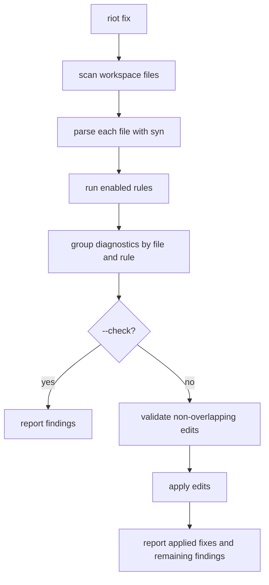
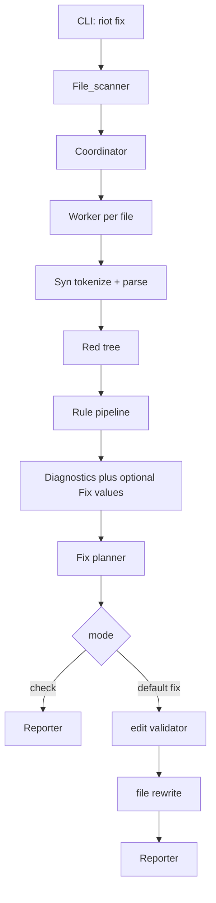
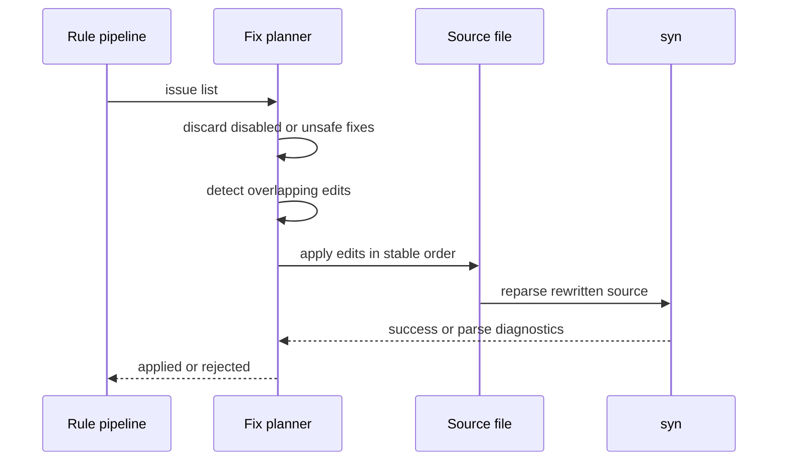

> Canonical source: `docs/rfds/RFD0007-riot-fix.md`

> Status: **Implemented**

- Feature Name: `riot_fix`
- Start Date: `2026-03-20`
- Status: `implemented`
- RFD PR: [leostera/riot#0000](https://github.com/leostera/riot/pull/0000)
- Riot Issue: [leostera/riot#0000](https://github.com/leostera/riot/issues/0000)

## Summary
[summary]: #summary

This RFD proposes turning `riot-fix` into the first syntax-aware linting and
auto-fix tool in the Riot stack, exposed primarily as `riot fix`. The system
should parse source files once with `syn`, run a configurable set of lint rules
over the resulting red tree, report structured diagnostics, and apply safe
edits by default. The immediate goal is not to solve formatting or
broad code modernization. The goal is to establish a reliable fix pipeline that
can power small, explicit, high-confidence rewrites across Riot codebases.

## Motivation
[motivation]: #motivation

Riot now has the parser foundation needed for a real fix tool:

- `syn` parses the Riot codebase successfully and has broad syntax coverage.
- `syn` produces a lossless CST.
- `syn` has a dedicated diagnostics suite and a large fixture corpus.
- `ceibo` provides the underlying tree model needed for syntax-aware traversal.

That changes what is practical.

Until now, linting and mechanical cleanup in the repo have largely been one of
three things:

- style and convention enforcement in human review
- ad hoc shell-based rewrites
- source-level grep checks without syntax awareness

Those approaches do not scale well once the codebase grows and the conventions
become more intentional. Riot has strong conventions:

- prefer `open Std`
- avoid direct `Stdlib`, `Unix`, and `Sys` usage outside owned boundaries
- keep package APIs abstract
- use the Riot stack rather than defaulting back to stock OCaml libraries

If Riot wants conventions over configuration and a value-oriented stack, then
the stack should help enforce and repair those conventions.

There are several concrete use cases:

1. A contributor runs `riot fix --check` and gets actionable diagnostics about direct
   `Stdlib` or `Unix` usage in the wrong package.
2. A contributor runs `riot fix` and the obvious safe rewrites are
   applied automatically.
4. Future migrations, such as renaming modules or updating API usage, are
   expressed as rules instead of one-off scripts.
5. Editor or agent tooling can reuse the same diagnostics and fixes instead of
   inventing parallel logic.

This RFD is motivated by two beliefs:

- syntax-aware rewriting should be part of the Riot toolchain
- fixes should be explicit, safe, and explainable, not magical

## Guide-level explanation
[guide-level-explanation]: #guide-level-explanation

Contributors should think about `riot fix` as a parser-backed lint and rewrite
tool that applies safe fixes by default, with an explicit check-only mode.

In the default mode:

```text
riot fix
```

the tool scans the workspace, parses each source file with `syn`, runs enabled
rules, applies safe edits, and reports what changed plus any remaining
findings.

In check-only mode:

```text
riot fix --check
```

the tool performs the same scan and analysis, but does not write files.

The key design point is that rules should produce both:

- a human-readable explanation of the problem
- an optional machine-applicable fix

The user model should look like this:



### Intended command surface

The core surface should be:

- `riot fix`
- `riot fix --check`
- `riot fix <path>`
- `riot fix --rule no-stdlib`
- `riot fix --json`

`--check` means “report but do not write; exit non-zero if issues were found”.

`--json` should expose structured output for editor integrations and agents.

### What counts as a good fix

A good `riot fix` rule:

- matches a real Riot convention or migration need
- emits a specific diagnostic
- carries an edit only when the rewrite is unambiguous
- leaves code in a parseable state
- can explain what it changed

Examples of good early rules:

- replace `open Stdlib` with `open Std`
- replace forbidden stdlib module paths with Riot equivalents when the mapping is direct
- remove or rewrite obviously disallowed imports in packages that own stricter boundaries

Examples of bad early rules:

- global style normalization that is really formatter territory
- semantic refactors that require typechecking or cross-file reasoning
- “best guess” rewrites with multiple plausible outcomes

### Relationship to `riot fmt`

`riot fix` is not `riot fmt`.

`riot fix` should perform targeted, rule-driven rewrites.
`riot fmt` would be a whole-program formatting tool with a much larger surface
area and a different correctness model.

The two can share parser infrastructure, but they should stay distinct in the
user model and in implementation.

## Reference-level explanation
[reference-level-explanation]: #reference-level-explanation

## 1. Current package state

The repository already contains a `packages/riot-fix` package with the right
high-level pieces:

- `Pipeline`
- `Rule`
- `Diagnostic`
- `Fix`
- `Traversal`
- `Coordinator` / `Worker`
- a small set of built-in rules

Today, that package is better understood as a scaffold than a finished tool.

Important current properties:

- `Pipeline.run` tokenizes and parses exactly once per file.
- Parse diagnostics are converted into `riot-fix` diagnostics.
- Rules run over a red tree, not raw text.
- `Fix` already models text edits and grouped fixes, but edit application is not
  implemented as the primary path yet.
- The only meaningful built-in rule today is `no-stdlib`.

That makes `riot-fix` the right place to evolve the feature rather than writing
`riot fix` from scratch somewhere else.

## 2. Architecture

The proposed steady-state architecture is:



The main subsystems are:

- **scanner**: decides which files enter the pipeline
- **parser stage**: produces syntax trees and parse diagnostics
- **rule stage**: emits lint diagnostics and optional fixes
- **fix planner**: groups, validates, and orders edits
- **reporter**: renders human and machine output
- **CLI integration**: exposes the feature through `riot`

## 3. File model

The primary unit of work should be a single source file.

Each file run produces:

- the source path
- parse result
- parse diagnostics
- rule diagnostics
- zero or more proposed fixes

Cross-file edits are intentionally out of scope for the first version.

That keeps the system:

- safer
- easier to parallelize
- easier to reason about
- easier to recover from when a fix fails

## 4. Rule model

The current `Rule.t` type already has the right basic shape:

- metadata
- enabled flag
- function from context and red tree to diagnostics

The proposal is to extend the effective rule contract so rules can emit both
diagnostics and fixes. There are two reasonable shapes:

1. change `Diagnostic.t` to optionally carry a `Fix.fix`
2. change rules to return a richer issue type, for example:

```ocaml
type issue = {
  diagnostic : Diagnostic.t;
  fix : Fix.fix option;
}
```

This RFD prefers the second shape.

It keeps diagnostics as diagnostics, and makes fix attachment explicit rather
than overloading every diagnostic value in the system.

The rule contract should become:

```ocaml
run : context -> red_tree -> issue list
```

### Rule categories

Rules should be grouped conceptually into:

- **lint-only rules**
  emit diagnostics but no fix
- **safe default-fix rules**
  emit diagnostics plus deterministic edits
- **advisory migration rules**
  may propose fixes later, but start in report-only mode

The first release of `riot fix` should only execute safe default-fix rules.

## 5. Fix model

`Fix.text_edit` and `Fix.fix` already exist and are close to the desired shape.

The fix planner should enforce:

- edits within one fix must not overlap
- edits across multiple applied fixes for a file must not overlap
- edits are applied in descending span order or another stable order that does
  not invalidate subsequent spans
- the resulting file should be reparsed after apply to guard against broken output

Proposed flow for one file:



If reparsing fails, the tool should:

- leave the original file untouched if possible, or
- fail that file atomically and report the rejected fix set

The system should strongly prefer atomic file rewrites.

## 6. Safety model

Safety is the core design constraint.

The first version of `riot fix` should only apply fixes that are:

- local to one file
- local to one syntactic construct
- unambiguous from syntax alone
- validated after rewrite by reparsing

Examples of safe:

- replacing one module token with another
- inserting a missing `open Std` in a known canonical location
- rewriting a known forbidden path to a known allowed path

Examples of not yet safe:

- moving declarations across files
- changing names that may require broad symbol updates
- inference-dependent rewrites
- any rewrite that depends on types or module resolution outside the current file

## 7. CLI integration

The primary entrypoint should live in `riot-cli`.

The command should:

1. resolve the workspace root
2. collect candidate files
3. construct the default or requested rule set
4. run `riot-fix`
5. report results
6. choose exit code based on mode

Proposed exit behavior:

- `0` when no issues were found, or when all applicable fixes were applied successfully
- `1` when issues were found in `--check`
- `1` when default fix mode rejected a fix due to conflicts or invalid output
- `1` when default fix mode leaves remaining diagnostics that should still fail the command

If desired later, `riot-fix` can keep a standalone binary for development, but
`riot fix` should be the primary interface.

## 8. Output formats

The current text and JSON reporting split is good and should remain.

Text output should emphasize:

- file path
- span
- rule id
- message
- suggested fix title when present
- whether the fix was applied, skipped, or rejected

JSON output should be structured enough for:

- editors
- agents
- CI annotations

A single issue in JSON should include:

- file
- span
- severity
- rule id
- message
- optional suggestion
- optional fix metadata
- apply status in default fix mode

## 9. Initial built-in rules

The first meaningful built-in rules should stay small and Riot-specific.

Recommended initial set:

- `no-stdlib`
  already exists and should become the first full auto-fix rule where mappings are direct
- `no-unix-outside-owned-boundary`
  only report at first
- `prefer-open-std`
  probably report-only first, auto-fix later
- `no-sys-outside-owned-boundary`
  similar to `no-stdlib`

This keeps the first version aligned with actual Riot conventions rather than
trying to become a generic OCaml linter immediately.

## 10. Tests

The test strategy should mirror the `syn` approach and stay explicit.

Three kinds of tests are needed:

1. **diagnostic tests**
   specific source snippet to expected issues
2. **fix tests**
   source snippet to rewritten output
3. **idempotence tests**
   applying the same fix twice should not keep changing the file

For default-fix rules, each test should ideally check:

- diagnostics before apply
- rewritten output
- successful reparse after apply

## Drawbacks
[drawbacks]: #drawbacks

- A fix tool introduces a new layer of correctness requirements beyond parsing.
- Users may over-trust auto-fixes if the tool is not conservative enough.
- Rule authorship can become a maintenance burden if the rule surface grows too quickly.
- Some desired rewrites will remain out of scope until Riot has richer semantic analysis.

## Rationale and alternatives
[rationale-and-alternatives]: #rationale-and-alternatives

This design is the best next step because it uses the parser work that now
exists and aims at a smaller, more reliable surface than a formatter.

Alternatives considered:

- **Build `riot fmt` first**
  A formatter has much broader output-surface risk and a larger design space.
  `riot fix` can deliver useful value sooner.

- **Keep `riot-fix` as a standalone side tool**
  That makes adoption weaker and splits the user story away from `riot`.

- **Use regex or grep based rewriting**
  That would be simpler short-term, but it would throw away the parser and tree
  infrastructure Riot just finished building.

- **Make fixes just another flavor of parser diagnostics**
  That collapses two concepts together too early. The richer issue model keeps
  parse errors, lint issues, and auto-fixes easier to reason about.

If Riot does not build `riot fix`, then many of its conventions remain social
rules enforced mostly in review rather than in tooling.

## Prior art
[prior-art]: #prior-art

There is strong prior art for syntax-aware linting and safe code actions:

- Rust’s `clippy` and `cargo fix`
- ESLint with fixers
- Ruff’s lints and safe auto-fixes
- language-server quick fixes in several ecosystems

The common useful lesson is:

- diagnostics and fixes should stay paired
- automatic rewrites should begin with the safest local transformations
- broad formatting and broad refactoring should not be conflated with lint fixes

Riot should learn from those systems without copying their entire scope. The
first version should be much smaller and more opinionated.

## Unresolved questions
[unresolved-questions]: #unresolved-questions

- Should `riot-fix` keep its own binary in the long term, or become only a `riot` subcommand?
- Should rule configuration live in `riot.toml`, or should the first version stay convention-driven with almost no configuration?
- Should parse diagnostics and lint diagnostics be reported together in one stream, or clearly separated in output?
- What exact issue type should replace the current “diagnostic only” rule return value?

## Future possibilities
[future-possibilities]: #future-possibilities

Once `riot fix` exists as a stable syntax-aware rewrite tool, several follow-on
features become much easier:

- `riot fmt`, built on the same parser stack but with a different output model
- codemod-style migrations for Riot package APIs
- editor-integrated quick fixes powered by the same rule engine
- selective rule packs for package domains such as `std`, `suri`, or `riot`
- eventually, type-aware fixes once Riot has a stronger semantic layer to build on

The long-term opportunity is for Riot to own not just parsing and diagnostics,
but the whole “find issue, explain issue, fix issue” workflow in one coherent
toolchain.
