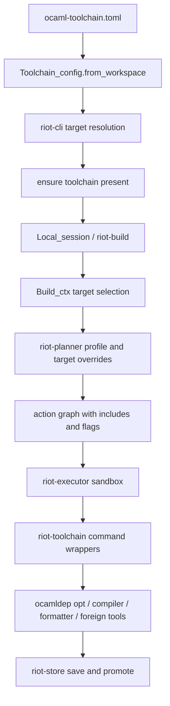

- Feature Name: `riot_toolchain_system_snapshot`
- Start Date: `2026-03-20`
- Status: `implemented`

## Summary
[summary]: #summary

This RFD documents Riot's current toolchain system as a snapshot RFD. It
explains how workspaces declare toolchains and targets, how compiler bundles
are provisioned under `~/.riot/toolchains`, and how target information flows
through planning and execution.

- toolchains are versioned, target-specific OCaml bundles selected from
  workspace configuration
- the current build path distinguishes configured targets, build-context
  targets, and the concrete `Riot_toolchain.t` used by a worker
- planning and execution are both target-aware, but still single-target per
  invocation in the common path
- the toolchain layer owns compiler, formatter, and related command wrappers
- this RFD documents the current steady-state toolchain path, not a redesign of
  Riot's compiler story

## Motivation
[motivation]: #motivation

The repository already has a build-system snapshot, but the toolchain portion
of that story is distributed across configuration loading, install logic,
planner inputs, executor flags, and wrapper code.

That makes several recurring questions harder than they should be:

- what actually counts as a Riot toolchain
- where toolchains live on disk and how they are selected
- how `ocaml-toolchain.toml` changes a build
- what the effective difference is between host builds and target builds
- which parts of the current model are real behavior and which are still
  scaffolding for future cross-compilation work

Those questions come up whenever contributors debug target-specific failures,
review cross-compilation changes, or touch toolchain installation behavior.

The confusion is structural because the current model really does have several
related notions at once: configured targets, build-context targets, and the
concrete compiler bundle selected by a worker. This snapshot exists to make the
current behavior explicit before more cross-compilation and bootstrap work
lands.

## Guide-level explanation
[guide-level-explanation]: #guide-level-explanation

Suppose a contributor runs:

```text
riot build --target x86_64-unknown-linux-gnu
```

The current toolchain story should be understood as one flow with three related
pieces of state:

- workspace configuration from `ocaml-toolchain.toml`
- a build-context target carried through planning
- the concrete `Riot_toolchain.t` selected for the worker that runs actions

In the common case, Riot:

1. reads `ocaml-toolchain.toml` from the workspace root
2. resolves the requested version and target to a directory under
   `~/.riot/toolchains/<version>/<target>`
3. ensures that toolchain is installed before the build starts
4. stores the selected toolchain in the local build session
5. carries host-vs-target information through `Build_ctx`
6. lets the planner and executor shape flags, includes, and wrappers from that
   context

The important contributor mental model is:

- `riot-model` owns configuration and build-context types
- `riot-toolchain` owns discovery, provisioning, validation, and wrappers
- `riot-build` owns per-build toolchain selection
- `riot-planner` and `riot-executor` consume that decision

That means target-specific behavior is not decided in one place only. It is a
single path that starts in workspace configuration and ends in sandboxed tool
invocation.

### Contributor mental model

The current implementation has three separate but related notions:

- configured targets: the target triples listed in `ocaml-toolchain.toml`
- build context target: the `Build_ctx.target` value that drives target-aware
  planning
- concrete compiler bundle: the `Riot_toolchain.t` selected for the current
  build worker

Those usually line up during an explicit `riot build -x <triple>` invocation,
but they are not represented by one single type or initialization path.

### End-to-end toolchain flow



### What a contributor should expect

- A workspace-level `ocaml-toolchain.toml` controls the requested version and
  the set of known targets.
- `riot toolchain list` and `riot toolchain install` operate on that workspace
  configuration.
- A normal build defaults to the host triple.
- An explicit target build installs and validates the requested target
  toolchain first, then runs planning and execution with a target-aware
  `Build_ctx`.
- Action execution happens in a sandbox, but dependency artifacts are usually
  consumed from the content-addressed store by absolute `-I` include paths
  rather than being recopied in full.
- The current CLI can resolve more than one configured target, but the actual
  build path still requires a single target per invocation.

## Reference-level explanation
[reference-level-explanation]: #reference-level-explanation

## 1. Configuration model

The entrypoint for workspace toolchain configuration is
`packages/riot-model/src/toolchain_config.ml`.

`Toolchain_config.t` currently contains:

- `version`
- `source`
- `targets`

`Toolchain_config.from_workspace` reads `<workspace>/ocaml-toolchain.toml` and
looks for:

- `[toolchain].version`
- `[toolchain].targets`

`version` can be represented as:

- a string version like `"5.5.0"`
- a table with `path`
- a table with `url`

If the file is missing or cannot be parsed, the system falls back to
`Toolchain_config.default`, which currently means:

- version `5.3.0`
- source `Version "5.3.0"`
- no explicit targets, which means host-only

That is the effective workspace fallback used by the current runtime path, even
though `packages/riot-toolchain/src/riot_toolchain.ml` also defines a separate
`default_ocaml_version` constant with the value `5.5.0`.

In this repository, the root `ocaml-toolchain.toml` overrides that fallback and
currently requests OCaml `5.5.0` plus several cross-compilation targets.

## 2. Filesystem layout

`packages/riot-model/src/riot_dirs.ml` defines the main directory conventions.

The important ones for toolchains are:

```text
~/.riot/toolchains/<version>/<target>
~/.riot/projects/<project-id>
<workspace>/_build/<profile>/<target>/out
<workspace>/_build/<profile>/<target>/sandbox
```

The toolchain package resolves binaries relative to:

```text
~/.riot/toolchains/<version>/<target>/bin
```

The current store root is created with `Riot_dirs.cache_dir`, which still uses a
host/debug-oriented default path helper. The store remains safe across targets
because stored entries are addressed by content hash, but the store directory
name itself is not yet fully target-aware.

## 3. What a `Riot_toolchain.t` contains

`packages/riot-toolchain/src/riot_toolchain.ml` defines the concrete toolchain
record.

A toolchain currently stores:

- requested version
- configured source metadata
- target triple string
- compiler wrapper
- `ocamlopt.opt` path
- `ocamldep.opt` wrapper
- `ocamlformat` wrapper

The command wrappers are thin. They mainly:

- remember the binary path
- convert planner data into command-line arguments
- shell out with `Command.output`

Despite the `Ocamlc` module name, the current toolchain record points that
wrapper at `ocamlopt.opt`. In steady state, the build path currently drives the
native compiler binary rather than switching between separate bytecode and
native compiler executables.

## 4. Host triple and target resolution

`Riot_toolchain.get_host_triple` derives the host triple from
`System.host_triplet` on Unix and otherwise falls back to
`x86_64-unknown-linux`.

Toolchain paths are resolved as:

- host/default: `~/.riot/toolchains/<version>/<host-triple>`
- explicit target: `~/.riot/toolchains/<version>/<target>`

`riot-toolchain` distinguishes between:

- `init`: initialize the host toolchain
- `init_for_target`: initialize a specific target toolchain
- `get_for_target`: alias for `init_for_target`

`list_toolchains` computes the set of relevant targets from config:

- if `targets = []`, it lists only the host triple
- otherwise it lists the configured targets exactly

## 5. Provisioning and validation

Provisioning order is implemented in `riot_toolchain.ml`.

For the host toolchain, initialization works like this:

1. look for `~/.riot/toolchains/<version>/<host>/bin`
2. if present, validate required binaries
3. otherwise, look for `./ocaml/compiler`
4. if `./ocaml/compiler` exists, symlink it into the expected
   `~/.riot/toolchains/...` location
5. otherwise, download a prebuilt tarball from `https://cdn.ocaml.ai/ocaml/`

For explicit non-host targets, the local `./ocaml/compiler` shortcut is not
used. The code goes directly to the target-specific install-or-download path.

The current download URL patterns are:

- native: `ocaml-<version>-<host>.tar.gz`
- cross: `ocaml-<version>-<host>-x-<target>.tar.gz`

Validation currently checks for the presence of:

- the toolchain record's compiler-wrapper path
- `ocamlopt.opt`
- `ocamldep.opt`

`check_health` then runs the compiler binary with `-version`.

`ocamlformat` is part of the toolchain record, but it is not currently part of
the binary-existence check.

## 5.1 Download provenance and packaging boundary

The current repository clearly defines the consumer side of prebuilt toolchains.

The download entrypoints are:

- `packages/riot-toolchain/src/riot_toolchain.ml` for steady-state `riot`
- `bootstrap.py` for bootstrap-time toolchain acquisition

Both point at:

```text
https://cdn.ocaml.ai/ocaml/
```

The tarball naming convention expected by this repository is:

- `ocaml-<version>-<host>.tar.gz`
- `ocaml-<version>-<host>-x-<target>.tar.gz`

From the extraction code, the archive is expected to unpack directly into the
target toolchain directory rather than into an extra nested top-level folder.
That is, after extraction, `~/.riot/toolchains/<version>/<target>/` is expected
to contain paths such as:

- `bin/ocamlopt.opt`
- `bin/ocamldep.opt`
- `bin/ocamlformat`
- `lib/ocaml/...`

This direct-layout expectation is an inference from the current extraction code
in `bootstrap.py` and `riot_toolchain.ml`.

What this repository does not currently define is the producer side of those
tarballs.

The repository now includes a local manual helper for the producer side of those
tarballs:

- `scripts/toolchain/ocaml.sh`

That script can build selected vendored compilers, package them with the
existing `vendor/ocaml/cross/package.sh` naming convention, upload existing
tarballs, or do both in one `release` step against an S3-compatible bucket such
as Cloudflare R2.

What this repository still does not currently define is an active automated
publisher for those tarballs.

The disabled workflow reference remains:

- a GitHub Actions workflow under `.github/workflows/ocaml-publish-toolchains.yml.disabled`
- no manifest describing which external system is responsible for publishing
  them

By contrast, this repository now includes local manual helpers for publishing:

- `riot` release tarballs via `scripts/release/riot.sh`
- the top-level install script at `cdn.ocaml.ai/riot/install.sh`
- prebuilt OCaml tarballs via `scripts/toolchain/ocaml.sh`

The disabled workflow references remain:

- `riot` release tarballs under `cdn.ocaml.ai/riot`
- the install script upload job in `.github/workflows/release.yml.disabled`
- the OCaml tarball upload jobs in `.github/workflows/ocaml-publish-toolchains.yml.disabled`
- the `ghcr.io/leostera/riot/riot-builder` Docker image

So the current architectural boundary is:

- this repo consumes prebuilt OCaml toolchain tarballs from `cdn.ocaml.ai/ocaml`
- this repo can fall back to building OCaml from source during bootstrap via
  `riot-ocaml`
- this repo does not currently document or automate the publication of those
  OCaml tarballs themselves

The Docker builder image is related but separate. `docker/Dockerfile` bootstraps
or downloads toolchains during the image build, then copies
`/root/.riot/toolchains` into the final `riot-builder` image so containerized
builds start with a pre-seeded toolchain cache. That image pipeline does not
publish the OCaml tarballs to `cdn.ocaml.ai/ocaml`.

## 6. CLI surface

The CLI entrypoints live in:

- `packages/riot-cli/src/cli.ml`
- `packages/riot-cli/src/build.ml`
- `packages/riot-cli/src/toolchain_cmd.ml`

There are two main user-facing toolchain surfaces.

### 6.1 `riot toolchain`

`riot toolchain list`:

- loads `Toolchain_config` from the workspace
- reports configured targets
- marks each one as installed, not installed, or incomplete

`riot toolchain install`:

- loads the same config
- installs all missing or incomplete toolchains

### 6.2 `riot build`

`riot build` supports:

- `-x` / `--target <pattern>`
- `--all-targets`

Target resolution happens in `build.ml`:

- `host` and `native` map to the current host triple
- `all` maps to all configured targets
- exact configured target names are accepted directly
- other strings are treated as substring matches against the configured target
  list

The CLI then:

1. installs any missing toolchains for the resolved target set
2. validates the selected target toolchain with `init_for_target`
3. passes `target_arch` into the local session build request

The current implementation still executes only one target build at a time. If a
pattern matches multiple targets, the CLI stops and asks the user to choose a
single target explicitly.

`cli.ml` also runs a host-toolchain preflight for `build`, `run`, `test`,
`bench`, and `fmt` before starting the local session. That means toolchain
initialization logic currently exists both in the top-level CLI path and again
inside the build worker.

## 7. Local session and build worker behavior

`packages/riot-build/src/internal_server.ml` creates server state for a single
command invocation.

That state includes:

- the rescanned workspace
- a host toolchain
- the artifact store
- the package graph

The host toolchain is initialized during server startup with:

- `Toolchain_config.from_workspace`
- `Riot_toolchain.init`

The build request protocol then carries:

- package target selection (`All` or a package name)
- `target_arch : string option`
- `session_id`

The actual target-aware selection happens in
`packages/riot-build/src/build_server.ml`.

The build worker:

1. starts from the workspace debug profile plus workspace profile overrides
2. parses `target_arch`, if present, into `System.Host.t`
3. creates a `Target.Host` or `Target.Cross` value
4. builds `Build_ctx`
5. initializes the concrete toolchain for the explicit target
6. falls back to the host toolchain if target-specific initialization fails
7. invokes `Coordinator2.build_workspace`

This is the main runtime seam between:

- the symbolic target carried by `Build_ctx`
- the concrete compiler bundle carried by `Riot_toolchain.t`

## 8. Cross-compilation metadata

Cross-compilation metadata lives in:

- `packages/riot-model/src/target.ml`
- `packages/riot-toolchain/src/cross_compiling_toolchain.ml`

When the build worker sees a non-host target, it calls
`CrossCompilingToolchain.detect`.

That detection step:

1. derives a compiler prefix from the target triple
2. looks for `<prefix>gcc` in `PATH`
3. asks that compiler for `-print-sysroot`
4. records `sysroot`, `bin_dir`, `bin_prefix`, and `c_compiler`

The result is embedded into `Target.Cross`, which means the build context can
carry cross-compilation metadata even though the OCaml compiler bundle itself is
still resolved separately by `Riot_toolchain.init_for_target`.

Today this metadata is primarily consumed to thread `--sysroot=...` into C
compile and link flags.

## 9. Planning-time toolchain behavior

The planner uses toolchain information in three different ways.

### 9.1 Package-level hashing and profile resolution

`packages/riot-planner/src/package_planner.ml` resolves the effective profile
for each package by:

1. starting from the build-context profile
2. applying package profile overrides by profile name
3. applying package target overrides by target platform name

The target-override key space is currently platform-oriented:

- `macos`
- `linux`
- `windows`

It is not keyed by full target triple.

The fast-path package input hash includes:

- `Build_ctx`
- package metadata
- workspace-specific dependency details
- dependency hashes

It excludes:

- `Session_id`
- module-graph shape
- action-graph shape

### 9.2 Module dependency discovery

`packages/riot-planner/src/module_graph.ml` uses the toolchain's `ocamldep`
wrapper to wire OCaml module dependencies.

Important properties:

- `ocamldep` runs in batch mode
- files are sorted deterministically before invocation
- dependency results are resolved back into package namespaces

### 9.3 Action-node hashing

`packages/riot-planner/src/action_node.ml` includes the toolchain hash in each
action-node hash.

That means action nodes are explicitly sensitive to compiler path changes.

This is stricter than the package fast-path hash, which currently does not add
the resolved toolchain hash directly. The current system therefore has a
real distinction between:

- package-level cache admission
- action-node identity inside a fully planned package

## 10. Action generation

`packages/riot-planner/src/action_graph.ml` is where toolchain-adjacent planner
decisions become executable action data.

The important behaviors are:

- OCaml compile actions receive include paths and explicit compiler flags such as
  `-open`, `-nopervasives`, and optionally `-nostdlib`
- dependency cache directories from `riot-store` are passed as `-I` includes
- special OCaml stdlib package includes like `+unix` and `+dynlink` are passed
  through untouched
- C compile actions receive `profile.cc_flags`
- executable and shared-library link actions receive:
  - the current package `ld_flags`
  - target-specific dependency `ld_flags` collected transitively from the
    dependency set
  - `--sysroot=...` when the build context is cross-compiling
- foreign dependencies become explicit `BuildForeignDependency` actions

This is also where target-aware package overrides show up concretely. The
build-context target affects:

- which package target override is selected
- whether sysroot is threaded into C compile and link commands

## 11. Sandbox execution

`packages/riot-executor/src/sandbox.ml` and
`packages/riot-executor/src/parallel_action_executor.ml` own the execution side.

For each package build:

1. a fresh sandbox directory is created under `_build/.../sandbox`
2. package source inputs are copied into that sandbox
3. dependency `.o` files are copied in from cached artifacts
4. other dependency artifacts stay in the immutable store and are referenced by
   absolute include paths
5. planned actions are executed in dependency order

The action executor translates planner actions into `riot-toolchain` calls.

Relative includes become sandbox paths.
Absolute cache include paths stay absolute.
`+unix` and `+dynlink` are preserved as OCaml special include paths.

This is the main point where the toolchain wrappers become real subprocesses:

- `Ocamldep.batch_deps`
- `Ocamlc.compile_interface`
- `Ocamlc.compile_impl`
- `Ocamlc.generate_interface`
- `Ocamlc.compile_c`
- `Ocamlc.create_library`
- `Ocamlc.create_executable`
- `Ocamlc.create_shared_library`

Foreign dependencies are the exception. They run their own `build_cmd` directly
from the foreign package directory instead of going through the OCaml toolchain
wrapper.

## 12. Store interaction

`packages/riot-store/src/store.ml` provides the content-addressed artifact
store.

Toolchain behavior matters to the store in two ways.

First, cache admission happens at package granularity. If the package hash
already exists, `Package_builder.build` skips full action execution and promotes
the stored outputs into the target output directory.

Second, dependency packages are reused structurally:

- `Store.get_artifact_dir` provides include directories for downstream
  compilation
- `Store.get_artifact_paths` provides object files copied into the sandbox for
  downstream linking

That means the store is not just a final output cache. It is also part of the
toolchain input surface for downstream packages.

## 13. Formatter behavior

The toolchain package also owns `ocamlformat`.

`packages/riot-toolchain/src/ocamlformat.ml` shells out to the toolchain's
`ocamlformat` binary for:

- formatting files in place or in check mode
- formatting ad hoc code snippets

`riot-build` exposes format requests over the same local-session protocol used
for builds, and `riot-cli` performs the same host-toolchain preflight before
reaching that path.

## 14. Current asymmetries and sharp edges

This section is descriptive. It captures the current system shape that a reader
will encounter in the code.

### 14.1 `source` is broader than active initialization

`Toolchain_config.source` can be:

- `Version`
- `Path`
- `Url`

The current initialization path preserves that source metadata in the toolchain
record, but still resolves binaries from the standard
`~/.riot/toolchains/<version>/<target>` layout.

In other words, `Path` and `Url` are modeled in config today, but the active
steady-state load path is still centered on the canonical `~/.riot/toolchains`
directory layout.

### 14.2 The compiler wrapper is more native-oriented than its names suggest

The command wrapper module is named `Ocamlc`, and `Profile.kind` models
bytecode-vs-native intent.

The current concrete toolchain record still wires the compiler wrapper to
`ocamlopt.opt`, and the action graph always emits native-shaped implementation
outputs such as `.cmx`.

That means the current steady-state build path is more native-oriented than the
surface type names alone would imply.

### 14.3 Profile data is richer than the current command layer

`Profile.t` models:

- kind
- optimization toggles
- warnings
- errors
- raw compiler flags
- C flags
- linker flags

The current action-generation path actively consumes:

- target/platform selection
- `cc_flags`
- `ld_flags`

Other profile fields are present in the model and hashing story, but are not yet
fully translated into command-line generation in the current planner/executor
path.

### 14.4 Toolchain initialization is duplicated across layers

The CLI does an early host-toolchain preflight.
The local server also initializes a host toolchain.
The build worker may then initialize a target-specific toolchain again.

That duplication is part of the current implementation contract.

### 14.5 Multi-target configuration is ahead of multi-target execution

The workspace config can name many targets.
The CLI can list and install many targets.
Target pattern resolution can produce many matches.

The actual build path still executes one target per invocation.

## Drawbacks
[drawbacks]: #drawbacks

- The toolchain system is spread across model, CLI, server, planner, executor,
  and store code rather than being concentrated in one package.
- The public type surface suggests a more general source-selection and
  profile-selection model than the currently exercised execution path provides.
- Host-toolchain startup, target-toolchain startup, and cross-compilation
  metadata detection happen in separate layers.

## Rationale and alternatives
[rationale-and-alternatives]: #rationale-and-alternatives

This document is descriptive, not prescriptive.

Alternatives considered:

- expanding `RFD0003` instead of writing a dedicated toolchain snapshot
- relying only on package-local `AGENTS.md` files
- documenting only the user-facing CLI behavior and not the implementation

Those alternatives were weaker for the current need. The toolchain system spans
enough packages and enough subtle runtime behavior that a standalone snapshot is
easier to maintain and easier to reread later.

## Prior art
[prior-art]: #prior-art

The main prior art for this RFD is the current implementation across:

- `riot-model`
- `riot-toolchain`
- `riot-cli`
- `riot-build`
- `riot-planner`
- `riot-executor`
- `riot-store`

`RFD0002-riot-bootstrap.md` is also related, but it describes the bootstrap
path for acquiring the first working `riot`, not the steady-state runtime path
once `riot` is already available.

## Unresolved questions
[unresolved-questions]: #unresolved-questions

- Should `Toolchain_config.source` become an active binary-resolution input
  instead of mostly metadata?
- Should the command layer expose separate bytecode/native compiler selection
  more directly?
- Should package-level cache admission incorporate the resolved toolchain hash
  explicitly?
- Should the store root become fully target-aware at the directory-convention
  level instead of relying only on content hashes?
- How much of the current CLI/server/build-worker initialization duplication
  should remain?

## Future possibilities
[future-possibilities]: #future-possibilities

- unify toolchain initialization behind one runtime path
- make multi-target builds a first-class execution mode instead of a
  configuration-only capability
- thread more of `Profile.t` into concrete compiler invocation
- make target-aware cache and output directory conventions more consistent
- separate native and bytecode toolchain concerns more clearly if the build
  system starts exercising both modes explicitly
