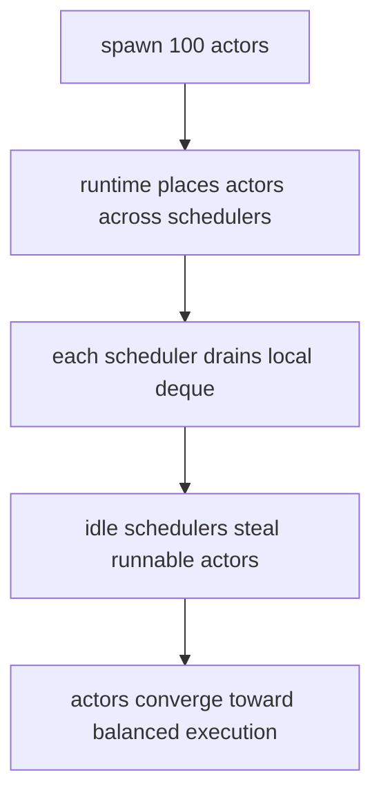
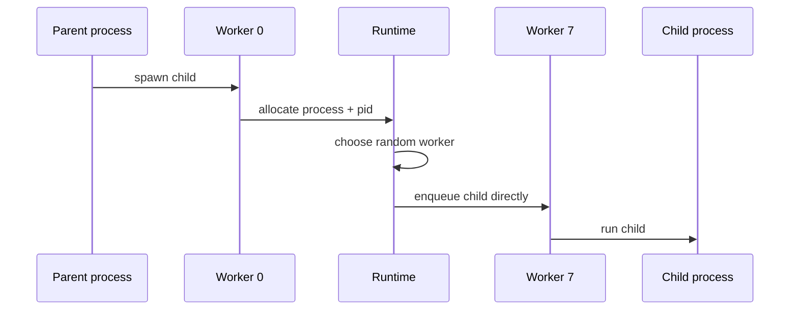
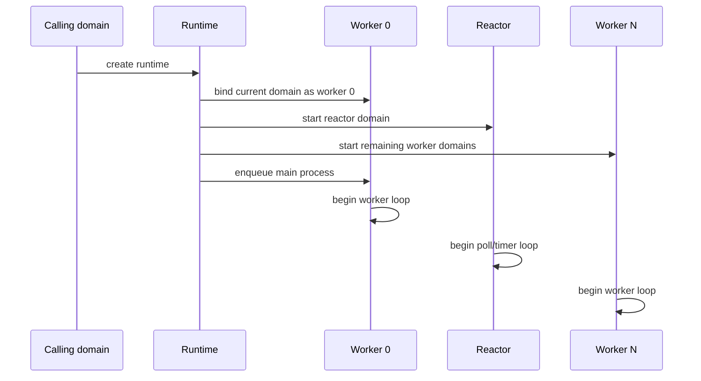
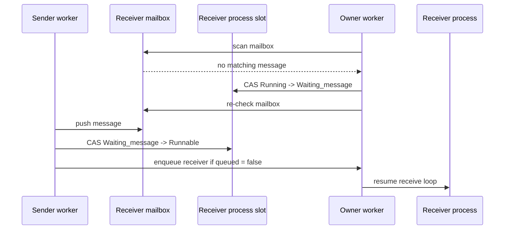
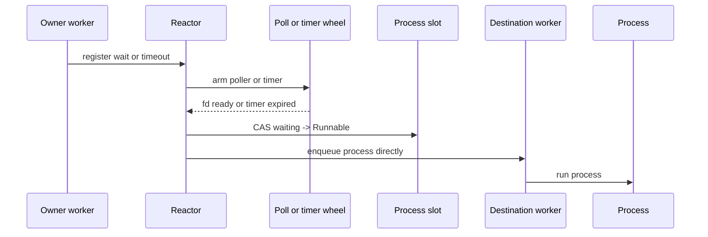
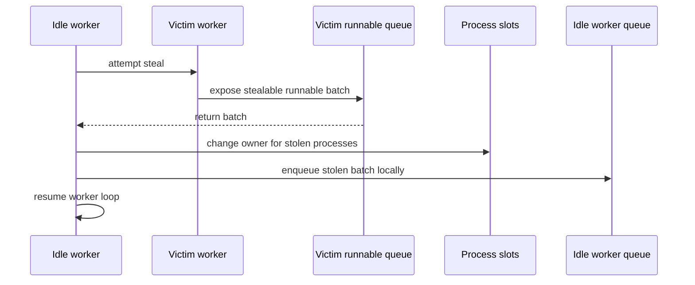

> Canonical source: `docs/rfds/RFD0010-actors-multicore-work-stealing-runtime.md`

> Status: **Presented**

- Feature Name: `actors_multicore_work_stealing_runtime`
- Start Date: `2026-03-20`
- Status: `presented`
- RFD PR: [leostera/riot#0000](https://github.com/leostera/riot/pull/0000)
- Riot Issue: [leostera/riot#0000](https://github.com/leostera/riot/issues/0000)

## Summary
[summary]: #summary

This RFD proposes turning `actors` from a single-scheduler actor runtime into a multicore runtime with one normal scheduler per CPU-sized worker domain, runtime-wide process lookup, one direct-enqueue runnable queue per worker, a dedicated reactor domain for I/O and timers, and work stealing. The public `spawn` API stays the default way to create actors, but it stops meaning "spawn on the current scheduler" and starts meaning "spawn a normal actor on one of the runtime schedulers". Runnable actors can migrate between schedulers when work is stolen. Blocked actors are registered with the reactor and return to worker runnable queues when they become runnable again.

## Motivation
[motivation]: #motivation

`actors` is explicitly single-core today. That is a deliberate and useful baseline, but it creates a hard ceiling that is now in the way of several natural Riot use cases:

- a build or server process can spawn many independent actors, but only one CPU core executes them
- one busy actor tree can monopolize the only scheduler even when the host has many available cores
- higher-level packages such as `std`, `suri`, and `blink` can express concurrency, but not parallel execution
- there is no path to scheduler-local APIs such as pinned actors or blocking actors without first introducing multiple schedulers

The concrete motivating case for this RFD is simple:

1. one actor spawns 100 child actors
2. the machine has 10 cores
3. the runtime starts 10 schedulers
4. those actors eventually distribute across the 10 schedulers instead of all staying behind one queue

This RFD is not primarily about exposing more knobs. It is about changing the runtime so the default actor model can use the hardware that Riot already knows how to detect through `System.available_parallelism`.

The proposal also creates the foundation for the next layers of scheduling APIs, like:

- `spawn_pinned` for actors that must stay on one scheduler
- `spawn_blocked` for actors that may run blocking code
- best-effort scheduler/domain affinity to specific CPUs

Those follow-up APIs are intentionally not in this RFD. The runtime first needs a solid notion of multiple schedulers, ownership, remote wakeup, and stealing.

## Guide-level explanation
[guide-level-explanation]: #guide-level-explanation

After this change, contributors should think about `actors` as a runtime, not a single scheduler.

The runtime contains:

- one process registry shared by all schedulers
- one normal scheduler per worker domain, with worker 0 running on the calling domain
- one runnable queue per scheduler
- one dedicated reactor domain for I/O and timers

The basic actor model stays the same:

- `spawn` creates an actor
- `send` delivers a message asynchronously
- `receive` suspends until a matching message arrives
- `yield` gives another actor a chance to run

What changes is where those actors run.

### New mental model

A normal actor has an owner scheduler, but that ownership is not permanent.

- while the actor is running, scanning its mailbox, or waiting on I/O, one scheduler owns it exclusively
- when the actor is runnable, it may be stolen by another scheduler
- once stolen, the new scheduler becomes the owner

That means `spawn` no longer implies co-location with the caller. If the runtime has 10 schedulers, a burst of 100 spawned actors should start spread across those schedulers and continue balancing through stealing.



### Example

Given:

- `scheduler_count = 10`
- one parent actor running on scheduler 0
- the parent calls `spawn` 100 times

The intended steady-state result is:

- actors are initially placed across the 10 schedulers using a cheap placement policy
- if one scheduler gets ahead or falls behind, idle schedulers steal runnable actors
- the system trends toward roughly even runnable load without requiring the user to manually shard work

The interaction that readers should picture is:



### Public semantics that stay the same

- `Pid.t` remains runtime-wide
- `send` continues to target a PID, not a scheduler
- `spawn_link`, links, monitors, and exit propagation keep working across the whole runtime
- `Timer.send_after` and `Timer.send_interval` remain actor-facing APIs, not scheduler-facing APIs

### Public semantics that change

- `spawn` is no longer current-scheduler-local
- global execution order becomes more nondeterministic once `scheduler_count > 1`

The runtime should preserve the strongest ordering guarantee that still makes sense in a parallel actor system:

- messages sent from one sender to one recipient are observed in send order

The runtime should stop implying stronger global ordering than that across different senders running on different schedulers.

## Reference-level explanation
[reference-level-explanation]: #reference-level-explanation

## 1. Internal split: runtime vs worker

The current `Scheduler.t` conflates runtime-wide state and scheduler-local state.

This RFD splits that in two:

- `Runtime.t`: process registry, spawn placement policy, shutdown state, worker array, reactor handle
- `Worker.t`: one scheduler domain with local runnable state
- `Reactor.t`: one dedicated domain that owns `Async.Poll`, timer state, and wakeup delivery for blocked actors

The current `Scheduler.run` becomes roughly:

1. create `Runtime.t`
2. create `Worker.t array`
3. create `Reactor.t`
4. bind worker 0 to the calling domain
5. start the reactor domain
6. start one domain for each remaining worker
7. place the main actor on worker 0
8. drive the runtime until shutdown

Startup now has an explicit handoff structure:



The current process-local `current_scheduler` cell is replaced by per-domain worker-local state. A worker domain needs domain-local access to:

- the current worker
- the current process
- the current reduction counter

That domain-local state should be introduced at the `kernel` boundary rather than by adding raw `Stdlib.Domain` usage ad hoc inside `actors`.

## 2. Configuration

`Config.t` grows a scheduler count:

```ocaml
type t = {
  timer_resolution : timer_resolution;
  scheduler_count : int;
}
```

Steady-state default:

- `scheduler_count = max 1 (System.available_parallelism - 1)`

The intended meaning is:

- one domain is reserved for the dedicated reactor
- `scheduler_count` counts normal schedulers, including worker 0 on the calling domain

The scheduler count remains configurable as a runtime sizing control.

This RFD does not propose making work-stealing tuning knobs public yet. Steal batch sizes, idle backoff, and inject draining policy can stay internal constants until the runtime has real operational experience.

## 3. Worker runnable queues

Each worker owns one runnable queue.

That runnable queue must support three operations:

- owner-local run and reschedule
- remote enqueue for `spawn` and wakeup
- stealing by idle workers

The intended fast path is:

- local reschedule: push back onto the owner worker's runnable queue
- local run: pop from the owner worker's runnable queue
- cross-worker spawn: pick a worker and enqueue the new process directly onto that worker's runnable queue
- remote wakeup: enqueue the target directly onto its owner worker's runnable queue
- idle steal: steal from another worker's runnable queue

The important semantic point is that `spawn` does not go through a separate staging queue. The current single-core runtime puts newly spawned actors straight into the run queue, and the multicore runtime should preserve that property.

This does make the runnable queue design harder than a pure owner-local deque. The queue implementation remains open in this RFD. The requirement is behavioral:

- a spawned process is immediately enqueued onto the chosen scheduler's runnable queue
- it does not wait for a later inject-queue drain to become runnable

Stealing should happen in batches rather than one actor at a time. The simplest first cut is:

- choose a random victim
- steal up to half of the victim's runnable queue, capped to a small batch

That keeps contention down and follows established work-stealing practice for continuation-based runtimes.

## 4. Process representation

Today `Process.t` assumes single ownership. That assumption breaks immediately once sends, wakeups, and stealing can happen from multiple domains.

`Process.t` itself does not need to know which scheduler currently owns it. Scheduler ownership is runtime metadata, not actor state.

The runtime should wrap each process in a runtime-side process slot or control record that tracks scheduling metadata such as:

- current owner worker
- queue-membership state
- placement policy

`Process.t` still needs these changes:

- `state` becomes atomic
- PID generation becomes atomic
- message envelope UID generation becomes atomic
- `mailbox` becomes multi-producer/single-consumer
- `save_queue`, continuation, and ready-I/O tokens remain owner-local
- `trap_exit` becomes atomic or otherwise remotely readable without races

The important invariant is:

- only the owner worker mutates the continuation, save queue, and waiting-I/O state

Remote domains are allowed to:

- append to the main mailbox
- attempt a wakeup transition
- mark the process exited
- enqueue the process onto the currently owning worker's runnable queue if they win the wakeup race

## 5. Mailbox design

The current mailbox is a plain mutable FIFO queue. That is not safe once many schedulers can call `send` concurrently.

The mailbox should split into:

- `main_mailbox`: MPSC queue for regular sends
- `save_queue`: owner-local FIFO for selective receive skips

The existing note in `packages/actors/docs/intrusive-mpsc-node-based-queue.html` is a good starting point for the `main_mailbox`.

This keeps the common send path cheap:

1. allocate or reuse an envelope node
2. push it into the target process's MPSC mailbox
3. attempt wakeup

Selective receive remains owner-local because only one worker scans and reorders unmatched messages.

## 6. Wakeup protocol and duplicate-enqueue control

The biggest correctness change in this RFD is not stealing itself. It is the park/wake protocol.

Single-core `actors` can do this unsafely because there are no concurrent senders:

1. inspect mailbox
2. see it empty
3. mark process waiting
4. suspend

That sequence loses wakeups in a multicore runtime.

The multicore runtime needs:

- an atomic process state
- an atomic `queued` flag or equivalent queue-membership guard
- a two-phase park protocol

The receive-side protocol becomes:

1. scan `save_queue` and `main_mailbox`
2. if no match, install timeout if needed
3. transition `Running -> Waiting_message`
4. re-check mailbox after the waiting transition
5. if a message arrived during the transition, switch back to `Runnable` and continue instead of sleeping

Remote wakeup becomes:

1. enqueue message
2. read process state
3. if state is `Waiting_message`, CAS to `Runnable`
4. if the process is now runnable and not already queued, enqueue it directly onto a worker runnable queue

The same pattern applies to I/O wakeups and timeout wakeups.

The process interaction is:



This invariant matters:

- a runnable process may be present in at most one worker queue at a time

Without that invariant, stealing and remote wakeups will create duplicate scheduling of the same continuation.

## 7. Dedicated reactor domain

I/O polling and timers move out of worker schedulers and into one dedicated reactor domain.

The reactor owns:

- `Async.Poll.t`
- timer wheel
- wait registration and cancellation state

Workers do not poll I/O and do not tick timers directly.

Instead, workers send commands to the reactor such as:

- register receive timeout
- cancel receive timeout
- register syscall wait
- cancel syscall wait
- `Timer.send_after`
- `Timer.send_interval`
- `Timer.cancel`

This gives the runtime one authoritative owner for all blocked-wait mechanics.

### Why centralize I/O and timers

This improves the multicore design in a few concrete ways:

- workers stay focused on running runnable actors
- blocked actors do not need to stay attached to a worker just because that worker owns the poller or timer wheel
- timer cancellation has one natural owner
- the worker loop becomes much simpler

An actor that is:

- `Waiting_io`
- `Waiting_message` with a timeout

is registered with the reactor, not with a worker-local poller.

That means the runtime still only steals `Runnable` actors, but blocked actors are no longer coupled to per-worker I/O or timer ownership.

### Wakeup path

When I/O becomes ready or a timer expires, the reactor:

1. marks the target process runnable if it wins the wakeup race
2. chooses a destination worker according to the runtime placement policy
3. enqueues the process directly onto that worker's runnable queue

For ordinary wakeups, a reasonable first policy is:

- wake onto the process's last worker for locality, unless the runtime later decides a different balancing heuristic is better

The important point is that the reactor wakes actors back into worker runnable queues. It does not run actor continuations itself.

The wakeup path should look like this:



### Timer cancellation

With one reactor-owned timer wheel, `Timer.cancel` routes to the reactor and does not need per-worker timer ownership encoding.

## 8. Runtime-wide process registry

`send`, `monitor`, `link`, and cross-worker exit propagation all need runtime-wide PID lookup.

The current plain scheduler-local `HashMap` becomes a runtime-wide registry. A pragmatic first implementation is a sharded hash map:

- shard by PID
- guard each shard with a lock
- keep lookups and inserts single-shard

That is less glamorous than a fully lock-free registry, but it is a much better fit for this runtime stage:

- registry operations are frequent enough to matter
- but they are still much lower-volume than mailbox enqueue and local run queue traffic
- correctness and debuggability matter more than heroic lock-free design at this layer

## 9. Links, monitors, and exits

Links and monitors currently mutate plain process-local lists. In the multicore runtime those relationships can be touched from different workers.

The simplest correct rule is:

- relationship metadata is protected independently from run-queue state

That can be implemented with:

- a small per-process lock for links and monitor lists
- PID-ordered double locking for bidirectional link updates

Exit propagation becomes runtime-wide:

- `DOWN` messages can target any worker
- linked-process kill propagation can target any worker
- `trap_exit` must be visible across workers

Abnormal exit of a linked process should mark the target exited and enqueue it on its owner worker if needed, rather than assuming the current scheduler owns both processes.

## 10. `spawn` placement

Default `spawn` should place new normal actors using a cheap runtime-wide policy.

The proposed first policy is:

- random worker selection

Why random first:

- it is cheap
- it avoids a shared placement cursor in the `spawn` fast path
- it matches the direct-enqueue model well: create process, choose worker, enqueue immediately

The runtime should rely on stealing to smooth out unlucky random skew.

Work stealing then becomes the correction mechanism rather than the only balancing mechanism.

The current-scheduler-local spawn policy is intentionally not preserved as the default. The follow-up `spawn_pinned` RFD introduces the opt-in locality escape hatch.

## 11. Worker loop

Each worker's event loop becomes:

1. run local runnable actors
2. attempt steals if idle
3. park briefly if still idle

The reactor's event loop becomes:

1. drain wait-registration and timer commands
2. process expired timers
3. poll I/O until the next timer deadline or wakeup command
4. wake actors by enqueuing them onto worker runnable queues

Shutdown is runtime-wide:

- main process exit sets runtime stop
- all workers observe stop and exit their loops
- parked workers are unparked

When a worker runs out of local work, the steal interaction is:



## 12. Implementation plan

The implementation should be staged so each phase hardens one concurrency boundary at a time instead of rewriting the whole runtime in one pass.

### Phase 1: split runtime-owned and worker-owned state

Start by reshaping the current scheduler code without changing public semantics yet.

Concrete steps:

1. introduce `Runtime.t`, `Worker.t`, and `Reactor.t` module boundaries next to the existing scheduler code
2. move runtime-wide state out of `Scheduler.t`: process registry, stop state, worker array, placement policy
3. keep worker 0 on the calling domain and make the old single worker loop run through `Worker.run`
4. replace the current scheduler cell with domain-local current-worker/current-process/current-reduction state

The goal of this phase is structural:

- keep one worker actually running actors
- make the ownership boundaries explicit before adding parallelism

### Phase 2: make process identity and state remotely observable

Once the runtime split exists, harden the parts of process state that remote domains will need to read or update.

Concrete steps:

1. make PID allocation atomic
2. make message envelope UID allocation atomic
3. change `Process.state` to an atomic state machine
4. move scheduler/placement metadata out of `Process.t` and into a runtime-side process slot
5. make `trap_exit` and other remotely relevant flags safe to observe across domains

The goal of this phase is to eliminate the current single-owner assumptions in:

- `process.ml`
- `pid.ml`
- `message.ml`
- `runtime.ml`

### Phase 3: replace the mailbox and add duplicate-enqueue protection

Before multiple workers run, the send and wakeup path must become safe.

Concrete steps:

1. replace the current mailbox FIFO with an MPSC main mailbox
2. keep `save_queue` owner-local for selective receive
3. add a `queued` guard or equivalent queue-membership state in the runtime-side process slot
4. implement the park/wake transition so a process cannot be both sleeping and runnable
5. preserve the invariant that one runnable process appears in at most one worker queue at a time

This phase should finish with:

- cross-domain `send`
- cross-domain wakeup
- no work stealing yet

### Phase 4: introduce the dedicated reactor domain

Move blocked wait ownership out of the worker loop before introducing stealing.

Concrete steps:

1. create the reactor command path
2. move timer wheel ownership into the reactor
3. move `Async.Poll` ownership into the reactor
4. route receive timeouts, syscall waits, and timer APIs through the reactor
5. make the reactor wake actors by enqueuing them directly onto worker runnable queues

This phase should end with workers responsible only for runnable actors, while the reactor owns:

- I/O wait registration
- timeout registration
- timer cancellation and expiry

### Phase 5: add direct-placement multicore spawn

Only after the wakeup and blocked-wait path is correct should the runtime start more than one worker.

Concrete steps:

1. start the remaining worker domains
2. make `spawn` choose a random worker
3. enqueue the new process directly onto that worker's runnable queue
4. switch runtime-wide PID lookup, links, monitors, and exit delivery to the shared registry
5. validate that multi-worker `send`, `receive`, `yield`, links, and monitors all work without stealing enabled

This gives the runtime real multicore execution while still keeping actor placement simple enough to debug.

### Phase 6: add work stealing

Stealing should be the last major scheduler change, not the first.

Concrete steps:

1. implement steal attempts only for idle workers
2. steal only `Runnable` actors
3. steal in small batches from a random victim
4. transfer queue ownership through the runtime-side process slot before the stolen actor runs
5. add counters and tracing for steals, failed steals, remote wakeups, and duplicate-enqueue races

This phase should be benchmarked against spawn-heavy and message-heavy workloads before tuning policy.

### Phase 7: harden runtime-wide lifecycle behavior

After stealing works, tighten the parts of the runtime that are easy to get mostly-right but still wrong under load.

Concrete steps:

1. make link and monitor mutation explicitly concurrency-safe
2. make abnormal exit propagation wake remote workers correctly
3. ensure timer cancellation races do not resurrect dead actors
4. ensure shutdown unparks idle workers and stops the reactor cleanly
5. add stress coverage for exit storms, timeout races, and many-sender mailbox contention

### Suggested validation order

The runtime should be verified incrementally, not only at the end.

1. single-worker refactor parity: the refactored runtime still passes today's `actors` behavior tests
2. multicore without stealing: multiple workers run correctly with random `spawn` placement and remote wakeups
3. multicore with reactor: timers, I/O waits, and cancellation remain correct under concurrent sends
4. multicore with stealing: spawn bursts and uneven workloads converge toward balanced execution
5. stress and benchmark passes: throughput, fairness, shutdown, and exit semantics remain acceptable

That rollout order keeps the failure surface narrow. If a phase regresses, the runtime can be stopped at the last correct boundary instead of debugging placement, wakeup, I/O, and stealing all at once.

## Drawbacks
[drawbacks]: #drawbacks

- The runtime becomes materially more complex than today's single-core scheduler.
- Global execution order becomes less deterministic once more than one scheduler runs.
- Mailbox, wakeup, and exit paths all become concurrency-sensitive.
- Work stealing can hurt cache locality for actor trees that communicate heavily.
- The implementation risk is concentrated in a small set of tricky invariants: queue membership, park/wake races, and safe ownership transfer.

## Rationale and alternatives
[rationale-and-alternatives]: #rationale-and-alternatives

This design is the best next step because it keeps the actor model intact while changing the scheduler architecture underneath it.

Alternatives considered:

- Keep `actors` single-core and tell higher layers to use external thread pools.
  That pushes parallelism above the actor runtime and leaves core features like links, monitors, timers, and exit handling outside the parallel execution model.

- Add multiple schedulers but no stealing.
  That helps initial burst placement, but long-lived imbalance remains unsolved. One hot scheduler can still dominate runtime throughput.

- Use one global concurrent run queue.
  That is simpler conceptually, but it throws away locality and turns the hottest runtime structure into a global contention point.

- Keep `spawn` local-by-default and rely only on stealing.
  That preserves locality, but it makes the motivating "one actor spawns many children" case rebalance much more slowly.

- Rewrite actors around an explicit state-machine interpreter before introducing multicore.
  That may eventually be attractive, but it is a much larger rewrite than this RFD needs. This proposal keeps the effect-based process model and hardens the scheduler around it.

One important implementation risk remains open:

- whether `Proc_state` continuations can be resumed safely on a different worker domain after ownership transfer

This RFD assumes that runnable actor migration is feasible at the OCaml runtime level. If implementation proves otherwise, the runtime split in this RFD is still valuable, but stealing would need to be constrained or the continuation representation would need a further redesign.

## Prior art
[prior-art]: #prior-art

- The BEAM scheduler is the obvious conceptual prior art: multiple run queues, actor migration, and scheduler-local work balanced by stealing.
- Chase-Lev style deques are established practice for work-stealing runtimes that want fast owner push/pop and cheap stealing.
- The 1024cores intrusive MPSC queue design is already referenced in `packages/actors/docs/intrusive-mpsc-node-based-queue.html` and fits the mailbox inject path well.
- Effect-based OCaml runtimes such as Eio show the importance of keeping scheduler-local wait state local even when broader concurrency exists.
- Riot's old prototype in `3rdparty/riot-old/packages/riot-runtime` is useful prior art specifically for the fast path, even if other parts of that runtime are now superseded. The parts worth learning from are:
  - random scheduler selection in `spawn`
  - direct enqueue onto the chosen scheduler's run queue
  - a dedicated I/O domain separate from normal worker schedulers
  - domain-local current-scheduler/current-process state via `Domain.DLS`
  - reserving domain budget for the non-worker reactor path instead of assuming every domain is a worker

Riot should borrow the structure, not blindly copy any one runtime. `actors` needs a design that fits its own process, timer, and effect machinery.

## Unresolved questions
[unresolved-questions]: #unresolved-questions

- Can `Proc_state` continuations be resumed on a different domain safely enough for migrated runnable actors?
- Is pure random placement good enough for the first rollout, or should the runtime move quickly to a two-choice heuristic once queue depth becomes observable?
- Should runtime-wide process lookup start as a sharded lock-based table or jump directly to a more concurrent structure?
- Should timer ownership be encoded into `Timer_id.t` or tracked in a separate table?
- Do we need a dedicated runtime trace hook before rollout so steal activity and wakeup races are observable in tests?

## Future possibilities
[future-possibilities]: #future-possibilities

This runtime split enables several follow-up directions:

- `spawn_pinned` and `spawn_blocked`
- scheduler/domain affinity configuration
- steal-aware telemetry and tracing
- per-worker metrics for runnable depth, steal counts, timer wakeups, and I/O wakeups
- locality-aware spawn heuristics beyond simple round-robin
- actor handoff policies that incorporate mailbox depth or recent communication patterns

It also creates a path to revisit some currently misleading higher-level abstractions in `std` that talk about parallel tasks without a true multicore actor runtime underneath them.
