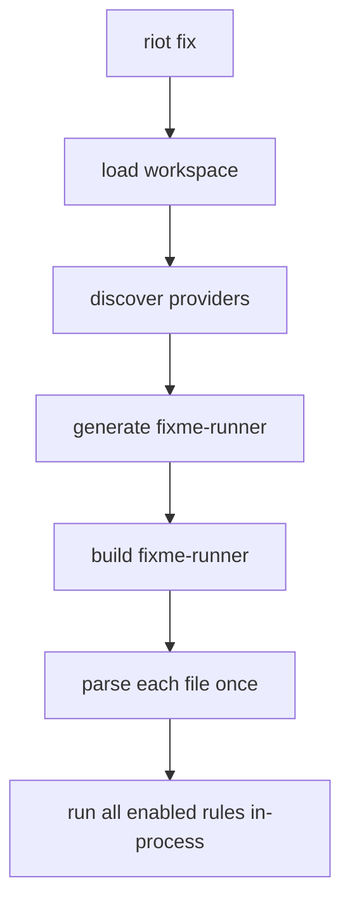

- Feature Name: `riot_fix_package_rules`
- Start Date: `2026-03-20`
- Status: `implemented`

## Summary
[summary]: #summary

This RFD extends `riot-fix` so workspace packages can ship their own lint rules
and explanations while still executing the whole workspace through one
generated in-process runner.

- rule ownership moves to the package that defines the policy, rather than
  centralizing unrelated rules in `riot-fix`
- `riot fix` still parses each file once and runs all enabled rules in-process
  through one synthetic `fixme-runner`
- provider entrypoints live in build-oriented rule source files and are exposed
  through one `[riot.fix.provider]` declaration per package
- rule ids and diagnostic codes are automatically namespaced as
  `<package>:<rule>` and `<package>:<code>`
- this RFD is about package-owned rule integration, not about running one
  binary per rule or per package

## Motivation
[motivation]: #motivation

`riot-fix` already had the right execution primitives:

- parser-backed analysis
- typed diagnostics
- fixes and explanations
- one-process execution

What it lacked was ownership. Rules such as `std:no-stdlib` are not generic
style opinions; they are package-owned policy. Without a package-owned model,
Riot keeps paying two costs:

- rule definitions drift toward one central tool package even when the policy
  really belongs to `std`, `suri`, `sqlx`, or another domain package
- every attempt to decentralize rule ownership risks a much worse runtime shape
  with repeated parsing, repeated process startup, and fragmented streaming

That second cost matters in Riot-sized workspaces. Running one binary per rule
or one binary per package would turn `riot fix` into a subprocess orchestration
problem instead of one parser-and-runner pass.

So the actual requirement is:

- let packages own their rules
- keep one generated in-process `fixme-runner`

This proposal exists to remove the ownership problem without giving up the
runtime shape that makes `riot-fix` practical.

## Guide-level explanation
[guide-level-explanation]: #guide-level-explanation

Suppose `std` wants to enforce `std:no-stdlib`.

Without this design, Riot has two bad choices:

- put the rule in central `riot-fix` code even though the policy belongs to
  `std`
- or try to run separate rule binaries and pay repeated parse and process costs

With this proposal, the package itself declares a provider in `riot.toml`:

```toml
[riot.fix.provider]
rules = ["no-stdlib"]
```

If `path` is omitted, `riot-fix` should probe these defaults in order,
preferring build-only `fix/` locations:

- `fix/riot_fix_rules/riot_fix_rules.ml`
- `fix/riot_fix_rules.ml`
- `src/riot_fix_rules/riot_fix_rules.ml`
- `src/riot_fix_rules.ml`

The provider source does not participate in the owning package's normal runtime
build. Instead, `riot fix` discovers all providers in the workspace, generates
one synthetic `fixme-runner`, builds it, and runs that one binary.

From the user side, the command surface stays simple:

```text
riot fix
riot fix --check
riot fix --explain std:f0001
```

From the runtime side, the shape is:



So the contributor mental model is:

- packages own their lint policy
- `riot fix` still behaves like one workspace-wide tool
- the generated runner is an implementation detail that preserves the good
  runtime shape

## Reference-level explanation
[reference-level-explanation]: #reference-level-explanation

## 1. Manifest shape

The manifest shape should be:

```toml
[riot.fix.provider]
path = "fix/riot_fix_rules.ml" # optional
rules = ["no-stdlib"]
```

Rules should be declared provider-locally, but exposed to users as
`<package>:<rule>`.

For example:

- package `std`
- local rule `no-stdlib`

becomes:

- `std:no-stdlib`

Likewise, provider-defined diagnostic code `f0001` should become `std:f0001`.

## 2. Provider authoring

Shared rule-authoring types should live in `fixme`.

Provider implementations should prefer `fix/` over `src/` so build-only rule
code does not participate in the package's runtime dependency graph. Legacy
`src/` discovery may exist as a compatibility fallback, but it should not be
the preferred authoring location.

The generated `fixme-runner` should still expose the richer `Riot_fix` runtime surface,
but provider authors should write against the shared rule API plus `syn`
helpers.

Provider-owning packages should place rule-authoring dependencies such as
`fixme` in `[build-dependencies]`, not `[dependencies]`.

Conceptually, a provider module looks like:

```ocaml
open Std

let name = "std"

let rules () =
  [ No_stdlib.make () ]

let diagnostic_codes () =
  No_stdlib.codes
```

Provider support modules that live next to the entrypoint should be copied into
the generated `fixme-runner` as sibling embedded modules.

## 3. Fusion model

`riot fix` should generate a workspace-specific synthetic package that depends
on:

- `riot-fix`
- `fixme`
- `syn`
- `std`
- each provider-owning package

and emits generated source that:

- embeds provider entrypoints
- embeds provider support modules
- registers providers before CLI execution

The resulting `fixme-runner` should be rebuilt like any other `riot` package,
so it inherits normal build caching behavior.

## 4. Runtime model

Per file, the `fixme-runner` should:

1. parse once with `syn`
2. run all enabled built-in and package rules in-process
3. collect diagnostics and optional fixes
4. stream results through the CLI reporter

That runtime model is the main reason to prefer generated fusion over provider
subprocesses.

## 5. Config interaction

The effective rule set should be:

1. built-in rules
2. discovered package-provided rules
3. workspace `[riot.fix].rules` overrides
4. package-local `[riot.fix].rules` overrides

Short rule syntax still applies:

- `"name"` enables
- `"-name"` disables

Package-local overrides apply on top of workspace defaults.

## 6. Explain flow

`riot fix --explain std:f0001` searches:

1. built-in diagnostic codes
2. package-owned diagnostic codes fused into the runtime
3. unknown-code fallback if nothing matches

That should make package-provided explanations first-class.

## 7. Dependency-layering constraint

`std` wants to own `std:no-stdlib`, but direct normal dependency layering like:

- `std -> fixme`
- `fixme -> syn`
- `syn -> ceibo`
- `ceibo -> std`

creates a cycle.

That is why provider source must remain outside the owning package's normal
build, and why provider authoring dependencies should resolve through
`[build-dependencies]`, not through the runtime package graph.

## 8. Dependency-class interaction

Package-provided rules should integrate with dependency classes like this:

- normal package builds should not traverse provider build-time dependencies
- generated fused tooling such as `riot fix` should resolve provider packages
  through the `Build` graph
- provider authors should be able to depend on `fixme`, `syn`, and other
  rule-authoring support libraries without contaminating runtime package
  products
- packages should still own their rule ids and diagnostic code namespaces even
  when those rules are compiled only into the fused runtime

## Drawbacks
[drawbacks]: #drawbacks

- fusion introduces generated workspace build artifacts
- provider source is compiled in a synthetic runtime, not in the owning
  package's normal build
- the synthetic runtime must be rebuilt when provider membership changes
- provider authoring pushes on the package dependency model, which is why
  dependency classes are necessary

## Rationale and alternatives
[rationale-and-alternatives]: #rationale-and-alternatives

### Why not one provider binary per package

Because it is the wrong runtime shape:

- too many subprocesses
- repeated parsing
- repeated startup cost
- poor scaling for large workspaces

### Why not statically link all rules into checked-in `riot-fix`

Because it creates the wrong ownership model:

- package-specific rules stay centralized
- package authors must edit `packages/riot-fix`
- `riot-fix` becomes a bottleneck package

### Why not dynlink

Because it buys the wrong tradeoff:

- platform-sensitive behavior
- ABI fragility
- more complex debugging
- harder-to-reason-about build/runtime story

Generated fusion is more explicit and more predictable.

## Prior art
[prior-art]: #prior-art

Relevant patterns:

- synthetic registries generated at build time
- workspace-discovered extension points
- toolchains that keep extension ownership at the package boundary while still
  executing one coherent runtime

This design follows that same pattern.

## Unresolved questions
[unresolved-questions]: #unresolved-questions

- How far should provider sources be allowed to reach into the owning package:
  only public modules, or some future friend/internal surface?
- When built-ins migrate to package providers, should the built-in copies linger
  for a transition window or be removed immediately after verification?
