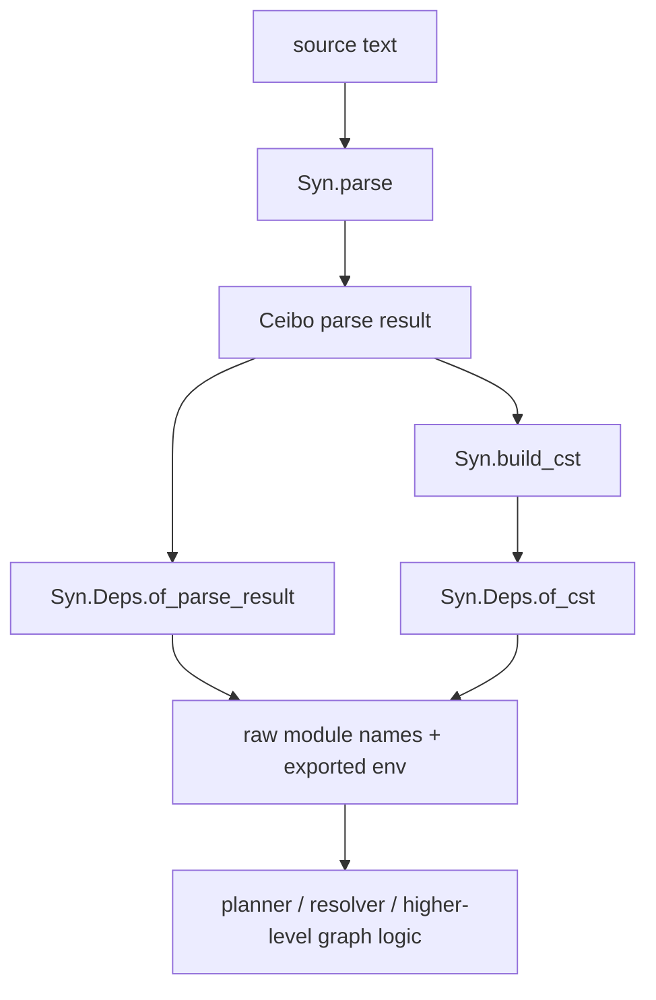

> Canonical source: `docs/rfds/RFD0034-syn-syntactic-dependency-extraction.md`

> Status: **Presented**

- Feature Name: `syn_syntactic_dependency_extraction`
- Start Date: `2026-04-03`
- Status: `implemented`
- RFD PR: [leostera/riot#0000](https://github.com/leostera/riot/pull/0000)
- Riot Issue: [leostera/riot#0000](https://github.com/leostera/riot/issues/0000)

## Summary
[summary]: #summary

This RFD proposes adding a pure, in-memory dependency extractor to `syn`:
`Syn.Deps`.

The new layer should replace Riot's current use of external `ocamldep -modules`
for normal module-graph wiring. It should accept either a clean
`Parser.parse_result` backed by Ceibo or an already-built `Syn.Cst.source_file`,
and return a deterministic summary of the file's syntactic module
dependencies.

The key design constraints are:

- keep dependency extraction in `packages/syn`, because the logic is syntactic
- keep the API pure and parallel-safe: no global refs, no filesystem, no
  process execution
- keep load-path resolution, `.cmi` / `.cmx` target selection, and makefile
  rendering out of `syn`
- preserve enough alias and open-state information that Riot can eventually
  cover `ocamldep` map-style workflows without reparsing

This RFD is intentionally narrower than "port all of `ocamldep`". The
proposal ports the syntactic extraction behavior now implemented in
`vendor/ocaml/parsing/depend.ml`. It does not move the CLI, preprocessing,
filesystem probing, or output formatting logic from
`vendor/ocaml/driver/makedepend.ml` into `syn`.

## Motivation
[motivation]: #motivation

Riot currently discovers module-level OCaml dependencies by shelling out to the
toolchain's `ocamldep.opt`, then reparsing text output in
`packages/riot-toolchain/src/ocamldep.ml`.

That path works, but it is the wrong layer for the long term.

The current design has four concrete costs:

1. Dependency analysis depends on an external process even though the real
   dependency logic is syntax-directed.
2. Planner code has to translate paths into a shell command, execute the tool,
   and then parse `"file.ml: A B C"` back into data.
3. The process boundary prevents reuse of already-parsed syntax and makes fine
   grained parallel analysis awkward.
4. The upstream implementation keeps state in process-global refs such as
   `Depend.free_structure_names`, `Depend.pp_deps`, `pattern_bv`, and several
   `makedepend` refs, which makes direct in-process reuse unattractive.

The important observation from reading the vendored OCaml code is that
`vendor/ocaml/tools/ocamldep.ml` is not the implementation we actually need to
replace. That file is only:

```ocaml
let () = Makedepend.main ()
```

The real behavior is split across two deeper layers:

- `vendor/ocaml/driver/makedepend.ml`
  This owns CLI parsing, preprocessing, load-path handling, target-file
  selection, raw-vs-make output formatting, and `-sort`.
- `vendor/ocaml/parsing/depend.ml`
  This is the syntax walk that discovers free module references while tracking
  locally bound modules, `open`, `include`, aliases, recursive groups, and
  module-language structure.

Only the second layer belongs in `syn`.

That split matters for Riot because the current planner use case is already the
syntax-only subset:

- parse source files
- extract raw module names
- resolve those names against Riot's own registry and namespace model
- add graph edges

Riot does not need `syn` to emit `.cmo` dependencies, quote makefile paths, or
scan the filesystem for `Foo.ml` vs `Foo.mli`. Riot already has its own module
registry and build graph for that.

This proposal addresses three concrete use cases:

### Use case 1: planner wiring without a toolchain process

`riot-planner` should be able to wire module edges from file contents in
memory. The planner already owns registry resolution and graph construction, so
it should not have to round-trip through an external tool just to recover raw
module names.

### Use case 2: reusable syntax summaries

Once dependency extraction lives in `syn`, any tool that already has a parse
result or CST can reuse it:

- build planning
- editor tooling
- fix or refactor passes that want dependency-aware checks
- future caches of per-file syntax summaries

### Use case 3: explicit parity targets

Today, "dependency analysis" is hidden inside a tool wrapper. A `Syn.Deps`
layer makes the contract explicit and testable:

- raw `-modules` parity
- alias-map parity
- determinism under parallel evaluation
- planner integration without a shell command

## Guide-level explanation
[guide-level-explanation]: #guide-level-explanation

Contributors should think of `Syn.Deps` as a file-summary layer on top of
`syn`.

The job of that layer is:

- walk the syntax of one file
- keep track of module bindings introduced earlier in that same file
- optionally start from an imported alias/open environment
- return the module names that remain free after that analysis
- return the file's exported environment so a later file can reuse it

The job of that layer is not:

- resolve module names to files on disk
- decide between `.cmi`, `.cmo`, `.cmx`, or `.o`
- search `-I` directories
- print makefile fragments
- topologically sort files

In other words, `Syn.Deps` should answer:

- "Which module roots does this file depend on syntactically?"

It should not answer:

- "Which target artifacts should Make depend on?"

### Mental model

The proposed stack becomes:



The dependency summary itself is intentionally small:

- the file kind: implementation or interface
- the raw module names, sorted and deduped
- an opaque exported environment for later syntactic composition

### What normal planner code should look like

The common case should feel like this:

```ocaml
let parsed = Syn.parse ~filename source in

match Syn.Deps.of_parse_result parsed with
| Ok deps ->
    Syn.Deps.module_names deps
| Error (Syn.Deps.Parse_diagnostics diagnostics) ->
    (* planner decides its own fallback policy *)
    ignore diagnostics;
    []
```

If another syntax consumer already has a `Syn.Cst.source_file`, it should be
able to avoid rederiving it:

```ocaml
let deps = Syn.Deps.of_cst source_file in
let names = Syn.Deps.module_names deps in
ignore names
```

If a caller wants `ocamldep -map` style behavior later, it should be able to
thread an exported environment explicitly:

```ocaml
let lib_env = Syn.Deps.exported_env lib_summary in

let deps =
  Syn.Deps.of_parse_result
    ~options:{ Syn.Deps.default_options with env = lib_env }
    client_parse
in
ignore deps
```

The crucial point is that the environment is a value, not hidden process state.

## Reference-level explanation
[reference-level-explanation]: #reference-level-explanation

## 1. Scope split: what moves into `syn`

This proposal ports only the syntactic portion of upstream `ocamldep`.

### In scope

- path-sensitive module reference extraction
- same-file bound-module tracking
- `open` and `include` environment updates
- module alias handling
- recursive module group handling
- traversal of expressions, patterns, core types, module expressions, module
  types, classes, and signatures that can introduce dependencies
- explicit imported environment support for future `-map` / `-open` parity

### Out of scope

- `-pp` / `-ppx` preprocessing
- filesystem search and load-path probing
- suffix rules such as `.ml` / `.mli` synonyms
- `.cmi` / `.cmo` / `.cmx` target expansion
- makefile output rendering
- `-sort`
- Windows slash rewriting and line wrapping
- compiler-libs `Parsetree`

The resulting rule is simple:

- `syn` extracts syntactic facts
- higher layers resolve those facts into Riot build edges

## 2. Public API direction

The exact final signature can tighten during implementation, but the public
shape should be close to:

```ocaml
module Syn.Deps : sig
  module Env : sig
    type t
    val empty : t
    val union : t -> t -> t
  end

  type alias_mode =
    | Immediate
    | Delayed

  type options = {
    env: Env.t;
    open_modules: Cst.Ident.t list;
    alias_mode: alias_mode;
  }

  type t

  type error =
    | Parse_diagnostics of Diagnostic.t list
    | Unsupported_root of SyntaxKind.t
    | Unsupported_shape of {
        syntax_kind: SyntaxKind.t;
        context: string list;
      }

  val default_options : options

  val of_cst : ?options:options -> Cst.source_file -> t

  val of_parse_result :
    ?options:options ->
    Parser.parse_result ->
    (t, error) result

  val kind : t -> [ `Implementation | `Interface ]

  val module_names : t -> string list

  val exported_env : t -> Env.t
end

type deps_input =
  | Parse_result of Parser.parse_result
  | Cst of Cst.source_file

val deps :
  ?options:Syn.Deps.options ->
  deps_input ->
  (Syn.Deps.t, Syn.Deps.error) result
```

Three parts of that surface matter more than the exact spellings:

1. `of_cst` must be total on a valid CST.
2. `of_parse_result` must not require `Syn.build_cst` to succeed.
3. `Env` must be explicit and immutable so cross-file composition is
   parallel-safe.

## 3. Summary semantics

`Syn.Deps.t` should represent raw syntactic dependencies, not Riot-specific
module resolution.

That means:

- `module_names` are plain OCaml module roots, not `Riot_model.Module_name.t`
- names are sorted and deduped, matching the determinism of upstream
  `String.Set`-based output
- a name may later resolve to the file itself once Riot applies its own
  namespace rules; self-edge filtering stays outside `syn`
- `exported_env` is opaque and reusable, but not tied to any filesystem path

The two alias modes exist to mirror the two important upstream behaviors:

- `Immediate`
  Default. This matches normal `ocamldep -modules` behavior. A module alias
  contributes its target dependency immediately.
- `Delayed`
  This matches the delayed-alias behavior behind `-as-map` /
  `-no-alias-deps`. Alias bindings primarily contribute exported environment,
  and later consumers decide when those delayed deps become visible.

Riot planner integration only needs `Immediate` first. `Delayed` exists so the
core design does not dead-end at the first milestone.

## 4. Internal architecture

The implementation should live under a dedicated submodule tree inside
`packages/syn/src/deps/`.

The expected split is:

- `src/deps/deps.ml`
  Public API, summary type, and top-level dispatch
- `src/deps/env.ml`
  Pure port of the bound-map / map-tree logic from upstream `Depend`
- `src/deps/state.ml`
  Accumulator and shared helper logic
- `src/deps/cst_walker.ml`
  `Syn.Visit`-based traversal over `Syn.Cst`
- `src/deps/ceibo_walker.ml`
  Ceibo-backed traversal for the parse-result lane

This split is intentional:

- `Env` is the semantic core that both walkers must share
- the Cst and Ceibo lanes may differ mechanically, but they must not fork the
  dependency rules
- the public API should stay small even if the implementation uses several
  internal modules

## 5. Core environment model

The upstream `Depend` module uses a small tree structure:

```ocaml
type map_tree = Node of String.Set.t * bound_map
and bound_map = map_tree String.Map.t
```

That structure is the most important part of the port. It encodes:

- which free module names are required to access a structure
- which submodules become available after opening or including that structure

The Riot port should preserve that model, but make it immutable and
side-effect-free.

Conceptually:

- `Env.lookup_free A.B.C`
  answers "what free module names are required to reach `A.B.C`?"
- `Env.open_module`
  merges the reachable child map into the current environment
- `Env.union`
  combines exported environments from earlier files

This is what lets the extractor resolve cases such as:

```ocaml
module Packed = struct
  module A = LibA
end

open Packed
let x = A.f
```

to `LibA` instead of `Packed`.

## 6. Extraction algorithm from upstream `Depend`

The upstream algorithm is a mutually recursive syntax walk over the OCaml
syntax tree. Almost every function has the same shape:

- accept the current bound-module environment `bv`
- inspect one syntax node
- record free module names
- sometimes return an updated environment when the syntax introduces new
  module bindings

In upstream OCaml, the free names are written into the global ref
`Depend.free_structure_names` and some pattern cases also mutate the global
`pattern_bv` ref. In Riot, those become ordinary fields in a pure accumulator.

The port should therefore think in terms of a threaded state:

```ocaml
type state = {
  env: Env.t;
  free: String.Set.t;
  exported_env: Env.t;
}
```

The rest of the algorithm is best understood as five rules.

### 6.1 Path classification: full module path vs parent module path

The single most important detail in `Depend` is that it does not treat every
long identifier as a module path.

There are two classes of occurrences:

- occurrences that denote a module path directly
- occurrences that end in some non-module terminal such as a value, type
  constructor, record field, class member, or exception constructor

Upstream encodes that distinction by using two helpers:

- `add_module_path`
  calls `add_path` on the full path
- `add`
  is just `add_parent`, so it strips the terminal segment before tracking the
  dependency

That means:

- `open Packed.A` tracks `Packed.A`
- `module M = Packed.A` tracks `Packed.A`
- `module type of Packed.A` tracks `Packed.A`
- `Packed.A.f` tracks `Packed.A`, not `Packed.A.f`
- `M.t` tracks `M`, not `M.t`
- unqualified names such as `f`, `t`, or `Some` do not become module
  dependencies at all

This is why a faithful port cannot just collect every uppercase-looking
identifier. It has to know whether the final path segment is still module-like.

### 6.2 Environment nodes carry both direct imports and submodule structure

The upstream environment is:

```ocaml
type map_tree = Node of String.Set.t * bound_map
and bound_map = map_tree String.Map.t
```

`Node (free, children)` means:

- `free`
  the imports required to access this node directly
- `children`
  the named submodules available under this node

The four core operations are:

- `lookup_free`
  walk a path through `children` as far as possible; when descent stops, return
  the current node's `free` set
- `lookup_map`
  return the whole `Node` for a module path
- `collect_free`
  union `free` with the recursive free names of all descendants
- `weaken_map`
  push an inherited free set down through every descendant

That model is the reason `Depend` can resolve a later `A.f` reference to
`LibA` after an earlier `open Packed` if `Packed` exported `module A = LibA`.

### 6.3 `add_path` resolves a use through the current environment

`add_path` is the real lookup algorithm.

Given a path like `Packed.A.f`, upstream peels the path back to the head while
remembering the suffix. For a parent-style dependency position such as a value
reference, that suffix becomes `["A"]`. For a real module-path position, the
suffix becomes `["A"; "f"]` only if `f` is itself part of the module path.

The algorithm is:

1. peel the path until the head identifier is known
2. ask `lookup_free` for the head-plus-suffix in the current environment
3. if the lookup succeeds, add the returned free set
4. if the lookup fails at the head, fall back to the singleton set containing
   the head module name

So `A.f` means:

- if `A` is locally known as an alias to `LibA`, record `LibA`
- otherwise record `A`

That one rule explains almost all of the "alias and open work" behavior in
`ocamldep`.

In pseudocode, the core path-resolution rule is:

```text
function record_path(env, path, use_full_path):
  query_path =
    if use_full_path then
      path
    else
      parent_of(path)

  if query_path is empty:
    return {}

  head, suffix = split_head(query_path)

  match env.lookup_free(head, suffix):
    | Some free_names -> free_names
    | None -> { head }
```

### 6.4 Source order matters because `bv` is folded left

Structure and signature bodies are processed left-to-right.

Upstream uses:

- `add_structure_binding`
  a left fold over structure items
- `add_signature_binding`
  a left fold over signature items

Each fold threads two maps:

- `bv`
  the module environment visible to later items in the same body
- `m`
  the module environment exported by the current structure or signature

That makes source order semantically important:

- `module A = LibA` can affect later items
- `open A` changes how later qualified names resolve
- `include A` changes both local visibility and exported structure
- later items never flow backward to earlier ones

The consequence for the Riot port is simple:

- dependency extraction must stay an ordered fold, even if files are analyzed in
  parallel

### 6.5 Binding forms update the environment conservatively

The upstream binding logic is not "infer the full module shape whenever
possible". It is more conservative than that.

The important cases are:

- `module M = N`
  uses `add_module_alias`
- `module M = struct ... end`
  uses the recursively built `m` map of the structure body
- `module M = <complex module expr>`
  collects dependencies from the expression, but exports only `bound`
- `module type S = sig ... end`
  exports a structured node
- `module type S = module type of M`
  exports the module binding derived from `M`
- recursive modules prebind names as `bound`, walk bodies under that prebound
  environment, and keep the exported recursive names conservative

That last point is easy to miss. Upstream `Pstr_recmodule` and `Psig_recmodule`
do not try to recover a rich exported map from each recursive body. They:

1. prebind every recursive name to `bound`
2. analyze each body under that prebound environment
3. keep the exported names conservative

The Riot port should preserve that conservatism.

Non-module syntax mostly does not update `bv` at all. Expressions, types,
classes, exceptions, and ordinary value bindings contribute free names but do
not add module bindings. The main exception is first-class-module unpack
patterns, which can bind a module name into scope and therefore do update the
environment.

### 6.6 `open` and `include` are the main environment mutation points

Upstream has two closely related but different algorithms here.

For `open X`:

1. try `lookup_map X bv`
2. if it succeeds with `Node (s, m)`:
   add `s` to the free set and merge `m` into `bv`
3. if it fails:
   treat `X` as an ordinary dependency path and leave `bv` unchanged

For `include X`:

1. analyze the included module or module type as a binding and get a
   `Node (s, m)` back
2. merge `m` into both the local environment and the exported environment
3. decide how many free names to materialize now

That last step is where delayed alias handling appears:

- immediate mode:
  add `collect_free node`
- delayed mode:
  add only `s`

So immediate mode imports every delayed alias dependency exposed by the included
structure, while delayed mode preserves those alias dependencies behind the
merged environment until some later reference actually uses them.

That behavior is exactly what Riot needs to model explicitly if it wants
eventual parity with `ocamldep -map`.

### 6.7 Structure expressions bubble submodule dependencies outward

One subtle upstream rule is:

```ocaml
and add_structure bv item_list =
  let (bv, m) = add_structure_binding bv item_list in
  add_names (collect_free (make_node m));
  bv
```

This means a structure expression is not finished when its direct item walk is
done. Upstream also unions the free names hidden inside the structure's exported
module map.

Without that step, something like:

```ocaml
struct
  module A = LibA
end
```

would export a map for `A`, but the outer analysis would miss the fact that the
structure depends on `LibA`.

The Riot port should keep that exact rule.

Putting the pieces together, a faithful extraction pass is roughly:

```text
function analyze_source_file(initial_env, items, mode):
  state = {
    env = initial_env,
    free = {},
    exported = {}
  }

  for item in items:
    state = analyze_item(state, item, mode)

  return {
    module_names = sort_and_dedup(state.free),
    exported_env = state.exported
  }

function analyze_item(state, item, mode):
  match item:
    | Module_binding(name, expr):
        node, free_from_expr = analyze_module_binding(state.env, expr, mode)
        return {
          state with
          free = state.free ∪ free_from_expr,
          env = state.env + (name -> node),
          exported = state.exported + (name -> node)
        }

    | Open(target):
        match resolve_node(state.env, target):
          | Some Node(free_here, children) ->
              return {
                state with
                free = state.free ∪ free_here,
                env = merge_children(state.env, children)
              }
          | None ->
              return {
                state with
                free = state.free ∪ record_full_module_path(state.env, target)
              }

    | Include(target):
        node, free_from_target = analyze_include_target(state.env, target, mode)
        imported_free =
          if mode = Immediate then collect_free(node) else direct_free(node)
        return {
          free = state.free ∪ free_from_target ∪ imported_free,
          env = merge_children(state.env, children(node)),
          exported = merge_children(state.exported, children(node))
        }

    | Other_syntax(node) ->
        return {
          state with
          free = state.free ∪ analyze_non_module_syntax(state.env, node)
        }
```

## 7. Worked examples

### 7.1 Alias exposed through `open`

Consider:

```ocaml
module Packed = struct
  module A = LibA
end

open Packed
let y = A.f
```

The upstream algorithm does this:

1. `module A = LibA`
   creates a child node `A -> leaf LibA`
2. `module Packed = struct ... end`
   creates `Packed -> Node({}, { A -> leaf LibA })`
3. `open Packed`
   merges child `A` into the current environment
4. `A.f`
   is a parent-style path, so the terminal `f` is stripped
5. `lookup_free A`
   now returns `{LibA}`

Final dependency set:

- `LibA`

### 7.2 Delayed alias behavior through `include`

Consider:

```ocaml
module Packed = struct
  module A = LibA
end

include Packed
let y = A.f
```

In immediate mode:

- `include Packed` materializes `collect_free Packed`, so `LibA` is added
  immediately

In delayed mode:

- `include Packed` merges child `A` into scope but does not materialize `LibA`
  yet
- the later `A.f` lookup resolves through that merged child and produces `LibA`

This is the behavioral core of upstream map-style alias propagation.

### 7.3 Recursive modules stay conservative

Consider:

```ocaml
module rec A : S = B
and B : T = A
```

Upstream does not try to build a rich exported map saying "`A` expands to `B`
and `B` expands to `A`". It first binds both names to `bound`, walks each body
under that prebound environment, collects any external free names, and keeps the
recursive exports conservative.

That is important because it means the Riot port should not overfit recursive
modules into a richer env shape than upstream guarantees.

## 8. How `ocamldep -sort` works

The upstream `-sort` algorithm in `makedepend.ml` is not a generic topo sort
over module names. It is a topo sort over file-kind nodes with OCaml-specific
edge expansion.

For each input file, upstream creates a key:

- `(module_name, ML)` for `.ml`
- `(module_name, MLI)` for `.mli`

Then it keeps only dependencies that point at modules defined in the current
file set and expands each raw module dependency according to OCaml file-kind
rules:

- if the current file is `.ml`, a dependency on `X` becomes:
  `X.mli` if present, and `X.ml` if present
- if the current file is `.mli`, a dependency on `X` becomes:
  `X.mli` if present, otherwise `X.ml`
- every `.ml` file also gets an implicit dependency on its own `.mli` if that
  file exists

After that expansion, upstream repeatedly:

1. finds files with no remaining unresolved deps
2. prints and removes them
3. prunes removed files from everyone else's dep list
4. repeats until either all files are removed or one full pass removes none

If one full pass removes none, upstream reports a cycle and then prints the
remaining files in filename order.

This matters for Riot because it means `riot-planner` can implement
`ocamldep -sort` on top of `Syn.Deps`, but only after it adds the same
file-kind expansion policy above the raw per-file summaries.

In pseudocode:

```text
function sort_files(files, raw_module_deps):
  present = {
    (module_name(file), kind(file)) -> file
    for file in files
  }

  expanded_edges = {}

  for file in files:
    key = (module_name(file), kind(file))
    expanded_edges[key] = []

    for dep_module in raw_module_deps[file]:
      if kind(file) = ML:
        if (dep_module, MLI) in present:
          expanded_edges[key].append((dep_module, MLI))
        if (dep_module, ML) in present:
          expanded_edges[key].append((dep_module, ML))
      else:
        if (dep_module, MLI) in present:
          expanded_edges[key].append((dep_module, MLI))
        else if (dep_module, ML) in present:
          expanded_edges[key].append((dep_module, ML))

    if kind(file) = ML and (module_name(file), MLI) in present:
      expanded_edges[key].append((module_name(file), MLI))

  result = []
  remaining = set(keys(present))

  while remaining is not empty:
    ready = [key for key in remaining if no dep in expanded_edges[key] is in remaining]

    if ready is empty:
      return Cycle(sorted_by_filename(remaining))

    for key in ready:
      result.append(present[key])
      remaining.remove(key)

  return result
```

## 9. Input lanes

The two entrypoints have different roles:

### `of_cst`

This is the ergonomic lane. It should use `Syn.Visit` and the typed CST.

It is expected to be the easier implementation to read and the easier surface
to extend when dependency-relevant CST nodes evolve.

### `of_parse_result`

This is the completeness lane. It exists for two reasons:

1. some callers may only have a parse result
2. dependency extraction should not be blocked on the full `Syn.Cst` lift

The important contract is behavioral, not mechanical:

- callers should be able to analyze a clean parse result without first
  requiring `Syn.build_cst`

The implementation may use a narrow dependency-specific Ceibo decoder
internally, but it should not make full-CST success a prerequisite for the
parse-result API.

For the initial milestone, `of_parse_result` may reject parse results with
diagnostics instead of inventing a recovery heuristic. That keeps the first
contract exact and smaller than upstream `-allow-approx`.

## 10. Planner integration

The long-term integration target should be `riot-planner`, not
`riot-toolchain`.

That boundary is deliberate:

- `riot-toolchain` should stay focused on real external compiler and tool
  invocation
- `Syn.Deps` is syntax analysis, not a process wrapper
- `riot-planner` already owns registry resolution, namespacing, and graph-edge
  policy

The migration should therefore be:

1. add a `syn` dependency to `riot-planner`
2. replace the `Riot_toolchain.Ocamldep.batch_deps` call in
   `module_graph.ml` with `Syn.parse` + `Syn.Deps`
3. keep path-to-`Module_name.t` resolution in planner exactly where it already
   happens
4. remove normal-path planner reliance on the external `ocamldep` binary

This proposal does not require deleting the vendored OCaml `ocamldep`
implementation immediately. It only requires that Riot no longer depend on that
binary for its ordinary module wiring path.

## 11. Rollout and validation

The rollout should be staged.

### Phase 1: exact raw-module parity

Ship:

- `Syn.Deps.of_cst`
- `Syn.Deps.of_parse_result`
- default `Immediate` alias mode
- planner integration for the current `-modules` use case

Validation goals:

- add a new `packages/syn/tests/deps_fixture_tests.ml`
- snapshot raw module-name summaries for curated fixtures
- differential-test those summaries against vendored `ocamldep -modules`
  across the approved clean fixture corpus
- add a parallel determinism test that analyzes the same file set concurrently
  and asserts byte-for-byte identical summaries

The exit criterion for Phase 1 is:

- no planner shellout on the normal module-wiring path
- no diff against `ocamldep -modules` on the approved corpus

### Phase 2: explicit env and alias-map parity

Expand validation to the vendored OCaml tests that specifically stress alias
maps:

- `vendor/ocaml/testsuite/tests/tool-ocamldep-modalias`

That phase should prove:

- exported env composition works
- delayed alias mode matches upstream map behavior
- open/include alias semantics stay correct

### Phase 3: planner confidence and cleanup

After parity is stable:

- remove or narrow the current `riot-toolchain` `ocamldep` wrapper usage
- keep any remaining compatibility surface explicit
- document the new dependency path in the relevant planner and `syn` docs
- cover planner-level resolution cases that still live above `syn`, including
  load-path and file-kind shadowing behavior such as the scenarios in
  `vendor/ocaml/testsuite/tests/tool-ocamldep-shadowing`

## Drawbacks
[drawbacks]: #drawbacks

This proposal introduces another public analysis layer in `syn`.

That has three real costs:

- `syn` becomes responsible for one more long-lived public contract
- exact parity with `Depend` is subtle because alias handling depends on a small
  but nontrivial environment model
- supporting both Cst and Ceibo inputs risks duplicated implementation unless
  the shared core stays disciplined

There is also a short-term package-graph cost: `riot-planner` will need a
direct dependency on `syn`.

## Rationale and alternatives
[rationale-and-alternatives]: #rationale-and-alternatives

### Keep shelling out to `ocamldep`

Rejected.

That preserves the current process boundary, text parsing, and toolchain
coupling. It also leaves the real dependency contract implicit.

### Port compiler-libs `Depend` into planner or toolchain directly

Rejected.

Riot already owns a syntax stack in `syn`. Porting the logic into another
package against `Parsetree` would duplicate grammar knowledge and keep Riot tied
to compiler-libs for a problem that is already in `syn`'s domain.

### Support only `Syn.Cst`, not parse results

Rejected.

That would make dependency extraction hostage to full CST lift coverage. The
parse-result lane exists specifically so dependency analysis can remain usable
even if a syntax form is not yet reified into the public CST.

### Support only parse results, not `Syn.Cst`

Rejected.

`Syn.Cst` is the most maintainable consumer surface Riot has for syntax tools.
The dependency layer should integrate with that surface, not route around it.

### Put filesystem resolution and `-sort` into `syn`

Rejected.

That would collapse syntax extraction and build-system policy back into one
layer, which is exactly the split this RFD is trying to make explicit.

## Prior art
[prior-art]: #prior-art

The primary prior art is upstream OCaml itself:

- `vendor/ocaml/parsing/depend.ml`
- `vendor/ocaml/driver/makedepend.ml`

This RFD deliberately follows the upstream split between:

- a syntactic dependency walker
- higher-level CLI and target resolution logic

The key difference is that Riot wants the walker as a pure library API instead
of a global-ref helper behind a command-line tool.

Inside Riot, the current prior art is:

- `packages/riot-toolchain/src/ocamldep.ml`
- `packages/riot-planner/src/module_graph.ml`

Those files show that Riot already wants only the raw module-name portion of
`ocamldep`. This RFD simply makes that dependency explicit and in-memory.

The broader architectural prior art is Riot's own direction in `syn`:

- [RFD0015](./RFD0015-syn-typed-cst.md) made `syn` the faithful structural
  syntax layer
- [RFD0018](./RFD0018-syn-matchers-traversal-and-visitor.md) made `Syn.Visit`
  the shared traversal layer

`Syn.Deps` is consistent with that direction: syntax consumers should be built
on Riot's syntax stack instead of escaping to external tools when the problem is
still syntactic.

## Unresolved questions
[unresolved-questions]: #unresolved-questions

- Should the first public `of_parse_result` implementation reject all parse
  diagnostics, or should it expose an explicit recovered/best-effort mode from
  day one?
- Do we want public occurrence-level metadata eventually, such as dependency
  spans or reasons, or is a sorted module-name set enough for the first
  contract?
- Should planner batching stay entirely outside `syn`, or is a future
  `Syn.Deps.Batch` helper worthwhile once the single-file API stabilizes?
- How much of the vendored OCaml `tool-ocamldep-modalias` corpus should be
  imported directly into `packages/syn/tests` versus exercised through a
  differential harness over vendored sources?

## Future possibilities
[future-possibilities]: #future-possibilities

Once the exact raw-module path is stable, this design opens several follow-ups:

- a recovered-tree dependency mode for malformed files
- occurrence-level dependency facts with spans and categories
- cached per-file dependency summaries in planner artifacts
- full in-memory replacement for more of `ocamldep`'s map-style workflows
- higher-level sort utilities outside `syn` that consume `Syn.Deps` summaries
  plus Riot's resolver

The important constraint for those follow-ups is unchanged:

- keep `syn` responsible for syntax facts
- keep build and filesystem policy above `syn`
