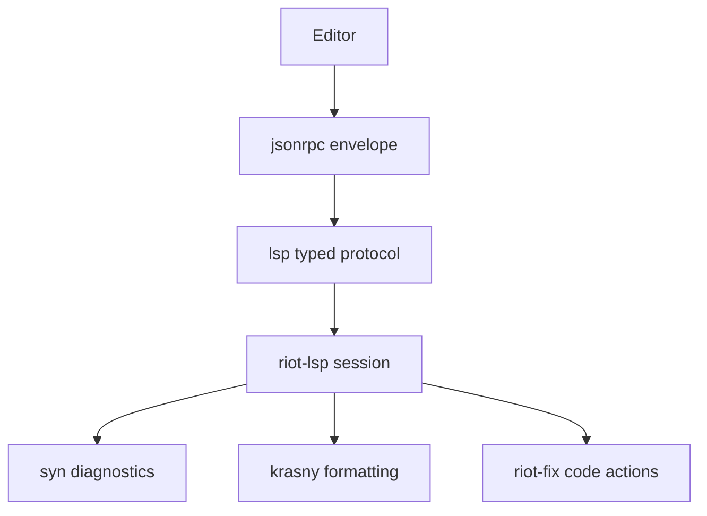
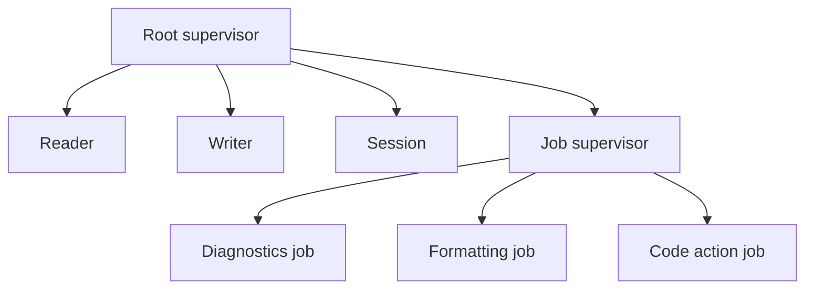

> Canonical source: `docs/rfds/RFD0036-lsp-protocol-package-and-riot-language-server.md`

> Status: **Presented**

- Feature Name: `lsp_protocol_package_and_riot_lsp`
- Start Date: `2026-04-03`
- Status: `implemented`
- RFD PR: [leostera/riot#0000](https://github.com/leostera/riot/pull/0000)
- Riot Issue: [leostera/riot#0000](https://github.com/leostera/riot/issues/0000)

## Summary
[summary]: #summary

This RFD proposes adding two new packages:

- `packages/lsp`: a protocol-only LSP package built on top of `jsonrpc`
- `packages/riot-lsp`: Riot's actual OCaml language server

The goal is to give Riot an editor-agnostic, incremental interface for
diagnostics, formatting, and code actions without baking those features into a
Neovim-only plugin or a shell-oriented CLI flow.

The stack should be:

```text
jsonrpc -> lsp -> riot-lsp
```

The first iteration is intentionally syntax-first. It should support:

- `initialize`, `initialized`, `shutdown`, `exit`
- dirty-buffer document tracking through `didOpen`, `didChange`, and `didClose`
- `publishDiagnostics` from `syn`
- `textDocument/formatting` from `krasny`
- `textDocument/codeAction` for syntax-local fixes backed by `riot-fix`

This RFD also proposes a parallel, failure-isolated `riot-lsp` server
architecture:

- one serialized session process owns mutable state
- individual requests run in supervised worker jobs
- one crashing request fails only that request, not the whole server

## Motivation
[motivation]: #motivation

Riot now has enough syntax-owned tooling that an editor protocol is more useful
than another layer of CLI wrappers.

Today, the new `riot.nvim` plugin can format on save and surface save-time
diagnostics by shelling out to:

- `riot fmt --json <file>`
- `riot fix --json <file>`

That is already useful, but it is still the wrong long-term boundary for
editor features.

The current CLI-driven editor path has four concrete limitations:

1. It is save-driven rather than document-driven. The editor cannot ask Riot
   about dirty buffer contents without writing the file first.
2. It is editor-specific. A Neovim plugin can shell out to `riot`, but that
   does not give Helix, Zed, VS Code, or other editors a common integration
   surface.
3. It turns request/response editor interactions into process orchestration and
   output parsing.
4. It does not give Riot a stable home for editor-native behaviors such as
   code actions, formatting edits, and future hover or type-at-point queries.

Riot already points toward an LSP boundary in two ways:

- `riot` already advertises an `lsp` command slot in
  `packages/riot-cli/src/cli.ml`
- `RFD0030` already assumes that the editor protocol layer should sit above
  the lower-level analysis libraries

What Riot is missing is not just "an editor plugin". It is the actual protocol
surface and server implementation.

This proposal addresses four concrete use cases.

### Use case 1: dirty-buffer syntax diagnostics

An editor should be able to send unsaved OCaml text to Riot and receive parser
diagnostics without writing to disk.

That is the main gap between today's save-time plugin experience and a real
editor-native workflow.

### Use case 2: syntax-directed code actions

Riot already owns syntax-aware fixes and rewrites through `riot-fix` and
`syn`. An LSP server gives those features a natural delivery mechanism:

- quick fixes for diagnostics
- fix-all
- syntax-local refactors such as extract-let or extract-type-syntax

These are awkward to model as shell commands, but straightforward as LSP code
actions returning `WorkspaceEdit`.

### Use case 3: editor-agnostic integration

The right boundary for editor features is not `riot.nvim`, but `riot lsp`.

That lets Riot support:

- Neovim
- VS Code
- Helix
- Zed
- editor-independent integration tests

without duplicating feature logic per editor.

### Use case 4: a path toward `typ`

Riot does not have a full `riot check` or `typ`-backed semantic engine yet.
That is fine.

The proposed LSP stack lets Riot start with syntax-first features now, then add
semantic features later without replacing the protocol boundary:

- hover
- type hints
- goto definition
- references
- rename

## Guide-level explanation
[guide-level-explanation]: #guide-level-explanation

Contributors should think about the proposal as three layers with different
jobs.

### Layer 1: `jsonrpc`

`jsonrpc` remains the generic JSON-RPC package.

It should continue to own:

- request and response envelopes
- ids and params
- generic request/response codecs

It should not grow editor-specific notions such as positions, diagnostics, or
code actions.

### Layer 2: `lsp`

`lsp` is the protocol package.

It should own:

- LSP types such as `Position`, `Range`, `Diagnostic`, `TextEdit`,
  `WorkspaceEdit`, and `CodeAction`
- method descriptors and method names
- request and notification parameter/result codecs
- capability records
- URI and UTF-16 position helpers

It should not own:

- a server loop
- stdio framing
- document storage
- actor supervision
- Riot-specific features

### Layer 3: `riot-lsp`

`riot-lsp` is the real language server.

It should own:

- stdio `Content-Length` framing
- session state
- request and notification routing
- document snapshots
- feature workers
- calls into `syn`, `krasny`, and `riot-fix`

This layer is where Riot-specific language behavior lives.

### Mental model

The architecture should look like this:



The critical design point is that `riot-lsp` is a server, not a bag of helper
functions.

Contributors should think about the server as:

- one session process that owns all mutable state
- many supervised request jobs that operate on immutable snapshots

That means editor requests can run in parallel without letting one bad request
take down the server.

### First iteration

The first iteration should be narrow and boring.

Included:

- `initialize`
- `initialized`
- `shutdown`
- `exit`
- `didOpen`
- `didChange`
- `didClose`
- syntax diagnostics
- document formatting
- syntax-local code actions

Explicitly not included:

- type-driven hover
- goto definition
- references
- rename
- semantic tokens
- generated-runner workspace lint as a mandatory request path

This should be a syntax-first language server, not a fake promise of a full
semantic IDE.

## Reference-level explanation
[reference-level-explanation]: #reference-level-explanation

## 1. Package boundaries

The dependency direction should be strict:

```text
jsonrpc -> lsp -> riot-lsp
```

### `packages/jsonrpc`

No architectural change is proposed here.

It remains the generic JSON-RPC substrate.

### `packages/lsp`

This package should look much closer to `mcp` than to a server implementation.
It should primarily expose protocol types and codecs.

Proposed module layout:

```text
packages/lsp/src/
  lsp.ml
  lsp.mli
  types.ml
  method.ml
  codec.ml
  utf16.ml
  uri.ml
```

Responsibilities:

- LSP protocol records and sums
- typed request and notification descriptors
- `to_json` / `of_json`
- URI conversion helpers
- UTF-16 conversion helpers

Non-responsibilities:

- stdio framing
- session loop
- request scheduling
- cancellation bookkeeping
- `syn`, `krasny`, or `riot-fix`

### `packages/riot-lsp`

This package should own the actual server.

Proposed module layout:

```text
packages/riot-lsp/src/
  riot_lsp.ml
  framing.ml
  session.ml
  state.ml
  documents.ml
  handlers/request.ml
  handlers/notification.ml
  features/diagnostics.ml
  features/formatting.ml
  features/code_actions.ml
  features/helpers.ml
```

Responsibilities:

- read and write LSP stdio messages
- own session state
- supervise request workers
- turn LSP params into `syn` / `krasny` / `riot-fix` calls
- publish results back as LSP responses and notifications

## 2. `lsp` public API direction

The exact API can tighten during implementation, but the shape should be close
to this.

### Core types

```ocaml
module Uri : sig
  type t
  val of_string : string -> t
  val to_string : t -> string
  val of_path : Std.Path.t -> t
  val to_path : t -> (Std.Path.t, string) result
end

module Position : sig
  type t = { line: int; character: int }
end

module Range : sig
  type t = {
    start_: Position.t;
    end_: Position.t;
  }
end

module Diagnostic : sig
  type severity =
    | Error
    | Warning
    | Information
    | Hint

  type t = {
    range: Range.t;
    severity: severity option;
    code: string option;
    source: string option;
    message: string;
    data: Json.t option;
  }
end

module Text_edit : sig
  type t = {
    range: Range.t;
    new_text: string;
  }
end

module Workspace_edit : sig
  type t = {
    changes: (Uri.t * Text_edit.t list) list;
  }
end

module Code_action : sig
  type kind =
    | Quick_fix
    | Refactor
    | Refactor_extract
    | Refactor_rewrite
    | Source
    | Source_fix_all
    | Custom of string

  type t = {
    title: string;
    kind: kind option;
    diagnostics: Diagnostic.t list;
    edit: Workspace_edit.t option;
    data: Json.t option;
  }
end
```

### Typed method descriptors

The `lsp` package should not force `riot-lsp` to parse raw JSON by hand.

The protocol boundary should look like:

```ocaml
module Method : sig
  type ('params, 'result) request = {
    name: string;
    params_of_jsonrpc: Jsonrpc.params -> ('params, Json.t) result;
    params_to_jsonrpc: 'params -> Jsonrpc.params;
    result_of_json: Json.t -> ('result, Json.t) result;
    result_to_json: 'result -> Json.t;
  }

  type 'params notification = {
    name: string;
    params_of_jsonrpc: Jsonrpc.params -> ('params, Json.t) result;
    params_to_jsonrpc: 'params -> Jsonrpc.params;
  }
end
```

That allows `riot-lsp` handlers to stay typed at the boundary.

### First supported protocol subset

The initial `lsp` package should only model the subset `riot-lsp` needs:

- `initialize`
- `initialized`
- `shutdown`
- `exit`
- `textDocument/didOpen`
- `textDocument/didChange`
- `textDocument/didClose`
- `textDocument/publishDiagnostics`
- `textDocument/formatting`
- `textDocument/codeAction`

This package should not start by trying to encode the entire LSP specification.

## 3. `riot-lsp` server architecture

The server should reuse Riot's own concurrency model.

In particular, it should follow the same broad pattern used in `suri`'s server
infrastructure:

- a thin top-level entrypoint
- one long-lived control process
- a supervised set of homogeneous worker jobs

### Actor tree



### Responsibilities

#### `Reader`

- reads `Content-Length` framed messages from stdin
- decodes the JSON-RPC envelope
- forwards parsed client messages to `Session`

#### `Writer`

- is the only process allowed to write to stdout
- serializes server responses and notifications back to LSP framing

#### `Session`

This is the authoritative mutable state owner.

It owns:

- client capabilities
- shutdown state
- open documents
- active request/job bookkeeping
- per-document latest version

It is responsible for:

- handling notifications that mutate state
- spawning jobs for expensive requests
- dropping stale results
- publishing accepted results through `Writer`

#### `Job supervisor`

This is a dynamic supervisor for temporary request jobs.

Jobs should be:

- one-shot
- isolated
- monitored by `Session`
- not restarted on failure

That means a request crash becomes "that request failed", not "the LSP server
died".

## 4. State and message shapes

The server state should stay explicit.

```ocaml
type document = {
  uri: Lsp.Uri.t;
  path: Std.Path.t option;
  version: int;
  text: string;
  workspace_root: Std.Path.t option;
}

type job_kind =
  | Diagnostics of { uri: Lsp.Uri.t; version: int }
  | Formatting of { request_id: Jsonrpc.id; uri: Lsp.Uri.t; version: int }
  | Code_action of { request_id: Jsonrpc.id; uri: Lsp.Uri.t; version: int }

type state = {
  initialized: bool;
  shutdown_requested: bool;
  documents: (Lsp.Uri.t, document) Hashtbl.t;
  active_jobs: (Pid.t, job_kind) Hashtbl.t;
  pending_requests: (Jsonrpc.id, Pid.t) Hashtbl.t;
}
```

The internal session messages should also be explicit:

```ocaml
type session_msg =
  | From_client of client_message
  | Job_done of { pid: Pid.t; result: job_result }
  | Job_failed of { pid: Pid.t; reason: Process.exit_reason }
  | Cancel_request of Jsonrpc.id
```

## 5. Request lifecycle

The server should use immutable snapshots for parallel work.

Request flow:

1. `Reader` parses an incoming request.
2. `Session` validates the method and current state.
3. `Session` snapshots the current document or workspace facts needed for the
   request.
4. `Session` spawns a temporary worker under `Job supervisor`.
5. The worker computes a result from that snapshot only.
6. The worker replies to `Session`.
7. `Session` drops the result if it is stale or cancelled.
8. Otherwise `Session` forwards the response or notification to `Writer`.

That gives Riot parallelism without surrendering state consistency.

## 6. Failure isolation and cancellation

This is the main architectural requirement of the server.

`riot-lsp` should not behave like one big request loop where any exception can
poison the whole session.

The rules should be:

- only `Session` owns mutable state
- worker jobs are isolated and disposable
- workers are monitored, not tightly linked, by `Session`
- a worker crash becomes a request error or a dropped diagnostic refresh
- a stale worker result never overwrites a newer document version

`$/cancelRequest` should cancel only the matching request job. It should not
affect unrelated work on the same file.

## 7. First iteration scope

The first implementation should support only full document sync.

That means:

- `didOpen` includes the whole text
- `didChange` also sends the whole text
- no incremental patching is required yet

This keeps the first iteration simple and fully compatible with Riot's current
syntax-first needs.

### Included in v0

- full-sync document tracking
- syntax diagnostics from `syn`
- document formatting from `krasny`
- code actions from syntax-local `riot-fix` rules
- a thin `riot lsp` CLI entrypoint that starts the server

### Deferred from v0

- dirty-buffer workspace lint through generated runners
- semantic queries from `typ`
- cross-file rename
- workspace symbol search
- semantic tokens
- codeAction resolve
- incremental text diff application

## Drawbacks
[drawbacks]: #drawbacks

- Riot gains two new packages instead of one, which increases package count and
  protocol surface area.
- LSP is large; even a narrow subset requires careful codec work and UTF-16
  position handling.
- A parallel server with cancellation and stale-result dropping is more complex
  than a single blocking request loop.
- The syntax-first first iteration will still leave obvious gaps until `typ`
  exists.

## Rationale and alternatives
[rationale-and-alternatives]: #rationale-and-alternatives

### Why not keep everything in `riot.nvim`?

Because editor features should not be Neovim-specific.

The plugin is a good thin client, but it is the wrong boundary for:

- dirty-buffer diagnostics
- formatting edits
- editor-native code actions
- future hover and type info

### Why not put LSP types directly in `jsonrpc`?

Because LSP is not generic JSON-RPC.

`jsonrpc` should stay transport- and application-neutral. LSP concepts such as
`Position`, `Range`, and `CodeAction` do not belong there.

### Why not build only `riot-lsp` and skip `lsp`?

Because that would mix protocol schema and application behavior into one
package.

The `lsp` package gives Riot:

- a testable protocol layer
- a reusable boundary for future tools
- a cleaner `riot-lsp` package that focuses on server behavior

### Why not a single-threaded request loop?

Because Riot already has cheap concurrency, and editor workloads benefit from
isolating requests.

The goal is not "maximum parallelism everywhere". The goal is:

- cheap concurrent request handling
- cancellation
- request-level fault isolation

That is easier with a serialized session plus supervised worker jobs than with
one monolithic blocking loop.

## Prior art
[prior-art]: #prior-art

- `packages/jsonrpc`
  This is the immediate example for a protocol package that stays generic.
- `packages/mcp`
  This is the immediate example for a protocol package that owns typed schema
  and codecs without owning application logic.
- `packages/suri/src/socket_pool` and `packages/suri/src/web_server`
  These are the local examples for Riot-style server supervision and worker
  pool structure.
- `rust-analyzer`
  This is the strongest external example for keeping syntax and IDE services
  below the LSP shell, and for explicit request/notification boundaries.

The proposal intentionally copies the boundaries, not the full complexity, of
`rust-analyzer`.

## Unresolved questions
[unresolved-questions]: #unresolved-questions

- How much of `riot-fix` should be exposed in-memory for dirty-buffer code
  actions in v0, and how much should wait for a separate editor-focused API?
- Should `textDocument/documentSymbol` and `textDocument/foldingRange` be part
  of the initial implementation, or a follow-up once diagnostics and code
  actions are stable?
- Should `riot-lsp` own client progress notifications in v0, or defer progress
  reporting until the basic request flow is proven?

## Future possibilities
[future-possibilities]: #future-possibilities

- Add `typ`-backed hover, type-at-point, definitions, references, and rename.
- Add semantic tokens once Riot has enough semantic classification support.
- Add incremental document sync rather than full-buffer replacement.
- Add richer syntax-driven refactors beyond `riot-fix` quick fixes.
- Add editor-agnostic tests that exercise `riot-lsp` over a raw JSON-RPC/LSP
  transport harness.
